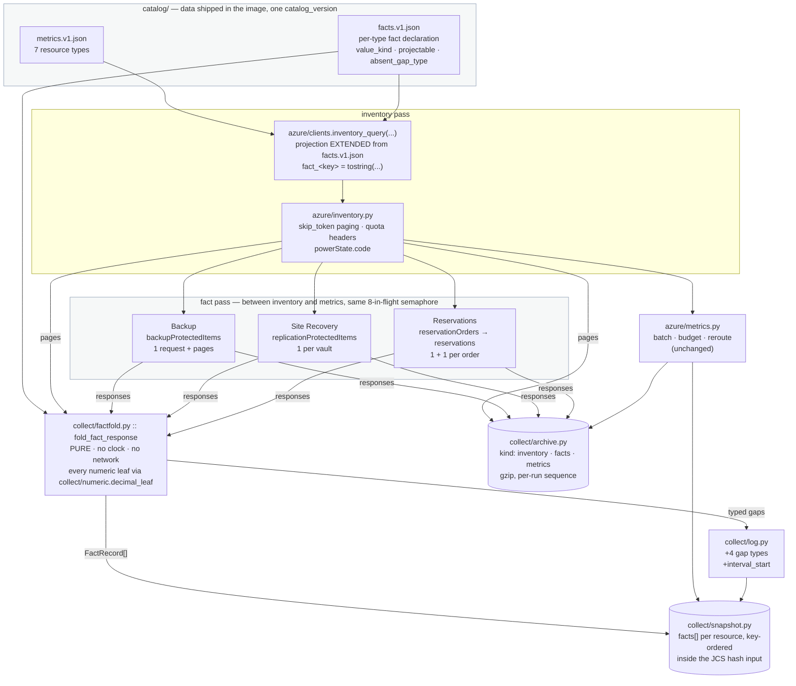
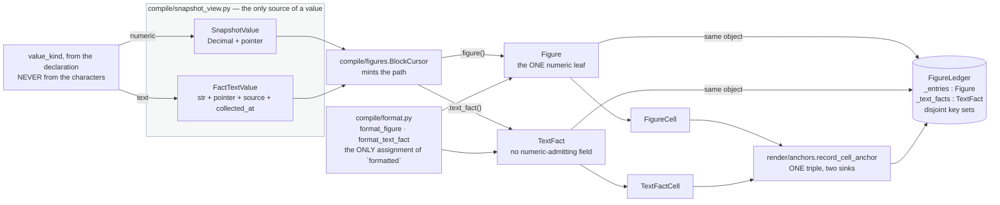
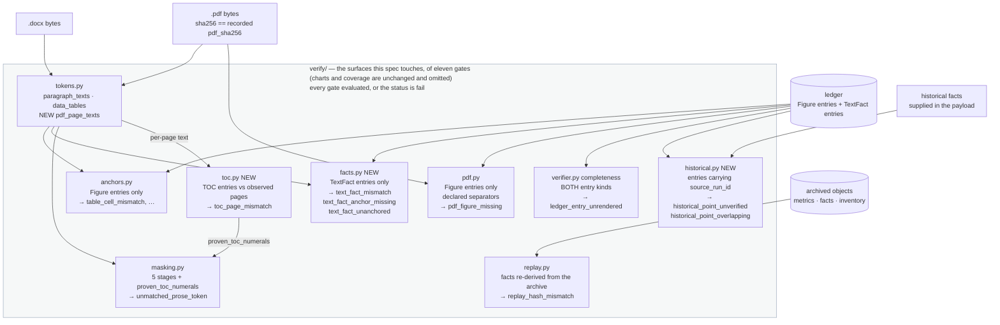
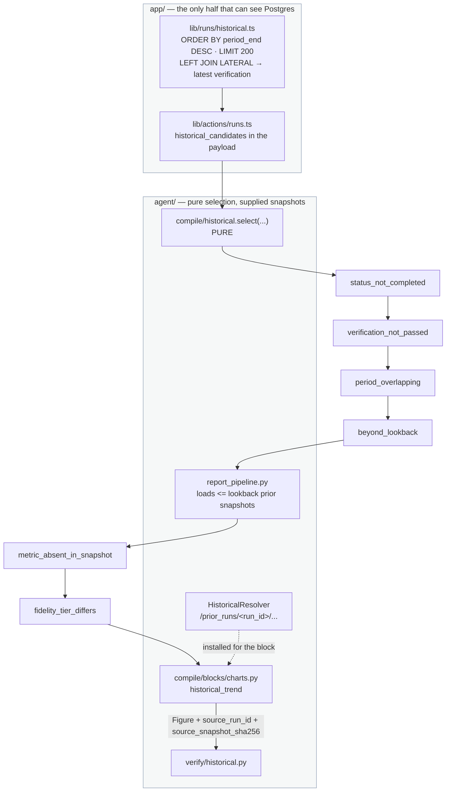

# Design Document

## Overview

Two specs are complete and built. `reporting-agent-foundation` delivered the collector, the
immutable content-addressed snapshot, the raw archive, the `report_runs` state machine and the
metric catalog; `reporting-agent-templates-reports` delivered the wizard, the compiler, the
typed AST, the figure ledger, two emitters and the verifier with its sixteen blocking finding
types. Everything they specify is referenced here by name and re-designed nowhere.

This spec makes the output a **deliverable document**. It is overwhelmingly a design about
*existing modules*: it adds twelve source modules to `agent/` and thirteen to `app/`, and it edits
around fifty that already work. The file trees in
[Components and Interfaces](#components-and-interfaces) mark every one as `NEW` or `(exists)`, so
"additive" is checkable rather than asserted.

### What changes

| Concern | Created | Edited |
|---|---|---|
| Catalog breadth | `catalog/facts.v1.json`, `tests/fixtures/metric_definitions/<type>.json` | `catalog/metrics.v1.json`, `catalog/loader.py` |
| Facts | `azure/facts.py`, `collect/factfold.py`, `collect/numeric.py` | `azure/inventory.py`, `azure/clients.py`, `collect/archive.py`, `collect/snapshot.py`, `collect/log.py`, `collect/pipeline.py` |
| `TextFact` | `verify/facts.py` | `compile/ast.py`, `compile/figures.py`, `compile/format.py`, `render/anchors.py`, `render/docx.py`, `render/html.py`, `verify/verifier.py`, `verify/masking.py` |
| Front matter · TOC | `render/front_matter.py`, `render/toc.py`, `verify/toc.py`, `evidence/toc/` | `compile/definition.py`, `render/docx.py`, `render/themes.py`, `verify/tokens.py` |
| Language | `messages/catalog.v1.json`, `compile/messages.py`, `app/lib/messages/catalog.ts` | `compile/blocks/*`, `render/*`, `verify/allowlist.py`, `narrate/summary.py` |
| Historical trend | `compile/historical.py`, `verify/historical.py`, `app/lib/runs/historical.ts` | `compile/definition.py`, `compile/blocks/`, `report_pipeline.py` |
| Pickers | `app/api/subscriptions/[id]/inventory/route.ts`, `app/lib/templates/options.ts`, `app/lib/templates/migrate.ts`, `app/components/templates/scope-picker.tsx`, `metric-picker.tsx`, `config-picker.tsx` | `main.py`, `step-scope.tsx`, `step-metrics.tsx`, `block-inspector.tsx`, `step-identity.tsx`, `lib/templates/definition.ts`, `lib/templates/blocks.ts` |
| Report page | `app/lib/runs/gap-groups.ts`, `app/components/reports/paper-classes.ts`, `app/lib/reports/paper-claim.ts` | `gap-list.tsx`, `verification-panel.tsx`, `paper-render.tsx`, `app/globals.css` |

The claim the whole spec turns on is the one the two completed specs already made, extended to
the half of the document that is not a time series:

> **A fact in a delivered document is an observation with a recorded source and a recorded
> instant, checked against the snapshot it came from — including when it is not a number.**

Four consequences shape everything below.

**A numeric fact is a `Figure` and nothing new.** It carries a `snapshot_path`, it lands in the
ledger, it is checked by anchored cell equality, it is present in replay, and it is verified by
the passes requirements 27 through 33 of the templates spec already declare. There is no second
numeric path, and negative test 24.4 asserts a mutated numeric fact fails as
`table_cell_mismatch` exactly as a metric figure does.

**A text fact needs its own gate because the numeric one structurally cannot see it.**
`verify/masking.py`'s stage 2 masks `[A-Za-z_][\w.\-]*[0-9][\w.\-]*`, so `Standard_D4s_v3` is
consumed as an identifier before any digit-bearing token survives; and `Succeeded` carries no
digit, so it is never extracted as a numeric token at all. `TextFact` is therefore a ledger
entry with an anchor and an exact-string equality check, and Property 6 is written to fail
against an implementation that hopes masking will catch it.

**Every fact-producing response is archived, and that now includes the inventory pages.** A
projectable fact rides the Resource Graph projection, so the inventory response is a
fact-producing response and must be in the archive or replay cannot reproduce the snapshot. Two
things follow: `collect/archive.py` gains an `inventory` object kind, and the projected-fact
derivation becomes one pure function called from the live pass and from replay — not two readers
that agree today.

**The one reader obligation is discharged by having one fold, not two agreeing readers.**
`azure/metrics.py`'s `_as_decimal` already accepts an `int`, a `float`, a `Decimal` and a decimal
**string**, and its docstring records the month the archive was write-only because it did not.
This spec moves it to `collect/numeric.py::decimal_leaf`, re-exports it under its old name so
nothing else changes, and puts the *entire* fact fold in `collect/factfold.py` so the live pass
and replay call one function rather than two functions that happen to parse alike.

### What this design deliberately does not contain

- **No new SSE event type.** The cross-language event mirror the foundation's criterion 40.13
  guards is untouched, and `app/lib/events.ts` and `agent/.../events.py` are not edited. The one
  new command (`list_inventory`) reports its result on `done`'s `outcome` mapping, exactly as
  `preflight` already does — see [The inventory endpoint](#7-the-inventory-endpoint-and-the-three-pickers).
- **No regeneration of `app/components.json` and no reformatting of `app/app/globals.css`.**
  The only edits to `globals.css` are two **appended** blocks and one **added line** inside the
  existing `@theme inline` block, and a guard asserts every preset token value is byte-identical
  to a committed fixture — see [The paper stylesheet](#12-the-paper-stylesheet).
- **No `DROP` anywhere.** Two additive Postgres columns, one additive enum value, and nothing
  else. `app/test/migrations.static.test.ts` already fails a `DROP` and needs no change.
- **No resource picker that stores a named resource.** Every picker is an affordance over one
  subscription's live inventory; what is stored is a rule. Property 7 is the gate.
- **No template language, still.** `front_matter` is a declared section with declared fields,
  the document-number pattern is a closed placeholder grammar, and the message catalog resolves
  ids rather than evaluating expressions.
- **No migration path in the agent.** A stored `schema_version` 1 definition is compiled *as
  version 1* forever. Migration is one-directional, app-only and happens at save
  (criterion 13.12), which is what makes criterion 13.11 true rather than aspirational.
- **No third language, and no user-authored translation.** `identity.language` is `en` or `id`.

---

## Research and decisions

Twelve questions requirements.md left open. Each records the decision, the reason, the rejected
alternative and the criteria it satisfies.

### 1. The table of contents — an experiment, not a preference

Criterion 14.1 forbids adopting an approach before proving it, and criterion 14.3 makes shipping
**no** table of contents a working outcome rather than a failure. So this subsection designs the
experiment and the no-approach path, and picks no winner.

**Why this cannot be settled by reading.** `python-docx` can insert a `TOC` field
(`w:fldChar`/`w:instrText` carrying `TOC \o "1-3" \h \z \u`) and cannot compute a page number for
it, because pagination is the consumer's decision. Whether headless LibreOffice updates that
field during `--convert-to pdf` depends on the version in the image, the filter options passed,
and whether the field carries a cached result — and an un-updated field renders in the delivered
PDF as an instruction to the reader, which is precisely the artifact criterion 14 exists to
prevent. Three candidates, and the only honest position before measurement is that we do not
know which of them works.

#### The declared setting

`agent/src/reporting_agent/render/toc.py` declares it, and nothing else may:

```python
TOC_APPROACH_LIBREOFFICE_INDEX: Final[str] = "libreoffice_index_update"
TOC_APPROACH_TWO_PASS: Final[str] = "two_pass_measure"
TOC_APPROACH_CONVERSION_MACRO: Final[str] = "conversion_macro"
TOC_APPROACH_NONE: Final[str] = "none"

TOC_APPROACHES: Final[tuple[str, ...]] = (
    TOC_APPROACH_LIBREOFFICE_INDEX,
    TOC_APPROACH_TWO_PASS,
    TOC_APPROACH_CONVERSION_MACRO,
    TOC_APPROACH_NONE,
)

ADOPTED_APPROACH: Final[str] = TOC_APPROACH_NONE   # until the evaluation says otherwise
```

A module constant rather than an environment variable, and that is the decision: a table of
contents whose correctness was proven in the image build must not be switchable at run time by
a deployment that never ran the proof. `--assert-build` reads it, the proof test reads it, and a
change to it is a code review (criterion 14.10).

#### The committed evaluation record

`agent/evidence/toc/evaluation.json`, one entry per candidate, plus the produced artifacts'
digests and the observed page table for each:

```jsonc
{
  "schema_version": 1,
  "fixture": {
    "definition": "tests/fixtures/toc/long_report.definition.json",
    "snapshot": "tests/fixtures/toc/long_report.snapshot.json",
    "pages": 11, "headings": 7, "distinct_heading_pages": 5
  },
  "libreoffice_version": "…",                     // as reported by `soffice --version` in the image
  "candidates": [
    { "approach": "libreoffice_index_update",
      "verdict": "incorrect",                     // "correct" | "incorrect" | "unavailable"
      "evaluated_at": "2026-…Z",
      "docx_sha256": "…", "pdf_sha256": "…",
      "named_pages":    { "Executive summary": 0, "Utilization": 0 },
      "observed_pages": { "Executive summary": 3, "Utilization": 5 },
      "note": "the field's cached result was exported unchanged" },
    { "approach": "two_pass_measure",   "verdict": "…", … },
    { "approach": "conversion_macro",   "verdict": "…", … }
  ]
}
```

`agent/tests/test_toc_evidence.py` is the guard, and every one of its assertions is a criterion:

- the record names **exactly** the three candidates criterion 14.1 declares, no more and no
  fewer;
- every candidate carries a verdict from the declared set and, for a `correct` verdict, a
  `named_pages` map equal to its `observed_pages` map (a `correct` verdict that does not agree
  with its own numbers is the recollection criterion 14.1 refuses);
- `ADOPTED_APPROACH` is either `none` or a candidate whose verdict is `correct`;
- the fixture named in the record is the fixture the proof test uses, compared by path and by
  content digest — so the record cannot describe an experiment on a document nobody renders.

#### The harness, and what evidence selects each candidate

`agent/tests/toc_harness.py` is one function used by the evaluation and by the proof test, so
neither can measure something the other does not:

```python
@dataclass(frozen=True, slots=True)
class TocMeasurement:
    docx_bytes: bytes
    pdf_bytes: bytes
    pdf_sha256: str
    observed_pages: Mapping[str, int]   # heading text -> 1-based page of its FIRST character
    named_pages: Mapping[str, int]      # heading text -> the page the TOC entry names

async def measure(definition, snapshot, *, approach: str) -> TocMeasurement:
    """Render through render/docx.py, convert through render/pdf.py, read pages through
    verify/tokens.pdf_page_texts. No hand-built document anywhere on this path (14.2)."""
```

The fixture is a compiled report of **at least 8 pages carrying at least 6 section headings
distributed across at least 4 pages** (criterion 14.2), produced by the same
`compile → render/docx.py → render/pdf.py` path a delivered report uses. `observed_pages` takes
the page carrying a heading's **first rendered character** (criterion 14.11), so a heading
spanning a page boundary resolves to exactly one page.

| Candidate | What is built | Selected when | Rejected when |
|---|---|---|---|
| **A — LibreOffice index update** | `render/toc.py` inserts a `TOC \o "1-3" \h \z \u` field with **no cached result**, and `render/pdf.py` passes the conversion filter unchanged | the produced `.pdf` names, for every heading, the page the harness observed | the PDF carries the field's cached text (empty, or a bare "Table of Contents"), or names any other page. Also rejected if it only works with a filter option that requires a writable profile beyond the pre-warmed one |
| **B — two-pass measure** | pass 1 emits the TOC section **at full size with no numbers** (one entry paragraph per heading, so the section occupies its final page count), converts, and measures; pass 2 re-emits with the measured numbers written as literal text and converts again | pass 2's `observed_pages` equals pass 1's for **every** heading — a fixed point — and every named page equals its observed page | any heading's observed page differs between the two passes. That is the failure mode the reserved-size pass-1 exists to avoid, and if it still happens the approach has no fixed point and is unusable |
| **C — conversion-time macro** | a Basic macro invoked through `soffice`'s scripting URL, calling `updateIndexes()` before export | it works and needs nothing beyond the image's pre-warmed profile | it needs a writable macro library, a scripting-enabled profile the image does not build, a **second** `soffice` invocation (which contends on the one profile — the templates spec's risk 5), or produces different bytes across two runs |

Evaluation order is A, then B, then C — cheapest first, and A adds no machinery at all. **All
three verdicts are recorded regardless of which is adopted**, because criterion 14.1 asks for the
record, not for the winner.

Two conditional consequences, recorded now so adopting B is not a surprise:

- B produces two `.docx` and two `.pdf`. **Only pass 2's are artifacts**; pass 1's are held in
  memory and never written, so `docx_sha256` and `pdf_sha256` name pass 2's bytes and the
  templates spec's criterion 33.3 gate is unaffected.
- B doubles the LibreOffice conversion, each bounded at 300s (templates criterion 23.9). If B is
  adopted, `PHASE_DEADLINE_SECONDS.rendering` rises from 600 to 900. That is an additive edit to
  `lib/runs/state.ts` and `agent/.../errors.py`'s budget table, and it lands **with** the
  adoption or not at all.

#### The proof test, which never skips

`agent/tests/test_toc_proof.py` reads `ADOPTED_APPROACH` and asserts one of two things, so there
is no configuration in which nothing executes (criteria 14.2, 14.10):

- an adopted candidate ⇒ `measure(...)` over the fixture, then `named_pages == observed_pages`
  for every heading, plus `pages >= 8`, `headings >= 6`, `distinct_heading_pages >= 4`;
- `none` ⇒ the produced `.docx` carries **no** TOC section, no `w:fldChar` of type `TOC`, and no
  page-number position anywhere in the front matter.

Neither branch is `skipif`, `xfail` or a bare `pass`. `agent/tests/test_property_hygiene.py`'s
scan is extended to fail on a skip marker in this module by name, which is how criterion 14.2's
"SHALL fail IF that test is absent, is skipped or is marked as an expected failure" becomes an
assertion rather than a convention.

#### Verification, and why the page numbers are not admitted blanket

`verify/toc.py` is a new gate. It reads the produced `.pdf` — the one whose SHA-256 equals the
recorded `pdf_sha256` (criterion 14.7) — through `verify/tokens.pdf_page_texts`, locates each
heading's first character, and compares. A disagreement is `toc_page_mismatch` naming the heading
text, the page named and the page observed (criterion 14.6).

Criteria 14.9 and 14.12 together forbid the obvious implementation. 14.9 wants the page numerals
admitted rather than surviving as `unmatched_prose_token`; 14.12 wants a numeral in a
page-number position **that the Toc_Verifier did not compare** to fail. An allowlist entry cannot
do both, because an allowlist admits its string *anywhere in the document* — a stray `7` in prose
would then pass. So:

> `verify/toc.py` runs **before** the prose gate and returns
> `proven_toc_numerals: Mapping[int, frozenset[str]]`, keyed by paragraph ordinal.
> `masking.scan_paragraphs` takes it as an additive keyword defaulting to `{}` and admits a
> numeral only in the paragraph whose comparison produced it.

That is a **narrowing of criterion 14.9's stated mechanism** — the admission is not an allowlist
entry — and it satisfies 14.9's intent and 14.12's letter, which an allowlist entry cannot. It is
recorded in [Risks](#risks-and-residual-exposure), item 2.

The HTML emitter emits the table of contents as a heading list carrying **no page number and no
page count** (criterion 14.8), unchanged in mechanism from the templates spec's criterion 14.3.

#### If all three fail

**We ship `none`, and the document is complete without it.** The front matter is cover →
document control → content; `front_matter.toc` stays in the definition and is retained
(the same pattern criterion 13.9 applies to a disabled cover); the HTML preview still lists the
headings; `verification.counts.toc_entries_checked` is `0`; and the proof test asserts the
absence rather than skipping. A consultant gets a document with no contents page, which is worse
than one with a correct contents page and **much** better than one whose first page says
"Right-click to update". That is the whole argument of criterion 14.3 and this design does not
hedge it.

### 2. The `facts` shape, and where the fact declaration lives

#### The shape

`Fact(key, value, value_kind, unit?, source, collected_at, formatted)`, one collection per
resource, ordered by `key` ascending in Unicode code-point order, inside the RFC 8785 canonical
form the `content_hash` is computed over (criteria 4.1, 4.5). Every `value` is a JSON **string**,
never a number, including a numeric fact's (criterion 4.6, Property 1.7) — the same rule the
snapshot already applies to every metric value, for the same reason.

`value_kind` is read from the **declaration**, never from the characters of the value
(criterion 4.11). The requirement states the reason and it is worth keeping in front of the
implementation: `2022` is an operating-system version that satisfies a decimal grammar, while
`10.0.0.4` and `10.0.0.0/16` do not. A router that reads characters formats a Windows version
with a grouping separator.

#### Where the declaration lives

**A sibling file, `catalog/facts.v1.json`, loaded by the same `catalog/loader.py` in the same
call, participating in the single `catalog_version`.**

Why a sibling rather than a `facts` key inside `metrics.v1.json`: the metric entry's validation
vocabulary (`unit_family`, `aggregations`, `scale`, `percentiles`) and a fact declaration's
(`value_kind`, `projectable`, `projection`, `absent_gap_type`) have nothing in common, so folding
them would make `_validate_one_metric`'s reason list the union of two unrelated schemas. And the
Catalog_Evidence_Guard (requirement 2) compares every entry against a **Metric Definitions API**
fixture; a fact declaration has no such fixture and never will, so one file would need a
per-entry-kind exemption in the guard — which is exactly the shape that makes a guard vacuous for
whatever it exempts.

Why **one** `catalog_version` rather than a version per file: `collect/snapshot.py` records
exactly one, criterion 1.3 requires it to compare greater, and two versions would mean the
snapshot records two and "which catalog produced this report" has two answers. So raising either
file raises the one version, and the loader asserts `facts.v1.json` declares **no** version of
its own — so nobody can raise one and leave the other behind.

Rejected: two versions (above); a database table (a catalog is code shipped in the image, and a
report must stay readable against the catalog that produced it — a row somebody can edit is the
opposite of that); a fact declaration derived from the Resource Graph schema at run time (it
would make an absent fact and a fact the type never had indistinguishable, which is the one
thing the declaration exists to separate).

```jsonc
// agent/src/reporting_agent/catalog/facts.v1.json  — no version key of its own, by design
{
  "resource_types": {
    "Microsoft.Compute/virtualMachines": {
      "facts": [
        { "key": "os_type",            "value_kind": "text", "source": "resource_graph",
          "projectable": true,
          "projection": "tostring(properties.storageProfile.osDisk.osType)" },
        { "key": "provisioning_state", "value_kind": "text", "source": "resource_graph",
          "projectable": true,
          "projection": "tostring(properties.provisioningState)" },
        { "key": "vm_size",            "value_kind": "text", "source": "resource_graph",
          "projectable": true,
          "projection": "tostring(properties.hardwareProfile.vmSize)" },
        { "key": "data_disk_count",    "value_kind": "numeric", "unit": "count",
          "source": "resource_graph", "projectable": true,
          "projection": "tostring(array_length(properties.storageProfile.dataDisks))" },
        { "key": "last_backup_status", "value_kind": "text", "source": "recovery_services",
          "projectable": false, "absent_gap_type": "backup_not_configured" },
        { "key": "last_restore_point", "value_kind": "text", "source": "recovery_services",
          "projectable": false, "absent_gap_type": "backup_not_configured" },
        { "key": "replication_health", "value_kind": "text", "source": "recovery_services",
          "projectable": false, "absent_gap_type": "replication_not_enabled" },
        { "key": "reservation_term",       "value_kind": "text", "source": "capacity",
          "projectable": false, "absent_gap_type": "no_reservations" },
        { "key": "reservation_expires_at", "value_kind": "text", "source": "capacity",
          "projectable": false, "absent_gap_type": "no_reservations" }
      ]
    },
    "Microsoft.Storage/storageAccounts": { "facts": [ /* sku_name, kind, access_tier, … */ ] },
    "Microsoft.Compute/disks":           { "facts": [ /* sku_name, disk_size_gb (numeric), … */ ] },
    "Microsoft.Web/sites":               { "facts": [ /* kind, state, https_only, … */ ] },
    "Microsoft.Sql/servers/databases":   { "facts": [ /* sku_name, tier, max_size_bytes, … */ ] },
    "Microsoft.Sql/managedInstances":    { "facts": [ /* sku_name, license_type, … */ ] },
    "Microsoft.DBforPostgreSQL/flexibleServers": { "facts": [ /* version, tier, … */ ] }
  }
}
```

Loader validation, per entry, degrading rather than raising exactly as a metric entry does
(criteria 1.4, 1.7): `key` 1–120 characters matching `^[a-z][a-z0-9_]*$`; `value_kind` in
`{numeric, text}`; `source` in `{resource_graph, arm, recovery_services, capacity}`;
`projectable` a boolean; `projection` present and non-empty **iff** `projectable`;
`absent_gap_type` present and drawn from `{backup_not_configured, no_reservations,
replication_not_enabled}` **iff not** `projectable`; `unit` present only for a `numeric` fact and
drawn from `DECLARED_FACT_UNITS`; no repeated key within one resource type. A failing entry is one
more `InvalidEntry` carrying `gap_type` `catalog_entry_invalid`, and the run continues.

`DECLARED_FACT_UNITS` is a **new declared set** in `catalog/loader.py`, being
`{"bytes", "count", "percent", "days"}`, and it is deliberately not `DECLARED_UNITS`: a metric's
unit selects a sketch, and a fact is never sketched. `compile/format.py`'s `UNIT_PRESENTATION`
gains the three new suffixes, so a numeric fact's `formatted` string is produced by the one
formatting path with no special case.

#### The extended Resource Graph projection

`azure/clients.inventory_query` takes its projected fact expressions **from the declaration**, so
adding a projectable fact is a data edit rather than a query edit:

```python
def inventory_query(resource_types, *, subscription_id, fact_projections: Sequence[tuple[str, str]]) -> str
```

`fact_projections` is `[(key, projection), …]` for every projectable fact of every requested
resource type, ordered by key so two runs build one identical query. The emitted query is the
existing one with the pairs appended to its `project` clause under a reserved prefix, so a fact
key can never collide with an inventory field name:

```kusto
Resources
| where subscriptionId == '<sub>'
| where type in~ ('Microsoft.Compute/virtualMachines', 'Microsoft.Storage/storageAccounts', …)
| project id, name, type, location, resourceGroup, tags,
          sku = tostring(properties.hardwareProfile.vmSize),
          powerState = tostring(properties.extended.instanceView.powerState.code),
          fact_data_disk_count    = tostring(array_length(properties.storageProfile.dataDisks)),
          fact_os_type            = tostring(properties.storageProfile.osDisk.osType),
          fact_provisioning_state = tostring(properties.provisioningState),
          fact_vm_size            = tostring(properties.hardwareProfile.vmSize)
| order by id asc
```

`FACT_FIELD_PREFIX: Final[str] = "fact_"`. A row's `fact_<key>` that is absent, `null` or empty
yields **no fact and no gap for a resource whose type does not declare that key** (criterion 5.9)
and a `fact_unavailable` gap for a resource whose type does (criterion 5.4) — the loop is over
the *declaration for that resource's type*, which is what makes 5.9 structural rather than a
filter someone remembers. A projection an unrelated resource type does not have simply returns
empty for those rows, which is why the declaration is consulted per type rather than per row.

Two notes that are facts about the service rather than choices. Resource Graph lowercases `type`
in its response body, which `azure/inventory.py` already handles case-insensitively, so the
per-type declaration lookup uses `LoadedCatalog.for_resource_type`'s existing case-folded match.
And the projected column count grows with the union of every declared projectable fact across
every requested type; at seven types that is roughly thirty columns, well inside Resource Graph's
limits, and it costs **zero** additional requests (criterion 4.7).

#### The three separate-call sources, against the 8-in-flight cap

Criterion 4.8 permits a request only for a non-projectable fact. The decision that makes that
affordable is **one subscription-scoped list per source, not one request per resource**:

| Source | Request | Bound | Indexed by |
|---|---|---|---|
| `recovery_services` — Backup | `GET /subscriptions/{id}/providers/Microsoft.RecoveryServices/backupProtectedItems` with `$filter=backupManagementType eq 'AzureIaasVM'`, paged | 1 request + pages | each item's `properties.sourceResourceId` |
| `recovery_services` — Site Recovery | one `replicationProtectedItems` list **per Recovery Services vault**, vaults taken from the inventory the run already has | 1 per vault, typically 1–2 | each item's `properties.providerSpecificDetails.fabricObjectId` |
| `capacity` — Reservations | `GET /providers/Microsoft.Capacity/reservationOrders`, then `reservations` per order | 1 + 1 per order | each reservation's applied scope |

Three to six requests for a subscription of any size, issued in the **fact pass between
inventory and metrics**, through the same semaphore keyed by subscription id that
`azure/metrics.py` uses, so the cap of 8 in flight (criterion 4.9) is honoured with the metric
batches not yet running and the pass costs seconds rather than minutes.

Rejected: per-resource requests (200 resources × 3 sources = 600 requests, which would spend the
Resource Graph and ARM quota the metric queries need, for facts that are already available in
bulk); collecting facts *after* metrics (the semaphore would then be contended and the fact pass
would extend the critical path of an 8-to-12 minute run for no reason).

**An honest exposure, stated because it will be the common case.** Reader at subscription scope
does **not** grant `Microsoft.Capacity/reservationOrders/read` — reservations are tenant- and
billing-scoped. So on most connections the reservation request is *rejected*, which is
criterion 5.4's `fact_unavailable` branch and emphatically **not** criterion 5.2's
`no_reservations` branch. The two must not be conflated: `no_reservations` says "we looked and
nothing covers this resource", `fact_unavailable` says "we could not look". A design that
collapsed them would print "no reservations" on a document for a subscription that has plenty.
`agent/tests/test_facts_reservations.py` asserts both branches from the two response shapes.

#### `collected_at`, and the bound it is checked against

`collected_at` is the instant the response carrying that value was **received**, truncated toward
the past to whole seconds, in RFC 3339 with a `Z` designator (criteria 4.3, 4.13). It is an
instant and not the collection period, and the requirement's reasoning is the product's:
presenting `last backup: Success` as characterising a whole month is the same class of error as
reporting 0% CPU for a deallocated VM.

Criterion 4.13 bounds it below by the run's `claimed_at`. **The runtime cannot observe
`claimed_at`**: the invoke `context` is closed at twelve fields (foundation criterion 41.5) with
a guard, and widening it for this would break a closure the foundation chose deliberately. So the
lower bound is the **invocation instant** the runtime records at entry:

```
invocation_started_at <= fact.collected_at <= snapshot_written_at
```

The tick claims and then invokes, so `invocation_started_at >= claimed_at` and the bound is
strictly **tighter** than the criterion's. A value that passes 4.13 and fails this would have to
have been collected between the claim and the invocation, which cannot happen. Every failure 4.13
names — a period boundary, a clock default of the epoch or of "now" — is caught. Recorded as a
narrowing in [Risks](#risks-and-residual-exposure), item 3.

### 3. `TextFact` in the AST and the ledger

#### The node, and why it is wrapped

```python
@dataclass(frozen=True, slots=True)
class TextFact:
    """One non-numeric observation in the document, with everything needed to prove it.

    Declares no field admitting an `int`, a `float`, a `Decimal` or a `DecimalString`
    (criterion 6.3), so the AST guard's numeric-annotation scan passes it without an
    exemption. `formatted` is the fact's `value` character for character — see
    `compile/format.format_text_fact`, which is where that is enforced rather than assumed.
    """
    path: FigurePath
    key: str
    value: str
    snapshot_path: str
    source: str
    collected_at: str
    formatted: str

@dataclass(frozen=True, slots=True)
class TextFactCell:
    """A data-table cell holding a text fact, and nothing else."""
    path: FigurePath
    fact: TextFact

type Cell = FigureCell | TextCell | EmptyCell | TextFactCell
```

The wrapper is the design, and it mirrors `FigureCell` for the same reason. `TextFactCell.fact`
is the **only** field in `compile/ast.py` annotated `TextFact`, and `TextFactCell` is a member of
`Cell` and of nothing else. So criterion 6.3's "every `TextFact` position admits the `TextFact`
node type alone" is a type declaration, and criterion 6.8's "only into a data-table cell" is a
consequence of the union membership rather than a rule the compiler enforces at run time.

Rejected: making `TextFact` a `Cell` member directly (it would carry two paths' worth of meaning
in one node and diverge from `FigureCell`'s shape for no gain); making it an `Inline` member (an
`Inline` position is a paragraph run, which is exactly the unanchorable position 6.8 forbids);
reusing `TextCell` with a provenance side-table (a side-table is a second structure, and the
templates spec's whole ledger argument is that there is one).

The AST guard extends by three declarations and no new mechanism:

```python
TEXT_FACT_ADMITTING_ANNOTATIONS: Final[frozenset[str]] = frozenset({"TextFact"})
_EXPECTED_UNION_MEMBERS = (
    ("Inline", ("Text", "Figure")),
    ("Cell",   ("FigureCell", "TextCell", "EmptyCell", "TextFactCell")),
)
REQUIRED_NODE_NAMES = (..., "TextFact", "TextFactCell")
```

`NUMERIC_ANNOTATION_NAMES` is unchanged and `TextFact` is **not** exempted from it — which is the
point: a future edit adding a `count: int` to `TextFact` fails the guard.

#### One walk, two kinds — `figures.py`

`FigureLedger` gains two dictionaries, not one dictionary of a union:

```python
_entries: dict[FigurePath, Figure]
_anchors: dict[FigurePath, TableAnchor]
_text_facts: dict[FigurePath, TextFact]              # NEW
_text_fact_anchors: dict[FigurePath, TableAnchor]    # NEW
_tables: dict[str, FigurePath]
```

Two dictionaries **because masking stage 1 must not see the text facts** (criteria 6.5, 6.10).
`formatted_values()` and `ledger_strings_of(ledger.entries)` are unchanged and therefore
structurally cannot pick up a `TextFact`'s string; a single dict of a union would make that
exclusion a filter at every call site, and Property 6.4 exists precisely because masking a text
fact's string by accident produces a clean pass on a mutated document. The key sets are asserted
**disjoint** — one AST path addresses one node — so "one ledger keyed by AST path"
(criterion 6.2) is still true of the pair.

New members, each mirroring an existing one exactly:

```python
def insert_text_fact(self, fact: TextFact) -> None: ...          # mirrors insert
def record_text_fact_anchor(self, path, anchor) -> None: ...     # mirrors record_anchor
@property
def text_facts(self) -> Mapping[FigurePath, TextFact]: ...
def text_fact_anchors(self) -> Mapping[FigurePath, TableAnchor]: ...
def entry_paths(self) -> tuple[FigurePath, ...]:
    """Every ledger entry path, both kinds, in document order. The completeness
    assertion (criterion 6.10) reads this; nothing else does."""
```

`serialize()` gains `text_facts` and `text_fact_anchors` keys **omitted when empty**, following
the omit-when-`None` convention `_figure_to_plain` already documents. A document with no text
facts therefore serializes byte-identically to today and every committed `ledger_sha256` fixture
is unchanged — asserted by a guard test, because "additive" is a claim about bytes here, not a
description.

`BlockCursor` gains the only factory:

```python
def text_fact(self, fact_value: FactTextValue) -> TextFact:
    """Construct a TextFact at this cursor's path and register it, in one step.

    Mirrors `.figure(...)` deliberately: the ledger entry is created during the traversal
    that creates the node, so the ledger and the render context are the same objects for
    both kinds and there is no `build_text_fact_ledger(ast)` anywhere.
    """
```

`walk_figures` becomes `walk_ledger_nodes` yielding `(ordinals, Figure | TextFact)`, and
`assert_ledger_matches_tree` compares against `entry_paths()`. `walk_figures` is retained as a
filtering wrapper so existing callers and the foundation's tests are untouched.

#### One anchor mechanism — `render/anchors.py`

Criterion 6.9 wants both kinds anchored "through one mechanism". `AnchorRecorder` already walks a
data table's rows; the extension is one dispatch at the leaf:

```python
_LEDGER_BEARING_CELLS: Final[tuple[type, ...]] = (FigureCell, TextFactCell)

def record_cell_anchor(ledger, node: Table, row: Row, cell: object, *, column_key: str) -> None:
    """One anchor triple, two sinks. The triple is built once — `{table_id(node.path),
    row.key, column_key}` — and routed by the cell's type, so a change to how an anchor is
    formed cannot apply to one kind and not the other."""
    anchor = TableAnchor(kind=ANCHOR_TABLE, anchor_id=table_id(node.path),
                         row_key=row.key, column_key=column_key)
    match cell:
        case FigureCell():   ledger.record_anchor(cell.figure.path, anchor)
        case TextFactCell(): ledger.record_text_fact_anchor(cell.fact.path, anchor)
```

`render/docx.py` emits a `TextFact` as **exactly one run in exactly one paragraph** of that cell
(criterion 6.4), in the theme's `Figure` character style — the same style a figure takes, because
what the style marks is "this text is a checked value", and the token extractor's ability to find
it without re-parsing prose is the reason the style exists at all.

#### `verify/facts.py`, beside `verify/pdf.py` and neither reading the other

```python
@dataclass(frozen=True, slots=True)
class TextFactPass:
    findings: tuple[Finding, ...]
    entries_checked: int
    entries_resolved: int

def check_text_facts(ledger: FigureLedger, grids: Sequence[TableGrid]) -> TextFactPass:
    """Exact string equality at each TextFact's anchor (criterion 6.4).

    Reads the ledger's `text_facts`/`text_fact_anchors` and the `.docx` grids. It does not
    read the figure entries, and `verify/pdf.py` does not read the text-fact entries — the
    two passes have disjoint inputs, which is what keeps "a text fact is checked by exact
    string equality" and "a figure is checked by a located PDF occurrence" from becoming one
    blurred rule with two half-assertions.
    """
```

Three findings, with the distinction between the second and the third stated precisely because
it is the part a reader would otherwise guess at:

| Finding | Condition |
|---|---|
| `text_fact_mismatch` | an anchor was recorded, it resolves to exactly one cell, and that cell's runs concatenated in document order with **no character inserted between runs** differ from `formatted` — no trimming, no whitespace normalization, no case folding, no re-parsing (criterion 6.6) |
| `text_fact_anchor_missing` | an anchor **was** recorded and resolves to no cell (criterion 6.7) |
| `text_fact_unanchored` | a `TextFact` ledger entry for which **no anchor was recorded at all** (criterion 6.8) |

`text_fact_unanchored` is reachable, and its reachability is the point. The type system stops a
`TextFact` occupying a non-cell *AST* position; it does not stop a **renderer** emitting a
`Table` through `write_layout_table` — which writes no `w:tblCaption`, so `AnchorRecorder`
records nothing. That is a renderer defect of exactly the class the finding exists to catch, and
negative test 24.15 constructs it by driving a purpose-built emitter down the layout path with a
`TextFactCell` in the tree.

Counts and gates. `REQUIRED_GATES` grows from eight to **eleven** — `"facts"` (requirement 6),
`"toc"` (requirement 14) and `"historical"` (requirement 18) — so a gate wired into the spec and
not into `verify()` fails every verification naming itself. `figure_count` stays the count of `Figure` entries;
`text_fact_count` is a new field on the verification result (criterion 6.15); the bidirectional
completeness assertion reads `entry_paths()`, so an unrendered `TextFact` is
`ledger_entry_unrendered` exactly as an unrendered figure is (criterion 6.10).

### 4. The archive round trip for facts

#### One fold, not two readers

```
agent/src/reporting_agent/collect/numeric.py     NEW  — `decimal_leaf`, the one numeric-leaf reader
agent/src/reporting_agent/collect/factfold.py    NEW  — `fold_fact_response`, the one fact fold
```

`collect/numeric.py` is `azure/metrics.py::_as_decimal` moved verbatim, docstring included —
including the paragraph recording the month the archive was write-only because the reader refused
a `str`. `azure/metrics.py` re-exports it as `_as_decimal = decimal_leaf`, so behaviour is
unchanged and every existing test passes untouched.

`collect/factfold.py` is the stronger half of the decision. Rather than a live derivation and a
replay derivation that both call one reader, **there is one derivation**:

```python
def fold_fact_response(
    body: Mapping[str, object],
    *,
    kind: str,                       # "inventory" | "facts"
    source: str,
    resource_ids: Sequence[str],
    declaration: FactDeclaration,    # per-resource-type, from catalog/facts.v1.json
    resource_types: Mapping[str, str],
    received_at: datetime,           # SUPPLIED — this module reads no clock (criterion 7.11)
) -> tuple[tuple[FactRecord, ...], tuple[GapRecord, ...]]:
    """Derive every Fact one response produces, and every typed gap its absences produce.

    PURE. No clock, no network, no object store. `azure/facts.py` calls it during collection
    with the instant it received the response; `verify/replay.py` calls it with the instant
    the archived object recorded. There is no second derivation to agree with.
    """
```

Every numeric leaf inside it goes through `decimal_leaf`, which accepts an `int`, a `float`, a
`Decimal` and a decimal **string**, and returns `None` for a string that does not parse — so a
malformed value classifies as absent and records `fact_unavailable` rather than raising mid-fold
(criteria 7.7, 7.8).

**The seam is tested by calling it, not by naming it.** `agent/tests/test_fact_reader_seam.py`
installs a counting wrapper over `collect.numeric.decimal_leaf` and asserts that a live
collection pass **and** a replay both route every numeric fact through it, with equal counts.
That is the lesson `tech.md` records as "an injected seam is an untested seam": a static
assertion that both modules import the symbol would pass against a module that imported it and
then parsed inline.

A static guard adds the other half: no module under `collect/`, `azure/` or `verify/` other than
`collect/numeric.py` may contain a `Decimal(` construction from a value read out of a response
mapping, and neither `collect/factfold.py` nor `verify/replay.py` may contain the tokens
`datetime.now`, `time.time` or `utcnow`.

#### The archive objects

Two kinds are added to `collect/archive.py`, and the dispatch is on a declared `kind` field
rather than on the shape of the body — existing metric objects carry no `kind`, so its absence
means `metrics` and no committed object changes:

```jsonc
// kind: "facts" — one per non-projectable-source response (criteria 7.1, 7.2, 7.10)
{
  "schema_version": 1,
  "kind": "facts",
  "sequence": 91,
  "source": "recovery_services",
  "request_target": "/subscriptions/<sub>/providers/Microsoft.RecoveryServices/backupProtectedItems",
  "resource_ids": ["/subscriptions/…/prod-sql-01", "…"],
  "received_at": "2026-08-01T09:20:44Z",
  "catalog_version": "1.1.0",
  "raw_response": { /* the body as received */ }
}

// kind: "inventory" — one per Resource Graph page, because a projected fact is derived from it
{
  "schema_version": 1,
  "kind": "inventory",
  "sequence": 1,
  "source": "resource_graph",
  "request_target": "/providers/Microsoft.ResourceGraph/resources",
  "page_index": 0,
  "skip_token_present": true,
  "received_at": "2026-08-01T09:19:02Z",
  "catalog_version": "1.1.0",
  "raw_response": { /* the body as received, `data` rows and all */ }
}
```

The write happens **during the same pass that folds** the response and **completes before the
next fact-producing request is issued** (criterion 7.1). That ordering is observable as the call
order a recording object-store double records — Property 1.5 asserts it — rather than as an
intention in a comment.

Nothing re-reads Azure to build the archive (criterion 7.6): the inventory pages were already in
hand, and the three source responses are written as they arrive.

#### Replay

`verify/replay.py` gains fact re-derivation and reads no clock:

- `_fold_object` dispatches on `kind`. `"metrics"` (or absent) is today's path, unchanged.
  `"facts"` and `"inventory"` call `fold_fact_response` with `received_at` taken **from the
  archived object** (criterion 7.11) — a `collected_at` stamped at the replay instant would enter
  the canonical form and produce `REPLAY_MISMATCH` on every run however correct the collection
  was.
- The re-derived facts enter the recomputed snapshot in the canonical order criterion 4.5
  declares, and the digest is compared byte for byte (criterion 7.3).
- A fact folded into the snapshot with no archived object produces a differing digest and
  `replay_hash_mismatch` (criterion 7.5) — which is what negative test 24.6 removes an object to
  demonstrate.
- An absent, undecompressable or unparseable object is the **advisory** `archive_incomplete` with
  replay recorded as not possible and no exception mid-fold (criteria 7.4, 7.12), unchanged in
  mechanism from the templates spec's criterion 31.8.

**A bounded honesty about what replay proves.** Replay re-derives the *facts* from the archived
inventory pages; it continues to take each resource's inventory **record** from `ReplayPlan`,
built from the stored snapshot, exactly as the foundation designed it. So replay proves the fact
derivation and the aggregation, not the inventory query — the same boundary it already has for
metrics, where it proves the fold and not the metric query. Deriving the facts from the plan
instead would be circular: reading a fact out of the snapshot and putting it back is the
"recompute nothing and return the stored digest" failure Property 4 exists to kill.

Rejected: writing a synthetic "derived facts" object to the archive instead of archiving the
inventory page. The archive's value is *here is what Azure returned* (`product.md`); an object we
composed ourselves proves nothing about what Azure said, and it would make Property 1.4's
single-value mutation unable to distinguish a correct run from a fabricated one.

### 5. `schema_version` 2 without rewriting an immutable row

`MAX_SUPPORTED_SCHEMA_VERSION` becomes `2` in `app/lib/templates/definition.ts` and
`agent/.../compile/definition.py`; `MIN_SCHEMA_VERSION` stays `1` (criterion 13.10). What raises
the version: `front_matter`, `identity.language`, and the two `number_format` separators.

#### One validator, version-conditional key sets

Not two validators. The version-conditional facts are **declared as data**, between sentinel
comments in both halves, so the Mirror_Guard stays a set comparison with no parser on either
side:

```ts
// app/lib/templates/definition.ts
// --- BEGIN SCHEMA VERSIONS (mirrored in agent/src/reporting_agent/compile/definition.py) ---
export const MIN_SCHEMA_VERSION = 1
export const MAX_SUPPORTED_SCHEMA_VERSION = 2

export const REQUIRED_TOP_LEVEL_KEYS = {
  1: ["schema_version", "identity", "scope", "period", "metrics", "blocks", "design"],
  2: ["schema_version", "identity", "scope", "period", "metrics", "blocks", "design",
      "front_matter"],
} as const

export const NUMBER_FORMAT_KEYS = {
  1: ["decimal_places", "group_thousands"],
  2: ["decimal_places", "group_thousands", "decimal_separator", "grouping_separator"],
} as const

export const IDENTITY_KEYS = {
  1: ["name", "description", "report_title"],
  2: ["name", "description", "report_title", "language"],
} as const

export const REQUIRED_IDENTITY_KEYS = { 1: ["name"], 2: ["name", "language"] } as const
export const LANGUAGES = ["en", "id"] as const
export const FRONT_MATTER_KEYS = ["cover", "document_control", "toc"] as const
export const FRONT_MATTER_FORBIDDEN_BLOCK_TYPES = ["cover"] as const   // in `blocks`, at v2+
// --- END SCHEMA VERSIONS ---
```

Behaviour that follows, with no branch anybody writes twice:

- A v1 definition carrying `front_matter` is rejected as an **undeclared key** by the existing
  strict check. No new rule.
- A v2 definition placing a `cover` block in `blocks` is rejected naming the block id
  (criterion 13.2). `document_control` and `toc` are **not block types and never were**, so there
  is nothing to forbid for them — `BLOCK_TYPES` grows from sixteen to **seventeen** by adding
  `historical_trend` and nothing else (criterion 18.1).
- `cover` **stays** a block type, because criterion 13.11 requires a stored v1 definition
  carrying one to compile, and `app/lib/templates/starters.ts` alone carries five of them.
- `identity.language` is required at v2, constrained case-sensitively to `en` or `id`
  (criterion 15.1); absent at v1, where every string id resolves in `en` (criterion 15.12).
- `number_format` permits two keys at v1 and four at v2. The separator constraints
  (criterion 16.2) apply to the **resolved** pair after the language-derived defaults:
  exactly one character, not a digit, not a minus sign, **not whitespace**, and the two not equal.
  `compile/format.NumberFormat.__post_init__` already rejects digits, minus signs and equality —
  it gains the whitespace clause, and `definition.ts` gains all of it. That is the mirror's job:
  the two halves must reject the same formats, and Property 2.7 generates the rejections.
- Language-derived defaults (criterion 16.3): `id` → decimal `,` grouping `.`; `en` → decimal `.`
  grouping `,`. A **declared** value is persisted unchanged with no default applied to it. For a
  stored v1 definition the defaults are resolved at **format** time from the pinned language,
  which is `en`, which is `DEFAULT_NUMBER_FORMAT` — so v1 rendering is byte-identical to today
  (criterion 16.10) and no stored row is rewritten.

#### The compiler's dispatch, in one place

```python
# agent/.../compile/definition.py
def validate_definition(raw: Mapping[str, object]) -> tuple[ValidationIssue, ...]:
    version = _schema_version(raw)                    # 1 or 2, or an issue
    required = REQUIRED_TOP_LEVEL_KEYS[version]
    number_format_keys = NUMBER_FORMAT_KEYS[version]
    identity_keys, required_identity = IDENTITY_KEYS[version], REQUIRED_IDENTITY_KEYS[version]
    ...
```

And in the compiler proper: a v1 definition compiles its `cover` block through
`compile/blocks/structure.compile_cover` exactly as today; a v2 definition compiles no `cover`
block and `render/front_matter.py` emits the cover from `front_matter.cover` instead. The two
paths meet at the same `Paragraph` and `Table` nodes, so there is one renderer and one set of
theme styles.

`agent/tests/test_schema_version_1.py` compiles **every shipped starter as stored** — five
`cover` blocks, two `number_format` keys, no `language` — and asserts a rendered document, a
passing verification, copy resolved in `en`, and separators `.` and `,`. That is the positive
outcome criterion 24.17 names as exempt from the enumeration meta-test, and it is proven by a
compile test rather than by a gate that can fail.

#### Migration is app-only and one-directional

`app/lib/templates/migrate.ts::toSchemaVersion2(definition)` is pure: it lifts a v1 `cover`
block's config into `front_matter.cover`, removes that block from `blocks`, sets
`identity.language` to `en`, resolves the two separators from `en`, and sets `schema_version` to
2. The wizard applies it when opening a v1 draft; the **save** writes a new version row
declaring v2 and applies no write to the existing row (criterion 13.12).

The agent has **no** migration and needs none. That asymmetry is the design: a stored v1 row is
compiled as v1 for as long as it exists, which is what makes an archived report reproducible from
its pinned version. A migration in the agent would mean a two-year-old report rendered through
today's reading of its definition, which is the opposite of pinning.

#### What the Mirror_Guard compares

`app/test/mirror.static.test.ts` extends its sentinel extraction to the block-type set (now
seventeen), the per-type config schemas (now including `historical_trend`), and the four new
declarations above: `MIN_SCHEMA_VERSION`, `MAX_SUPPORTED_SCHEMA_VERSION`,
`REQUIRED_TOP_LEVEL_KEYS`, `NUMBER_FORMAT_KEYS`, `IDENTITY_KEYS`, `REQUIRED_IDENTITY_KEYS`,
`LANGUAGES`, `FRONT_MATTER_KEYS`, `FRONT_MATTER_FORBIDDEN_BLOCK_TYPES` and `COLUMN_ATTRIBUTES`
(see [decision 8](#8-the-block-config-picker-versus-columns)). It fails naming every differing
key, and the shared fixture corpus gains v1 and v2 cases — accepted and rejected — run through
both the `Template_Validator` and the `Block_Compiler` with matching verdicts and matching
offender paths.

### 6. The message catalog, mirrored across two languages and two languages of implementation

#### Storage format and the two files

**Two declarations and one guard**, matching the two mirrors the product already has
(`events.ts` ↔ `events.py`, `blocks.ts` ↔ `definition.py`) rather than inventing a third
mechanism. Criterion 15.10 asks for exactly that: a Mirror_Guard over the id sets of the two
halves.

```
agent/src/reporting_agent/messages/catalog.v1.json    the agent's declaration, shipped in the image
app/lib/messages/catalog.ts                           the app's declaration, between sentinels
```

```jsonc
// agent/src/reporting_agent/messages/catalog.v1.json
{
  "schema_version": 1,
  "messages": {
    "doc.front_matter.document_control.title":  { "en": "Document control",  "id": "Kendali dokumen" },
    "doc.front_matter.approvers.role.author":   { "en": "Author",            "id": "Penyusun" },
    "doc.table.header.observed_at":             { "en": "Observed",          "id": "Diamati" },
    "doc.notice.empty_scope":                   { "en": "No resources matched this scope",
                                                  "id": "Tidak ada sumber daya yang cocok dengan cakupan ini" },
    "doc.facts.point_in_time":                  { "en": "…", "id": "…" },
    "doc.trend.short_lookback":                 { "en": "…", "id": "…" },
    "chart.axis.percentage":                    { "en": "Utilization", "id": "Utilisasi" },
    "ui.gap.metric_not_selected.explanation":   { "en": "…", "id": "…" },
    "ui.template.untitled_placeholder":         { "en": "Untitled template", "id": "Templat tanpa nama" }
  }
}
```

Rejected: gettext/`.po` (a second toolchain and a runtime dependency in two languages, for a
two-language catalog of a few hundred ids); one file generated into the other (a generator is a
third artifact that can be stale, and a guard is cheaper than a build step); the app importing
the agent's JSON across the monorepo path (it would put agent internals in the app's module graph
and the browser bundle, and the two halves deploy as different containers anyway).

#### The string-id namespace

`^(doc|chart|ui)\.[a-z][a-z0-9_]*(\.[a-z][a-z0-9_]*)+$` — a closed prefix set, lowercase ASCII,
dotted. `doc.` and `chart.` ids are resolved by the agent, `ui.` by the app; **both halves
declare every id**, because criterion 15.10 requires equal sets and because the interface has to
present an archived run's fixed copy in its pinned language (criterion 15.9), which needs the
`doc.` ids for gap explanations and the verification record. The dead weight is a few kilobytes
of copy the app does not resolve, which is a better trade than a second guard deciding which
half owns which prefix.

#### Resolution, and where it actually happens

Criterion 15.3 names the renderers, and the literals mostly are not in the renderers. Today
`EMPTY_SCOPE_TEXT`, `NO_DATA_TEXT`, `PARAGRAPH_STYLES`' captions and every `Column(header=…)`
live in `compile/blocks/*`. So:

> **The catalog is resolved at compile time and at render time, and the AST carries resolved
> strings.** `compile/messages.py` loads the catalog once and exposes
> `Messages.text(string_id) -> str` bound to the pinned language; `BlockContext` gains a
> `messages: Messages` field; `render/front_matter.py`, `render/toc.py` and `render/charts.py`
> resolve their own chrome directly, because those strings have no compile-time node to carry
> them.

The renderers then emit resolved strings verbatim and compose no copy of their own, which is what
criterion 15.3 requires of them. An id with no value in the pinned language is `RENDER_FAILED`
naming the id and the language (criterion 15.4) — never a fallback to the other language, which
is the failure that criterion exists to prevent and which negative test 24.21 asserts absent.

```python
# agent/.../compile/messages.py
class MissingMessageError(RenderFailedError): ...

@dataclass(frozen=True, slots=True)
class Messages:
    language: str
    _table: Mapping[str, Mapping[str, str]]

    def text(self, string_id: str) -> str:
        """The declared value, or RENDER_FAILED naming the id and the language."""
```

#### The build check for a hard-coded literal, in a form that can actually be implemented

A check that cannot be implemented is worse than none, so both halves are specified as
mechanisms rather than intentions.

**Python** — `agent/tests/test_message_literals.py`, walking each module with the standard
`ast` module (already used by `collect/accumulate.evaluate_formula`):

1. A **declared** set of text-emitting sites, as `(callable_name, parameter)` pairs:
   `(Text, "text")`, `(TextCell, "text")`, `(Column, "header")`, `(Table, "caption")`,
   `(Series, "label")`, `(Chart, "title")`, `(Paragraph, "style")` — no, `style` is a Word style
   id and is **excluded**; the emitting set is the first six plus
   `(add_paragraph, 0)`, `(add_run, 0)` and an assignment to `.text` on a `python-docx` run.
2. Every `ast.Constant` of type `str` appearing at a declared site, or assigned to a module-level
   `Final[str]` whose name matches `_(TEXT|LABEL|HEADER|CAPTION|NOTICE|TITLE)$`, must be a string
   id the catalog declares — or `""`.
3. Excluded, per criterion 15.6 and two additions this design records: element names, attribute
   names, class names, `data-` values; **Word style names** (they are style ids, not copy);
   and **a `TextFact`'s `formatted`**, which is collected data (criterion 6.13).
4. Scanned: `agent/.../render/**` as criterion 15.6 declares, **and** `agent/.../compile/blocks/**`,
   because that is where the labels and headers criterion 15.2 covers are actually written. The
   extension is additive and is recorded as such.
5. **The guard guards itself**: it additionally asserts that every dataclass in `compile/ast.py`
   carrying a `str` field named `text`, `header`, `caption`, `label` or `title` appears in the
   declared emitting set. A new emitting site added without registering it fails the suite — the
   same closure `REQUIRED_GATES` gives the verifier.
6. It runs in the suite **and** in the image build, invoked from the Dockerfile beside
   `--assert-build`, because `.dockerignore` excludes `tests/` and a guard that only ran in the
   suite could not stop an image from carrying English copy in an Indonesian document.

**TypeScript** — `app/test/message-literals.static.test.ts`, using the `typescript` package's own
`ts.createSourceFile` (already a dev dependency, since `pnpm typecheck` runs `tsc`; no new
dependency). Over `app/components/reports/**`:

- flag every `ts.JsxText` node with non-whitespace content;
- flag every string literal inside a `ts.JsxExpression` that is a **child** rather than an
  attribute value;
- flag every string literal assigned to `aria-label`, `title`, `alt` or `placeholder` — those
  *are* user-facing copy, so this is stricter than criterion 15.6's "excluding attribute names",
  deliberately;
- do not flag `className`, `data-*`, element or attribute names;
- an offender is any flagged literal that is not a declared string id.

**What neither guard can do**, said plainly rather than implied: a literal that reaches a text
position through a variable defined in another module escapes both. The mitigation is that within
the scanned modules the catalog resolver is the only way to obtain a string for those positions,
and the self-guard in step 5 stops the declared site set from silently shrinking. It is a lint
with a closure property, not a proof.

#### A `TextFact`'s value is never translated

`compile/format.py` gains the second half of the single formatting path:

```python
def format_text_fact(value: str, *, at: str) -> str:
    """A text fact's `formatted` string: its `value`, character for character.

    No case folding, no truncation, no separator substitution, and **no resolution against
    the Message_Catalog** (criterion 6.13). `Succeeded` reaches an Indonesian document as the
    string the API returned, because a fact's value is collected data and not fixed copy.
    A function rather than an inline pass-through so that `formatted` is still assigned in
    exactly one module and the existing single-formatting-path guard covers both kinds.
    """
```

A guard asserts `compile/format.py` neither imports `compile/messages.py` nor names any string
id — so the module that produces every `formatted` string structurally cannot translate one.

### 7. The inventory endpoint and the three pickers

#### The endpoint

`app/app/api/subscriptions/[id]/inventory/route.ts`, `GET`, `export const runtime = "nodejs"`,
`Cache-Control: no-store`, both path parameters and search parameters parsed with **named zod
schemas** at the boundary (criterion 9.3):

```ts
export const inventoryParamsSchema = z.object({ id: z.string().trim().min(1).max(200) }).strict()
export const inventoryQuerySchema  = z.object({}).strict()   // no search parameters, and saying so
```

The Azure call goes **through the runtime as a deterministic command, never a prompt**
(criterion 9.3), so the app issues no Azure request and holds no Azure access token. The command
is `list_inventory`, and it reports its result on `done`'s `outcome` mapping:

```jsonc
// invoke payload
{ "command": "list_inventory", "context": { /* the twelve fields, unchanged */ } }

// the terminating event
{ "type": "done", "run_id": null, "status": "completed",
  "resource_types":  { "values": ["Microsoft.Compute/disks", "…"], "truncated": false },
  "resource_groups": { "values": ["rg-prod-sea", "…"],             "truncated": false },
  "tag_keys":        { "values": ["env", "tier"],                  "truncated": false },
  "tag_values":      { "values": ["prod", "web"],                  "truncated": false } }
```

**That is why no SSE event type is added.** `main.py`'s `_done_event` already merges an
`Invocation.outcome` mapping into `done`, and `preflight` already reports its whole result that
way — the mechanism exists, it is the pattern for a command whose result *is* its outcome, and the
cross-language event mirror stays untouched. Rejected: a new `inventory` event type (it would edit
both halves of a mirror this spec's scope boundary closes); a non-streaming invocation with
`accept: application/json` (the runtime is SSE-only today and adding a second response mode for
one command is a larger change than reusing `outcome`).

`agent/src/reporting_agent/azure/inventory.py` gains `distinct_dimensions(...)`: **one** Resource
Graph query per cache miss (criterion 9.2), a `summarize`/`distinct` projection over the whole
subscription scope, each dimension ordered ascending in Unicode code-point order, at most 2000
values per dimension with a per-dimension `truncated` flag (criterion 9.1). The response carries
**no** fully qualified resource identifier, subscription id, tenant id or client id
(criterion 9.5, Property 7.4) — the query projects the four dimensions and nothing else, so the
exclusion is a property of the projection rather than a filter applied afterwards.

The app's side, in order, because the order is three criteria:

1. **Ownership first.** `user_id` must equal the signed-in user's id; anything else resolves as
   not found with no Azure query and no field of that row disclosed (criterion 9.4).
2. **Then status.** A `status` other than `active` resolves as unavailable naming that status and
   disclosing nothing else (criterion 9.9) — which drives the free-entry fallback rather than an
   empty option list a consultant would read as an empty subscription.
3. **Then the cache**, consulted only after the ownership check (criterion 9.2). Keyed on the
   connected subscription's **row id alone**; a hit for 300 seconds after the query completed; a
   miss thereafter; and a miss once that row has been written after that instant — so a rotated
   credential or a changed status lists the subscription again. Implemented as a module-level
   `Map<string, { at: number; rowUpdatedAt: string; payload: InventoryDimensions }>` in
   `lib/subscriptions/inventory-cache.ts`, invalidated by comparing the row's `updated_at`, which
   makes invalidation-on-write a read of the row the handler already loaded rather than a
   publish/subscribe problem.
4. **A 30-second bound on the runtime**, after which the request resolves as unavailable naming
   which of unreachable / rejected / no-response occurred, writes **no** cache entry, and issues
   **no** automatic retry (criterion 9.8).

#### The picker is an affordance; what is stored is a rule

Four option kinds, four stored shapes (criterion 10.2). The table is the decision:

| Option kind | Presented as | Stored as |
|---|---|---|
| resource type | `Microsoft.Compute/virtualMachines` | that string in `scope.resource_types` |
| resource group | `rg-prod-sea` | that string in `scope.resource_groups` |
| **tag key alone** | `env` | `{ key: "env", value: "" }` in `scope.tag_filters` |
| tag key + value | `env = prod` | `{ key: "env", value: "prod" }` |

A tag key picked alone stores a **zero-length value**, which the templates spec's criterion 3.1
already defines as the rule "carries this tag". That is the one non-obvious mapping and it is why
the table exists: the alternative — inventing a wildcard token — would be a value no inventory
response carried and a second spelling of a rule the schema already has.

Nothing identifying the subscription whose inventory was listed is recorded (criterion 10.3), and
the `Template_Validator`'s existing rejection of a resource id, subscription id or tenant id in
any scope field is **not relaxed** (criterion 10.4). Property 7 is the gate, with the declared
case of a resource group whose name contains a subscription-like substring.

Free entry survives beside the picker (criteria 10.5, 10.6): the same bounds, the same
validation, a rule **character-identical** to the one a selected option of the same string would
store, one entry rather than two on a duplicate, and the error on the step rather than at save.

**A value the current subscription's inventory does not list survives being opened against it**
(criterion 10.10). The mechanism is that the picker never writes: it renders the definition's
stored values as selected — whether or not the response contains them — marks the ones the
response does not contain as *not present in this subscription*, and removes a value only on an
explicit removal. So opening a template against a second subscription's inventory **edits no
rule**, and one template runs unedited against every connected subscription. That is the same
discipline as decision 8's load path: the load computes issues and performs no write.

Case folding follows the resolver (criterion 10.11): resource types and tag **keys** that differ
only by case present as one option, tag **values** that differ by case present as distinct
options, because `compile/scope.py` compares the first two case-insensitively and the third
case-sensitively — and two options one resolver cannot distinguish are one rule.

#### The metric picker

`step-metrics.tsx` gains grouping by resource type, sourced from the Metric_Catalog through
`GET /api/templates/catalog` (which already exists), never from a list in the app
(criteria 11.1, 11.2). Two partitions in a fixed order — the types the definition's scope declares,
then **every other type the catalog declares**, present rather than hidden, because a block scope
override may narrow to a type the template default does not name (criterion 11.6). Groups ordered
by resource type name and options by option name, both ascending in code-point order
(criterion 11.5), so two renders of one catalog and one definition present one identical order.

Two refusal states, both of which retain the stored selection and refuse step completion rather
than saving something the validator would reject minutes later: an unavailable catalog
(criterion 11.8) and a stored entry the current catalog no longer declares (criterion 11.9) —
which a `catalog_version` raised under criterion 1.3 can produce with no edit at all.

### 8. The block-config picker versus `columns`

#### Option-source resolution as one pure function

`app/lib/templates/options.ts`, pure, no I/O, shared by the inspector and by the load-time check:

```ts
export type ConfigFieldKind =
  | "metric_ref"        // capacity_metric, usage_metric, order_by
  | "metric_ref_list"   // metrics
  | "column_list"       // columns
  | "enum"              // order_by_direction, …
  | "other"

export function fieldKind(blockType: BlockType, field: string): ConfigFieldKind

export type MetricOption    = { readonly key: string; readonly metric: string; readonly statistic: string
                                readonly label: string; readonly estimated: boolean
                                readonly scale: number; readonly estimatorLabel: string | null }
export type AttributeOption = { readonly key: AttributeKey; readonly label: string }
export type FactOption      = { readonly key: string; readonly resourceTypes: readonly string[]
                                readonly valueKind: "numeric" | "text" }

export type OptionGroups = {
  readonly metrics: readonly MetricOption[]
  readonly attributes: readonly AttributeOption[]   // column_list only
  readonly facts: readonly FactOption[]             // column_list only
}

export function optionsFor(
  field: string,
  input: { definition: TemplateDefinition; block: TemplateBlock
           catalog: CatalogView; factDeclaration: FactDeclarationView }
): OptionGroups
```

The rule per field kind (criteria 12.2, 12.4, 12.9):

- `metric_ref` and `metric_ref_list` draw options from the **definition's metric selection alone**
  — not from the catalog. A block can display only a subset of what the run collects, and an
  option outside the selection guarantees a block carrying no figure.
- `column_list` draws from **three distinctly presented groups**: those same metrics; the resource
  attributes; and the fact keys the declaration declares for a resource type the block's resolved
  scope **can contain**. Facts are why this field is different from the other four, and the
  grouping is presentational as well as structural — the inspector renders three labelled
  sections, because "CPU average", "resource group" and "last backup status" are three different
  kinds of thing and a flat list would invite picking a fact where a metric was meant.
- A block carrying a `scope_override` narrows both the metric options and the fact options to the
  types that override can contain (criterion 12.4).

`COLUMN_ATTRIBUTES` is a new **mirrored** constant, sentinel-delimited in both halves, drawn from
what `compile/blocks/tables.py` can actually emit today rather than from what a `ResourceView`
happens to carry:

```ts
// --- BEGIN COLUMN ATTRIBUTES (mirrored in agent/src/reporting_agent/compile/blocks/tables.py) ---
export const COLUMN_ATTRIBUTES = [
  "resource_name", "resource_group", "resource_type",
  "location", "sku_name", "power_state", "fidelity_tier",
] as const
// --- END COLUMN ATTRIBUTES ---
```

`resource_table`'s implicit name column and its `show_fidelity` flag are **unchanged**, so no
version-conditional block behaviour appears. Naming `resource_name` or `fidelity_tier` as an
explicit column while it is already implicit is a validation error naming the field — a duplicate
column key would otherwise make `(row_key, column_key)` address two cells, which the AST already
refuses.

A fact column emits **two** columns: the fact and its instant. `<key>` and `<key>.observed_at`,
the second carrying that fact's `collected_at` as a `TextFact` with its own anchor (criteria 8.1,
8.7, 8.8). Two facts with differing instants therefore produce two instant columns and no
table-level instant, which is what criterion 8.8 requires and what one caption over differing
instants would get wrong. The cost is stated plainly: a fact column doubles into two columns, and
a `resource_table` naming four fact keys is eight columns wider.

#### A stored reference that has become undeclared

```ts
export type ConfigReferenceIssue = {
  readonly blockId: string
  readonly field: string
  readonly value: string
  readonly reason: "metric_not_selected" | "fact_key_undeclared" | "attribute_unknown"
}

export function undeclaredReferences(
  definition: TemplateDefinition, catalog: CatalogView, factDeclaration: FactDeclarationView
): readonly ConfigReferenceIssue[]
```

**The load path calls a pure function that returns issues and performs no write.** That is
criterion 12.10's "no load path edits a definition on its own" as a signature rather than as a
discipline: `undeclaredReferences` cannot write, because it returns a value and takes no store.
The wizard renders each issue on the inspector for that block **and** on step 4, naming the block,
the field and the value in both places, retains the stored value, and refuses completion until
the reference is removed or the referenced item reselected (criteria 12.5, 12.10). The
`Template_Validator` independently rejects a save carrying it unchanged, so the two are belt and
braces rather than one check in two places.

Criterion 12.3's structural closure is what makes the raw-JSON control go away for these five
fields: `block-inspector.tsx` keeps `fieldValue`/`parseFieldValue` **only** for fields whose kind
is `other` (criterion 12.8), and the statement that "the validator decides whether the value is
acceptable — this pane does not guess" is narrowed in the copy to those fields alone. For the five
picked fields there is no free-text control at all, so a mistyped metric is not something the
interface can express.

### 9. The historical trend

#### Where the selection runs, and why it is pure

`report_runs` and `report_verifications` are in Postgres and the agent reaches no database. So the
work splits, and the split is the only one consistent with the boundary and with Property 3.9's
"no network request, asserted by a test double":

```
app/lib/runs/historical.ts       server-only — the SQL, producing a candidate list
agent/.../compile/historical.py  PURE — the selector over that supplied list
agent/.../verify/historical.py   PURE — the two blocking checks over the compiled ledger
```

The candidate list travels in the **invoke payload** (not the `context`, which stays closed at
twelve fields), and each selected run's snapshot is loaded by the pipeline and handed to the
selector — the same shape `verify/replay.py` already has, where the caller fetches and the pure
module folds.

#### The query

```sql
SELECT r.id, r.period_start, r.period_end, r.timezone, r.status,
       v.id                AS verification_id,
       v.status            AS verification_status,
       v.created_at        AS verification_created_at,
       v.snapshot_sha256   AS verification_snapshot_sha256
  FROM report_runs r
  JOIN report_template_versions tv ON tv.id = r.template_version_id
  LEFT JOIN LATERAL (
        SELECT rv.id, rv.status, rv.created_at, rv.snapshot_sha256
          FROM report_verifications rv
         WHERE rv.run_id = r.id
         ORDER BY rv.created_at DESC, rv.id DESC
         LIMIT 1
  ) v ON TRUE
 WHERE r.user_id = $1
   AND tv.template_id = $2                    -- the template ROW, any version (criterion 18.4)
   AND r.connected_subscription_id = $3
   AND r.id <> $4
   AND r.period_end < $5                      -- strictly earlier than the compiling period's start
 ORDER BY r.period_end DESC, v.created_at DESC, r.id DESC
 LIMIT 200;
```

Three things in it are decisions.

**`tv.template_id`, not `r.template_version_id`.** Criterion 18.4 states the reading and the
rejected one: a template version is immutable and editing a template writes a new version, so
keying on the identical version id would **empty every trend on the next edit**. The cost — two
points may have been compiled from different definitions — is what criteria 18.13 and 18.14
exclude wherever that difference reaches a plotted value.

**`LEFT JOIN LATERAL … LIMIT 1`** picks each run's **latest** verification, ordered by
`created_at DESC, id DESC` — which is criterion 18.6's tie-break expressed in the query rather
than re-derived in the selector. `report_verifications` deliberately carries no `UNIQUE (run_id)`,
because a re-verification appends, so "the latest" is a real question with a real answer and not a
lookup.

**`LIMIT 200`, not `LIMIT $lookback`.** The eligibility filters run *after* the bound, so bounding
at the lookback would let an ineligible newer run displace an eligible older one. 200 with
`lookback <= 24` leaves room for 176 ineligible candidates. Residual, stated with its number: a
subscription with more than 200 prior runs of one template, of which at least 177 of the newest
200 are ineligible, could lose an eligible run to the bound. Recorded in
[Risks](#risks-and-residual-exposure), item 5.

#### The selector

```python
@dataclass(frozen=True, slots=True)
class PriorRunCandidate:
    run_id: str
    period_start: date
    period_end: date
    timezone: str
    status: str
    verification_status: str | None      # None == absent
    verification_created_at: str | None
    verification_id: str | None
    snapshot_sha256: str | None

EXCLUSION_REASONS: Final[tuple[str, ...]] = (
    "status_not_completed", "verification_not_passed", "period_overlapping",
    "beyond_lookback", "metric_absent_in_snapshot", "fidelity_tier_differs",
)

@dataclass(frozen=True, slots=True)
class Exclusion:
    run_id: str
    reason: str                          # exactly one, from EXCLUSION_REASONS

@dataclass(frozen=True, slots=True)
class Selection:
    selected: tuple[PriorRunCandidate, ...]   # ordered by period start ASCENDING
    exclusions: tuple[Exclusion, ...]

def select(
    candidates: Sequence[PriorRunCandidate],
    *,
    compiling_period_start: date,
    lookback: int,
    metric: str,
    statistic: str,
    compiling_fidelity_tier: str,
    snapshot_for: Callable[[str], SnapshotView | None],
) -> Selection:
    """PURE. No clock, no network, no object store — `snapshot_for` is supplied and is only
    consulted for a candidate the first four filters admitted."""
```

Filter order, declared because "exactly one typed reason per excluded candidate"
(criterion 18.15, Property 3.11) needs a precedence and because the order bounds the snapshot
loads:

1. `status_not_completed` — `status != "completed"` (criterion 18.5).
2. `verification_not_passed` — no latest verification, or its status is not `pass`
   (criterion 18.6).
3. `period_overlapping` — two periods overlap when the later's start is at or before the earlier's
   end. The retained run is the one whose period end is later; on equal ends, the one whose latest
   passing verification has the greater creation instant, and on equal instants the one whose id
   compares greater in code-point order (criterion 18.7). So two runs of one identical period
   resolve to exactly one retained run on every call.
4. `beyond_lookback` — ordered by period end descending with the same tie-breaks
   (criterion 18.4), everything past the lookback count.
5. `metric_absent_in_snapshot` — the surviving run's snapshot carries no value for
   `(metric, statistic)` (criterion 18.13).
6. `fidelity_tier_differs` — its tier for that pair differs from the compiling run's
   (criterion 18.14).

Steps 5 and 6 are last because they are the only two that read a snapshot, so at most `lookback`
snapshots are ever loaded. `selected + exclusions == candidates` as a set, asserted by
Property 3.11 — a selector that silently drops a candidate leaves criterion 19.2's statement with
no reason to name.

#### Provenance: a qualified pointer plus two ledger fields

A historical point is a `Figure` whose value comes from **another run's** snapshot, and
`Figure.__post_init__` re-resolves `snapshot_path` against the compiling snapshot. The pattern to
follow already exists: `compile/blocks/comparison.py` installs a composite resolver for the
duration of a block (`with compiling_against(table.resolver(later))`). So:

```python
PRIOR_RUN_NAMESPACE: Final[str] = "prior_runs"

# a historical point's snapshot_path
#   /prior_runs/<run_id>/resources/<i>/statistics/<j>/value

class HistoricalResolver:
    """Resolves the compiling snapshot's own pointers, plus a prior run's pointers under
    `/prior_runs/<run_id>`. A superset for the duration of the block, so the rest of the
    document is unaffected — the same shape `DeltaResolver` already takes."""
    def resolve_all(self, raw_pointer: str) -> tuple[SnapshotValue, ...]: ...
```

And `Figure` gains two **optional** fields, omitted from `_figure_to_plain` when `None` so every
existing `ledger_sha256` is byte-identical (criterion 18.9):

```python
source_run_id: str | None = None
source_snapshot_sha256: str | None = None
```

Both are `str | None`, so the AST guard's numeric-annotation scan is unaffected. They are the two
fields criterion 18.9 requires to be **distinct from** the entry's own `snapshot_path`, and they
are redundant with the pointer's `/prior_runs/<run_id>` prefix by construction — deliberately: a
`__post_init__` assertion requires the prefix's run id to equal `source_run_id`, so the
disagreement negative test 24.12 injects is caught two ways.

That redundancy is also what makes the injection **expressible**. Criterion 18.9's "so that a
point sourced from another run is expressible, and therefore injectable" is satisfied because a
test can supply a `HistoricalResolver` for a run whose verification failed, construct the figure,
and have it pass construction — and then fail the verifier. If construction refused it, the
negative test could not exist and the gate would never have been observed failing.

#### The verification gate

`verify/historical.py`, a new gate `"historical"` in `REQUIRED_GATES`, reading
`VerifyInputs.historical` — a mapping from source run id to
`{verification_status, period_start, period_end}` supplied by the app in the invoke payload
alongside the candidates:

- every ledger entry carrying a `source_run_id` whose supplied verification status is not `pass`
  → `historical_point_unverified` naming that run id and the entry's AST path (criterion 18.11);
- any two distinct `source_run_id`s among the entries whose supplied periods overlap →
  `historical_point_overlapping` naming both run ids and both periods (criterion 18.12);
- and the verification result records, for every historical point, its source run id and that
  run's snapshot hash (criterion 19.9), so a reader can trace each plotted period to the
  verification that proved it.

#### Fewer points than requested

Exactly one plotted point per available period, the block emitted rather than omitted, and one
explicit statement resolved from the Message_Catalog naming the count plotted, the count requested
and the typed exclusion reasons (criteria 19.1, 19.2, 19.5). No interpolation, no carry-forward,
no padded axis (criteria 19.3, 19.4, 19.11): the chart's axis carries exactly one category per
plotted point.

Criterion 19.10 is the part worth naming as a mechanism: the two counts the statement emits are
themselves checked. `compile/blocks/charts.py` asserts the emitted plotted count equals the number
of points that block emitted and the emitted requested count equals the declared lookback, and a
disagreement is `COMPILE_FAILED` naming the block's AST path. And because those two numerals reach
the document as prose, they are admitted through the static-text allowlist the templates spec's
criterion 28.6 derives — which is sound precisely because the null-context render emits the same
statement with the same counts.

### 10. Gap grouping as a pure function with a total key

#### Where it lives, and the shape

`app/lib/runs/gap-groups.ts`. **No `import "server-only"`** — deliberately, and it is the one
module in this spec where that is the right call: the expansion control is a client component, and
the grouping must run where the entries are rendered. It touches no SDK and no secret, so the
boundary rule is satisfied by what it does not import rather than by a marker.

```ts
export const NO_METRIC_KEY = "\u0000no-metric"
export const UNATTRIBUTED_RESOURCE_KEY = "\u0000unattributed"

export type GapRange = {
  readonly startLocal: string   // YYYY-MM-DDTHH:mm:ss±HH:MM
  readonly endLocal: string
}

export type GapInnerGroup = {
  readonly resourceId: string        // or UNATTRIBUTED_RESOURCE_KEY
  readonly metric: string            // or NO_METRIC_KEY
  readonly count: number
  readonly representative: RunGap
  readonly range: GapRange | null
  readonly entries: readonly RunGap[]
}

export type GapTypeGroup = {
  readonly gapType: string
  readonly count: number
  readonly groups: readonly GapInnerGroup[]
}

export function groupGaps(
  gaps: readonly RunGap[],
  options: { readonly grain: string; readonly utcOffset: string }
): readonly GapTypeGroup[]
```

`\u0000`-prefixed sentinels, and the spelling is the reason. A NUL cannot appear in an Azure
metric name or resource id, so neither key can collide; and NUL sorts before every printable
character in code-point order, so criterion 20.5's "the no-metric key sorting before every metric"
is a **consequence of the sentinel's spelling** rather than a special case in the comparator. The
same holds for the unattributed group criterion 20.12 requires.

Totality is the whole point: `RunGap.metric` is `string | null` and `record_gap` accepts
`str | None`, so a `region_unreachable`, a `permission_denied` and every fact gap requirement 5
adds carries no metric, and a `(resource_id, metric)` key without the sentinel is **undefined for
them** — which is how a plausible grouper drops rows the sum in criterion 20.3 must account for.
Property 4.9 asserts no inner group's key is undefined.

`groupGaps` contains no input or output operation (criterion 20.11) and derives its grouping from
the supplied entries alone, which is what makes it unit-testable without a DOM and
property-testable at 100 cases without a fixture server.

#### The representative

The entry sorting first within the group by `resourceId`, then metric (sentinel first), then
interval start (absent first), then message, each ascending in code-point order (criterion 20.5).
Deterministic, so two renders of one collection log present one identical representative — which
Property 4.5 asserts and which a `Map`-iteration-order implementation fails.

#### Contiguity needs an interval start, which `GapRecord` does not carry

This is a **required additive change to a built foundation module**, and it is the only one this
spec needs beyond the message-catalog resolution:

| Change | Where | Why |
|---|---|---|
| `GapRecord` gains `interval_start: str \| None` | `agent/.../providers/base.py` | criterion 20.4's contiguity test and Property 4.6 are unreachable without it |
| `record_gap(..., interval_start=None)` accepts it, rejecting an empty string exactly as it rejects an empty `metric` | `agent/.../collect/log.py` | one gate, one validation style |
| the snapshot's gap object emits `interval_start` **when present and omits it when `None`** | `agent/.../collect/snapshot.py` | the omit-when-absent convention keeps every existing snapshot digest byte-identical |
| `azure/metrics.py`'s two interval-level call sites populate it | `interval_counts_missing`, `interval_malformed` | those are the 512-entry shape a live run produced |
| `RunGap` gains `intervalStart: string \| null`, parsed with `.catch(null)` | `app/lib/runs/gaps.ts` | the app reads a document a newer or older agent wrote |

Every other call site passes nothing and records `null`, which is the honest answer: a
`permission_denied` on a resource is not about an interval.

Contiguity (criterion 20.4): the starts sorted ascending, each after the earliest equal to the
preceding advanced by **exactly one step of the run's resolved grain** — 3600 seconds for `PT1H`,
900 for `PT15M` — rather than merely close in wall-clock time. The recorded range is the earliest
start to the latest start advanced by one step. A group with exactly one start records the range
spanning that one interval; a group whose starts are not contiguous, or any of whose entries
carries no start, records **no range** rather than one implying contiguity a plausible
implementation would assert.

The range is expressed in the run's timezone with the resolved UTC offset shown, computed
**arithmetically from the recorded offset** rather than through `Intl.DateTimeFormat`. That keeps
the function pure and ICU-independent, so two machines format one range identically. Bounded
residual: a single offset is wrong for a window containing a DST transition — the customer zone is
DST-free at +07:00, and `collect/buckets.choose_grain` already drops to `PT15M` for a
non-whole-hour offset, so the case is out of reach today. Recorded in
[Risks](#risks-and-residual-exposure), item 6.

#### Presentation

`gap-list.tsx` renders type groups with counts, expands to inner groups, and bounds an expanded
group at `MAX_EXPANDED_ENTRIES = 200` with an explicit statement naming the count presented and
the count contained (criterion 20.14) — so the 512-entry group a live run produced expands to a
bounded list rather than restoring the 512 paragraphs this requirement replaced. `GAP_TYPE_COPY`
covers eight of twenty types today; a type with no copy presents its `gap_type` value, its count
and its representative rather than being omitted (criterion 20.13), which is what the four gap
types this spec adds would otherwise fall through to. Everything stays in mist neutrals with
`--destructive` nowhere in the component (criterion 20.7).

### 11. Chart appearance without touching verification

#### What changes, and what the hash is computed from

`render/charts.py` gains axis titles and units, gridlines, a legend, direct value labels with the
thinning rule, a title and the period. All of it is **matplotlib figure content** — the embedded
image — and none of it is an input to the chart data hash. Stated as an enumeration rather than a
promise, because the enumeration is the argument:

```python
def chart_data_hash(node: Chart) -> str:
    """SHA-256 over the ordered plotted contributions, and nothing else.

    Each contribution is `(series.key, point.x, point.y.value)` — the ledger's decimal
    string, not its `formatted` string, not its label, not its colour, not its marker, not
    the axis title, not the legend, not the period, and not whether the point carries a
    direct label. Appearance is absent from the input by construction, which is why
    criterion 17.7's "appearance changes and verification does not" is a fact about this
    function's signature rather than a claim about care taken elsewhere.
    """
```

`verify/charts.py` recomputes it from the ledger, unchanged. The companion data table records
**every plotted point** whether or not it carries a direct label (criterion 17.4's last clause),
so thinning removes a label and never a figure — and the table is what the anchored pass checks,
so a thinned label costs no verification coverage at all.

Byte-identical image content across two renders (criterion 17.9) survives because
`render/chartstyle.py`'s frozen `rcParams`, its explicitly named in-image font and its suppressed
PNG metadata cover the new elements too, and because none of them derives from a clock, a locale,
an environment value or a hash-ordered container. The label-selection function is pure:

```python
def label_indices(points: Sequence[ChartPoint]) -> frozenset[int]:
    """Which points carry a direct value label (criterion 17.4).

    <= 24 points: every one. Otherwise exactly four — first, last, series maximum, series
    minimum — selecting the earlier point by period start where two carry one equal extreme.
    Pure, total, and deterministic, so the same series always labels the same points.
    """
```

Every emitted label is that point's ledger entry `formatted` string **verbatim**
(criteria 17.4, 16.8), so a chart cannot disagree with the table beside it about a value's text.

#### Axis titles and the two new AST fields

`Chart` gains three `str` fields — no numeric field, so the AST guard is unaffected:

```python
x_axis_label_id: str      # a Message_Catalog string id
y_axis_label_id: str      # a Message_Catalog string id
period_label: str         # resolved by the Formatter (criterion 17.12)
```

The title and axis titles resolve from the catalog; the unit comes from the Metric_Catalog for the
plotted metric (criterion 17.1). An absent value for either is `RENDER_FAILED` naming the axis,
the string id and the metric (criterion 17.11) — an untitled unitless axis is exactly the
presentation criterion 17.1 exists to prevent, so it is a refusal rather than a blank label.

`period_label` comes from the Formatter and the `Docx_Renderer`, the `Html_Emitter` and the
`Report_Detail_View` present that identical string (criterion 17.12), so a chart and the document
around it cannot disagree about the period plotted.

#### Contrast, as a standing gate

Criterion 17.10's floors — 3:1 for a plotted mark, 4.5:1 for an inline value label, against both
`--background` and `--card`, in both themes — are computed by the WCAG 2.1 relative-luminance
formula in `agent/tests/test_chartstyle.py`, which already reads the three files that carry the
palette (`app/app/globals.css`, `app/components/charts/palette.ts`,
`agent/.../render/chartstyle.py`) and asserts they agree. It gains the ratio computation and fails
naming the series, the surface and the theme. A standing gate rather than a pre-flight step
somebody remembers — the same posture `app/test/palette.static.test.ts` already takes for the CVD
margins.

### 12. The paper stylesheet

#### One declared collection, compared in two directions

`render/html.py` declares the thirteen names once and every emit site takes its class from the
declaration:

```python
EMITTED_CLASS_NAMES: Final[tuple[str, ...]] = (
    "rpt-document", "rpt-block", "rpt-break", "rpt-table", "rpt-row", "rpt-notice",
    "rpt-chart", "rpt-series-set", "rpt-series", "rpt-point", "rpt-figure",
    "rpt-column", "rpt-layout-row",
)
```

Criterion 22.7 is two checks in opposite directions, and both are cheap:

1. **Emitter ⊆ collection.** `agent/tests/test_html_classes.py` emits a fixture document
   exercising every node type, parses every `class` attribute out of the produced markup, and
   asserts the set is a subset of `EMITTED_CLASS_NAMES`. A *runtime* check rather than a source
   scan, because it cannot be fooled by an interpolated class name — and a source scan is added
   beside it asserting no `class="rpt-` literal appears outside the declaration.
2. **Collection ⊆ stylesheet.** `app/test/paper-stylesheet.static.test.ts` reads
   `app/app/globals.css`, extracts its selectors, and asserts a rule exists for each of the
   thirteen, failing **naming the class name**. It reads the thirteen from
   `app/components/reports/paper-classes.ts`, a sentinel-delimited mirror of the Python tuple,
   compared by `app/test/mirror.static.test.ts` — the same mechanism as the events, the block
   types and the message catalog, rather than a TypeScript test parsing Python from another
   package.

`rpt-paper`, which `paper-render.tsx` already emits as its own wrapper, is **not** in the
collection and does not need to be: the collection is what the *emitter* writes. A stylesheet rule
for `rpt-paper` is permitted and expected; an extra rule is never a failure, a missing one is.

#### The `globals.css` edit is additive, and that is asserted

`app/app/globals.css` is preset-owned. This spec appends **one block of `rpt-` rules** and adds
**one line** inside the existing `@theme inline` block, and reformats and replaces nothing:

```css
/* ==========================================================================
   Appended by reporting-agent-breadth-and-document. ADDITIVE.
   Every rule below is new. No preset token value above is altered, reordered
   or reformatted — `app/test/globals-preset.static.test.ts` compares every
   preset token against a committed fixture of its current value and fails on
   any change, so a well-meant reformat of this file fails the suite.
   ========================================================================== */
.rpt-document { … }
.rpt-block { … }
.rpt-break { … }
.rpt-table { border-collapse: collapse; }
.rpt-table td, .rpt-table th {
  /* criterion 22.2 — a hairline from --border on each side adjacent to another cell */
  border: 1px solid var(--border);
}
.rpt-row { … }
.rpt-notice { color: var(--muted-foreground); }        /* mist neutrals, criterion 22.12 */
.rpt-chart { … }
.rpt-series-set { … }
.rpt-series { … }
.rpt-point { … }
.rpt-figure {
  /* criterion 22.5 */
  font-family: var(--font-mono);
  font-variant-numeric: tabular-nums;
}
.rpt-figure + .rpt-figure { margin-inline-start: 0.5ch; }   /* criterion 22.4 */
.rpt-column { … }
.rpt-layout-row { … }
```

And, inside the existing `@theme inline` block, the one line `design-system.md` records as
missing:

```css
--font-mono: var(--font-mono);
```

That is additive and explicitly sanctioned; without it `font-mono` resolves by stylesheet order
rather than deterministically, and `.rpt-figure`'s mono requirement would depend on it.

`app/test/globals-preset.static.test.ts` is the guard that makes "additive" a fact: it parses
`app/app/globals.css`, extracts every `--*` custom property declared in `:root` and `.dark` that
the preset shipped, and compares each against a committed fixture. A changed value, a removed
declaration or a reordered block fails, naming the token. It additionally asserts the file still
contains `@import "shadcn/tailwind.css"` — pruning that breaks the build — and that no appended
`rpt-` rule mentions `destructive` (criterion 22.12).

#### The separator, emitted outside every figure

`render/html.py` joins consecutive `rpt-point` elements with `" · "` instead of `""`
(criterion 22.3):

```python
def series(self, series: Series) -> str:
    points = " · ".join(self.point(point) for point in series.points)
```

The separator is a text node **inside `rpt-series` and outside every `rpt-figure`**, so three
consecutive percentages render as `0.20% · 0.22% · 0.20%` rather than `0.20%0.22%0.20%`, while
each figure's own text stays that ledger entry's `formatted` string character for character
(criterion 22.11). A middle dot rather than a space because the design system already uses `·` as
its statement separator and because a bare space between two percentages reads as one number
broken in half.

No ledger `formatted` string changes, no `chart_data_hash` input changes, and the HTML is not a
verification input at all (the templates spec's criterion 24.8) — so styling the in-app rendering
adds **no verification surface** (criterion 22.11).

#### Which claim the view makes, decided by an executing assertion

Criterion 22.8 makes the view's own claim conditional on a test passing, and a component cannot
observe a test result. The mechanism:

```ts
// app/lib/reports/paper-claim.ts
export const PAPER_CLAIM: "approximation" | "text_extract" = "approximation"
```

- `paper-render.tsx` reads `PAPER_CLAIM`. `approximation` renders the permanent preview label
  plus "an approximation of the delivered page"; `text_extract` renders "a text extract",
  makes **no** claim about approximating the page, and presents the presigned `.pdf` as the
  delivered result. Both branches present the permanent label and no page number
  (criteria 22.6, 22.8).
- `app/test/paper-render.dom.test.tsx` is the deciding test (criterion 22.9): it renders a paper
  rendering carrying a data table and a three-point chart series, asserts each cell presents in
  its own `<td>` carrying its own `data-column-key`, asserts the three figures present as three
  **separated text values** rather than as `0.20%0.22%0.20%`, and asserts **no element width** —
  because the app test environment performs no layout and reports every width as zero, so a width
  assertion there would report a pass for a rendering that concatenated everything.
- **The same test asserts `PAPER_CLAIM === "approximation"`.** That is what "decided by an
  executing assertion" means mechanically: the claim and the assertion are checked against each
  other in one run, so setting the claim to `approximation` while the rendering is broken is
  impossible. Setting it to `text_extract` while the test passes is permitted — a more
  conservative claim is always allowed.
- `app/test/property-hygiene.static.test.ts` fails if that test is absent, skipped or marked as an
  expected failure (criterion 22.10), so the fallback is entered on a proven condition rather than
  on a test nobody ran.

---

## Architecture

### The extended collection pass

One inventory query now carries the projectable facts; three subscription-scoped sources carry the
rest; every response reaches the archive sink in the same pass that folds it.



Three edges carry the argument. `PG -->|pages| ARCH` is new and is what makes a projected fact
replayable: the inventory response is a fact-producing response. `FAC --> FOLD` is the declaration
driving the derivation, which is what makes an absent fact distinguishable from a fact the type
never had. And `FOLD` has exactly one arrow into `SNAP` and one into `LOG` — there is no third
edge, so there is no path by which a fact-collection failure becomes a value.

### The compile path — `Fact` becomes `Figure` or `TextFact`



`DECL` is the first node on purpose: the routing decision is made from the declaration before any
value is read, so there is no point in the pipeline where a value's characters could decide what
kind of leaf it becomes. Both arrows into `LED` are the same references the AST holds — the
templates spec's aliasing claim, now true of two entry kinds. And `ANC` has one arrow in from each
cell type and one arrow out, which is criterion 6.9's "one mechanism" as a shape.

### The verification surfaces, and which entries each owns



The ownership is deliberate and disjoint. `ANCH` and `PDFG` read the ledger's `Figure` entries;
`FACTS` reads its `TextFact` entries; **neither reads the other's**, so "a figure is proven by a
located PDF occurrence" and "a text fact is proven by exact string equality at its anchor" stay
two assertions rather than one blurred rule with two half-checks. `MASK`'s exclusion of every
`TextFact` string (criterion 6.10) is structural — `formatted_values()` reads `_entries` and there
is no `TextFact` in it. `COMP` is the only gate that reads both, and it must: an unrendered
`TextFact` is `ledger_entry_unrendered` exactly as an unrendered figure is.

The one ordering edge — `TOC -->|proven_toc_numerals| MASK` — is the reason `verify/toc.py` runs
before the prose gate, and it is the mechanism [decision 1](#1-the-table-of-contents--an-experiment-not-a-preference)
records in place of a blanket allowlist entry.

### Historical-trend resolution



The filter chain is drawn in order because the order is a criterion: `F5` and `F6` sit **after**
`LOAD` because they are the only two that read a snapshot, which bounds the loads to the lookback
and gives criterion 18.15's "exactly one typed reason" a precedence to be exact about.

### The boundary, restated for four new modules

`azure/` stays the only package permitted to import an Azure SDK, and the four modules this spec
adds to the pure half hold to it for the same reason: they are unit-testable and
property-testable without a subscription.

| Guard | Asserts | Criterion |
|---|---|---|
| SDK boundary (extended) | the scan now covers `collect/factfold.py`, `collect/numeric.py`, `compile/historical.py`, `compile/messages.py`, `verify/facts.py`, `verify/toc.py`, `verify/historical.py`, `render/front_matter.py`, `render/toc.py` | foundation 18.7 |
| Replay purity (extended) | `verify/replay.py`'s transitive first-party closure now includes `collect/factfold.py` and `collect/numeric.py`, and still reaches no `azure.*`, `boto3`, `httpx` or `storage.s3` | 7.9 |
| **No clock on the replay path** | neither `collect/factfold.py` nor `verify/replay.py` contains `datetime.now`, `time.time` or `utcnow` | 7.11 |
| **One numeric-leaf reader** | no module under `collect/`, `azure/` or `verify/` other than `collect/numeric.py` constructs a `Decimal` from a value read out of a response mapping; and a behavioural test asserts the live fold *and* replay both route through it | 7.7 |
| AST numeric leaf (extended) | `TextFact` and `TextFactCell` are declared, `Cell` is a union over exactly four members, `TextFact` declares no numeric annotation and is **not** exempted from the scan | 6.3 |
| **No bare suppression on the fact path** | no module from a fact response to the Snapshot_Builder declares an `except` handler that neither records a typed gap nor re-raises | 5.7 |
| Mirror (extended) | 17 block types, the per-type config, the schema-version key sets, `COLUMN_ATTRIBUTES`, the message-catalog id sets, the `rpt-` class collection | 13.10, 15.10, 18.1, 22.7 |
| Theme (extended) | each of the four themes declares the front-matter styles beside `Figure` and `PreviewNotice` | 13.5, 13.6 |
| **Additive `globals.css`** | every preset token value is byte-identical to a committed fixture; `@import "shadcn/tailwind.css"` survives; no `rpt-` rule mentions `destructive` | 22.1, 22.12 |

`verify/replay.py` now imports `collect/factfold.py`, which imports `collect/numeric.py` and
`catalog/loader.py`. All three are pure — `catalog/loader.py` reads one file at import-time
request and touches no network — so the closure widens without weakening.

---

## Components and Interfaces

### `agent/` — the runtime

#### Files, against `structure.md`'s layout

`(exists)` is edited, not recreated.

```
agent/
  evidence/toc/evaluation.json                     NEW  the committed TOC evaluation record (14.1)
  evidence/toc/<candidate>/{named,observed}.json   NEW  per-candidate page tables
  src/reporting_agent/
    catalog/
      metrics.v1.json                              (exists) + six resource types, catalog_version 1.1.0
      facts.v1.json                                NEW  the fact declaration
      loader.py                                    (exists) + facts, DECLARED_FACT_UNITS, the shared version
    messages/
      __init__.py  catalog.v1.json                 NEW  the fixed-copy store
    azure/
      facts.py                                     NEW  Fact_Collector — the three separate-call sources
      inventory.py                                 (exists) + fact_<key> projection, distinct_dimensions
      clients.py                                   (exists) + fact_projections, three ARM ports
      ports.py                                     (exists) + FactsPort
    collect/
      numeric.py                                   NEW  decimal_leaf — the ONE numeric-leaf reader
      factfold.py                                  NEW  fold_fact_response — the ONE fact fold
      archive.py                                   (exists) + kind: inventory | facts
      snapshot.py                                  (exists) + FactEntry, facts[] in the canonical form
      log.py                                       (exists) + 4 gap types, interval_start
      pipeline.py                                  (exists) + the fact pass between inventory and metrics
    compile/
      messages.py                                  NEW  Messages.text(string_id)
      historical.py                                NEW  Historical_Resolver — PURE
      ast.py                                       (exists) + TextFact, TextFactCell, Chart fields, Figure fields
      figures.py                                   (exists) + text-fact entries, anchors, entry_paths
      format.py                                    (exists) + format_text_fact, whitespace separator rejection
      definition.py                                (exists) + schema_version 2, front_matter, historical_trend
      blocks/tables.py                             (exists) + attribute and fact columns
      blocks/charts.py                             (exists) + historical_trend
      blocks/base.py                               (exists) + messages on BlockContext
    render/
      front_matter.py                              NEW  Front_Matter_Renderer
      toc.py                                       NEW  Toc_Builder + ADOPTED_APPROACH
      docx.py                                      (exists) + front matter, TextFact runs
      html.py                                      (exists) + EMITTED_CLASS_NAMES, the point separator
      anchors.py                                   (exists) + record_cell_anchor
      charts.py                                    (exists) + axes, gridlines, legend, labels, title, period
      themes.py                                    (exists) + the front-matter styles
    verify/
      facts.py                                     NEW  Text_Fact_Verifier
      toc.py                                       NEW  Toc_Verifier
      historical.py                                NEW  the two historical findings
      tokens.py                                    (exists) + pdf_page_texts
      masking.py                                   (exists) + proven_toc_numerals
      verifier.py                                  (exists) + three gates, text_fact_count
      replay.py                                    (exists) + fact re-derivation
      findings.py                                  (exists) + 7 blocking types
      allowlist.py                                 (exists) + derived in the pinned language
  tests/
    fixtures/metric_definitions/<type>.json        NEW  one recorded response per resource type (2.1)
    fixtures/toc/long_report.{definition,snapshot}.json  NEW
    toc_harness.py                                 NEW  measure(...) — one path for the record and the proof
    test_toc_evidence.py  test_toc_proof.py        NEW
    test_catalog_evidence.py                       NEW  Catalog_Evidence_Guard
    test_fact_reader_seam.py                       NEW  the behavioural single-reader test
    test_message_literals.py                       NEW  the Python literal guard
    test_html_classes.py                           NEW  emitter ⊆ collection
    test_schema_version_1.py                       NEW  every shipped starter compiles as stored
    property/test_facts_property.py                NEW  Property 1
    property/test_number_format_property.py        NEW  Property 2
    property/test_historical_property.py           NEW  Property 3
    property/test_catalog_evidence_property.py     NEW  Property 5
    property/test_text_fact_property.py            NEW  Property 6
```

#### `catalog/loader.py` — one version, two files

```python
DECLARED_FACT_UNITS: Final[frozenset[str]] = frozenset({"bytes", "count", "percent", "days"})
DECLARED_FACT_SOURCES: Final[frozenset[str]] = frozenset(
    {"resource_graph", "arm", "recovery_services", "capacity"}
)
DECLARED_FACT_VALUE_KINDS: Final[frozenset[str]] = frozenset({"numeric", "text"})
DECLARED_ABSENT_GAP_TYPES: Final[frozenset[str]] = frozenset(
    {"backup_not_configured", "no_reservations", "replication_not_enabled"}
)
DEFAULT_FACTS_PATH: Final[Path] = Path(__file__).resolve().parent / "facts.v1.json"

@dataclass(frozen=True, slots=True)
class FactDeclarationEntry:
    resource_type: str
    key: str
    value_kind: Literal["numeric", "text"]
    source: str
    projectable: bool
    projection: str | None = None       # present iff projectable
    absent_gap_type: str | None = None  # present iff not projectable
    unit: str | None = None             # numeric only

@dataclass(frozen=True, slots=True)
class FactDeclaration:
    """Every declared fact, frozen, tuples all the way down — the same reasoning
    `LoadedCatalog` records."""
    entries: tuple[FactDeclarationEntry, ...]

    def for_resource_type(self, resource_type: str) -> tuple[FactDeclarationEntry, ...]:
        """Case-folded, matching `LoadedCatalog.for_resource_type`, because Resource Graph
        lowercases `type` in its response body."""

    def projectable(self) -> tuple[FactDeclarationEntry, ...]: ...
    def by_source(self, source: str) -> tuple[FactDeclarationEntry, ...]: ...

def load_catalog(path=None, *, facts_path=None) -> LoadedCatalog:
    """Unchanged signature for existing callers. `LoadedCatalog` gains `facts:
    FactDeclaration`, and `catalog_version` covers both files: a `catalog_version` key in
    `facts.v1.json` is itself a validation failure, so the two cannot be raised apart."""
```

A fact entry that fails validation is one more `InvalidEntry` with `gap_type`
`catalog_entry_invalid`, skipped, run continuing (criteria 1.4, 1.7). Zero valid metric, derived,
enhanced **and fact** entries across every declared resource type is `CATALOG_UNUSABLE`
(criterion 1.8) — the existing whole-catalog gate, widened by one term.

#### `azure/facts.py` — the Fact_Collector

```python
MAX_FACT_VALUE_LENGTH: Final[int] = 512      # criterion 4.1
MAX_FACT_KEY_LENGTH: Final[int] = 120

@dataclass(frozen=True, slots=True)
class FactRecord:
    """One collected fact, as it crosses to the Snapshot_Builder. Plain data only, so the
    provider boundary's rule (foundation 18.3) is unchanged."""
    resource_id: str
    key: str
    value: str                       # a decimal string for a numeric fact
    value_kind: str
    source: str
    collected_at: str                # RFC 3339, Z, whole seconds
    unit: str | None = None

class FactCollector:
    def __init__(
        self, port: FactsPort, archive: ArchiveWriter, *,
        declaration: FactDeclaration, semaphore: asyncio.Semaphore,
        clock: Callable[[], datetime],
    ) -> None: ...

    async def collect(
        self, *, resources: Sequence[ResourceRecord],
        inventory_pages: Sequence[Mapping[str, object]],
    ) -> tuple[tuple[FactRecord, ...], tuple[GapRecord, ...]]:
        """Projected facts from the inventory pages the caller already has; the rest from
        the three sources. Every response archived before the next request is issued
        (criterion 7.1). The clock is injected, so the derivation stays testable and
        `collected_at` is the receipt instant rather than whatever a fold happened to run at."""
```

`FactsPort` (in `azure/ports.py`) is three methods, so the whole Azure surface is fakeable and the
entire fact suite runs without a subscription:

```python
class FactsPort(Protocol):
    async def list_backup_protected_items(self, subscription_id: str) -> AsyncIterator[Response]: ...
    async def list_replication_protected_items(self, vault_id: str) -> AsyncIterator[Response]: ...
    async def list_reservations(self) -> AsyncIterator[Response]: ...
```

#### `collect/factfold.py` — the one fold

```python
def fold_fact_response(
    body: Mapping[str, object], *, kind: str, source: str,
    resource_ids: Sequence[str], declaration: FactDeclaration,
    resource_types: Mapping[str, str], received_at: datetime,
) -> tuple[tuple[FactRecord, ...], tuple[GapRecord, ...]]:
    """PURE. Called by `azure/facts.py` during collection and by `verify/replay.py` during
    replay, so there is one derivation rather than two that agree today.

    `kind` selects the reader: `"inventory"` walks `data` rows for `fact_<key>` columns,
    `"facts"` walks the source's own item list. `received_at` is supplied — this module
    contains no clock (criterion 7.11).
    """

def projected_facts_from_row(
    row: Mapping[str, object], *, declaration: FactDeclaration, received_at: datetime
) -> tuple[tuple[FactRecord, ...], tuple[GapRecord, ...]]:
    """One inventory row's projected facts. The loop is over the declaration for **that
    row's resource type**, which is what makes criterion 5.9 structural: a key the type does
    not declare is never visited, so it can produce neither a fact nor a gap."""
```

#### `collect/snapshot.py` — the fact entry

```python
@dataclass(frozen=True, slots=True)
class FactEntry:
    """One fact in a snapshot (criterion 4.1).

    `value` is always a **string** in the emitted object, including for a numeric fact
    (criterion 4.6, Property 1.7). `__post_init__` refuses an absent or undeclared `source`,
    an absent `collected_at`, an absent or undeclared `value_kind`, and a `numeric` value the
    anchored decimal grammar criterion 4.11 declares does not match — naming the resource id
    and the key, and writing no snapshot object (criteria 4.4, 4.11).
    """
    key: str
    value: str
    value_kind: str
    source: str
    collected_at: str
    formatted: str
    unit: str | None = None

    @property
    def sort_key(self) -> str:
        return self.key          # criterion 4.5 — key ascending, code-point order

NUMERIC_FACT_GRAMMAR: Final[re.Pattern[str]] = re.compile(r"^-?[0-9]+(\.[0-9]+)?$")
"""Anchored end to end: no exponent, no grouping separator, no leading plus, no surrounding
whitespace (criterion 4.11)."""
```

`ResourceSnapshot` gains `facts: tuple[FactEntry, ...]` and `to_plain_data` emits
`"facts": [...]` **always, including as an empty array** (criterion 4.12) — an absent collection
and an empty collection are two different canonical forms of one observation, and emitting one
consistently is what keeps the digest a function of the estate. `build_snapshot` refuses two facts
for one resource sharing a key (criterion 4.12) and refuses a `collected_at` outside
`[invocation_started_at, snapshot_written_at]` (criterion 4.13, as narrowed in decision 2), naming
the resource id and the key in both cases and writing nothing.

#### `compile/ast.py` — three additions and two extended fields

Given in full, because the declarations are the enforcement:

```python
@dataclass(frozen=True, slots=True)
class TextFact:
    path: FigurePath
    key: str
    value: str
    snapshot_path: str
    source: str
    collected_at: str
    formatted: str

    def __post_init__(self) -> None:
        at = f"text fact {self.path!r}"
        for name in ("path", "key", "value", "snapshot_path", "source", "collected_at",
                     "formatted"):
            _require_text(getattr(self, name), name, at)
        if not FIGURE_PATH_PATTERN.match(str(self.path)):
            raise CompileFailedError(f"{at}: {self.path!r} is not a valid node path")
        if self.formatted != self.value:
            raise CompileFailedError(
                f"{at}: `formatted` is {self.formatted!r} but `value` is {self.value!r}; a "
                f"text fact's formatted string is its value character for character "
                f"(criterion 6.13) — a translated or truncated value is not this fact"
            )
        self._assert_provenance_resolves(at)

    def _assert_provenance_resolves(self, at: str) -> None:
        """Re-resolve `snapshot_path` against the installed resolver's text side and require
        it to address exactly this value — the same three failures `Figure` distinguishes
        (nothing, two values, a different string), for the same reason: a provenance nobody
        checked is the claim this class exists to refuse."""

TextFact.__setattr__ = _text_fact_setattr      # immutable after construction (criterion 6.3)

@dataclass(frozen=True, slots=True)
class TextFactCell:
    path: FigurePath
    fact: TextFact

    def __post_init__(self) -> None:
        if not isinstance(self.fact, TextFact):
            raise CompileFailedError(
                f"cell {self.path!r} field 'fact' is {type(self.fact).__name__}; a text-fact "
                f"position admits only a TextFact"
            )

type Cell = FigureCell | TextCell | EmptyCell | TextFactCell
```

`Figure` gains `source_run_id: str | None = None` and `source_snapshot_sha256: str | None = None`,
with `__post_init__` asserting that a `snapshot_path` under `/prior_runs/<id>` carries a matching
`source_run_id` and that a `source_run_id` is accompanied by a `source_snapshot_sha256`. `Chart`
gains `x_axis_label_id: str`, `y_axis_label_id: str` and `period_label: str`. `compiling_against`
is extended to install a resolver exposing both `resolve_all` (numeric) and `resolve_text_all`
(text), so `SnapshotView` grows one method and the context variable's protocol grows one member.

#### `compile/historical.py`, `compile/messages.py`

Signatures are given in [decision 9](#9-the-historical-trend) and
[decision 6](#6-the-message-catalog-mirrored-across-two-languages-and-two-languages-of-implementation)
and are not restated. Both are pure, both are on `verify/replay.py`'s widened import closure, and
neither reads a clock.

#### `render/front_matter.py`

```python
def emit_front_matter(
    document: DocxDocument, *, front_matter: FrontMatterConfig, run: RunFacts,
    messages: Messages, cursor: BlockCursor, ledger: FigureLedger,
) -> None:
    """Cover, then document control, then the table of contents — in that order, before
    every content block (criterion 13.4). Not composable, not reorderable, and the palette
    offers no entry for any of the three (criteria 13.2, 13.3).

    A per-run value that is absent is `RENDER_FAILED` naming it, with **no substituted
    placeholder** in its position (criterion 13.15): a cover carrying invented copy is a
    document that cannot be signed.
    """

def document_number(pattern: str, *, run: RunFacts) -> str:
    """The pattern applied to one run (criterion 13.8).

    Placeholders are a closed set — `{template}`, `{year}`, `{month}`, `{run}` — 1 to 120
    characters, and a pattern naming an undeclared placeholder is rejected, as is one naming
    no placeholder whose value differs between two runs of one template and one resolved
    period (criterion 13.16). Two renders of one run resolve one identical number; two runs
    of one period resolve the same number and are distinguished by the revision history row,
    because a re-run of one period is a revision of one document rather than a second one.
    """
```

The approvers table emits one row per role — author, quality control, reviewer, customer — each
with company, name and signature cell (criterion 13.6). Where the template supplies a signature
image, that image; where it supplies none, an **empty ruled signature box** at the height the theme
declares, and specifically **not** that role's typed name, because a typed name in a signature
position presents an approval nobody gave. `render/themes.py`'s `REQUIRED_PARAGRAPH_STYLES` and
`REQUIRED_TABLE_STYLES` grow by the front-matter styles (`Cover Title`, `Cover Meta`,
`Document Control`, `Toc Entry`, `Table Signature`), so a theme missing one is a **build**
failure rather than an unstyled delivered page.

### `app/` — the web app

#### Files

```
app/
  app/
    globals.css                                    (exists) + APPENDED rpt- rules, + one @theme line
    api/subscriptions/[id]/inventory/route.ts      NEW  Inventory_Endpoint
  components/
    templates/
      scope-picker.tsx                             NEW  Scope_Picker
      metric-picker.tsx                            NEW  Metric_Picker
      config-picker.tsx                            NEW  Block_Config_Picker
      step-scope.tsx  step-metrics.tsx             (exists) → the pickers replace the text controls
      block-inspector.tsx                          (exists) + picker for 5 fields, raw JSON for the rest
      step-identity.tsx                            (exists) + the rename invocation
      front-matter-form.tsx                        NEW  the fixed front-matter section
    reports/
      gap-list.tsx                                 (exists) + grouped, bounded, explanatory
      verification-panel.tsx                       (exists) + the seed through CopyDigest
      paper-render.tsx                             (exists) + the claim from PAPER_CLAIM
      paper-classes.ts                             NEW  the mirrored rpt- collection
  lib/
    messages/catalog.ts                            NEW  the app's message declaration
    reports/paper-claim.ts                         NEW  PAPER_CLAIM
    runs/gap-groups.ts                             NEW  Gap_Grouper — PURE
    runs/historical.ts                             NEW  the candidate query — server-only
    subscriptions/inventory-cache.ts               NEW  the 300s window — server-only
    templates/options.ts                           NEW  option-source resolution — PURE
    templates/migrate.ts                           NEW  toSchemaVersion2 — PURE, app-only
    templates/definition.ts  blocks.ts             (exists) + schema_version 2, 17 block types
    runs/input.ts                                  (exists) + the per-run front-matter values
  test/
    message-catalog.static.test.ts                 NEW  the id-set mirror
    message-literals.static.test.ts                NEW  the TS literal guard
    paper-stylesheet.static.test.ts                NEW  collection ⊆ stylesheet
    globals-preset.static.test.ts                  NEW  the preset tokens are byte-identical
    paper-render.dom.test.tsx                      NEW  the deciding test (22.9)
    verification-panel.dom.test.tsx                NEW  presented text, no width (21.5)
    identity-rename.dom.test.tsx                   NEW  the rename is invoked once (23.12)
    property/gap-groups.property.test.ts           NEW  Property 4
    property/scope-picker.property.test.ts         NEW  Property 7
    property/config-options.property.test.ts       NEW  the option-source property
```

#### `lib/runs/input.ts` — the per-run front-matter values

```ts
export const MAX_CUSTOMER_NAME_LENGTH = 200
export const MAX_REVISION_NOTE_LENGTH = 500

export const revisionHistoryRowSchema = z.object({
  revision: z.string().trim().min(1).max(40),
  note: z.string().trim().min(1).max(MAX_REVISION_NOTE_LENGTH),
  author: z.string().trim().min(1).max(MAX_CUSTOMER_NAME_LENGTH),
}).strict()

export const runCreateInputSchema = z.object({
  connectedSubscriptionId: /* unchanged */,
  templateId: /* unchanged */,
  timezone: /* unchanged */,
  /**
   * Required when the resolved template version declares `schema_version` 2 or above, and
   * refused when absent (criterion 13.14). Optional in the schema and required in the
   * action, because the version is resolved at insert and the schema cannot know it yet —
   * the rejection names every absent value and inserts no `report_runs` row.
   */
  customerName: z.string().trim().min(1).max(MAX_CUSTOMER_NAME_LENGTH).optional(),
  revisionHistoryRow: revisionHistoryRowSchema.optional(),
}).strict()
```

#### `lib/db/views.ts` — two projections extended

`RunView` gains `customerName: string | null` and `revisionHistoryRow: RevisionHistoryRowView |
null`, taking its key count from seventeen to nineteen, and the Projection_Guard's **exact sorted
key set** assertion is updated in the same change (criteria the templates spec's 43.4 declares).
`VerificationView` gains `textFactCount: number` and `historicalPoints:
readonly { runId: string; snapshotSha256: string }[]`, taking it from twelve to fourteen. Neither
projection gains a secret-bearing field, and the guard's serialization assertion — distinct
non-empty fixture values for every secret, none of which may appear — is unchanged in mechanism.

---

## Data Models

### The extended snapshot

One resource, abbreviated to the fields this spec adds. Every fact `value` is a JSON **string**;
`facts` is present on every resource including as an empty array; the array is ordered by `key`
ascending in Unicode code-point order and is **inside** the RFC 8785 canonical form the
`content_hash` is computed over.

```jsonc
{
  "schema_version": "1.0.0",
  "producer": { "agent_version": "0.2.0", "catalog_version": "1.1.0" },   // criterion 1.3
  "snapshot_id": "9f2c…", "content_hash": "9f2c…",
  "raw_archive": { "complete": true, "object_count": 94 },

  "resources": [
    {
      "resource_id": "/subscriptions/3f2b…/…/virtualMachines/prod-sql-01",
      "resource_type": "Microsoft.Compute/virtualMachines",
      "power_state": "running",
      "fidelity_tier": "baseline",
      "sku": { "name": "Standard_E32-8s_v5", "vcpus_available": "8",
               "memory_bytes": "274877906944" },

      // NEW — key-ordered, always present, in the hash input (criteria 4.1, 4.5, 4.12)
      "facts": [
        { "key": "data_disk_count", "value": "4", "value_kind": "numeric", "unit": "count",
          "source": "resource_graph", "collected_at": "2026-08-01T09:19:02Z",
          "formatted": "4" },
        { "key": "last_backup_status", "value": "Succeeded", "value_kind": "text",
          "source": "recovery_services", "collected_at": "2026-08-01T09:20:44Z",
          "formatted": "Succeeded" },
        { "key": "last_restore_point", "value": "2026-07-31T18:07:11Z", "value_kind": "text",
          "source": "recovery_services", "collected_at": "2026-08-01T09:20:44Z",
          "formatted": "2026-07-31T18:07:11Z" },
        { "key": "os_type", "value": "Windows", "value_kind": "text",
          "source": "resource_graph", "collected_at": "2026-08-01T09:19:02Z",
          "formatted": "Windows" },
        { "key": "provisioning_state", "value": "Succeeded", "value_kind": "text",
          "source": "resource_graph", "collected_at": "2026-08-01T09:19:02Z",
          "formatted": "Succeeded" },
        { "key": "vm_size", "value": "Standard_E32-8s_v5", "value_kind": "text",
          "source": "resource_graph", "collected_at": "2026-08-01T09:19:02Z",
          "formatted": "Standard_E32-8s_v5" }
      ],

      "statistics": [ /* unchanged */ ],
      "day_buckets": [ /* unchanged */ ]
    },
    {
      // criterion 4.10 — a deallocated resource still contributes its configuration
      "resource_id": "/subscriptions/3f2b…/…/virtualMachines/prod-batch-02",
      "power_state": "deallocated",
      "facts": [ { "key": "os_type", "value": "Linux", "value_kind": "text",
                   "source": "resource_graph", "collected_at": "2026-08-01T09:19:02Z",
                   "formatted": "Linux" } ],
      "statistics": [], "day_buckets": []
    },
    {
      // criterion 4.12 — an empty collection is a canonical form, not an absence
      "resource_id": "/subscriptions/3f2b…/…/disks/prod-sql-01-osdisk",
      "facts": [],
      "statistics": [ /* … */ ]
    }
  ],

  "gaps": [
    { "gap_type": "backup_not_configured",
      "resource_id": "/subscriptions/3f2b…/…/virtualMachines/dev-web-01",
      "metric": "last_backup_status", "message": "…",
      "source": "recovery_services" },                       // NEW field on a fact gap (5.10)
    { "gap_type": "no_reservations",
      "resource_id": "/subscriptions/3f2b…/…/virtualMachines/dev-web-01",
      "metric": "reservation_term", "message": "…", "source": "capacity" },
    { "gap_type": "fact_unavailable",
      "resource_id": "/subscriptions/3f2b…/…/virtualMachines/prod-sql-01",
      "metric": "reservation_term", "message": "the reservations request was rejected (403)",
      "source": "capacity" },
    { "gap_type": "interval_counts_missing",
      "resource_id": "/subscriptions/3f2b…/…/virtualMachines/prod-sql-01",
      "metric": "Percentage CPU", "message": "…",
      "interval_start": "2026-07-14T03:00:00Z" }             // NEW, omitted when absent (20.4)
    // criterion 5.9: no `no_reservations` gap exists for a storage account, because the
    // declaration for that type never names a reservation key and the loop is over the
    // declaration.
  ]
}
```

Two additive fields on a gap and their omission rules, because the digest depends on them:
`source` is present on **every** gap of a type this spec adds (criterion 5.10) and absent
elsewhere; `interval_start` is present only where a call site recorded one. Both follow the
omit-when-absent convention `collect/snapshot.py` already documents, so every existing snapshot
digest is byte-identical and Property 1's mutation assertions remain meaningful.

**A fact gap's `metric` position carries the fact key** (criterion 20.1), which is what makes the
`(resource_id, metric)` grouping key defined for it, and what makes criterion 5.8's "one gap per
absent (resource, key)" one row of the grouped list rather than two.

### The fact archive object

Both new kinds are given in [decision 4](#4-the-archive-round-trip-for-facts). What matters for the
data model is the completeness claim of criterion 7.10: the object carries **every input the
Snapshot_Builder derives its facts from**, so replay reproduces the canonical form criterion 4.5
hashes without re-querying Azure and without re-deriving a value the archive did not carry.

| Field | Derives |
|---|---|
| `raw_response` | `key`, `value`, and for a projected fact the row's `type` that selects the declaration |
| `source` | the `Fact`'s `source` |
| `received_at` | the `Fact`'s `collected_at` — **the only source of it on replay** (criterion 7.11) |
| `catalog_version` | which declaration set `value_kind` and `unit`; a replay against a raised catalog reads the version it was collected under |
| `resource_ids` | which resources the response covers, so an absence is attributable |
| `sequence` | the fold order, and the ordinal `archive_incomplete` names (criteria 7.4, 7.12) |
| `kind` | which reader in `fold_fact_response` applies |

`value_kind`, `unit` and `formatted` are **derived** on replay from the archived
`catalog_version`'s declaration rather than stored, deliberately: storing them would mean the
archive carried a value the declaration also carries, and the two could disagree. `formatted` is
recomputed through `compile/format.py`, which is the only place a `formatted` string is ever
produced.

### The `schema_version` 2 definition

```jsonc
{
  "schema_version": 2,
  "identity": {
    "name": "Monthly utilization",
    "description": "…",
    "report_title": "Infrastructure utilization report",
    "language": "id"                                  // NEW, required at v2 (criterion 15.1)
  },
  "scope": { /* unchanged — rules only, never an identifier (criterion 10.4) */ },
  "period": { "kind": "last_full_month" },
  "metrics": { /* unchanged */ },

  // NEW — not composable, not reorderable, no block inside it (criteria 13.1, 13.2)
  "front_matter": {
    "cover": {
      "logo": null,
      "contact": { "company": "…", "address": "…", "email": "…", "phone": "…" },
      "subtitle": "…"
    },
    "document_control": {
      "document_name": "Utilization report",
      "document_number_pattern": "RPT-{template}-{year}{month}",     // criterion 13.16
      "confidentiality_notice_id": "doc.front_matter.confidentiality.standard",
      "distribution": ["…"],
      "approvers": [
        { "role": "author",          "company": "…", "name": "…", "signature": null },
        { "role": "quality_control", "company": "…", "name": "…", "signature": null },
        { "role": "reviewer",        "company": "…", "name": "…", "signature": null },
        { "role": "customer",        "company": "…", "name": "…", "signature": null }
      ]
    },
    "toc": { "enabled": true, "max_level": 3 }         // criterion 14.11 — levels 1..3
  },

  "blocks": [
    // NO cover block at v2 (criterion 13.2). NEW block type:
    { "id": "trend-1", "type": "historical_trend",
      "config": { "metric": "Percentage CPU", "statistic": "avg", "lookback": 6 } },
    { "id": "tbl-1", "type": "resource_table",
      "config": { "columns": [
          { "kind": "attribute", "key": "resource_group" },
          { "kind": "fact",      "key": "vm_size" },
          { "kind": "fact",      "key": "last_backup_status" },
          { "kind": "metric",    "metric": "Percentage CPU", "statistic": "avg" }
      ] } }
  ],

  "design": {
    "preset": "corporate",
    "number_format": {
      "decimal_places": 2, "group_thousands": true,
      "decimal_separator": ",", "grouping_separator": "."      // NEW at v2 (criterion 16.1)
    },
    "cover_page": true, "logo": null, "page_size": "A4",
    "accent_color": "#1f6f78", "density": "normal", "table_style": "hairline"
  }
}
```

`columns` entries become **objects carrying a `kind`** rather than bare strings, because a bare
string could not distinguish a fact key from an attribute key from a metric key without inferring
from its spelling — which is exactly the inference `value_kind` exists to avoid one layer down. A
v1 definition's bare-string `columns` continue to parse as metric refs, so no stored row changes
meaning. The kinds are `metric`, `attribute` and `fact`, mirrored in `blocks.ts` and
`definition.py` as an enumerated value of the `columns` field, and a `fact` column emits its paired
`<key>.observed_at` column at compile time rather than in the definition (criterion 8.1).

`lookback` is an integer from 2 to 24 inclusive (criterion 18.2), and a `historical_trend` naming a
metric or statistic outside the definition's metric selection is rejected (criterion 18.3).

### Ledger entry shapes

```jsonc
// A Figure from a numeric fact (criteria 6.1, 6.14).
// `metric` carries the fact KEY; `window` carries the INSTANT, never the run's period —
// a figure carrying the period as its window presents a moment's observation as an aggregate.
{
  "path": "tbl-1:0.3.4",
  "value": "4", "unit": "count",
  "snapshot_path": "/resources/7/facts/0/value",
  "formatted": "4",
  "statistic": "fact",
  "metric": "data_disk_count",
  "resource_id": "/subscriptions/…/prod-sql-01",
  "window": "2026-08-01T09:19:02Z",
  "fidelity_tier": "baseline",
  "derived_from": [ { "kind": "fact_source", "name": "resource_graph" } ]
  // no `estimator` and no `estimator_label` — a fact is observed, not estimated
}

// A TextFact entry (criterion 6.2).
{
  "path": "tbl-1:0.3.2",
  "key": "last_backup_status",
  "value": "Succeeded",
  "snapshot_path": "/resources/7/facts/1/value",
  "source": "recovery_services",
  "collected_at": "2026-08-01T09:20:44Z",
  "formatted": "Succeeded"
}

// A historical point (criteria 18.9, 19.9). Two provenance fields DISTINCT from snapshot_path.
{
  "path": "trend-1:0.0.2",
  "value": "11.240000", "unit": "percent",
  "snapshot_path": "/prior_runs/run_01J8…/resources/4/statistics/1/value",
  "formatted": "11,24%",
  "statistic": "avg", "metric": "Percentage CPU",
  "window": "2026-06-01/2026-06-30",
  "fidelity_tier": "baseline",
  "source_run_id": "run_01J8…",
  "source_snapshot_sha256": "b41e…"
}
```

The ledger artifact gains two keys, **omitted when empty**, so a document with no text facts
serializes to byte-identical bytes and every committed `ledger_sha256` fixture is unchanged:

```jsonc
{
  "schema_version": 1,
  "entries": { /* Figure entries by path */ },
  "anchors": { /* figure anchors by path */ },
  "text_facts": { "tbl-1:0.3.2": { /* the TextFact entry above */ } },
  "text_fact_anchors": { "tbl-1:0.3.2": { "kind": "table", "anchor_id": "tbl:tbl-1:0",
                                          "row_key": "/subscriptions/…/prod-sql-01",
                                          "column_key": "last_backup_status" } }
}
```

### The four new gap types

Appended to the twenty `agent/.../collect/log.py` declares, taking `DECLARED_GAP_TYPES` to
**twenty-four** and its length assertion with it. Every one is neutral information, never an empty
string and never a zero.

| `gap_type` | Recorded when | Criterion |
|---|---|---|
| `backup_not_configured` | the Backup source answered successfully and named no protected item for that resource | 5.1 |
| `no_reservations` | the Reservations source answered successfully and no reservation covers that resource | 5.2 |
| `replication_not_enabled` | the Site Recovery source answered successfully and named no protected item for that resource | 5.3 |
| `fact_unavailable` | a fact-producing request failed, was rejected, answered with no value for a declared key, or answered with a value over the 512-character bound | 5.4 |

The distinction between the first three and the fourth is the one that matters and it is the one a
plausible implementation collapses: the first three say *we looked and nothing is configured*, the
fourth says *we could not look*. Criterion 5.8 makes it one gap per absent `(resource, key)` and
forbids recording both for one key, so the displayed count is the count of absences.

### The seven new blocking finding types

Appended to the templates spec's sixteen, taking `BLOCKING_FINDING_TYPES` to **twenty-three**. Every
one is blocking, and criterion 24.17's enumeration meta-test grows to cover them — so a type
declared here with no negative test that observes it **fails the suite**.

| Finding | Owner | Negative test |
|---|---|---|
| `text_fact_mismatch` | `verify/facts.py` | 24.5 |
| `text_fact_anchor_missing` | `verify/facts.py` | 24.19 |
| `text_fact_unanchored` | `verify/facts.py` | 24.15 |
| `historical_point_unverified` | `verify/historical.py` | 24.12 |
| `historical_point_overlapping` | `verify/historical.py` | 24.13 |
| `toc_page_mismatch` | `verify/toc.py` | 24.14 |
| `fact_source_missing` | `compile/` (raised as `COMPILE_FAILED`) | 24.16 |

### Postgres — additive only

Two columns and one enum value. Nothing is dropped, no column changes type or nullability, and
`app/test/migrations.static.test.ts` already fails a `DROP` and needs no edit.

```sql
-- criterion 13.7 — per-run front-matter values, recorded at enqueue
ALTER TABLE report_runs ADD COLUMN customer_name text;
ALTER TABLE report_runs ADD COLUMN revision_history_row jsonb;

-- criterion 13.15's failure branch is RENDER_FAILED, which the enum already carries.
-- criterion 6.11's is COMPILE_FAILED, which the enum already carries.
-- Nothing else is needed: every terminal code this spec uses already exists.
```

Both columns are **nullable**, for the reason the templates spec's `template_version_id` note
records: a run pinned to a `schema_version` 1 version legitimately carries neither, and making them
`NOT NULL` would require writing a value into rows that never had one. The invariant is enforced
where it belongs — `Enqueue_Action` rejects a request pinning a v2 version and carrying either
absent, naming every absent value and inserting no row (criterion 13.14) — and a CHECK constrained
on the pinned version's schema version would require a join a CHECK cannot perform.

`report_verifications` gains nothing. `text_fact_count` and the historical points travel inside the
existing `counts` and `findings` jsonb and the verification artifact, which is where every other
per-pass count already lives — six columns holding six counts could drift from the artifact, and one
jsonb read from one artifact cannot.

### Environment variables

**None.** `ADOPTED_APPROACH` is a module constant rather than an environment variable, deliberately
(a table of contents proven in the image build must not be switchable by a deployment that never
ran the proof); the message catalog and the fact declaration ship in the image; the inventory
command reuses the existing runtime ARN and credentials. `.env.example` is therefore unchanged, and
the Boundary_Guard's assertion that its key set **equals** the app's `REQUIRED_ENV_VARS` continues
to hold with no edit.

---

## Error Handling

### Terminal codes, and the branches that reach them

Every code this spec uses already exists in `run_error_code`. What is new is the branch.

| Code | New branch | Where | UI |
|---|---|---|---|
| `CATALOG_UNUSABLE` | validation leaves zero valid metric, derived, enhanced **and fact** entries across every resource type in scope | `catalog/loader.load_catalog` | terminal; no snapshot object, no `snapshot_ready` (criterion 1.8) |
| `COMPILE_FAILED` | a `Fact` reaches the Fact_Compiler with no `source` or no `collected_at` → `fact_source_missing` naming the resource id and the key (criterion 6.11) | `compile/` | terminal; no report artifact |
| `COMPILE_FAILED` | a `historical_trend`'s stated plotted count differs from the points it emitted, or its stated requested count differs from the declared lookback (criterion 19.10) | `compile/blocks/charts.py` | terminal, naming the block's AST path |
| `RENDER_FAILED` | a per-run front-matter value criterion 13.7 declares is absent when the front matter is emitted (criterion 13.15) | `render/front_matter.py` | terminal, naming that value; **no substituted placeholder** in its position |
| `RENDER_FAILED` | the Message_Catalog declares no value for a resolved string id in the pinned language (criterion 15.4) | `compile/messages.Messages.text` | terminal, naming the id and the language; **never** the other language's value |
| `RENDER_FAILED` | an axis title's string id or a plotted axis's unit is absent (criterion 17.11) | `render/charts.py` | terminal, naming the axis, the id and the metric |
| `VERIFICATION_FAILED` | any of the seven new blocking findings | `verify/facts.py`, `verify/toc.py`, `verify/historical.py` | the panel lists every finding; the report is **not delivered** |
| `REPLAY_MISMATCH` | a fact folded into the snapshot with no archived object, or a fact archive the reader could not reproduce | `verify/replay.py` | both digests and the fold count; no download exists |

Three `RENDER_FAILED` branches rather than one is deliberate: each names a different absent thing,
and a consultant reading "the render failed" learns nothing while "the cover has no customer name"
and "no Indonesian value is declared for `doc.table.header.observed_at`" are each one action.

### The data-plane reroute versus a per-resource error

The asymmetry `azure-integration.md` establishes is load-bearing and this spec composes with it
rather than restating it:

| Observation | Classification | Outcome |
|---|---|---|
| the batch metrics **endpoint** answers `401`, `403` or `404` — the response to the batch request | a property of the **data plane**, not of the caller | mark that location fallback-only for the rest of the run, re-issue against the ARM per-resource path, and record **no gap** (criterion 3.3) |
| a **per-resource** error inside a response answered `200` | a fact about that resource | one typed `collection_log` gap naming the resource and the metric, no statistic, no zero, and every other resource of that batch collected (criterion 3.8) |
| a location answering through **neither** route | a fact about the region | `region_unreachable` per resource, `REGION_UNREACHABLE` non-terminal unless every location fails (criterion 3.9) |

Classifying the first as a permission gap turns a fully collectable subscription into
`NO_STATISTICS` while a working route sits unused — which is what it did before this was
understood, and it is why the endpoint-level case records nothing at all.

The fact sources take the same shape one level over. A rejected reservations request is
`fact_unavailable` naming the source (criterion 5.4) and never `no_reservations`, because a 403 on
`Microsoft.Capacity` is a statement about the caller's scope and not about the subscription's
reservations. There is no reroute for a fact source: there is no second route to a Recovery
Services vault.

### Failures that must not fail the run

| Failure | Handling |
|---|---|
| a fact-producing request fails, is rejected, or returns no value for a declared key | `fact_unavailable`, run continues, `PARTIAL_COVERAGE` non-terminal before `done` (criteria 5.4, 5.6) |
| the Inventory_Endpoint is unavailable or exceeds its 30-second bound | the picker presents the free-entry control with a statement, retains every stored value, and blocks neither the step nor the save (criterion 9.6) |
| the Metric_Catalog cannot be listed | the picker presents a statement, presents no option, retains the stored selection, and **refuses step completion** — so an unavailable catalog is not read as a catalog declaring no metric (criterion 11.8) |
| a stored config reference has become undeclared | surfaced on load, retained, completion refused; **no write** (criteria 11.9, 12.10) |
| the rename write fails while the draft write succeeded | the wizard states which of the two did not land, retains the entered value, leaves `report_templates.name` unchanged, offers a control that re-invokes the rename, and reports the step as **not saved** — reporting no error against the draft write that succeeded (criterion 23.9) |
| a clipboard write is refused | the complete string stays reachable through the control's accessible name, no error state, `--destructive` nowhere (criterion 21.10) |
| fewer prior runs than the lookback | one point per available period, the block emitted, one explicit statement; **no error code and no gap** (criteria 19.1, 19.6) |
| an archived object is absent, undecompressable or unparseable | advisory `archive_incomplete`, replay recorded as not possible, no exception mid-fold (criteria 7.4, 7.12) |
| the in-app paper rendering's deciding test does not pass | `PAPER_CLAIM` is `text_extract`, the view claims to be a text extract, and the presigned `.pdf` remains the delivered result (criterion 22.8) |
| no TOC approach has been proven | no table of contents is emitted, the configuration is retained, and the document is complete without it (criteria 14.3, 14.10) |

### Generic-outcome discipline

Two paths return responses identical by construction, extending the foundation's three and the
templates spec's three:

- an inventory request for another user's subscription, and for a subscription id that exists for
  no row → one not-found response, **no Azure query**, no field disclosed (criterion 9.4);
- a rename against another user's template row → the same not-found the templates spec's
  criterion 1.4 already produces (criterion 23.4).

---

## Correctness Properties

*A property is a characteristic or behavior that should hold true across all valid executions of a
system — essentially, a formal statement about what the system should do. Properties serve as the
bridge between human-readable specifications and machine-verifiable correctness guarantees.*

requirements.md declares seven and criterion 25.6 makes the set **closed**, so this section
realises those seven and declares the two web-side identifiers criterion 25.1 implies but does not
enumerate — the option-source resolver and the number-format defaults did not exist when
requirements.md was written, and the enumeration guard needs a set to compare against.

Every property runs at a minimum of **100 accepted cases**, reports the shrunk counterexample with
the seed that reproduces it, and fails the suite if skipped, marked expected-failure, declared
below 100, exhausted before 100 accepted, or rejecting more than 20% of generated cases through a
precondition (criteria 25.1, 25.3, 25.4). A fixed counterexample is retained as a declared example
running **in addition to** the 100 rather than counting toward it (criterion 25.5). Two executions
carrying one identical seed reach an identical verdict, and a property that reads a wall clock,
issues a network request or reads an ambient environment value fails the suite naming itself
(criterion 25.10).

### The regression gate

Three properties from the two completed specs re-run **unchanged** — generators, assertions and
declared examples untouched — because facts now participate in the snapshot digest and in replay
(criterion 25.2):

| Property | Protects | Why this spec depends on it |
|---|---|---|
| foundation **Property 1** — count-weighted aggregation | the average is the real average; min and max roll up exactly | a fact column sits beside a metric column in the same table; a regression here produces a document that verifies perfectly against a wrong number |
| foundation **Property 2** — JCS canonicalization and content addressing | the digest is a function of the content, stable across processes | `facts` is now inside the canonical form, so a canonicalization regression changes every snapshot id |
| templates **Property 4** — replay's bit-identical digest | re-running the aggregation reproduces the snapshot | fact re-derivation is folded into the same replay, and Property 1 below extends rather than replaces it |

If any is absent from this spec's suite, does not execute, or fails, this spec's suite fails
reporting which one.

### Property 1: A fact round-trips through the archive

*Round-trip.* *For any* generated fact set, writing every fact-producing response through the
Archive_Writer's own encoder and reading it back with a plain JSON parse re-derives a snapshot whose
digest equals the one the original collection produced; every numeric leaf is accepted in each of
the four forms either side can produce and yields an equal `Decimal`; any single-value mutation of
one archived response produces a differing digest; every archived object is folded exactly once with
zero network requests; an unparseable decimal string classifies as absent with a typed gap and no
exception mid-fold; and every fact `value` in the canonical form is a JSON string.

**Validates: Requirements 4.1, 4.5, 4.6, 4.11, 4.12, 7.3, 7.7, 7.8, 7.11**

*Realises requirements.md Property 1, criteria 1.1 through 1.7.*

| | |
|---|---|
| **Module** | `collect/factfold.py`, `collect/numeric.py`, `collect/archive.py`, `collect/snapshot.py`, `verify/replay.py` |
| **Framework** | `hypothesis`, identifier `facts_archive_round_trip` |
| **Generators** | 1–40 resources across 1–7 declared resource types; 0–12 facts each drawn from that type's declaration, keys including pairs differing only by case and one non-ASCII key; text values including `Succeeded`, `Standard_D4s_v3`, `10.0.0.0/16` and a 512-character value; **numeric values as `Decimal` carrying at least one non-zero fractional digit**; 1–8 archived objects per source across `inventory` and `facts` kinds; mutations from {none, alter one value, drop one object, corrupt one object's gzip, replace one value with an unparseable string} |
| **Assertions** | 1.1 recomputed digest equals the original · 1.2 `int`/`float`/`Decimal`/`str` of one value all yield one equal `Decimal` · 1.4 any single-value mutation differs · 1.5 a fold counter shows each object folded once and a network double fails the property on any call · 1.6 an unparseable string ⇒ absent + typed gap + no exception · 1.7 every fact `value` in the canonical form is a JSON string with no number token · plus: the fact array is ordered by key ascending, a duplicate key raises, and `received_at` is read from the object rather than a clock |
| **Declared examples** | the numeric values `0.1`, `462.81`, `0.30000000000000004` and one carrying 17 significant digits (criterion 1.3); a storage account whose declaration names no reservation key, asserting **zero** reservation gaps (criterion 5.9); a resource with zero facts, asserting `"facts": []` rather than an absent key |
| **Kills** | a reader accepting `int`, `float` and `Decimal` but not a decimal `str` — every archived fact classifies as absent and every subscription whose facts carry a fractional value reports `REPLAY_MISMATCH`; a fixture using whole numbers only, which passes against that same reader because a whole number stays a JSON integer through the archive; a collection path that folds a fact and writes no archive object, which 1.4's mutation cannot distinguish from a correct run unless the digest is genuinely recomputed; a replay that stamps `collected_at` at the replay instant, which fails every run however correct the collection was; an ordering that inherits the response's key order rather than producing one |

### Property 2: Formatting and verification agree on the declared format

*Metamorphic / round-trip.* *For any* generated value and declared number format, the Verifier
locates the `formatted` string the Formatter produced in a document written under that same format,
and records `pdf_figure_missing` for a document written under one format and checked against another
whose decimal separator differs — **in both directions**; the `formatted` string contains the
declared separators and neither separator of any other format; the Formatter is deterministic per
triple and constructs no binary floating-point number on the path; and a format whose separators are
equal, empty, or contain a digit or a minus sign or whitespace is rejected naming the field.

**Validates: Requirements 16.1, 16.2, 16.3, 16.4, 16.5, 16.6, 16.7, 16.11**

*Realises requirements.md Property 2, criteria 2.1 through 2.7.*

| | |
|---|---|
| **Module** | `compile/format.py`, `verify/pdf.py`, `compile/definition.py` |
| **Framework** | `hypothesis`, identifier `number_format_agreement` |
| **Generators** | `Decimal` values with 0–9 fractional digits over 0–10¹⁵ including negatives and exact zero; declared formats over decimal places 0–3 × grouping on/off × a decimal separator from `.` `,` `’` × a grouping separator from `,` `.` ` ` `’`; languages `en` and `id`; rejected formats where the two are equal, one is empty, one contains a digit, a minus sign or whitespace |
| **Assertions** | 2.1 located under the same format · 2.2 `pdf_figure_missing` in both directions across a differing decimal separator · 2.3 the string contains the declared separators and no other format's · 2.4 the declared pairs and values below are covered · 2.5 identical per (value, format, language) triple · 2.6 a `float` guard on the path raises · 2.7 every rejected format is rejected naming the field · plus: grouping is inserted between each group of three digits of the integer part counted rightward and never in the fractional part (criterion 16.11) |
| **Declared examples** | the format pairs `{decimal ".", grouping ","}` and `{decimal ",", grouping "."}`; the values `0.58`, `462.81`, `1234567.5`, so `0,58%` and `462,81 GB` are covered as **correct outputs** rather than as failures; a `schema_version` 1 definition asserting the `en` defaults resolve to `.` and `,` |
| **Kills** | a verifier that treats a period as the decimal separator, which fails every correct Indonesian document; one that treats any separator as acceptable, which passes a document whose separator disagrees with its own declaration and thereby fails to detect a real corruption; a formatter that hard-codes either separator, which emits `0.58%` into a document that declared a comma; a validator that rejects a whitespace separator on one side of the mirror and not the other |

### Property 3: Historical run selection is newest-N, non-overlapping and verified

*Invariant.* *For any* generated prior-run set and lookback, the Historical_Resolver selects at most
the lookback count; selects no run whose status is other than `completed` and no run whose latest
verification is other than `pass`; selects no two runs whose resolved local periods overlap; selects
the newest eligible runs by period end descending; emits exactly one point per selected run ordered
by period start ascending; selects an identical set under any permutation of the input order;
selects every eligible run and pads nothing when fewer than the lookback exist; selects only runs of
the same template row and connected subscription; makes no network request; and records for every
candidate it did not select exactly one typed exclusion reason, so selected plus excluded equals the
candidates supplied.

**Validates: Requirements 18.4, 18.5, 18.6, 18.7, 18.10, 18.13, 18.14, 18.15, 19.1, 19.3, 19.4**

*Realises requirements.md Property 3, criteria 3.1 through 3.12.*

| | |
|---|---|
| **Module** | `compile/historical.py` |
| **Framework** | `hypothesis`, identifier `historical_selection` |
| **Generators** | prior-run counts 0–40; lookbacks 2–24; statuses including `completed` and `failed`; verification outcomes including `pass`, `fail` and **absent**, with 1–3 verifications per run at equal and differing creation instants; periods including exactly adjacent pairs, one-day-overlapping pairs and identical pairs; snapshots including some carrying no value for the declared `(metric, statistic)` and some carrying a differing `fidelity_tier`; other template rows and other subscription ids mixed in |
| **Assertions** | 3.1 `<= lookback` · 3.2 no non-`completed`, no non-`pass` · 3.3 no overlap · 3.4 newest-first, and no eligible run excluded while a later-ending run was admitted · 3.5 one point per run, ordered by period start ascending · 3.6 identical per (set, lookback) and under any input permutation · 3.7 fewer eligible than the lookback ⇒ every eligible selected and nothing padded · 3.8 only this template row and this subscription · 3.9 a network double proves purity · 3.11 selected + exclusions == candidates, exactly one reason each · 3.12 `metric_absent_in_snapshot` and `fidelity_tier_differs` exclude with no plotted point |
| **Declared examples** | two runs of one identical period whose latest passing verifications carry equal creation instants, asserting the id tie-break; a candidate whose latest verification is `fail` while an earlier one passed, asserting exclusion; a run of the same subscription under a **different template version of the same template row**, asserting inclusion (criterion 18.4's adopted reading) |
| **Kills** | a selector filtering on `status` alone, which admits a completed run whose verification failed; one taking the newest N **before** filtering, which returns fewer than N eligible while eligible older runs exist; one admitting overlapping periods, which plots one interval twice as two periods; one padding to the lookback, which fabricates a period; one whose order depends on the query's row order; one keyed on the identical `template_version_id`, which empties every trend on the next template edit; one that silently drops an ineligible candidate without recording why, which leaves criterion 19.2's statement with no reason to name |

### Property 4: Gap grouping is lossless

*Invariant.* *For any* generated collection log, the per-group entry counts sum across every group to
exactly the input count; every entry is in exactly one group; the distinct `gap_type` values equal
the input's; each type's inner-group keys equal the distinct keys present under the total keying,
taking the declared no-metric key and the declared unattributed group; the grouping and the
representative are identical on every call; a contiguous inner group records the range spanning the
earliest start to the latest start advanced by one grain step and a non-contiguous one records none;
no input or output operation is performed; and no inner group's key is undefined.

**Validates: Requirements 20.1, 20.2, 20.3, 20.4, 20.5, 20.11, 20.12**

*Realises requirements.md Property 4, criteria 4.1 through 4.9.*

| | |
|---|---|
| **Module** | `app/lib/runs/gap-groups.ts` |
| **Framework** | `fast-check`, identifier `gap_grouping_lossless` |
| **Generators** | 0–800 entries across 1–24 `gap_type` values; 1–50 resource ids including one empty string; metrics including `null`, `""` and 1–10 names; interval starts including absent, contiguous runs at `PT1H` and at `PT15M`, off-by-one-minute runs, duplicated starts, and runs with one hole; messages including duplicates; entries identical in all four fields |
| **Assertions** | 4.1 the counts sum to the input count · 4.2 every entry in exactly one group · 4.3 the type set equals the input's · 4.4 the inner keys equal the distinct keys under the total keying · 4.5 identical grouping and identical representative on every call · 4.6 a contiguous group's range is exactly earliest → latest + one step, and a non-contiguous or start-less group records none · 4.8 no I/O · 4.9 no undefined key |
| **Declared examples** | **512 entries across 8 metrics of 1 resource of one `gap_type`** — the shape a live run produced — asserting at most 9 rows before expansion while the counts still sum to 512 (criterion 20.14's bound is then exercised on top); an entry carrying a `null` metric; an entry carrying an empty `resourceId`; a group whose starts are one grain step apart except for one hole, asserting **no** range |
| **Kills** | a grouper that de-duplicates entries rather than counting them, which loses rows and presents a total below the recorded gap count; one grouping by `gap_type` alone, which is the present behaviour and leaves 512 rows in one group; one whose representative depends on `Map` iteration order; one recording a range across non-contiguous intervals, which asserts a continuous outage the data does not support; one keyed on `(resourceId, metric)` alone, which produces an undefined key for every `region_unreachable`, `permission_denied` and fact gap and therefore drops rows the sum must account for |

### Property 5: Every catalog entry is evidenced

*Invariant / model-based.* *For any* generated catalog entry drawn from a recorded Metric Definitions
fixture, the Catalog_Evidence_Guard accepts it; for any entry carrying a metric name absent from that
type's fixture, a unit differing from the mapping's term for the fixture's unit, or an aggregation the
fixture does not report as supported, it rejects naming the type, the metric and the disagreeing
field; for any entry whose name differs from a fixture name only by case, surrounding whitespace or a
substituted separator, it rejects; for any entry for a type with no fixture, it rejects naming the
type; and it reaches an identical verdict on every call.

**Validates: Requirements 1.6, 2.2, 2.3, 2.4, 2.7, 2.9, 2.10**

*Realises requirements.md Property 5, criteria 5.1 through 5.5.*

| | |
|---|---|
| **Module** | `agent/tests/test_catalog_evidence.py`'s guard function, imported from `catalog/evidence.py` so the property tests the implementation rather than the test |
| **Framework** | `hypothesis`, identifier `catalog_evidence` |
| **Generators** | fixtures over 1–7 resource types × 1–30 metrics with units drawn from the Metric Definitions vocabulary (`Percent`, `Bytes`, `BytesPerSecond`, `CountPerSecond`, `Count`, `Seconds`, `Unspecified`) and 1–4 supported aggregations each; entries drawn from those fixtures, then mutated by {none, rename, case-fold, pad with whitespace, substitute a separator, change the unit, add an unsupported aggregation, remove the fixture} |
| **Assertions** | 5.1 a faithful entry is accepted · 5.2 each of the three disagreements is rejected naming type, metric and field · 5.3 every near-miss form is rejected · 5.4 a missing fixture is rejected naming the type · 5.5 identical verdict per (catalog, fixture set) · plus: a fixture unit with no mapping term is rejected naming the unit (criterion 2.10), and a fixture carrying a subscription, tenant, resource id or credential value fails (criterion 2.11) |
| **Declared examples** | `Percentage Cpu`, ` Percentage CPU`, `Percentage_CPU` and `Percentage-CPU` against the fixture's `Percentage CPU`, each asserting rejection; a fixture unit of `BytesPerSecond` asserting the mapping's `count_per_second` term is **not** substituted for `bytes` |
| **Kills** | a guard comparing metric names case-insensitively, which accepts `Percentage Cpu`; one comparing only names and not units, which accepts a metric declared in the wrong unit family and therefore sketched into the wrong structure; one comparing the catalog's unit to the fixture's unit as equal strings, which fails every correct entry because the two vocabularies differ; one that passes when a fixture is missing, which makes the whole guard vacuous for a newly added type |

### Property 6: A text fact's check catches what numeric masking cannot

*Metamorphic.* *For any* generated text fact rendered into a data-table cell, the Text_Fact_Verifier
records zero findings for the unmutated document and `text_fact_mismatch` for any single-character
mutation of a rendered value; for any value carrying no digit, and for any value matching the
identifier pattern stage 2 masks, the numeric masking stages record **zero**
`unmatched_prose_token` findings while the Text_Fact_Verifier records the mismatch; a text fact
emitted outside a data-table cell is `text_fact_unanchored`; and a text fact whose rendered text is
removed while its ledger entry remains is `ledger_entry_unrendered`.

**Validates: Requirements 6.2, 6.4, 6.5, 6.6, 6.8, 6.10, 6.13**

*Realises requirements.md Property 6, criteria 6.1 through 6.7.*

| | |
|---|---|
| **Module** | `verify/facts.py`, `verify/masking.py`, `compile/ast.py`, `render/anchors.py`, `compile/format.py` |
| **Framework** | `hypothesis`, identifier `text_fact_exact_string` |
| **Generators** | 1–60 text facts per document across 1–8 data tables, values 1–512 characters drawn from three pools — digit-free words, identifier-shaped tokens matching `[A-Za-z_][\w.\-]*[0-9][\w.\-]*`, and dotted/slashed addresses; mutations from {none, one character substituted, one character deleted, one character inserted, the whole value replaced, the rendered text removed, the table's caption altered}; documents including one text fact emitted through the layout-table path |
| **Assertions** | 6.1 unmutated ⇒ zero findings · 6.2 any single-character mutation ⇒ `text_fact_mismatch` naming the anchor and both strings verbatim · 6.3 a digit-free value's mutation ⇒ **zero** `unmatched_prose_token` · 6.4 an identifier-shaped value's mutation ⇒ zero `unmatched_prose_token` **and** a `text_fact_mismatch` · 6.6 an unanchored text fact ⇒ `text_fact_unanchored` · 6.7 removed rendered text ⇒ `ledger_entry_unrendered` · plus: `formatted == value` character for character across every generated value and both languages (criterion 6.13), and `text_fact_count` is disjoint from `figure_count` |
| **Declared examples** | `Succeeded`, `Failed`, `Standard_D4s_v3`, `10.0.0.4`, `Windows Server 2022`, `10.0.0.0/16`, and the mutation `Succeeded` → `Failed` (criterion 5 of Property 6) |
| **Kills** | an implementation routing text facts through numeric masking, which records **nothing** for `Succeeded` becoming `Failed` because that token carries no digit and is never extracted; one routing them through masking stage 1 as a `formatted` value, which masks the mutated token by accident and reports a clean pass; one emitting text facts as plain `TextCell` content, which is not a ledger entry and therefore not checked at all; a formatter that resolves a text fact's value against the message catalog, which translates `Succeeded` into an Indonesian document |

### Property 7: A picked scope stays a rule

*Invariant.* *For any* generated subscription inventory and any selection from it, the stored
definition contains no subscription identifier, no tenant identifier and no fully qualified Azure
resource identifier; the Template_Validator accepts it; a selection of one resource type from two
different subscriptions' inventories stores an identical value; the Inventory_Endpoint's response
contains none of those identifiers; and a directly entered value gets the same bounds and the same
validation as a selected option.

**Validates: Requirements 9.5, 10.2, 10.3, 10.4, 10.5, 10.6, 10.10, 10.11**

*Realises requirements.md Property 7, criteria 7.1 through 7.6.*

| | |
|---|---|
| **Module** | `app/components/templates/scope-picker.tsx`'s pure reducer, `lib/templates/definition.ts`, the endpoint's projection shape |
| **Framework** | `fast-check`, identifier `scope_stays_a_rule` |
| **Generators** | inventories of 0–2000 resource types, groups, tag keys and tag values, with names including GUID-shaped substrings, `/subscriptions/…`-shaped substrings, pairs differing only by case, and values at the length bounds; selections of 0–60 options per dimension; directly entered values including duplicates of selected options, values absent from the inventory, and values over the bounds |
| **Assertions** | 7.1 the stored definition contains no identifier of the three kinds · 7.2 the validator accepts it · 7.3 one identical stored value from two inventories · 7.4 the endpoint's response carries none of the four identifier kinds · 7.5 a directly entered value gets the same bounds and validation and stores a character-identical rule · plus: a tag key picked alone stores `{key, value: ""}`; a stored value absent from the response presents as selected and is **retained** (criterion 10.10); types and tag keys differing only by case present as one option and tag values as distinct (criterion 10.11) |
| **Declared examples** | an inventory whose resource group name contains a subscription-like identifier substring, asserting the stored value is that group name and the definition still passes the resource-identifier rejection (criterion 6 of Property 7); a definition carrying a resource type the response does not list, asserting it is still selected and still stored after render |
| **Kills** | a picker that stores the selected resource's id alongside its type, which binds the template to one subscription and breaks the property that one template serves every customer; one storing a subscription-qualified group path; an endpoint returning full resource ids, which puts a resource identifier one copy-paste away from a scope field; a picker that prunes a stored value the current inventory does not list, which silently edits a rule on load |

### The two web-side properties criterion 25.1 implies

Declared here so criterion 25.6's enumeration compares against a closed set.

### Property 8: Block-config options are drawn from the selection and the declaration

*Invariant.* *For any* generated definition, block and catalog, every metric option offered for a
`metrics`, `capacity_metric`, `usage_metric` or `order_by` field is present in that definition's
metric selection; every column option is in exactly one of the three declared groups; every offered
fact key is declared for a resource type that block's resolved scope can contain; and
`undeclaredReferences` names every stored reference outside those option sets and performs no write.

**Validates: Requirements 12.2, 12.4, 12.9, 12.10, 11.9**

| | |
|---|---|
| **Module** | `app/lib/templates/options.ts` |
| **Framework** | `fast-check`, identifier `config_option_sources` |
| **Generators** | definitions over 1–7 resource types × 1–40 metric selection entries; blocks of every type carrying `scope_override`s that narrow, widen and disjoin from the default; catalogs and fact declarations including entries the definition does not select and keys no in-scope type declares |
| **Assertions** | every offered metric option is in the selection · no option is offered for a type the block's resolved scope cannot contain · column options partition into exactly three groups with no member in two · `undeclaredReferences` returns an issue for every stored reference outside the options and for no reference inside them · the function is pure: called twice on one input it returns equal issues and the definition is referentially unchanged |
| **Kills** | a resolver drawing metric options from the catalog rather than the selection, which offers a metric the run does not collect and guarantees a figureless block; one offering every declared fact key regardless of scope; a load path that removes an undeclared reference instead of reporting it, which edits a definition on open |

### Property 9: The number-format defaults are language-derived and never overwrite a declaration

*Invariant.* *For any* generated definition, an absent `decimal_separator` resolves to `,` under `id`
and `.` under `en`, an absent `grouping_separator` to `.` under `id` and `,` under `en`, a declared
value is persisted unchanged with no default applied, and the resolved pair satisfies the character
constraints or the definition is rejected naming the field.

**Validates: Requirements 16.2, 16.3, 16.10**

| | |
|---|---|
| **Module** | `app/lib/templates/definition.ts` |
| **Framework** | `fast-check`, identifier `number_format_defaults` |
| **Generators** | `schema_version` 1 and 2 definitions; languages `en`, `id` and absent; separators present on neither, one or both fields; declared separators including ones equal to the language default and ones deliberately different |
| **Assertions** | every absent field resolves to its language default · every declared field is byte-identical after validation · a `schema_version` 1 definition is accepted with exactly two `number_format` keys and resolves the `en` defaults · the resolved pair is checked after the defaults are applied |
| **Kills** | a resolver applying a default over a declared value, which silently rewrites a consultant's choice; one applying the `en` defaults to an `id` definition, which is the failure requirement 16 exists to close; one validating the constraints **before** the defaults, which accepts a definition whose resolved pair is equal |

---

## Testing Strategy

Two suites green, plus `pnpm lint`, `pnpm typecheck` and `ruff` clean, before any change in this
spec is committed (criterion 25.7).

### Acceptance-criteria testing prework

Every requirement group classified by the test type that can actually falsify it. The third column
is the point: it records why 100 generated cases would find nothing for most of this spec, so the
nine properties are the ones that earn the cost.

| Requirement group | Classification | Why, and what tests it instead |
|---|---|---|
| 1.1, 1.2, 1.5, 1.9, 2.1, 2.4, 2.5, 2.6, 2.11, 5.7, 6.3, 7.9, 9.3, 12.3, 13.10, 14.1, 14.10, 15.1, 15.2, 15.3, 15.5, 15.6, 15.10, 17.10, 18.1, 19.8, 22.1, 22.2, 22.5, 22.7, 22.12, 24.17, 25.1–25.10 | **SMOKE / static guard** | filesystem, AST, annotation and set assertions with one deterministic outcome. The extended AST guard, the replay-purity closure, the one-numeric-leaf-reader guard and the additive-`globals.css` guard are the four most valuable tests in the spec, because each asserts over *every future edit* rather than over one run |
| 1.6, 2.2, 2.3, 2.7, 2.9, 2.10 | **PROPERTY** | Property 5. The near-miss family is a large generated space and the three wrong guards all look right |
| 4.1, 4.5, 4.6, 4.11, 4.12, 5.8, 5.9, 7.3, 7.7, 7.8, 7.11 | **PROPERTY** | Property 1. Whole-number fixtures pass against the broken reader, which is why the generator draws fractional values and why this is the one property the product has already paid for once |
| 16.1–16.7, 16.11 | **PROPERTY** | Property 2, in **both** directions. One direction alone is what made the old negative test assert "commas are wrong" instead of "the separator disagrees with the declaration" |
| 18.4–18.7, 18.10, 18.13–18.15, 19.1, 19.3, 19.4 | **PROPERTY** | Property 3 |
| 20.1–20.5, 20.11, 20.12 | **PROPERTY** | Property 4, whose declared 512-entry case is the shape a live run produced |
| 6.2, 6.4, 6.5, 6.6, 6.8, 6.10, 6.13 | **PROPERTY** | Property 6. A digit-free mutation is invisible to the numeric path across *every* value, which is a universal claim and not an example |
| 9.5, 10.2–10.6, 10.10, 10.11 | **PROPERTY** | Property 7 |
| 12.2, 12.4, 12.9, 12.10, 11.9 | **PROPERTY** | Property 8 |
| 16.2, 16.3, 16.10 | **PROPERTY** | Property 9 |
| 17.4, 17.7, 17.9 | **PROPERTY** (extending the templates spec's chart property) | byte-identical image content is a universal statement over chart nodes and the only defence against a font or dependency bump; the thinning rule's boundary cases are declared examples on top |
| 4.4, 4.13, 5.4 (the length bound), 7.4, 7.12, 14.12, 19.5, 19.10, 21.4, 22.4 | **EDGE_CASE** | boundary conditions the property generators must reach, asserted directly as named cases so a generator change cannot quietly stop covering them |
| 3.1–3.9, 4.7–4.10, 5.1–5.3, 5.5, 5.6, 5.10, 6.1, 6.7, 6.9, 6.11, 6.12, 6.14, 6.15, 7.1, 7.2, 7.5, 7.6, 7.10, 8.1–8.9, 9.1, 9.2, 9.4, 9.6–9.9, 10.1, 10.7–10.9, 11.1–11.8, 12.1, 12.5–12.8, 13.1–13.9, 13.11–13.16, 14.3–14.9, 14.11, 15.4, 15.7–15.9, 15.11, 15.12, 16.8, 16.9, 16.12, 17.1–17.3, 17.5, 17.6, 17.8, 17.11, 17.12, 18.2, 18.3, 18.8, 18.9, 18.11, 18.12, 19.2, 19.6, 19.7, 19.9, 19.11, 20.6–20.10, 20.13, 20.14, 21.1–21.3, 21.5–21.10, 22.3, 22.6, 22.8–22.11, 23.1–23.12 | **EXAMPLE / INTEGRATION** | rendered output, invocation shapes, call-log assertions, ordering over finite sequences and relational behaviour. The transition from a v1 to a v2 definition is a finite set — the five shipped starters — so exhausting it beats generating 100 |
| 14.2 | **INTEGRATION** | the TOC proof runs the real `python-docx` → headless LibreOffice path in the built image. A fake cannot tell us whether LibreOffice updates an index |
| 24.1–24.21 | **EXAMPLE**, mandatory | the negative tests, below |

### The negative tests

Eighteen tests, each constructing a fixture, applying exactly one mutation, and asserting a
**failure**. Three preconditions apply to every one of them and are what stop a test passing for
the wrong reason:

- **The unmutated fixture passes first** (criterion 24.1). Every test asserts that the fixture it
  derives its input from produces a verification whose status is `pass` with zero blocking
  findings, **before** applying its mutation. Without it a broken fixture makes every one of these
  tests pass while proving nothing.
- **The recorded blocking finding types are exactly the declared set** (criterion 24.2). Each test
  declares what it expects and asserts **set equality**, failing if a blocking finding of an
  undeclared type is recorded — which is also what makes the zero-`unmatched_prose_token`
  assertion of 24.5 *entailed* by the equality rather than a second assertion standing beside it.
- **Zero download, observed at the interface** (criterion 24.3). Zero `report_file` events for that
  run; no presigned URL minted for any artifact key of that run; and a request to the Web_App for a
  presigned URL for any artifact key of that run resolved as **not found**. The absence is observed
  where a consultant would look, not inferred from a missing event.

None may be skipped or marked expected-failure, and all of them run before a change in this spec is
committed (criterion 24.18).

| # | Mutation | Expected blocking set | Proves |
|---|---|---|---|
| 24.4 | one digit of a **numeric fact**'s rendered value changed so the string equals no ledger `formatted` value | `{table_cell_mismatch}` | a numeric fact is proven exactly as a metric figure is — no second numeric path |
| 24.5 | a **text fact**'s rendered value changed from `Succeeded` to `Failed` | `{text_fact_mismatch}` | **and additionally**: the numeric masking stages record **zero** `unmatched_prose_token` for that mutation, so the test fails against an implementation relying on masking and thereby demonstrates why `TextFact` exists |
| 24.6 | one fact-producing response removed from a stored run's archive, leaving `snapshot_id`, the sequence and every other object unchanged | `{replay_hash_mismatch}` + terminal `REPLAY_MISMATCH` | a fact silently omitted from the archive fails replay rather than producing a snapshot that omits it |
| 24.7 | an `id` document declaring a comma decimal separator, converted so its figures carry a period | `{pdf_figure_missing}` naming ≥1 entry whose `formatted` carries a comma, with its AST path | the check is *the document disagrees with its declaration* |
| 24.8 | an `en` document declaring a period, converted so its figures carry a comma | `{pdf_figure_missing}` naming ≥1 entry whose `formatted` carries a period | the other direction, which is what makes 24.7 an agreement check rather than a comma rule |
| 24.9 | — | — | `test_n5_a_comma_decimal_conversion_fails_the_fidelity_gate` in `agent/tests/test_negative_gates.py` is **replaced** by the pair above |
| 24.10 | — | — | `test_the_conversion_locale_alone_rewrites_nothing_in_this_renderers_output` is **retained** and extended to both declared formats, because it is what records that every figure is a literal text run and a locale therefore has nothing to reformat |
| 24.11 | none — a lookback of 6 against exactly 2 eligible prior runs | **`{}`**, status `pass` | a short trend is a labelled normal outcome, never a fabricated six. Asserts exactly 2 points and the statement naming 2 plotted and 6 requested, on the same unmutated fixture 24.1 requires everything else to observe passing |
| 24.12 | a historical point injected from a run whose latest verification is `fail` | `{historical_point_unverified}` | and separately: the resolver **selects no point** from that run, so the gate and the selector are both observed |
| 24.13 | points injected from two runs whose resolved local periods overlap | `{historical_point_overlapping}` | and separately: the resolver selects at most one of the two |
| 24.14 | a document of ≥8 pages whose TOC names, for ≥1 entry, a page other than the one its heading is on | `{toc_page_mismatch}` | naming the heading text, the page named and the page observed |
| 24.15 | a `TextFact` emitted through the layout-table path, so no anchor is recorded | `{text_fact_unanchored}` | a renderer defect, reachable and injectable, rather than a type error the AST already refuses |
| 24.16 | a snapshot carrying a `Fact` with no `source` or no `collected_at`, compiled | `{fact_source_missing}` + terminal `COMPILE_FAILED` | a fact whose provenance is absent is an assertion rather than an observation |
| 24.19 | the table identity in the caption of a data table carrying exactly one ledger entry — a `TextFact` — altered so the anchor resolves to no cell | `{text_fact_anchor_missing}` | the type criterion 6.7 declares carries a test that observes it, rather than failing 24.17's enumeration |
| 24.20 | a `schema_version` 2 run with one per-run front-matter value absent | terminal `RENDER_FAILED` naming that value | **and additionally**: no object exists at that run's `.docx` and `.pdf` artifact keys, and no substituted placeholder reached any output — an absent cover value is a refusal, not invented copy |
| 24.21 | an `id` run for which the catalog declares no `id` value for one resolved string id | terminal `RENDER_FAILED` naming the id and the language | **and additionally**: no `en` value for that string id reached any rendered output, so the fallback criterion 15.4 exists to prevent is observed **absent** rather than assumed absent |

Criterion 24.17's **enumeration meta-test** grows to the twenty-three blocking types and the new
terminal branches — `COMPILE_FAILED` for an absent fact source, `RENDER_FAILED` for an absent
per-run front-matter value and for an absent message-catalog value — and fails if any covered type
or code is asserted by zero tests. It declares exactly two exemptions and names both: the
compilation of a `schema_version` 1 definition (criterion 13.11), which is a **positive** outcome
proven by `test_schema_version_1.py` rather than a gate that can fail; and the scope-rule invariant
(criterion 10.4), which Property 7 proves across generated inputs.

### The catalog evidence guard

`agent/tests/test_catalog_evidence.py`, over `catalog/evidence.py` so Property 5 tests the
implementation rather than the test:

- exactly one recorded `MonitorManagementClient.metric_definitions.list` response per declared
  resource type, committed as a fixture, capturing metric names, units and supported aggregations
  (criterion 2.1);
- for every metric every entry declares: the name present in that type's fixture compared as exact
  strings; the catalog's unit equal to the **mapping's term** for the fixture's reported unit
  (criterion 2.9, because the two vocabularies differ and comparing them as equal strings would
  fail every correct entry); every requested aggregation among the fixture's supported set
  (criterion 2.2);
- the near-miss rule: after case folding, trimming and replacing each space, underscore, hyphen,
  forward slash and period with one sentinel, equal normalized forms with unequal exact strings
  **fail**, naming the type, the declared name and the fixture name (criterion 2.7);
- a fixture with no mapping term for a reported unit fails naming the unit (criterion 2.10); a
  fixture carrying a subscription id, tenant id, fully qualified resource id or credential-shaped
  value fails naming the fixture and the field (criterion 2.11);
- each fixture records its subscription-independent provenance — resource type, region, and the
  capture instant as a UTC RFC 3339 instant with a `Z` designator and whole-second precision
  (criterion 2.5);
- and the guard **runs in the test suite and in the container image build** (criterion 2.6),
  invoked from the Dockerfile beside `--assert-build`, so an image cannot carry a catalog entry
  contradicted by the evidence committed beside it.

### The mirror guards

One mechanism, six declarations, all sentinel-delimited on both sides so no guard needs a parser:

| Mirror | Compared |
|---|---|
| block types | the 17-entry set, `blocks.ts` ↔ `definition.py` (criterion 18.1) |
| per-type config | field names, required status, enumerated values, including `historical_trend` and the `columns` `kind` enum |
| schema versions | `MIN_SCHEMA_VERSION`, `MAX_SUPPORTED_SCHEMA_VERSION`, `REQUIRED_TOP_LEVEL_KEYS`, `NUMBER_FORMAT_KEYS`, `IDENTITY_KEYS`, `REQUIRED_IDENTITY_KEYS`, `LANGUAGES`, `FRONT_MATTER_KEYS`, `FRONT_MATTER_FORBIDDEN_BLOCK_TYPES` (criterion 13.10) |
| column attributes | `COLUMN_ATTRIBUTES` (criterion 12.9) |
| message catalog | the **id sets** (criterion 15.10) and, more strongly, the **values** for every shared id — a diverging value would put different copy in the document and the interface, which is the failure criterion 15.9 exists to prevent |
| `rpt-` classes | `EMITTED_CLASS_NAMES` ↔ `paper-classes.ts` (criterion 22.7) |

The shared fixture corpus at `agent/tests/fixtures/definitions/` gains `schema_version` 1 and 2
cases — accepted and rejected — run through both the `Template_Validator` and the `Block_Compiler`
with matching verdicts and matching offender paths, and the events mirror is **not** touched
because no event type is added.

### The two app tests that assert presented text

Both exist because the app test environment performs no layout and reports every element width as
zero, so a width assertion there reports a pass for a broken surface. Both are named in
requirements.md for exactly that reason.

**`app/test/verification-panel.dom.test.tsx`** (criterion 21.5). Renders the panel carrying a
64-character seed and three 64-character digests, and asserts that each of those four values
presents **at most 12 characters of text** — the `TRUNCATE_TO` constant
`app/components/reports/copy-digest.tsx` already declares, read from that single declaration rather
than re-declared (criterion 21.3) — and that its complete recorded string is reachable through its
copy control's accessible name. It asserts **no element width**. Without this the seed's shipped
presentation, a bare `font-mono` span carrying all 64 characters, would pass a width-based test
that measured zero.

**`app/test/paper-render.dom.test.tsx`** (criterion 22.9). Renders a paper rendering carrying a data
table and a three-point chart series; asserts each cell presents in its own `<td>` carrying its own
`data-column-key`; asserts the three consecutive figures present as **three separated text values**
rather than as `0.20%0.22%0.20%`; asserts `PAPER_CLAIM === "approximation"`; and asserts **no
element width**. `app/test/property-hygiene.static.test.ts` fails if it is absent, skipped or
marked expected-failure (criterion 22.10).

A third app test earns its place beside them. **`app/test/identity-rename.dom.test.tsx`**
(criterion 23.12) saves the identity step with a name differing from the stored
`report_templates.name`, asserts the rename operation was invoked **exactly once**, and asserts the
template list then presents that submitted name and no placeholder — so the shipped defect (nothing
calls `renameTemplate`, and every template reads `Untitled template` forever) fails the suite rather
than a delivered list.

### Property test configuration

**Agent — `hypothesis` under pytest.** The existing profile is reused: `max_examples=100`,
`deadline=None`, `print_blob=True`, `derandomize=False`. `HealthCheck.filter_too_much` and
`HealthCheck.data_too_large` are **never** suppressed — they are the mechanism by which a property
discarding nearly every generated input fails instead of silently testing almost nothing
(criterion 25.4). Retained counterexamples are `@example(...)` decorators, running on every
subsequent execution and **in addition to** the 100 (criterion 25.5).

**Web — `fast-check` under Vitest.** `test/setup.ts` already calls
`fc.configureGlobal({ numRuns: 100, verbose: 1 })`; the four web properties inherit it and report
the shrunk counterexample with its seed and path.

**The hygiene guards extend rather than duplicate.** `agent/tests/test_property_hygiene.py` and
`app/test/property-hygiene.static.test.ts` already fail on a skip, an expected-failure marker, a run
count below 100 or a suppressed filtering health check. This spec adds three assertions to each
(criteria 25.6, 25.8, 25.10): the **set** of property identifiers collected equals the set this
design declares — `facts_archive_round_trip`, `number_format_agreement`, `historical_selection`,
`catalog_evidence`, `text_fact_exact_string` on the agent side; `gap_grouping_lossless`,
`scope_stays_a_rule`, `config_option_sources`, `number_format_defaults` on the web side — so a
property added here and never registered, or registered and never run, fails the suite; every
**declared example** must appear in the examples that property executed; and two executions carrying
one identical seed must reach an identical verdict, with a clock, network or ambient-environment read
on a property's path failing the suite naming the identifier.

### Integration tests

Against a real LibreOffice in the built image, once per suite: the TOC proof test of criterion 14.2,
and — if the adopted approach is `two_pass_measure` — one assertion that the two conversions are
**serialized**, because they contend on the single pre-warmed profile.

Against real Postgres: the historical candidate query's `LEFT JOIN LATERAL` returning each run's
latest verification across runs carrying one, several and none; and the enqueue's rejection of a
`schema_version` 2 run carrying no customer name, asserting **no** `report_runs` row was inserted.

The Azure boundary stays faked through the foundation's ports plus the new `FactsPort`, so the entire
fact, compile, render and verify suite runs without a subscription — which is the whole reason
`collect/`, `compile/`, `render/` and `verify/` may not import an Azure SDK.

---

## Traceability

### Design sections to requirements

| Requirement | Where |
|---|---|
| 1 The catalog covers seven resource types | [decision 2](#2-the-facts-shape-and-where-the-fact-declaration-lives), [`catalog/loader.py`](#catalogloaderpy--one-version-two-files) |
| 2 Every entry verified against the Metric Definitions API | [The catalog evidence guard](#the-catalog-evidence-guard), Property 5 |
| 3 Breadth composes with the collector | [The extended collection pass](#the-extended-collection-pass), [Error handling](#the-data-plane-reroute-versus-a-per-resource-error) |
| 4 Facts recorded beside statistics | [decision 2](#2-the-facts-shape-and-where-the-fact-declaration-lives), [The extended snapshot](#the-extended-snapshot), Property 1 |
| 5 A fact a subscription does not expose is a gap | [decision 2](#the-three-separate-call-sources-against-the-8-in-flight-cap), [The four new gap types](#the-four-new-gap-types) |
| 6 A numeric fact is a figure; a text fact is a TextFact | [decision 3](#3-textfact-in-the-ast-and-the-ledger), [`compile/ast.py`](#compileastpy--three-additions-and-two-extended-fields), Property 6 |
| 7 Every fact-producing response archived and replayed | [decision 4](#4-the-archive-round-trip-for-facts), [The fact archive object](#the-fact-archive-object), Property 1 |
| 8 A fact is presented with its instant | [decision 8](#8-the-block-config-picker-versus-columns), [`compile/ast.py`](#compileastpy--three-additions-and-two-extended-fields) |
| 9 The inventory endpoint | [decision 7](#7-the-inventory-endpoint-and-the-three-pickers), Property 7 |
| 10 The scope picker stores a rule | [decision 7](#the-picker-is-an-affordance-what-is-stored-is-a-rule), Property 7 |
| 11 The metric picker | [decision 7](#the-metric-picker) |
| 12 Block config is picked | [decision 8](#8-the-block-config-picker-versus-columns), Property 8 |
| 13 Front matter is fixed | [decision 5](#5-schema_version-2-without-rewriting-an-immutable-row), [`render/front_matter.py`](#renderfront_matterpy) |
| 14 The table of contents | [decision 1](#1-the-table-of-contents--an-experiment-not-a-preference) |
| 15 Language and the message catalog | [decision 6](#6-the-message-catalog-mirrored-across-two-languages-and-two-languages-of-implementation) |
| 16 The declared number format | [decision 5](#one-validator-version-conditional-key-sets), Properties 2 and 9 |
| 17 Charts look like a deliverable | [decision 11](#11-chart-appearance-without-touching-verification) |
| 18 A historical trend from prior verified runs | [decision 9](#9-the-historical-trend), Property 3 |
| 19 Fewer prior runs is normal and labelled | [decision 9](#fewer-points-than-requested), Property 3 |
| 20 The gap list groups losslessly | [decision 10](#10-gap-grouping-as-a-pure-function-with-a-total-key), Property 4 |
| 21 The verification panel fits its box | [The two app tests](#the-two-app-tests-that-assert-presented-text) |
| 22 The paper rendering | [decision 12](#12-the-paper-stylesheet) |
| 23 Saving the identity step names the template | [Error handling](#failures-that-must-not-fail-the-run), [The two app tests](#the-two-app-tests-that-assert-presented-text) |
| 24 Every gate observed failing | [The negative tests](#the-negative-tests) |
| 25 Property-based verification | [Correctness Properties](#correctness-properties), [Property test configuration](#property-test-configuration) |

### `azure-integration.md` guardrails this design composes with

| Guardrail | Where this design holds to it |
|---|---|
| A data-plane `401`/`403`/`404` reroutes to ARM and records no gap | [Error handling](#the-data-plane-reroute-versus-a-per-resource-error) — and the fact sources take the same shape one level over: a rejected reservations request is `fact_unavailable`, never `no_reservations` |
| One reader parses a numeric leaf from a live response and from the archive, accepting a decimal string | [decision 4](#one-fold-not-two-readers) — and the design goes further: one **fold**, so the property is structural rather than a pair that agrees |
| A replay fixture carries fractional values | Property 1's generator draws `Decimal` values with at least one non-zero fractional digit, and declares `0.1`, `462.81`, `0.30000000000000004` |
| Metric definitions probed once per `(resource_type, region)` and cached | unchanged; asserted for the six added types by an INTEGRATION test over a faked provider |
| Batching by points budget; one `metric_namespace` per call | unchanged; asserted for a seven-type inventory |
| Base grain `PT1H`, `PT15M` for a non-whole-hour offset | unchanged, and the grain is now also the contiguity step [decision 10](#contiguity-needs-an-interval-start-which-gaprecord-does-not-carry) uses |
| Every per-resource error a typed gap; no path converts one to a zero | extended to the fact path by the `except`-handler guard (criterion 5.7) |
| Every value a decimal string; the snapshot JCS-canonicalized and hashed | `facts` is inside the canonical form and every fact `value` is a JSON string (Property 1.7) |
| Concurrency capped at 8 per subscription | the fact pass shares the semaphore and runs before metrics, so the cap is honoured with the slots idle |
| A gap is recorded, never zero-filled, never an empty string | the four new types, and `record_gap`'s existing refusal of an empty field |
| An empty in-scope result stays a hard failure | referenced unchanged; nothing here weakens `EMPTY_SCOPE` |

### Criteria this design cannot yet satisfy, and what it does instead

Three, each recorded with the reason and the substitute rather than glossed.

| Criterion | Literal text | What this design does |
|---|---|---|
| **14.9** | the page numeral is admitted "through the static-text allowlist" | admitted through `proven_toc_numerals`, keyed to the paragraph whose comparison produced it. An allowlist entry admits its string **anywhere**, which would let a stray numeral in prose pass and would contradict 14.12. The substitute is strictly stronger and satisfies 14.12's letter |
| **4.13** | `collected_at` is bounded below by the run's `claimed_at` | bounded below by the runtime's **invocation instant**, which the runtime can observe and which is `>= claimed_at`. Reaching `claimed_at` would require a thirteenth `context` field, breaking a closure the foundation guards. The bound is tighter, so no correct run is rejected |
| **15.6** | the literal guard scans `agent/.../render/` and `app/components/reports/` | scans those **and** `agent/.../compile/blocks/`, because that is where the block labels and table headers criterion 15.2 covers are actually written. The extension is additive; scanning only the stated set would leave `EMPTY_SCOPE_TEXT` and every `Column(header=…)` untouched by the guard that exists to catch them |

Two more criteria are satisfied only conditionally, and the condition is named rather than assumed:

- **14.2's proof test** proves whichever approach the evaluation adopts. If all three verdicts are
  `incorrect` or `unavailable`, `ADOPTED_APPROACH` stays `none`, the proof test asserts the
  **absence** of a table of contents, and criteria 14.5, 14.6, 14.7 and 14.11 describe a section
  the document does not carry. That is criterion 14.3's stated outcome and not a gap.
- **20.4's time range** is reachable only because `GapRecord` gains `interval_start`, which is an
  additive change to a built foundation module and is listed as such in
  [Foundation touch-ups](#foundation-and-templates-touch-ups-this-spec-requires). Without it the criterion has no
  observable to test.

---

## Foundation and templates touch-ups this spec requires

Six additive changes to built modules. None changes behaviour for an existing input; each is
required by a gate or a surface this spec adds; each is listed so it is reviewed rather than
discovered.

| Change | Module | Required by |
|---|---|---|
| Move `_as_decimal` to `collect/numeric.py::decimal_leaf`; re-export from `azure/metrics.py` under its old name | `azure/metrics.py`, `collect/numeric.py` | the one-reader guard (criterion 7.7) and replay's widened import closure |
| `GapRecord` gains `interval_start: str \| None`; `record_gap` accepts it; the snapshot emits it when present and omits it when `None`; the two interval-level call sites populate it | `providers/base.py`, `collect/log.py`, `collect/snapshot.py`, `azure/metrics.py` | criterion 20.4's contiguity test and Property 4.6 |
| `DECLARED_GAP_TYPES` grows from 20 to 24 and its length assertion with it; a gap gains an optional `source` field for the four new types | `collect/log.py`, `collect/snapshot.py` | criteria 5.1–5.4, 5.10 |
| `NumberFormat.__post_init__` additionally rejects a whitespace separator | `compile/format.py` | criterion 16.2, and the mirror requires both halves to reject the same set |
| `REQUIRED_GATES` grows from 8 to 11 — `facts`, `toc`, `historical` — and `REQUIRED_STYLE_NAMES` grows by the front-matter styles | `verify/verifier.py`, `render/themes.py` | criteria 6.4, 13.5, 13.6, 14.6, 18.11 |
| `inventory_query` takes `fact_projections`; `discover` archives each page | `azure/clients.py`, `azure/inventory.py`, `collect/archive.py` | criteria 4.7, 7.1 |

`app/test/migrations.static.test.ts`, `app/test/event-mirror.static.test.ts` and
`agent/tests/test_ast_guard.py`'s guard-the-guard cases need **no** change: the first already fails
a `DROP`, the second compares a vocabulary this spec does not touch, and the third is extended by
three declarations rather than by a new mechanism.

---

## Risks and residual exposure

**1. All three table-of-contents candidates may fail, and the design ships `none`.**
`python-docx` cannot compute a page number; whether LibreOffice will is a fact about the version in
the image; the two-pass approach depends on a pagination fixed point that may not exist for a
document whose contents page changes length; and the macro approach may need a profile the image
deliberately does not build. If every verdict is `incorrect` or `unavailable`, the delivered
document has no contents page. That is worse than a correct one and much better than a page reading
"Right-click to update", and [decision 1](#if-all-three-fail) states the outcome rather than hedging
it. **Action at implementation:** run the evaluation *first*, before any front-matter work depends
on a TOC existing, because the two-pass candidate's adoption also moves the `rendering` phase budget
from 600s to 900s.

**2. The TOC page numerals are admitted by paragraph, not by allowlist — criterion 14.9 is
narrowed.** An allowlist entry would admit the numeral anywhere in the document and would make
criterion 14.12 unimplementable. The substitute keys the admission to the paragraph the comparison
was made in, which is strictly stronger. **Recorded as a deviation, not resolved by fiat**: if the
product owner prefers the literal mechanism, criterion 14.12 has to be dropped, and this note is
where that trade-off lives.

**3. `collected_at`'s lower bound is the invocation instant, not `claimed_at` — criterion 4.13 is
narrowed.** Reaching `claimed_at` needs a thirteenth invoke `context` field, and the foundation
closed that payload at twelve with a guard. The invocation instant is `>= claimed_at`, so the bound
is tighter and rejects no correct run. If the closure is ever widened for another reason, this
should move to the literal bound in the same change.

**4. Reservation facts will frequently be `fact_unavailable`, not `no_reservations`.** Reader at
subscription scope does not grant `Microsoft.Capacity/reservationOrders/read`. The design keeps the
two branches distinct and tests both, so the document says "we could not read reservations" rather
than "there are none" — but a consultant will see that gap on most connections, and the onboarding
copy should say which additional role would remove it. **Action:** decide whether reservation facts
are worth asking a customer for a second role assignment, or whether the two keys should be dropped
from the declaration for the first release. Dropping them is a one-line data edit and changes no
code.

**5. The historical candidate query is bounded at 200 rows.** The eligibility filters run after the
bound, so bounding at the lookback would let an ineligible newer run displace an eligible older one.
With `lookback <= 24` the bound leaves room for 176 ineligible candidates. **Residual:** a template
with more than 200 prior runs against one subscription, of which at least 177 of the newest 200 are
ineligible, loses an eligible run to the bound. At one run a month that is sixteen years of history;
at one a day it is seven months, so a daily-scheduled report would reach it. The number is recorded
so a future change to scheduling knows what to raise.

**6. A gap range's offset is a single value.** `groupGaps` formats a range arithmetically from the
run's recorded UTC offset rather than through `Intl`, which keeps it pure and ICU-independent. A
window containing a daylight-saving transition would render one of its endpoints in the wrong
offset. The customer zone is DST-free at +07:00 and `collect/buckets.choose_grain` already drops to
`PT15M` for a non-whole-hour offset, so the case is out of reach today — but a second customer in a
DST zone reaches it, and the fix is to carry the offset per interval rather than per run.

**7. The message-literal guards are lints with a closure property, not proofs.** A literal reaching a
text position through a variable defined in another module escapes both the Python and the
TypeScript scan. The mitigation is that within the scanned modules the catalog resolver is the only
way to obtain a string for those positions, and the self-guard — every `str` field named `text`,
`header`, `caption`, `label` or `title` in `compile/ast.py` must appear in the declared emitting set
— stops the declared set from silently shrinking. Said plainly because criterion 15.6 reads like a
proof and is not one.

**8. `columns` entries change shape from bare strings to objects carrying a `kind`.** A v1
definition's bare strings continue to parse as metric refs, so no stored row changes meaning and
criterion 13.11 holds — but the wizard, the compiler and the shared fixture corpus all have to read
both spellings, which is one more version-conditional reader than this spec would like. The
alternative, inferring a column's kind from its spelling, is the exact inference `value_kind` exists
to avoid one layer down, so the cost is accepted rather than traded.

**9. A fact column doubles into two columns.** A `resource_table` naming four fact keys is eight
columns wider, and a paginated A4 page runs out of width before a consultant runs out of interest.
Criterion 8.8 forbids the cheaper alternative — one table-level instant standing for every fact —
because differing instants under one caption state an observation none of the facts carries. **Action
at implementation:** the inspector should state the column count a fact selection produces, so the
consultant learns it in the builder rather than in the rendered PDF.

**10. Three cross-language mirrors become six.** `events.ts` ↔ `events.py` and `blocks.ts` ↔
`definition.py` were two; the verification result was a third; this spec adds the schema-version key
sets, `COLUMN_ATTRIBUTES`, the message catalog and the `rpt-` class collection. All six use one
mechanism — sentinel-delimited declarations compared as sets — which is what keeps the cost linear
rather than multiplicative. **If a seventh appears, the right move is a generated schema rather than
a seventh hand-written mirror**, and this is the note that should trigger that decision.

**11. Full WCAG conformance is not claimed.** The pickers' keyboard paths, the `aria-live`
announcements, the focus indicators, the gap-group expansion's accessible names and the chart
contrast floors are all designed and tested here. Genuine conformance still requires manual testing
with assistive technologies and expert accessibility review, and the automated checks in this design
substitute for neither.
