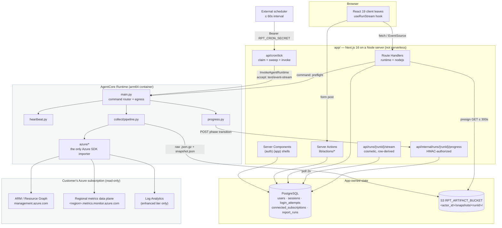
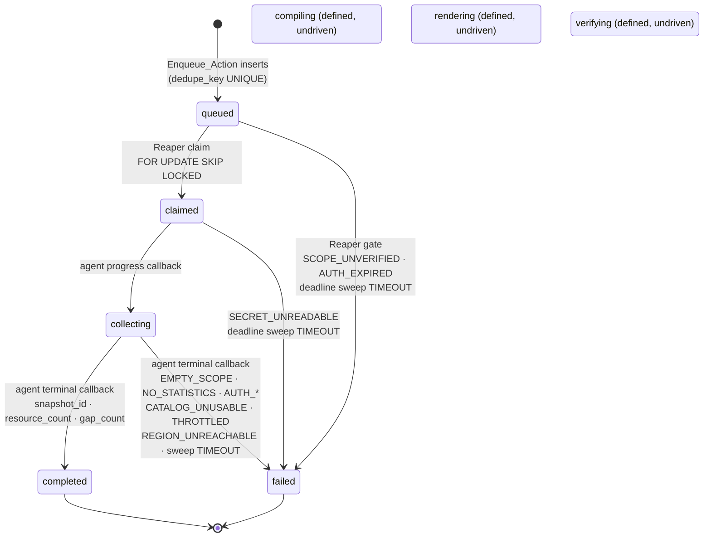

# Design Document

## Overview

This spec builds the foundation: an authenticated Next.js 16 web app, Azure subscription
onboarding behind a hard authorization gate, a Python AgentCore runtime, and a deterministic
metrics collector whose single output is one **immutable, content-addressed snapshot** per run.

The design is organised around one structural claim: **the product invariant is a directory
boundary.** `app/` orchestrates, authorizes and displays. `agent/` collects, computes and
proves. Nothing deterministic about a number lives in `app/` — **if a figure is being
calculated in `app/`, the layering is wrong**, and that is a design error rather than a style
preference. The boundary is enforced by tests, not by convention: `app/` may not import an
Azure SDK (Req 18.5 has no `app/` counterpart because `app/` has no Azure code path at all),
and `agent/` may not import an Azure SDK outside `agent/src/reporting_agent/azure/` (Req 18.7).

Three secondary claims shape everything below.

**Postgres is the state machine, not a stream.** A run is 8–12 minutes at p99. The
authoritative record is the `report_runs` row; the agent advances it with four or five tiny
`POST`s; the browser's SSE connection is a disposable view derived from that row. Nothing in
the system treats a long-held HTTP connection as truth.

**Determinism is a serialization discipline, not an intention.** Every metric value is a
fixed-precision decimal string from the moment it leaves the Azure response until it lands in
the snapshot; the snapshot is RFC 8785-canonicalized and SHA-256 hashed; `snapshot_id` *is*
that digest. A `float` reaching the snapshot path is an exception with a field path (Req
34.10), not a rounding difference someone notices in production.

**Secrets are structurally unable to reach an event.** Both halves funnel every outbound
event through one egress function that scrubs a per-invocation secret registry (Req 15.8), and
the app relays only through a redaction pass keyed on field names in either casing (Req 15.6).
`progress_token` is treated exactly like `client_secret`, because it authorizes writes to the
run state machine.

### What this design deliberately does not contain

The run pipeline is exercised end to end for exactly one command — `generate_report` — and that
command **stops at the snapshot**. There is no template AST, no template definition model, no
compiler, no figure ledger, no `formatted` production, no `.docx`/`.pdf` renderer, no theme
documents, no document verifier, no replay execution, no drift sampling, and no run
comparison. `compile/`, `render/`, `verify/` and `compare/` are **not created** by this spec;
their absence is the scope boundary made visible in the tree.

Two consequences worth stating because they look like omissions:

- `report_runs.status` carries `compiling`, `rendering` and `verifying` in its enum, and the
  design leaves them **defined, undriven and unreachable** (Req 36.2). The state machine is one
  design; migrating it twice would be the mistake.
- `events.py` / `lib/events.ts` **declare** the full ten-type event vocabulary while the runtime
  emits only the subset this spec drives (Req 14.11). The vocabulary is a shared contract, not a
  capability list — see
  [Event vocabulary](#the-event-vocabulary--one-contract-two-languages).

---

## Architecture

### Component and deployment view



Two edges carry the whole orchestration argument. `PR --> PROG` is the **authoritative** path:
short, independent requests that persist state. `RELAY --> PG` is the **cosmetic** path: it
reads the row and never touches the runtime. There is deliberately no edge from `RELAY` to
`MAIN`.

Deployment constraints that follow from the 8–12 minute p99: the app runs on a **Node server**,
not a serverless platform with a hard function ceiling; CloudFront's 30s origin-response
default and ALB's 60s idle default must be raised or they will kill the relay long before the
app does. Because the relay is cosmetic, a proxy killing it is survivable — the client
reconnects within 5s (Req 40.11) and rebuilds state from the row.

### The run state machine



Phase deadlines are written on every entry to a non-terminal status (Req 36.9): `queued` +900s,
`claimed` +300s, `collecting` +1800s. The `collecting` budget exceeds the 8–12 minute p99 by at
least 900s, and the 900s `queued` budget tolerates 14 consecutive missed scheduler ticks at a
60s interval (Req 39.12) before a queued run is failed as `TIMEOUT`.

### One `generate_report` run, end to end

```mermaid
sequenceDiagram
    autonumber
    actor U as Consultant
    participant A as Enqueue_Action
    participant DB as report_runs
    participant T as api/cron/tick
    participant R as AgentCore runtime
    participant AZ as Azure
    participant S as S3
    participant P as progress endpoint
    participant SR as stream relay (cosmetic)

    U->>A: submit period + subscription + scope
    A->>DB: INSERT status=queued, dedupe_key,<br/>progress_token_hash, phase_deadline=+900s
    A-->>U: runId (returns in under 2s; no invoke, no stream)

    Note over SR,DB: observer path — independent of everything below
    U->>SR: GET /api/runs/{runId}/stream
    loop every 2s until terminal or 120s idle
        SR->>DB: SELECT status, counts, error_code
        SR-->>U: heartbeat / status events
    end

    T->>DB: 1. sweep phase_deadline < now() -> failed/TIMEOUT
    T->>DB: 2. UPDATE ... status=claimed FOR UPDATE SKIP LOCKED LIMIT 10
    T->>T: recompute progress_token = HMAC(key, "progress-token"||runId)
    T->>R: InvokeAgentRuntime(command=generate_report, context)
    T-->>T: detached drain; respond in under 10s

    R->>P: POST phase=collecting
    P->>DB: status=collecting, phase_deadline=+1800s
    R->>AZ: Resource Graph paging (skip_token, quota headers)
    Note over R: EMPTY_SCOPE gate here —<br/>before any metrics request or artifact write
    loop batches sized by points budget
        R->>AZ: MetricsClient.query_resources (one namespace, one region)
        R->>S: raw .json.gz written in the SAME fold pass
        R->>R: fold into accumulators + sketches, discard points
    end
    R->>S: PUT snapshot.json (If-None-Match: *)
    R->>P: POST phase=completed, snapshot_id, resource_count, gap_count
    P->>DB: status=completed, phase_deadline=NULL
    SR->>DB: next poll observes terminal
    SR-->>U: snapshot_ready + done, then close
```

The sequence makes the load-bearing asymmetry visible: the tick has responded by step 11, minutes
before the run's terminal write at step 20, and the relay's polling loop is drawn as a detached
observer because deleting it changes no persisted outcome.

---

## Components and Interfaces

Two halves, one boundary. `app/` is described first because it owns the state machine every
other component reports into; `agent/` second because every one of its modules exists to produce
one snapshot. Signatures below are the contract, not a sketch: where a type is closed, the
closure is load-bearing.

### `app/` — the Next.js 16 web app

#### Next 16 constraints this design is written against

Read from the in-tree docs at `app/node_modules/next/dist/docs/`, not from memory:

| Constraint | Source | Consequence here |
|---|---|---|
| `cookies()`, `headers()`, `params` are **async only**; synchronous access removed | `02-guides/upgrading/version-16.md` | every session read is `await cookies()`; every dynamic route awaits `ctx.params` |
| **Cookies cannot be set during a Server Component render** | `04-functions/cookies.md` | idle-expiry renewal is a **DB write, never a cookie write** (Req 2.7, 2.14) — the requirement and the framework agree |
| `middleware` is deprecated, renamed `proxy`; `proxy` is Node-runtime only and runs on every route including prefetches | `upgrading/version-16.md`, `02-guides/authentication.md` | **no `proxy.ts` in this spec.** The route guard is a server-side check in `app/(app)/layout.tsx` plus a per-handler check — an authoritative DB check, not an optimistic cookie peek |
| `RouteContext<'/path'>` is a global typed helper generated by `next typegen` | `03-file-conventions/route.md` | dynamic route handlers type params as `RouteContext<'/api/runs/[runId]'>` |
| Route handlers are **not cached** by default; only `GET` can opt in | `01-getting-started/15-route-handlers.md` | no handler opts in; the presign route additionally sends `Cache-Control: no-store` |
| `runtime` is `'nodejs'` by default | `02-route-segment-config/runtime.md` | the explicit `export const runtime = "nodejs"` is kept anyway — it is the Boundary_Guard's anchor (Req 6.7) and documents that edge is not an option |
| `next lint` removed; ESLint runs directly | `upgrading/version-16.md` | the existing `"lint": "eslint"` script is already correct |
| `argon2`, `pg`, `@aws-sdk/client-s3` are auto-excluded from Server Components bundling | `01-next-config-js/serverExternalPackages.md` | `next.config.ts` needs no `serverExternalPackages` entry for them |
| Turbopack is the default builder | `upgrading/version-16.md` | no webpack config; adding one would fail the build |

#### File tree

`(exists)` files are already scaffolded and are **extended, not recreated**. `app/components.json`
and the token values in `app/app/globals.css` carry the Luma preset's identity and are not
regenerated (Req 6.9).

```
app/
  app/
    layout.tsx                                   (exists) + IconContext defaults
    page.tsx                                     (exists) -> redirect to /dashboard | /login
    globals.css                                  (exists) + ONE appended @theme line
    (auth)/layout.tsx                            new  centered card shell
    (auth)/login/page.tsx                        new
    (auth)/register/page.tsx                     new
    (app)/layout.tsx                             new  requireSession() + sidebar shell
    (app)/dashboard/page.tsx                     new  recent runs · subscription health · expiry
    (app)/subscriptions/page.tsx                 new  list + expiry banner + rotate
    (app)/subscriptions/new/page.tsx             new  the onboarding wizard
    (app)/reports/page.tsx                       new  run list + "New report" form
    (app)/reports/[runId]/page.tsx               new  run detail + live activity timeline
    api/subscriptions/route.ts                   new  GET list · POST create
    api/subscriptions/test/route.ts              new  POST preflight (the only accept path)
    api/subscriptions/[id]/secret/route.ts       new  POST rotate secret
    api/runs/route.ts                            new  POST enqueue
    api/runs/[runId]/route.ts                    new  GET status + gaps
    api/runs/[runId]/stream/route.ts             new  GET SSE (cosmetic)
    api/internal/runs/[runId]/progress/route.ts  new  POST phase transition
    api/cron/tick/route.ts                       new  POST sweep + claim + invoke
    api/artifact-url/route.ts                    new  GET presign
  components/
    ui/                        button.tsx (exists) + registry: input label field card badge
                               alert dialog select separator spinner table progress
    theme-provider.tsx                           (exists)
    app-shell/{sidebar,user-menu,theme-toggle}.tsx
    auth/{login-form,register-form}.tsx
    subscriptions/{subscription-list,connect-wizard,reader-role-explainer,az-script-step,
                   arm-template-step,preflight-result,secret-expiry-banner,
                   rotate-secret-dialog,copy-button}.tsx
    reports/{run-list,run-form,run-progress,activity-timeline,gap-list,
             snapshot-provenance,fidelity-badge}.tsx
  hooks/useRunStream.ts
  lib/
    env.ts  crypto.ts  session-id.ts  events.ts  utils.ts (exists)
    auth/{password,session,lockout,guard}.ts
    validation/{email,password,return-to,mask,index}.ts
    db/{index,schema,views}.ts   db/migrations/
    subscriptions/{store,state,azure-artifacts}.ts
    runs/{state,claim,progress-token,dedupe,gaps}.ts
    actions/{auth,subscriptions,runs}.ts
    aws/{agentcore,s3}.ts
  test/{setup.ts,server-only-stub.ts,boundaries.static.test.ts,
        property-hygiene.static.test.ts}
  drizzle.config.ts   vitest.config.ts   .env.example
```

`lib/aws/dynamo.ts` and `lib/aws/bedrock.ts` are **absent**: chat history and AI titles are out
of scope. `RPT_HISTORY_TABLE` and `RPT_TITLE_MODEL_ID` are nevertheless in the required env set
(Req 5.4) and in `.env.example` — declared, validated, unused by this spec.

#### Dependencies to add

```bash
# from app/
pnpm add drizzle-orm@0.45.2 pg@8.22.0 zod@4.4.3 argon2@0.45.0 \
  @aws-sdk/client-bedrock-agentcore@3.1090.0 @aws-sdk/client-s3@3.1090.0 \
  @aws-sdk/s3-request-presigner@3.1090.0 @aws-sdk/client-dynamodb@3.1092.0 \
  @aws-sdk/lib-dynamodb@3.1092.0 @aws-sdk/client-bedrock-runtime@3.1092.0 \
  server-only@0.0.1
pnpm add -D drizzle-kit@0.31.10 @types/pg@8.20.0 \
  vitest@4.1.10 @vitejs/plugin-react@6.0.3 jsdom@29.1.1 fast-check@4.9.0 \
  @testing-library/react@16.3.2 @testing-library/dom@10.4.1 \
  @testing-library/jest-dom@6.9.1 @testing-library/user-event@14.6.1
```

Exact pins, no ranges; the versions are the sibling project's resolved set, which is known to
work against `next@16.2.6` / `react@19.2.4`. **Vitest is not currently a dependency** and the
whole property-testing requirement (Req 42) depends on it. `shadcn` stays in `dependencies` —
`globals.css` does `@import "shadcn/tailwind.css"` (Req 6.8). New scripts: `db:generate`,
`db:migrate`, `db:push`, `test` (`vitest run`), `test:watch`.

#### `lib/env.ts` — call-time resolution

```ts
import "server-only"

export const REQUIRED_ENV_VARS = [
  "DATABASE_URL", "APP_ENCRYPTION_KEY", "AWS_REGION", "RPT_RUNTIME_ARN",
  "RPT_ARTIFACT_BUCKET", "RPT_HISTORY_TABLE", "RPT_TITLE_MODEL_ID",
  "RPT_CRON_SECRET", "RPT_APP_BASE_URL",
] as const                                        // Req 5.4, 5.10 — the guard reads THIS

export type RequiredEnvVar = (typeof REQUIRED_ENV_VARS)[number]
export class MissingEnvError extends Error { readonly variableName: RequiredEnvVar }
export function requireEnv(name: RequiredEnvVar): string   // Req 5.1, 5.2, 5.9
export function getEnv(): Record<RequiredEnvVar, string>   // Req 5.8 — declared order
```

`requireEnv` reads `process.env` per call and rejects absent, empty **and whitespace-only**
values (Req 5.2); the thrown error names the variable and never its value (Req 5.3). No
`AUTH_SECRET` (Req 5.5) — there is no Auth.js and nothing is signed. `REQUIRED_ENV_VARS` is
exported so the Boundary_Guard diffs `.env.example` against the array rather than a duplicated
list (Req 5.10, 6.6); a second list is a guard that passes while lying.

**`.gitignore` needs a fix.** `app/.gitignore` currently contains `.env*`, which ignores
`.env.example` too. Requirement 5.7 needs the example tracked, so add `!.env.example`
immediately after. This is a one-line addition to a generated-but-not-preset file, and the
Boundary_Guard asserts both the ignore rule and the negation.

#### `lib/crypto.ts` — AES-256-GCM at rest

```ts
import "server-only"
const KEY_BYTES = 32, IV_BYTES = 12, TAG_BYTES = 16      // Req 4.1
export class EncryptionKeyError extends Error {}          // unresolvable APP_ENCRYPTION_KEY
export class CiphertextError extends Error {}             // malformed / tag mismatch
export function resolveEncryptionKey(): Buffer            // base64-of-32 or 32 raw bytes (4.7)
export function encryptSecret(plaintext: string): string  // base64(iv|tag|ct) (4.2, 4.3, 4.9)
export function decryptSecret(blob: string): string       // throws on tamper (4.5, 4.6)
```

Two error **types**, not one: Req 4.11 requires a rotated key to be distinguishable from a
tampered value, and one `Error` cannot carry that distinction. Neither message includes
plaintext, ciphertext or key material (Req 4.10). `resolveEncryptionKey` is exported because
`lib/runs/progress-token.ts` keys its HMAC from the same 32 bytes (Req 37.3).

#### `lib/session-id.ts` — AgentCore runtime session ids

```ts
const THREAD_NS = "rpt:session:thread:v1:"
const RUN_NS    = "rpt:session:run:v1:"                    // Req 8.6 — namespace separation
export function sessionIdForThread(threadId: string): string  // sha256 hex, 64 chars
export function sessionIdForRun(runId: string): string        // sha256 hex, 64 chars
export function newSessionId(): string                        // base64url(randomBytes(48))
```

SHA-256 hex is 64 characters for **any** input, so the 33–128 bound holds by construction
rather than by validation (Req 8.1). Derivation is deterministic (Req 8.2) and the two
namespaces mean a thread id and a run id carrying the same string derive different ids
(Req 8.6). Not `server-only`: it is pure and holds no secret.

#### Auth — four modules, one responsibility each

**`lib/auth/password.ts`**

```ts
import "server-only"
const ARGON2 = { type: argon2.argon2id, memoryCost: 19456, timeCost: 2, parallelism: 1 } // 1.2, 1.10
const DECOY_HASH = "$argon2id$v=19$m=19456,t=2,p=1$..."   // fixed literal, same params (1.11)
export const PASSWORD_MIN = 12, PASSWORD_MAX = 256        // Unicode code points (1.3)
export function hashPassword(plaintext: string): Promise<string>
export function verifyPassword(hash: string, plaintext: string): Promise<boolean>  // 1.5, 1.6
export function burnDecoyVerification(plaintext: string): Promise<void>            // 1.11
```

The password is hashed **exactly as submitted**, including surrounding whitespace (Req 1.1) —
trimming a password silently changes the credential. Length is measured in code points
(`[...value].length`), so an emoji passphrase is not miscounted. `verifyPassword` returns
`false` for a malformed hash instead of throwing (Req 1.6). `burnDecoyVerification` performs one
real argon2id verification against `DECOY_HASH` on the unmatched-email path so that path and
the wrong-password path are indistinguishable by elapsed time (Req 1.11) — the decoy must carry
the **same parameters** or the timing difference it exists to hide reappears as a cost
difference.

**`lib/auth/session.ts`**

```ts
import "server-only"
export const SESSION_COOKIE = "rpt_session"                       // Req 2.15
export const ABSOLUTE_TTL_S = 30 * 24 * 3600                      // 2592000 (2.6, 2.15)
export const IDLE_TTL_S = 7 * 24 * 3600                           // Req 2.7, 2.17
export type AuthUser = { id: string; email: string }
export async function createSession(userId: string): Promise<void>
export async function readSession(): Promise<AuthUser | null>
export async function destroySession(): Promise<void>
export async function revokeAllSessionsForUser(userId: string, tx): Promise<void>
```

The token is `randomBytes(32)` (Req 2.1) encoded **base64url**, giving a 43-character token over
the base64url alphabet (Req 2.16). Only `sha256(token)` hex is stored, in
`sessions.session_token_hash`; no column holds the token (Req 2.2). Lookup is by hash equality,
then the candidate row's stored hash is compared to the recomputed hash with
`timingSafeEqual` over the decoded digests before the session is accepted (Req 2.5) — the SQL
index does the finding, the constant-time compare does the deciding.

Cookie: `httpOnly`, `sameSite: "lax"`, `path: "/"`, `maxAge: 2592000`, and `secure` only when
`NODE_ENV === "production"` (Req 2.3, 2.4, 2.15) so local HTTP development works.

Expiry is **absolute plus idle**. `createSession` writes `absolute_expires_at = now + 30d` and
`idle_expires_at = now + 7d` (Req 2.6, 2.17). `readSession` on a valid row pushes
`idle_expires_at` to `now + 7d` and leaves `absolute_expires_at` untouched (Req 2.7). That
renewal is a **DB write with no cookie write** — which is both what Req 2.7/2.14 demand and the
only thing Next 16 permits during a Server Component render. It costs one `UPDATE ... WHERE id
= $1` per authenticated request; that write is what makes idle expiry real rather than
decorative. A request at or past either expiry resolves unauthenticated and best-effort deletes
the row, swallowing a deletion failure (Req 2.8–2.11). A request with no cookie, or a token
matching no row, performs **no write at all** (Req 2.18).

**`lib/auth/lockout.ts`**

```ts
export const FAILED_THRESHOLD = 5, WINDOW_MINUTES = 15
export function isLockedOutFromFailures(failures: readonly Date[], now: Date): boolean  // PURE
```

```ts
import "server-only"
export async function recordLoginAttempt(emailNormalized: string, success: boolean): Promise<void>
export async function isLockedOut(emailNormalized: string, now: Date): Promise<boolean>
```

The window predicate is a pure function of a timestamp list and an instant, with no I/O
(Req 3.5), so the "locked for 15 minutes" behaviour is directly testable. Lockout is defined
**only** by the trailing inclusive window over failures (Req 3.2, 3.4) — there is no stored lock
row, so an email self-unlocks 15 minutes after its most recent qualifying failure. Rejected
attempts are themselves recorded as failures (Req 3.7), which is what makes the window measure
from the most recent attempt. A read failure on `login_attempts` **fails closed**: reject
without verifying and return the generic outcome (Req 3.8).

**`lib/auth/guard.ts`**

```ts
import "server-only"
export async function requireSession(returnTo?: string): Promise<AuthUser>  // redirect on miss
export async function requireSessionForApi(): Promise<AuthUser | null>      // 401/404 on miss
```

```ts
// lib/validation/return-to.ts — pure
export function safeReturnTo(raw: string | null | undefined): string   // Req 7.9
```

`safeReturnTo` accepts only a value beginning with exactly one `/` and returns `/dashboard`
otherwise — rejecting `//evil.com`, `/\evil.com`, `https://…` and a bare path. Absent or
off-origin becomes `/dashboard` (Req 7.9).

#### Server actions and route handlers

Every handler and every action parses its input with a **named zod schema at the boundary**;
path params and search params count as input (Req 7.7). No `as SomeType` on a request body.

| Entry point | Runtime | Input schema | Notes |
|---|---|---|---|
| `registerAction` | node | `registerInputSchema` | email ≤254 + format (7.11); password 12–256 code points; UNIQUE violation → email-unavailable, no user, no session (7.12) |
| `loginAction` | node | `loginInputSchema` | lockout → generic outcome (3.6); rotates an existing session by deleting the presented row (7.10) |
| `logoutAction` | node | — | deletes row + clears cookie; no-op without a cookie (2.12, 2.13) |
| `changePasswordAction` | node | `changePasswordInputSchema` | new hash + delete all this user's sessions **in one transaction** (1.9, 1.13) |
| `POST /api/subscriptions/test` | nodejs | `subscriptionTestInputSchema` | invokes `command: "preflight"`; 30s cap (12.12) |
| `POST /api/subscriptions` | nodejs | `subscriptionCreateInputSchema` | accepts only with a `scope_verified: true` preflight result (11.10, 12.5) |
| `POST /api/subscriptions/[id]/secret` | nodejs | `rotateSecretInputSchema` | replaces ciphertext, re-runs preflight (13.7, 13.8) |
| `POST /api/runs` | nodejs | `runCreateInputSchema` | thin wrapper over `enqueueRun` |
| `GET /api/runs/[runId]` | nodejs | `runIdParamSchema` | `RunView` + gap list |
| `GET /api/runs/[runId]/stream` | **nodejs** | `runIdParamSchema` | SSE; Node runtime is mandatory (40.1) |
| `POST /api/internal/runs/[runId]/progress` | nodejs | `progressCallbackSchema` | token in a header, never the body (38.2) |
| `POST /api/cron/tick` | nodejs | `bearerHeaderSchema` | sweep, claim, invoke, return <10s |
| `GET /api/artifact-url` | nodejs | `artifactUrlQuerySchema` | presign ≤300s, `Cache-Control: no-store` |

Every one of them declares `export const runtime = "nodejs"`. Two of those declarations are
load-bearing rather than documentary: the stream route because a long-lived SSE response and
the AWS SDK both require Node (Req 40.1, 6.7), and the tick route because it opens an
AgentCore invocation.

#### `POST /api/runs` → `lib/actions/runs.ts` — enqueue and return

```ts
export const runScopeSchema = z.object({
  resource_types: z.array(z.string().min(1)).min(1),
  resource_groups: z.array(z.string().min(1)).default([]),
  tag_filters: z.record(z.string(), z.string()).default({}),
})
export const runCreateInputSchema = z.object({
  connectedSubscriptionId: z.string().min(1),
  periodStart: z.string().regex(/^\d{4}-\d{2}-\d{2}$/),
  periodEnd:   z.string().regex(/^\d{4}-\d{2}-\d{2}$/),
  timezone: z.string().min(1).default("Asia/Jakarta"),
  scope: runScopeSchema,
})
export async function enqueueRun(userId: string, input): Promise<{ runId: string }>
```

`enqueueRun` validates, inserts one `queued` row, and returns — **within 2 seconds**, awaiting
nothing but its own validation and its own write (Req 37.2). It holds no stream, makes no
AgentCore call and no Azure call. Rejections before insert: a subscription that is not this
user's or not `active` (Req 37.9), and a period that is inverted, outside 1–31 local days, or
ending after today in the run's timezone (Req 37.10).

`dedupe_key` is derived, never random (Req 37.1):

```ts
// lib/runs/dedupe.ts — pure
const US = "\u001f"                                  // unit separator: no field-boundary ambiguity
export function deriveDedupeKey(p: {...}): string {
  return sha256hex([
    "v1", p.userId, p.connectedSubscriptionId, p.periodStart, p.periodEnd, p.timezone,
    [...p.resourceTypes].sort().join(","), [...p.resourceGroups].sort().join(","),
    String(Math.floor(p.enqueuedAtMs / 60_000) * 60),
  ].join(US))
}
```

The 60-second bucket is what makes a double-submitted form idempotent while still allowing a
deliberate re-run a minute later. On a UNIQUE violation the action returns the **existing** run
and mints no second token (Req 37.5) — the insert races are resolved by the database, not by a
pre-check.

#### The progress token — derived, not minted

```ts
// lib/runs/progress-token.ts
import "server-only"
const LABEL = "progress-token"                                        // domain separation
export function deriveProgressToken(runId: string): string            // base64url HMAC-SHA256
export function progressTokenHash(token: string): string              // sha256 hex, stored
export function validateProgressToken(token: string, storedHash: string): boolean // timingSafe
```

`token = base64url(HMAC-SHA256(key = resolveEncryptionKey(), msg = "progress-token" || runId))`
and only `sha256(token)` is stored, in `progress_token_hash` (Req 37.3).

**Why derived rather than randomly minted.** The process that invokes the runtime is the cron
tick — a *different, later HTTP request* than the enqueue that created the run. A random token
would have to be recoverable at invoke time, and the only stored form is a hash, which is
one-way by design. So the alternatives were: store the token in plaintext (a DB leak becomes a
run-hijack), store it encrypted (a second secret-at-rest path, and the same leak plus key gives
the same hijack), or mint a fresh token at claim time (then the token is not run-scoped-stable
and a retried tick invalidates an in-flight callback). Deriving it means the token is
**recomputable from the run id by anyone holding `APP_ENCRYPTION_KEY`** — that is, by the
server — and by nobody else. The fixed label domain-separates the HMAC from any other future
use of the same key.

The token is a credential, not a correlation id: it never appears in a URL (Req 38.2, 15.7),
never in `RunView` (Req 37.6, 37.7), never in an event or a log line (Req 38.9).

#### The progress endpoint

```ts
export const progressCallbackSchema = z.object({
  run_id: z.string().min(1),
  phase: z.enum(["collecting", "completed", "failed"]),
  error_code: z.enum(RUN_ERROR_CODES).optional(),
  error_message: z.string().max(2000).optional(),
  snapshot_id: z.string().regex(/^[0-9a-f]{64}$/).optional(),
  resource_count: z.number().int().nonnegative().optional(),
  gap_count: z.number().int().nonnegative().optional(),
  current: z.number().int().nonnegative().optional(),        // Req 38.1 — in-flight count
  total:   z.number().int().positive().optional(),
  label:   z.string().max(64).optional(),
})
```

The callback field is named **`current`** while the emitted SSE event field is named **`done`**.
That is deliberate and not a rename: the event vocabulary of Req 14.8 is unchanged, and the relay
maps `progress_current → done` when it emits (Req 40.15). The callback names a column; the event
names a field of a declared type.

The token arrives in `X-Rpt-Progress-Token` and is validated against the stored hash with a
constant-time compare (Req 38.5). A bad token and an unknown run id return **one identical
response** — `404` with a fixed body — so the endpoint discloses neither (Req 38.6).

Transition validation is a table, not a chain of ifs:

```ts
const DRIVEN: Record<RunStatus, readonly RunStatus[]> = {
  queued:     ["claimed", "failed"],       // 'claimed' is Reaper-only; the agent may not present it
  claimed:    ["collecting", "failed"],
  collecting: ["completed", "failed"],
  compiling: [], rendering: [], verifying: [], completed: [], failed: [],
}
```

Accepted targets are `{current} ∪ DRIVEN[current]` (Req 38.10). A valid **non-terminal**
transition writes the presented `progress_current`, `progress_total` and `progress_label`
alongside `status`, `updated_at` and `phase_deadline` (Req 38.7).

A target equal to the current status applies **no `status` change** but is not a no-op: it writes
the presented `progress_current`, `progress_total` and `progress_label`, refreshes `updated_at`,
and refreshes `phase_deadline` to that phase's budget (Req 38.13). So a same-status callback is
idempotent **with respect to `status`** — which is what makes a progress refresh inside one phase
persist rather than be discarded as a repeated transition, and what makes a replayed callback
harmless rather than an error.

One guard on that write: a presented `current` **below** the `progress_current` already stored
for the same phase leaves all three columns unchanged and applies the rest of the request
normally (Req 38.14). Req 14.8 requires successive `done` values for one step to be
non-decreasing, and the reporter's single retry can land out of order, so the row — not the
caller — enforces monotonicity.

Every transition on a **terminal** row is rejected with no write, including a repeat of the
terminal status it already carries (Req 38.8). `TIMEOUT` is rejected outright, as is any `failed`
target carrying a code outside the declared set (Req 38.11) — the Reaper is the only writer of
`TIMEOUT`. A terminal transition records its terminal fields and clears `phase_deadline`
**together with `progress_current`, `progress_total` and `progress_label`**, so a terminal row
carries no stale in-flight count, and writes no column derived from the presented token
(Req 38.12). The handler awaits no AgentCore, S3 or Azure call and returns within 2 seconds
(Req 38.7).

#### The reaper — `POST /api/cron/tick`

Authorization first, and it fails closed:

```ts
function bearerMatches(presented: string | null, expected: string | undefined): boolean {
  if (expected === undefined || expected === "") return false      // Req 39.2 — fail closed
  if (presented === null) return false
  const a = sha256(presented), b = sha256(expected)                // equal-length digests
  return timingSafeEqual(a, b)                                     // Req 39.1
}
```

Hashing both sides before comparing is what makes the comparison independent of the number of
matching leading characters **and** of the secret's length; `timingSafeEqual` on raw strings of
different length throws, which is itself a length oracle. A rejected request claims nothing and
writes nothing, including no `TIMEOUT` (Req 39.3).

Then, in this order within one request (Req 39.11):

```sql
-- 1. Deadline sweep, BEFORE the claim, so a queued row past its deadline is failed
--    rather than claimed. The `status` inside the SET expression evaluates to the
--    OLD row value in Postgres, which is exactly the expired phase name (Req 39.7).
UPDATE report_runs
   SET status = 'failed',
       error_code = 'TIMEOUT',
       error_message = 'Phase ' || status || ' exceeded its deadline',
       phase_deadline = NULL,
       updated_at = now()
 WHERE id IN (
   SELECT id FROM report_runs
    WHERE status IN ('queued','claimed','collecting')
      AND phase_deadline < now()
    ORDER BY phase_deadline
    FOR UPDATE SKIP LOCKED
    LIMIT 100)
RETURNING id, status;

-- 2. Atomic claim. Overlapping ticks claim disjoint sets (Req 39.5) because SKIP
--    LOCKED makes the second tick step over rows the first has locked. Rows the
--    sweep just failed no longer match `status='queued'`, so they are excluded by
--    construction rather than by a second predicate.
UPDATE report_runs
   SET status = 'claimed', claimed_at = now(), claimed_by = $1,
       updated_at = now(), phase_deadline = now() + interval '300 seconds'
 WHERE id IN (
   SELECT id FROM report_runs
    WHERE status = 'queued'
    ORDER BY created_at
    FOR UPDATE SKIP LOCKED
    LIMIT 10)
RETURNING id, user_id, connected_subscription_id, period_start, period_end, timezone, scope;
```

`claimed_by` is a `randomUUID()` minted once per tick request (Req 39.4).

For each claimed row the tick then gates and invokes:

1. Load the subscription. `scope_verified = false` → fail the run `SCOPE_UNVERIFIED`;
   `secret_expires_at <= now` → fail `AUTH_EXPIRED`; either way **no invocation** (Req 39.10).
2. Decrypt `client_secret_enc`. On failure: fail the run `SECRET_UNREADABLE`, make no SDK call,
   and exclude the ciphertext and key material from `error_message` (Req 41.10).
3. Re-read the row's status; anything other than `claimed` skips the invoke, so a retried tick
   cannot invoke one run twice (Req 41.9).
4. `invokeAgentRuntime` with `sessionId = sessionIdForRun(runId)` (Req 8.5, 41.7) and a 10-second
   start budget; a failure to start is logged with secrets excluded, the row is **left at
   `claimed`** for the deadline sweep, and the remaining rows are still invoked (Req 39.13).
5. Respond `{ swept, claimed, invoked, failed }` within 10 seconds, awaiting no run (Req 39.9).

**How the invocation response is released.** Requirement 39.6 says the tick leaves the event
stream unread and returns. This design implements that as a **detached drain**: a
non-awaited task that reads and discards bytes without parsing an event, holding no run state,
capped by the `collecting` budget. It is not an abort. The distinction matters because
`InvokeAgentRuntime` is a streaming request/response — if aborting the caller's side terminates
the runtime, an abort implementation would kill every run at second one, which is a total
failure that looks like an agent bug. Draining satisfies "never waits" and "never consumes
events as state" while leaving the transport intact. See
[Open questions](#open-questions), item 3.

#### The SSE relay is derived from the row

```ts
export const runtime = "nodejs"                                        // Req 40.1
// headers: Content-Type: text/event-stream · Cache-Control: no-cache, no-transform
//          X-Accel-Buffering: no                                      // Req 40.2
const POLL_MS = 2_000, HEARTBEAT_MS = 15_000, IDLE_CLOSE_MS = 120_000  // Req 40.3, 40.10
```

The handler authorizes the session and the run's `user_id`, resolving a mismatch as **not
found** with no stream opened and no field disclosed (Req 40.9). It then polls the
`report_runs` row every 2 seconds and emits events derived **only** from that row and the stored
gap list (Req 40.5, 40.10):

- a status change → `tool` start/end pairs for `collect_inventory` / `collect_metrics`;
- a `progress` event from `progress_current` / `progress_total` / `progress_label` while the row is
  non-terminal **and both counts carry a value**, mapping `progress_current → done`, taking `id`
  from the row's `status` so it matches the relay's own `tool` step ids, and taking `unit` from a
  per-phase constant in `app/lib/events.ts` rather than from run state (Req 40.10, 40.15). While
  either count is absent the relay emits **no** `progress` event, so a phase carrying no countable
  work produces no false determinate bar (Req 40.14);
- a `heartbeat` every 15 seconds while the row is non-terminal;
- on `completed` → `snapshot_ready` (snapshot id, resource count, window, grain, gaps) then
  `done`, then close (Req 40.12);
- on `failed` → `error` with `code`/`terminal: true` then `done`, then close.

**It makes no AgentCore invocation** (Req 40.10). This is the single most likely place for an
implementer to go wrong, because `cold-agent/app/app/api/chat/route.ts` is a working relay that
invokes the runtime and forwards its stream, and it is the obvious file to copy. It is the wrong
precedent here: in this design the invocation was started by the tick, **in a different request
that has already returned**, so there is no upstream stream for this handler to attach to. What
carries over from that file is the mechanical shell — `ReadableStream`, the encoder, the
inactivity race, the `cancel()` teardown — and nothing else.

The relay closes after 120 consecutive seconds in which it emitted nothing but heartbeats
(Req 40.3). For a run sitting in `collecting` for ten minutes that means the relay closes
roughly every two minutes and the client reopens within five seconds (Req 40.11), rebuilding
displayed state from the row before rendering (Req 40.4). That churn is intentional: a
disposable view that reconnects cleanly is strictly better than a long-lived one that must be
correct.

**Where the gap list comes from.** `report_runs` carries `gap_count` but not the gaps
themselves, and the terminal callback carries only counts (Req 38.12). The gap list's store is
the **snapshot object** (Req 35.4). `lib/runs/gaps.ts#loadRunGaps(run)` reads
`<actor_id>/snapshots/<runId>/snapshot.json` server-side once on terminal and projects its
`gaps` array. That keeps Req 40.5 true — the snapshot is one of the two named sources — and adds
neither a column nor a table.

#### `lib/aws/*`

```ts
// lib/aws/agentcore.ts
import "server-only"
export interface AgentInvokeContext {          // EXACTLY the 12 fields of Req 41.5, closed
  actor_id: string; subscription_id: string
  tenant_id: string; client_id: string; client_secret: string      // secrets
  timezone: string; display_name: string
  fidelity_tier: "baseline" | "enhanced"
  log_analytics_workspace_id: string | null
  run_id: string; progress_url: string; progress_token: string     // secret
}
export type InvokeCommand =
  | { command: "generate_report"; period: { start: string; end: string }; scope: RunScope }
  | { command: "preflight" }
export class MissingRuntimeConfigError extends Error {}            // Req 41.2
export async function invokeAgentRuntime(a: {
  sessionId: string; context: AgentInvokeContext; command: InvokeCommand
}): Promise<AsyncIterable<Uint8Array>>
```

The ARN is read from `process.env.RPT_RUNTIME_ARN` at call time and never hardcoded (Req 41.1,
6.3); unset or empty throws before any SDK call (Req 41.2). `buildInvokeContext(run,
subscription, secret, token)` is the only constructor of that type, and the type being closed is
what enforces Req 41.5's "no further field". `progress_url` is built from `RPT_APP_BASE_URL`
(Req 41.6); `actor_id` is the run's `user_id`, which is what makes the artifact prefix the
runtime writes under the same prefix the download authorization compares against (Req 41.11).
The payload carries no `prompt` field (Req 41.8) — the deterministic pipeline must be reachable
without a model decision.

```ts
// lib/aws/s3.ts
import "server-only"
export const MAX_PRESIGN_SECONDS = 300                                   // Req 37.8
export function parseArtifactKey(key: string): { actorId; runId; rest } | null  // PURE
export function keyBelongsToActor(actorId: string, key: string): boolean        // PURE
export async function presignArtifact(actorId: string, key: string): Promise<{url; expiresIn}>
export async function getSnapshotJson(key: string): Promise<unknown>
```

`keyBelongsToActor` is an **exact segment match**, not a `startsWith`: the key must split into
`<actorId>/snapshots/<runId>/<rest…>` with `segments[0] === actorId` and `segments[1] ===
"snapshots"`. `startsWith` would authorize `alice-evil/...` for `alice`. Authorization runs
before any AWS call, and a mismatch — of key prefix or of run ownership — resolves as not found
with no URL minted (Req 37.12). No presigned URL is stored or placed in a cacheable or
server-rendered payload (Req 37.8).

#### The onboarding wizard and the preflight gate

The wizard is four steps, and the third is the only path to an accepted connection.

1. **Subscription + role explainer.** States that **Reader at subscription scope** is required;
   that `Monitoring Reader` alone does **not** grant Resource Graph inventory and inventory is
   what identifies the resources metrics are collected for; that Reader exposes resource
   configuration in addition to metrics; and that the connection is read-only with no
   write-capable role requested (Req 11.3–11.5). This copy is not decoration — a customer who
   is surprised by Reader revokes access mid-engagement.
2. **Generated artifacts.** `lib/subscriptions/azure-artifacts.ts` is **pure** and returns both
   an `az` CLI script and an ARM template for the supplied subscription id, each containing
   **exactly one role assignment**, role `Reader`, scope `/subscriptions/<id>`, and no
   write-capable action (Req 11.1, 11.2, 11.8). The rendered script shows the target
   subscription id and never a client secret (Req 11.6). Being pure makes "exactly one Reader
   assignment" a property test rather than a review item.
3. **Credentials + expiry + preflight.** Collects tenant id, client id, client secret and
   `secret_expires_at`, stating the 24-month maximum and the common 6–12 month issuance
   (Req 11.7). An expiry that is absent, at or before now, or more than 24 months out is
   rejected with the accepted range stated (Req 11.9). Submitting runs the preflight; there is
   **no control anywhere in the wizard that saves a connection without a `scope_verified: true`
   result** (Req 11.10).
4. **Result.** On success the row is inserted `status = 'active'`. On `SCOPE_UNVERIFIED` the UI
   states the subscription-scope Reader requirement and why a resource-group-scoped assignment
   is rejected (Req 12.7).

`POST /api/subscriptions/test` invokes `command: "preflight"` and consumes that short stream
inline with a 30-second cap (Req 12.12). The app itself makes **no Azure call and holds no
Azure token** (Req 12.11) — which is why onboarding depends on the runtime being deployed
first, a bootstrapping order recorded in [Open questions](#open-questions), item 7.
`scope_verified` is derived **solely** from the permissions response, never from a successful
inventory query (Req 12.4), and the Preflight_Service is the **only** writer of a `true` value
(Req 12.14). Coverage checks cannot detect what RBAC hides: a principal with Reader on one
resource group returns that group's resources, every metric succeeds, every figure verifies,
and the document is 90% incomplete with nothing in the data to say so.

#### UI surfaces (this spec only)

Applying `design-system.md`: Luma preset tokens, teal as the single chromatic voice, rounded
corners with **controls as pills and surfaces at 10–14px**, all-sans Geist / Inter / Geist Mono,
Phosphor icons.

| Surface | Composition |
|---|---|
| `/login`, `/register` | centered `Card` at `rounded-xl` on `--background`; `Field` + `Input`; one pill submit; a single generic error that names neither field (Req 7.5) |
| `(app)` shell | `--sidebar` rail, nav with Phosphor icons, theme toggle, user menu; `requireSession()` in the layout |
| `/dashboard` | recent runs, subscription health, expiry banners; counts in `font-mono tabular-nums` |
| `/subscriptions` | list of `ConnectedSubscriptionView`; masked id in mono; `scopeVerified` and `fidelityTier` badges; expiry banner; rotate-secret dialog |
| `/subscriptions/new` | the four-step wizard; `az`/ARM artifacts in a mono code block with a copy button |
| `/reports` | run list — status, period, resource count, gap count, all numerals mono tabular |
| `/reports/[runId]` | run detail: status, activity timeline, snapshot provenance (id truncated in mono with copy, window in Asia/Jakarta **with the offset shown**, grain, counts), gap list grouped by `gap_type` |

Rules that are requirements rather than taste:

- **Mono tabular numerals for every figure** — metric values, counts, resource ids, snapshot
  hashes. In a product whose thesis is that the numbers are trustworthy, numerals that jitter as
  they stream undercut the argument. Streaming numerals do not animate.
- **`--destructive` is reserved.** Expired secret and hard run failure only. The
  approaching-expiry banner uses mist neutrals (Req 13.6), and the **gap list uses mist
  neutrals** — a gap is neutral information, not an error.
- **Phosphor from `@phosphor-icons/react/ssr` in server components.** `rsc: true` means the
  default entry is the client build and importing it triggers a spurious `"use client"`
  cascade. Defaults are set once via `IconContext.Provider`.
- **`aria-live="polite"`** carries run status; the activity timeline shows determinate
  `142 / 200 resources` from `progress` events rather than an indeterminate spinner, because a
  four-minute spinner reads as a hang.
- **The expiry warning is non-dismissible** (Req 13.2) and names the whole days remaining.

**The one additive CSS edit.** `@theme inline` maps `--font-sans` and `--font-heading` but not
`--font-mono`, even though `layout.tsx` sets the variable. Add exactly one line inside the
existing block:

```css
@theme inline {
    --font-mono: var(--font-mono);   /* additive; every other token value untouched */
}
```

The `--cat-*` categorical palette from `design-system.md` is **not** added by this spec: it has
no charts, and appending an unused palette invites it to drift before first use. It lands with
the spec that introduces charts.

---

### `agent/` — the Python AgentCore runtime

#### Package layout

```
agent/
  Dockerfile                       # linux/arm64, pinned Python, pinned deps
  pyproject.toml                   # all three Azure Monitor packages, pinned together
  requirements.lock                # fully pinned, committed (Req 17.8)
  .python-version                  # 3.12 (Req 17.9)
  README.md                        # build + deploy; every build line names --platform
  AGENTCORE_INTEGRATION.md         # the authoritative invoke contract the app reads
  src/reporting_agent/
    main.py                        # BedrockAgentCoreApp entrypoint; command routing; egress
    config.py                      # frozen config built once at process start
    events.py                      # the event vocabulary — mirrored in app/lib/events.ts
    redaction.py                   # per-invocation secret registry + logging filter
    heartbeat.py                   # 15s emitter merged into the pipeline generator
    progress.py                    # fire-and-forget phase-transition POSTs
    errors.py                      # terminal/non-terminal codes + typed exceptions
    catalog/
      metrics.v1.json              # THE declarative metric catalog (data, not code)
      loader.py                    # load once, validate, freeze
    providers/
      base.py                      # discover / collect / capabilities over plain data
      registry.py                  # provider id -> factory
    azure/                         # the ONLY package that may import an Azure SDK
      provider.py                  # implements providers.base for Azure
      credential.py                # ONE ClientSecretCredential per invocation
      preflight.py                 # permissions assertion -> scope_verified (hard gate)
      inventory.py                 # Resource Graph paging + powerState projection
      definitions.py               # metric-definition probe, cached (resource_type, region)
      skus.py                      # resource_skus.list, ALWAYS location-filtered
      metrics.py                   # batch planner, adaptive halving, per-resource errors
      regions.py                   # regional endpoints + DNS-failure fallback memo
      ports.py                     # InventoryPort / MetricsPort / SkuPort / DefinitionsPort
    collect/
      pipeline.py                  # orchestrates discover -> gate -> collect -> snapshot
      accumulate.py                # count-weighted avg, exact min/max, derived values
      sketch.py                    # fixed 0-100 histogram + log-spaced DDSketch
      buckets.py                   # local-day bucketing, half-open window, grain choice
      archive.py                   # raw responses -> object store, DURING the fold
      snapshot.py                   # immutable build + JCS canonicalize + SHA-256
      log.py                       # typed collection_log gaps
    storage/
      base.py                      # ObjectStore protocol (put_bytes, get_json)
      s3.py                        # boto3 implementation
  tests/
    conftest.py  fakes/  property/
```

`compile/`, `render/`, `verify/`, `compare/`, `tools/`, `agent.py` and `themes/` are **not
created**. There is no Strands agent and no model call anywhere in this spec: the only two
commands are deterministic, and Req 14.13 makes a payload without a `command` a terminal error
precisely because model-facing chat has no implementation to route to yet.

#### `pyproject.toml` and the container

```toml
[project]
name = "reporting-agent"
requires-python = "==3.12.*"          # pinned: Property 2.4 needs one hash across two processes
dependencies = [
  "bedrock-agentcore==1.18.1",
  "azure-identity==1.19.0",
  "azure-mgmt-resourcegraph==8.0.0",
  "azure-mgmt-compute==33.0.0",
  # --- All THREE Azure Monitor packages are required, pinned together. ----------
  # azure-monitor-query 2.0.0 removed BOTH metrics clients — MetricsClient AND
  # MetricsQueryClient — and is now logs-only. Its __all__ is:
  #   LogsBatchQuery, LogsQueryClient, LogsQueryError, LogsQueryPartialResult,
  #   LogsQueryResult, LogsQueryStatus, LogsTable, LogsTableRow,
  #   MonitorQueryLogsClient
  # So the metrics surface lives in two other packages, and the mapping is:
  #   azure-monitor-querymetrics -> MetricsClient.query_resources      (batch values,
  #                                 regional data plane)
  #   azure-mgmt-monitor         -> metric_definitions.list(resource_uri)
  #                                 metrics.list(resource_uri, ...)   (per-resource
  #                                 values — the regional fallback)
  #   azure-monitor-query        -> LogsQueryClient (enhanced tier ONLY)
  #
  # Installing only a subset fails at import in a way that reads like a version-pin
  # problem and is not: `from azure.monitor.query import MetricsQueryClient` raises
  # ImportError at >=2,<3, and azure.monitor.querymetrics.MetricsClient exposes only
  # query_resources — no metric definitions, no per-resource values.
  #
  # azure-mgmt-monitor is the ARM CONTROL-PLANE API on management.azure.com, which
  # has no regional endpoint. That is exactly why metrics.list is a sound fallback
  # when a region's metrics data-plane host fails DNS resolution, and why it needs
  # no new token scope: the single ClientSecretCredential already serves that
  # audience, so azure/credential.py is unchanged.
  "azure-monitor-query>=2,<3",        # Req 17.2 — LogsQueryClient ONLY (enhanced tier)
  "azure-monitor-querymetrics>=1,<2", # Req 17.3 — MetricsClient.query_resources
  "azure-mgmt-monitor==7.0.0",        # Req 17.10 — metric_definitions.list + metrics.list
  "boto3==1.43.51",
  "httpx==0.28.1",
  "rfc8785==0.1.4",                   # pure-Python RFC 8785 JCS, no dependencies
]
```

`rfc8785` is a deliberate choice over `json.dumps(sort_keys=True)`: RFC 8785 sorts object keys by
**UTF-16 code unit**, which `sort_keys` does not, and Property 2.6 exists specifically to fail an
implementation that sorts by Unicode code point. Canonicalization is not something to
approximate by hand.

`requirements.lock` is a committed, fully pinned resolution installed into the image, so two
builds of one commit resolve identical versions (Req 17.8).

```dockerfile
# syntax=docker/dockerfile:1.7
# AgentCore Runtime requires linux/arm64. A build on an x86 host that omits
# --platform linux/arm64 produces an image the runtime will not start:
#   docker buildx build --platform linux/arm64 -t <ecr>/reporting-agent:<tag> --push .
ARG PYTHON_VERSION=3.12
FROM --platform=linux/arm64 public.ecr.aws/docker/library/python:${PYTHON_VERSION}-slim-bookworm
ENV PYTHONUNBUFFERED=1 PYTHONDONTWRITEBYTECODE=1 PIP_NO_CACHE_DIR=1 PORT=8080
WORKDIR /app
COPY requirements.lock ./
RUN pip install --no-cache-dir --require-hashes -r requirements.lock
COPY src/reporting_agent/ ./reporting_agent/
# Fail the BUILD, not a deployed run, if the three-package Azure Monitor pin is wrong.
RUN python -c "\
from azure.monitor.querymetrics import MetricsClient; \
from azure.mgmt.monitor import MonitorManagementClient; \
from azure.monitor.query import LogsQueryClient; \
import azure.monitor.query as q; \
assert not hasattr(q, 'MetricsClient'); \
assert not hasattr(q, 'MetricsQueryClient'); \
print('azure monitor split ok')"
EXPOSE 8080
CMD ["python", "-m", "reporting_agent.main"]
```

LibreOffice, the theme fonts and the pre-warmed LibreOffice profile are **not** in this image.
They belong to the render spec; adding them now would bake a several-hundred-megabyte layer for
code that does not exist.

#### `main.py` — the entrypoint

```python
CONFIG = Config.from_env()          # built ONCE at process start, frozen (Req 14.12, 14.16)
CATALOG = load_catalog()            # loaded ONCE from image data, frozen (Req 32.8)
install_log_redaction()             # at import; again after context parse (Req 15.2)

app = BedrockAgentCoreApp()

@app.entrypoint
async def invoke(payload, context):
    async for event in _run(payload, context):
        yield emit(event)           # THE single egress choke point (Req 15.8)
```

`Config` is a frozen dataclass; every environment read happens in `from_env()` and nothing
re-reads `os.environ` afterwards, with a missing variable raising an error that names it and not
its value (Req 14.12, 14.16). `_run` is wrapped by the heartbeat merge and by a `finally` that
guarantees the terminal ordering.

Routing (Req 14.2–14.5, 14.13):

| Payload | Behaviour |
|---|---|
| `command: "generate_report"` | run the collector pipeline; ignore any `prompt`; no model invocation |
| `command: "preflight"` | assert subscription-scope read, probe fidelity; no model invocation |
| unrecognised `command` | terminal `error` with a code distinct from every collection-phase code, then `done` |
| no `command` field | terminal `error`, then `done` — chat is out of scope |
| `actor_id` absent / non-string / blank | terminal `error`, no collection started, then `done` |

Emission invariants, all enforced in one place rather than at each `yield`:

- every event carries `type`, and only declared types are emitted (Req 14.15);
- `progress.id` always references an open `tool` step, `done <= total`, and successive `done`
  values for one id never decrease (Req 14.8) — a small `StepTracker` owns this so a caller
  cannot emit an orphan or a regression;
- a `tool` step opened and not closed — **including one whose phase raised** — is closed before
  `done` (Req 14.14), which is why `StepTracker.close_all()` runs in the `finally`;
- exactly one `snapshot_ready` per invocation, before `done` (Req 14.9);
- `done` is the final event and nothing follows it (Req 14.10);
- no `verification` and no `report_file` are ever emitted (Req 14.11).

Session id resolution: `context.session_id`, else the request context's `session_id`, else a
derivation from `actor_id` of at least 33 characters — and the invocation continues rather than
failing (Req 14.6).

#### The event vocabulary — one contract, two languages

`events.py` and `app/lib/events.ts` each declare the **same ten types** between sentinel
comments, and the Boundary_Guard extracts the quoted strings from both files and compares the
sets (Req 40.13):

```python
# --- BEGIN EVENT TYPES (mirrored in app/lib/events.ts) ---
EVENT_TYPES: Final[tuple[str, ...]] = (
    "delta", "tool", "progress", "heartbeat", "snapshot_ready",
    "chart", "verification", "report_file", "error", "done",
)
# --- END EVENT TYPES ---

EMITTED_BY_FOUNDATION: Final[frozenset[str]] = frozenset(
    {"tool", "progress", "heartbeat", "snapshot_ready", "error", "done"})
```

Sentinel-delimited literals mean the guard needs no Python parser and no TS parser — it reads two
files and diffs two sets, which is a guard that cannot itself drift. Declaring the full
vocabulary now while emitting a subset is the deliberate reading of Req 14.11 + 40.13: the
downstream specs add **emitters**, not vocabulary, so the mirror never has to be renegotiated,
and the client already ignores unhandled types (Req 40.6).

#### The redaction guard

```python
SECRET_PLACEHOLDER = "[redacted]"
MIN_SECRET_LENGTH = 8                                   # Req 15.9
_SECRETS: ContextVar[tuple[re.Pattern, ...]] = ContextVar("secrets", default=())

def register_secrets(values: Iterable[object]) -> None   # skips non-str / len < 8; re.escape
def scrub(text: str | None) -> str | None
def scrub_deep(value: object) -> object                  # objects, arrays, any depth (Req 15.3)
def scrub_exception(exc: BaseException) -> str           # __cause__ and __context__ (Req 15.5)
def presence_marker(secret: str | None) -> str | None    # "<set:40chars>" (Req 15.4)
def install_log_redaction() -> None                      # idempotent (Req 15.2)
def discard_secrets(token) -> None                       # per-invocation teardown (Req 15.10)
```

Three details are load-bearing:

**A `ContextVar`, not a process-wide set.** The reference implementation keeps a module-level set
that is never cleared, which means an invocation's secrets outlive it and scrub a later
invocation's ordinary output — and the registry grows without bound. Requirement 15.10 forbids
exactly that. A `ContextVar` is scoped to the invocation's async context, so the logging filter
sees the right secrets and only those, and teardown is a reset rather than a subtraction.

**Patterns are `re.escape`d.** An Azure client secret routinely contains `.`, `*`, `+`, `?`, `[`,
`]`, `(`, `)`, `|`, `^`, `$`, `\` — interpolating one into a pattern unescaped produces either a
regex compile error or a pattern that matches the wrong text. Property 5.8 generates secrets
drawn from exactly that alphabet.

**A value shorter than 8 characters registers nothing** (Req 15.9). An empty pattern inserts the
placeholder between every character of the output and a one-character pattern shreds ordinary
prose; Property 5.9 generates lengths 0–7 to prove neither happens.

`client_secret` and `progress_token` are registered with **identical sensitivity** (Req 15.1) —
the token authorizes writes to the run state machine, so a leak lets someone mark a run
`completed`. On the app side, `redactForBrowser` strips any field named `client_secret`,
`progress_token`, `tenant_id` or `client_id` in either casing, case-insensitively, at any depth
(Req 15.6).

#### `heartbeat.py`

```python
HEARTBEAT_INTERVAL_S = 15.0        # Req 16.1, tolerance +/- 5s
MAX_EVENT_GAP_S = 30.0             # Req 16.2 — the same number the relay's window derives from

async def merge_with_heartbeat(
    source: AsyncIterator[dict], *, interval: float = HEARTBEAT_INTERVAL_S,
    clock: Callable[[], float] = time.monotonic,
    sleep: Callable[[float], Awaitable[None]] = asyncio.sleep,
) -> AsyncIterator[dict]: ...
```

A pull-based generator cannot emit on a timer, so the merge runs two tasks over one
`asyncio.Queue`: a **pump** draining `source` into the queue and a **ticker** pushing
`{"type": "heartbeat", "ts": ...}` every interval. The consumer yields from the queue until the
pump completes and the terminal event has been forwarded, then cancels the ticker so no
heartbeat can follow `done` (Req 16.3). The first heartbeat fires within 20 seconds of
acceptance rather than at the first phase transition (Req 16.1) — a run whose inventory takes
four minutes must not look dead for four minutes. A heartbeat carries **only** a timestamp: no
phase, no counts, no run id (Req 16.6), so no client can mistake it for run state. Timestamps
are monotonic non-decreasing (Req 16.7). A ticker that raises is logged and the invocation
continues to its terminal event, recording **no** `collection_log` gap, because a heartbeat
failure is not a collection gap (Req 16.5).

`clock` and `sleep` are injected so the required test (Req 16.8) can drive 45 simulated seconds
of a silent phase and assert at least two heartbeats without taking 45 real seconds. An emitter
that never starts must fail the suite, not a deployed run.

**Who consumes it in this spec.** Nobody in the browser: the tick drains and discards
(Req 39.6). Its consumers here are the transport — keeping the invocation's response from
looking idle to an intermediary — and the downstream chat relay that will attach to this stream.
Requirement 16.2's 30-second maximum gap is stated against the relay's 120-second window, and
the design keeps **one** constant so the row-derived relay and the runtime stream cannot drift to
different numbers.

#### `progress.py`

```python
PROGRESS_TIMEOUT_S = 5.0            # Req 38.3
PROGRESS_MAX_ATTEMPTS = 2           # one retry
PROGRESS_THROTTLE_S = 5.0           # Req 38.15 — at most 1 progress callback per phase per 5s
TOKEN_HEADER = "X-Rpt-Progress-Token"

class ProgressReporter:
    async def report(self, phase: str, **terminal_fields) -> None      # never raises (Req 38.4)
    async def report_terminal(self, phase: str, **fields) -> None      # awaited
```

The token travels in a **header**, never in the request target or body (Req 38.2), so no
intermediary access log can capture it from a URL. Every failure — timeout, non-success status,
exception — is retried at most once, logged with the token excluded, and then abandoned; the run
continues (Req 38.3). `report` raises nothing that can end a run (Req 38.4), because a run that
dies because it could not report its own progress is the worst of both designs.

**In-phase progress is throttled to one callback per 5 seconds per phase**
(`PROGRESS_THROTTLE_S`), with two guards stated positively: **every phase transition is sent at
the instant it occurs**, irrespective of the limit, and **the terminal callback is always sent**,
irrespective of the limit (Req 38.15). A 200-resource run folds many batches, so posting per
folded batch would turn the design's "four or five tiny requests per run" budget into hundreds —
each one a real HTTP request against the app, for a counter the UI reads at a 2-second poll
anyway. Throttling the count while exempting the transitions keeps the callback path short and
bounded without ever delaying the write that actually moves the state machine.

**Intermediate transitions are fire-and-forget; the terminal transition is awaited.** That
asymmetry is deliberate. Losing `collecting` costs a stale progress display and is corrected by
the next transition. Losing the terminal callback costs a **false `TIMEOUT`** on a run that
actually succeeded, and the container is about to exit, so there is no later transition to
correct it. Awaiting the terminal callback bounds the container's shutdown by 10 seconds worst
case and keeps the reaper as the backstop rather than the primary path.

#### The provider protocol

```python
# providers/base.py — plain data only (Req 18.3): str, bool, int, Decimal, None, list, dict
class ResourceRecord(TypedDict):
    resource_id: str; name: str; resource_type: str; location: str
    resource_group: str; tags: dict[str, str]; sku_name: str
    power_state_raw: str; power_state: str            # normalized, includes "unknown"
    fidelity_tier: str

class GapRecord(TypedDict):
    gap_type: str; resource_id: str; metric: str | None; message: str

class DiscoverResult(TypedDict):
    resources: list[ResourceRecord]                   # sorted by resource_id (Req 18.9)
    gaps: list[GapRecord]

class CollectResult(TypedDict):
    statistics: dict[str, dict[str, dict[str, StatValue]]]   # resource -> metric -> stat
    gaps: list[GapRecord]

class Capabilities(TypedDict):
    resource_types: list[str]; metrics: dict[str, list[str]]
    grains: list[str]; fidelity_tiers: list[str]              # Req 18.6

class Provider(Protocol):
    async def discover(self, scope: ScopeSpec) -> DiscoverResult: ...
    async def collect(self, request: CollectRequest) -> CollectResult: ...
    def capabilities(self) -> Capabilities: ...
```

No value in any signature has a type defined by a cloud provider SDK (Req 18.3), so the whole
pipeline downstream of `discover`/`collect` is unit-testable without a subscription. Inventories
are returned sorted by `resource_id` ascending in **Unicode code-point order** (Req 18.9), which
Python's default string comparison already is. That is a different ordering from the UTF-16
code-unit order RFC 8785 applies to **object keys** — they are not in conflict because they apply
to different things: we order arrays, JCS orders keys.

`azure/provider.py` implements the protocol and lives **inside** `azure/` so the SDK-import guard
has nothing to except. `providers/registry.py` maps a provider id to a factory; its import of
`reporting_agent.azure.provider` is not an `azure.*` SDK import, and the guard distinguishes them
by first dotted segment (see [Testing strategy](#testing-strategy)).

#### `azure/credential.py`

```python
class InvocationCredential:
    """ONE ClientSecretCredential per invocation, reused by every client."""
    def __init__(self, tenant_id: str, client_id: str, client_secret: str) -> None: ...
    def for_scope(self, scope: str) -> TokenCredential: ...     # same instance, serialized
```

Exactly one `ClientSecretCredential` is constructed per invocation from the values in the
invocation `context`, and the same instance serves `management.azure.com` and the regional
metrics data plane (Req 19.1, 19.2). It is held on the invocation-scoped context object, never
in a module global, so a second invocation in the same process constructs a **new** credential
and reuses nothing (Req 19.4) — one customer's credential must never be presented against
another customer's subscription. Token acquisition is serialized by a per-scope `asyncio.Lock`,
so eight concurrent metric requests trigger at most one acquisition per audience
(Req 19.5) rather than eight, which is itself a throttling trigger. Nothing reads a credential
from an environment variable or an ambient source, and `DefaultAzureCredential` appears nowhere
(Req 19.7) — a test asserts its absence, because an ambient fallback would silently authenticate
as the container's own identity. Token acquisition rejected for a non-expiry authorization
reason is `AUTH_FAILED`, distinct from `AUTH_EXPIRED` (Req 19.6), so a wrong client id is
distinguishable from an expired secret.

#### `azure/inventory.py`

```kusto
Resources
| where subscriptionId == '{subscription_id}'
| where type in~ ({resource_types})
| project id, name, type, location, resourceGroup, tags,
          sku = tostring(properties.hardwareProfile.vmSize),
          powerState = tostring(properties.extended.instanceView.powerState.code)
| order by id asc
```

`powerState.code` is projected on every resource (Req 20.1). Without it three completely
different realities collapse into one "0% CPU": a **deallocated** VM (expected — note it, exclude
it from averages), a metric **not emitted** for the SKU (a gap), and a **403** on the resource (a
failure). Reporting a stopped VM as measured idle is a factual error in a document someone may
resize infrastructure from. `order by id asc` is also what makes `skip_token` paging stable.

Paging follows `skip_token` until a response carries none (Req 20.2). Quota headers are obeyed
rather than guessed at: `x-ms-user-quota-remaining >= 1` issues the next request with **no
interposed wait** (Req 20.3); `== 0` waits exactly the duration in `x-ms-user-quota-resets-after`
and applies **no locally chosen backoff in its place** (Req 20.4); an absent or unparseable reset
header waits 5 seconds, at most 3 consecutive times, and a required 4th wait raises `THROTTLED`
(Req 20.14).

Power state produces gaps, not omissions. `PowerState/deallocated` or `PowerState/stopped` →
a `deallocated` gap carrying the exact projected code (Req 20.5), and the resource **stays in the
inventory** with its id, type, location, group, tags and power state (Req 20.10) — a stopped
resource is present and labelled, never absent. An absent or empty `powerState.code` on a VM →
`power_state_unknown`, and the accumulator excludes it from every average (Req 20.13), because
an unknown power state must be distinguishable from a measured value. The same resource id
arriving in two pages keeps one entry and records `duplicate_inventory_row` (Req 20.12), so a
page boundary changes neither the resource count nor the snapshot content.

#### `azure/skus.py`

```python
class SkuCatalog:
    _cache: dict[tuple[str, str], dict[str, SkuCapacity]]     # (subscription, location)
    GIB = Decimal(1073741824)
```

`resource_skus.list(filter=f"location eq '{location}'")` — **always** location-filtered
(Req 21.1). An unfiltered list returns every SKU in every region: slow, memory-hungry, and
entirely avoidable.

vCPU capacity comes from **`vCPUsAvailable`**, parsed as `Decimal`, and `vCPUs` is excluded from
every capacity computation (Req 21.2, 21.3). Constrained-core SKUs report the parent's core
count: `Standard_E32-8s_v5` advertises 32 while exposing 8, so using `vCPUs` overstates capacity
by 4× and every derived per-core figure is wrong. When `vCPUsAvailable` is absent or unparseable
the result is a `sku_capability_missing` gap — and specifically **not** a fallback to `vCPUs`
(Req 21.9), because the fallback is the bug.

`MemoryGB` is a decimal string in **GiB**, parsed as `Decimal` and multiplied by exactly
`1073741824` with decimal arithmetic, emitted as an integer-valued decimal string with unit
`bytes` (Req 21.4, 21.5). There is no `float` anywhere on the path from a capability value to a
snapshot value (Req 21.12).

The cache is keyed `(subscription, location)` and discarded at run end (Req 21.11): SKU
restrictions are subscription-scoped, so one subscription's restrictions are not another's.

#### `azure/definitions.py`

`MonitorManagementClient.metric_definitions.list` is probed **once per `(resource_type, region)`**
and cached for the run (Req 22.1, 22.2, 22.7). Definitions are identical across resources of one
type in one region; probing per resource is hundreds of wasted calls that burn the request quota
the actual metric queries need.

The probe target is the **lowest-sorting resource id** in the pair, with at most 2 further
distinct resources tried on failure (Req 22.4) — deterministic, so two runs probe the same
resource. A pair whose every attempt fails stores **nothing** in the cache, records
`definitions_unavailable`, and the collector falls back to the catalog's declared metric set for
that pair rather than skipping the pair's resources (Req 22.5, 22.6). No `metric_not_emitted`
gap is ever derived from a failed probe, because an unanswered probe and a metric the platform
does not emit are different facts.

#### `azure/metrics.py` — the batch planner

```python
POINTS_BUDGET = 20_000                    # Req 23.2
MAX_CONCURRENCY_PER_SUBSCRIPTION = 8      # Req 23.7
AGGREGATIONS = ("Total", "Count", "Minimum", "Maximum")   # Req 23.11, 27.8

def plan_batches(group: BatchGroup, *, interval_count: int) -> list[Batch]:
    per_resource = group.metric_count * interval_count
    capacity = max(1, POINTS_BUDGET // per_resource)
    return [Batch(group.key, tuple(chunk))
            for chunk in _chunk(group.resources_sorted, capacity)]
```

Grouping key is `(subscription, location, resource_type)` (Req 23.1): the batch endpoint takes
**one `metric_namespace` per call**, which makes it implicitly one resource type per call, and
the data plane is regional, so `location` is part of the key rather than an afterthought.

Sizing is by **points budget, not resource count** (Req 23.4). The documented 50-resource cap is
almost never the binding constraint: 50 resources × 6 metrics × 720 hourly points is 216,000
points, an order of magnitude past what one response should carry. At that shape `per_resource =
4320`, `capacity = 4`, and the planner emits 13 batches — which is why Property 4.5 asserts at
least 11 and fails an implementation that sizes by the cap. `max(1, …)` is what puts a resource
too large for the budget in a batch of its own instead of dropping it (Property 4.7).

Because there is **no paging** on the batch endpoint, batch sizing is the only control over
response size (Req 23.6). A response-too-large indication halves the batch by integer division
and retries, down to a floor of one resource (Req 23.3) — bounded by `ceil(log2(n)) + 1`
requests. A single-resource batch that still fails is split by metric name; a single-metric
request that still fails records `response_too_large` and **no zero value** (Req 23.14).

Reading a response: every returned series is matched to a requested resource **by resource id,
never by position** (Req 23.12) — position matching silently mis-attributes a whole resource's
metrics when the service reorders or omits one. A requested resource absent from the response is
a `resource_absent_from_response` gap (Req 23.12, 29.6). An interval missing `count` or `total`
is an `interval_counts_missing` gap and is excluded from the average (Req 23.13).

Concurrency is capped at 8 in-flight requests per subscription, counting batch and per-resource
fallback requests against the same semaphore, keyed by subscription id so a different
subscription is limited independently (Req 23.7) — limits are per-subscription, so parallelising
across customers is free. HTTP 429 waits exactly the `Retry-After` duration, accepting a
seconds count or an HTTP-date (Req 23.8); five consecutive 429s, each having honoured the
preceding wait, raise `THROTTLED` (Req 23.9).

**Per-resource errors arrive at HTTP 200** (Req 29.1). The call succeeds and individual
resources inside it can still have failed. Every resource entry's error field is inspected on
every response, and every error becomes a typed `collection_log` entry (Req 29.2). There is **no
code path that turns a per-resource error into a zero** (Req 29.3) and **no bare exception
suppression** between a response and the accumulator (Req 29.4) — a swallowed 403 averages into
the report as measured idleness. An error with no recognised classification is recorded as
`metric_error` rather than dropped (Req 29.7), so every per-resource error is typed. The
affected resource stays in the snapshot with no value for the affected metric (Req 29.8).

#### `azure/regions.py`

The endpoint is `https://{location}.metrics.monitor.azure.com` (Req 24.1), per the
[MetricsClient reference](https://learn.microsoft.com/en-us/python/api/azure-monitor-querymetrics/azure.monitor.querymetrics.metricsclient?view=azure-python).
Not every region has a metrics data-plane host, and the failure presents as **DNS resolution
failure**. On that failure the location is memoised as fallback-only for the remainder of the run
and every subsequent request for it routes to per-resource
`MonitorManagementClient.metrics.list` from `azure-mgmt-monitor` with **no further DNS attempt**
(Req 24.2, 24.6). That fallback resolves precisely because it is the ARM **control-plane** API on
`management.azure.com`, which has no regional endpoint, and it needs **no new token scope** — the
run's single `ClientSecretCredential` already serves that audience, so `azure/credential.py` is
unchanged. The fallback requests the same grain, window, metric names and aggregations the batch
path would have (Req 24.7) — `metrics.list` takes a `metricnamespace`, so it carries the batch
path's one-namespace-per-call parity — and its responses are archived in the same fold pass
(Req 24.8) so a fallback location stays replayable from the archive alone.

The region is **never dropped**: every distinct location in the inventory receives at least one
metric request (Req 24.3). A location whose fallback also fails records `region_unreachable` for
every resource in it, with no statistic and no zero value, and `REGION_UNREACHABLE` as a
non-terminal code (Req 24.4). Only when **every** location is unreachable does the run fail
(Req 24.5). A silently missing region is a silently incomplete report.

#### `collect/buckets.py`

```python
BASE_GRAIN, FALLBACK_GRAIN = "PT1H", "PT15M"      # Req 25.8 — nothing else is ever requested

def resolve_window(start_date, end_date, tz) -> Window      # half-open, UTC instants
def choose_grain(window, tz) -> str                          # offset-derived (Req 25.5, 25.6)
def local_day(instant_utc, tz) -> date                       # from the interval START (25.3)
def day_buckets(window, tz, grain) -> list[DayBucket]        # slot counts retained (25.11)
```

`P1D` is never requested (Req 25.2). Daily buckets are **UTC-aligned**, so for a UTC+07:00
customer every reported "day" would silently span 07:00 to 07:00 local — peak-hour analysis
becomes meaningless and the month edges include and exclude the wrong data. `PT1M` is never
requested either (Req 25.8): 200 resources × 6 metrics × 31 days is roughly 268,000 points per
resource and ~6 GB of JSON at `PT1M` against ~4,500 points and ~110 MB at `PT1H`. **Grain, not
resource count, is the scaling limit.**

The window is **half-open** `[start, end)`: local start date at 00:00:00 through 00:00:00 of the
local day *after* the end date, both converted to UTC before requesting (Req 25.7). For
2026-07-01 → 2026-07-31 at UTC+07:00 that is `2026-06-30T17:00Z` inclusive to
`2026-07-31T17:00Z` exclusive — the exact instants Property 6.9 pins, and the direct
counter-example to an implementation that requests `2026-07-01T00:00Z … 2026-07-31T23:59Z`.

Grain selection is derived from the **offsets actually evaluated** across the window — at the
start instant, the end instant, and every transition between them — and consults **no hardcoded
zone list** (Req 25.5, 25.6). Whole-hour offsets → `PT1H`; anything else → `PT15M`, because
`+05:45` cannot be bucketed from hourly data. Timezone defaults to `Asia/Jakarta` when absent or
empty (Req 25.4); a value resolving to no IANA zone is a **terminal error with no metric request
and no snapshot** (Req 25.9), since an unresolvable zone would silently change every local-day
value.

A data point is assigned to the local day containing the **start instant of its interval**, with
the timestamp interpreted as UTC and the day derived solely from the run's configured zone
(Req 25.3, 25.10) — so the assignment is identical under any host or process `TZ`. Partial edge
days are retained as buckets carrying their contributing slot count (Req 25.11); discarding a
partial day would silently drop real measurements at exactly the window edges.

#### `collect/accumulate.py`

```python
WORKING_PRECISION = 28            # Req 27.11
QUANTIZE_SCALE = Decimal("0.000001")   # 6 dp, ROUND_HALF_EVEN

@dataclass
class MetricAccumulator:
    total: Decimal; count: Decimal
    minimum: Decimal | None; maximum: Decimal | None
    sketch: FixedHistogram | DDSketch
```

The average is `sum(total) / sum(count)` (Req 27.1). There is **no code path that averages
per-interval averages** (Req 27.2) — buckets do not carry equal sample counts, so a mean of means
weights a 3-sample partial hour the same as a 60-sample full one, and the result is wrong in
exactly the cases nobody checks: month boundaries and recently-created VMs. `Total` and `Count`
are therefore requested for every metric declaring an average (Req 27.8): the weighting cannot be
recovered later.

`min`/`max` roll up as the min of minima and the max of maxima, exactly, at any grain
(Req 27.3, 27.4). No caveat is attached to them and none should be.

Every operation is on `Decimal` and no `float` exists between a folded response and a snapshot
value (Req 27.5, 27.6). Division runs at ≥28 significant digits and quantizes to exactly 6
decimal places, half to even (Req 27.11) — pinned so two machines produce the same digits. A
zero-count interval leaves the accumulator untouched (Req 27.7); a malformed one records
`interval_malformed` and leaves it untouched (Req 27.10). A pair whose summed count is zero emits
**no average, no minimum and no maximum** and records `no_samples` (Req 27.9): an absent
measurement is never serialized as zero. Fold order is irrelevant to the result (Req 27.12).

**Derived memory utilization inverts direction** (Req 30.1):

```
memory_used_pct = (sku_memory_bytes - available_memory_bytes) / sku_memory_bytes * 100
  avg utilization  <- count-weighted avg of Available Memory Bytes
  MAX utilization  <- MINIMUM of Available Memory Bytes
  MIN utilization  <- MAXIMUM of Available Memory Bytes
```

The expression is monotonically decreasing in available memory, so binding max-to-max would
report the machine's *emptiest* moment as its peak memory usage — a plausible-looking figure
that is exactly backwards. The inversion lives in the **catalog as data** (`for_statistic`), not
in a branch someone can reorder. Missing or zero SKU memory records `sku_capability_missing` and
emits no value (Req 30.7); a computed percentage outside 0–100 records `metric_error` and emits
no value for that statistic rather than clamping or zero-filling (Req 30.8).

#### `collect/sketch.py`

| Family | Structure | Parameters | Bound |
|---|---|---|---|
| `percentage` (CPU, memory %, % free space) | fixed histogram | range 0–100, bin width **0.5** → exactly 200 bins | ≤200 bins (Req 28.3) |
| `magnitude` (bytes, IOPS, throughput) | log-spaced DDSketch | **`gamma = 1.02`** | ≤2048 buckets (Req 28.3) |

Both are 1–2 KB per series **regardless of window length**, which is what makes percentiles
affordable at all and why the sketch is folded during collection rather than reconstructed later
from points that no longer exist (Req 28.8).

The DDSketch relative-error guarantee is `α = (γ − 1) / (γ + 1) = 0.02 / 2.02 ≈ 0.0099`, i.e.
just under 1% — which is precisely why `gamma = 1.02` satisfies Property 3.2's 1% relative bound
with margin rather than by luck. The fixed histogram reports a bin **midpoint**, so its absolute
error is at most half a bin width, 0.25, inside Property 3.1's 0.5 bound. Values outside 0–100
fold into the nearest boundary bin, and the **exact observed min and max are retained alongside
the bins** (Req 28.10), so the q=0 estimate is exactly the observed minimum and q=1 exactly the
observed maximum (Property 3.5). Exact zeros in a DDSketch go to a **dedicated zero bucket**
(Req 28.11) — `log(0)` has no bucket index, and a series of idle intervals must still yield a
defined quantile, exactly 0.

Sketch kind is selected from the **catalog-declared unit family**, never from a metric-name
substring (Req 28.9) — `Disk Read Operations/Sec` contains no substring that reliably classifies
it, and a name-sniffing selector silently mis-sketches the next metric added. A family that
selects neither structure emits no percentile and records `percentile_unsupported_unit`
(Req 28.13, 32.6) while avg/min/max collection continues.

A point taken from an interval coarser than `PT1M` is folded as `interval.total /
interval.count`, and the resulting percentile's `estimator` names **both** the source grain and
the interval statistic folded (Req 28.12). This is the honest form of a hard limitation: Azure
Monitor stores `{min, max, sum, count}` per interval and there is no percentile aggregation, so a
percentile is not reconstructible from those four moments. A "p95" computed from hourly buckets
runs **20–40 points below** the true p95 of the minute samples — not a rounding difference, but
precisely the error that makes an over-provisioned VM look right-sized, because a spiky
workload's hourly averages hide every spike and the estimate lands near the mean.

Therefore **no bare percentile key exists anywhere**: no `p95`, no `p99`, no key of `p` followed
only by digits, at any level of the snapshot (Req 28.4). A percentile is an object carrying
`metric`, `statistic`, `value`, `estimator`, `fidelity_tier` and `unit` (Req 28.5), and a
`baseline` resource's percentiles are marked as estimates (Req 28.7). The estimator is derived
from the sketch and the source grain and **never** from the resource's `fidelity_tier`
(Req 31.8), so an `enhanced` resource whose percentile came from hourly platform samples is still
marked estimated.

#### `collect/archive.py`

```
s3://<RPT_ARTIFACT_BUCKET>/<actor_id>/snapshots/<runId>/raw/<seq:06d>-<location>-<type>.json.gz
```

Each response is written **during the same pass that folds it** (Req 26.3, 26.9), before its
points are discarded (Req 26.4). Write, fold, discard — one stream-reduce pass with one extra
sink. Roughly 8 MB gzipped for a 200-resource month at `PT1H`.

**This composes with stream-reduce and cannot be retrofitted.** Once the points are discarded
they are gone, so a replay check added later would have to re-collect against data that may have
shifted. It ships with the collector or it never ships — a foundation decision, not an
optimization, even though the replay verifier that consumes it is a downstream spec.

The object body carries the grouping key, the requested grain, the requested window and the
requested metric names alongside the raw response (Req 26.6), so the aggregation is replayable
from the archive alone. The key embeds a per-run monotonic sequence, so no object overwrites
another and a run's raw objects enumerate in fold order (Req 26.8). A **rejected** request writes
no object (Req 26.10), so folding each archived object exactly once reproduces the aggregation
exactly. A failed write records `archive_write_failed` for every resource in the grouping key,
folds the response anyway, and continues (Req 26.7); the snapshot then records that its raw
archive is **incomplete** (Req 26.12), so a replayable run is distinguishable from a
non-replayable one. Nothing re-reads Azure to build the archive (Req 26.5).

Per `(resource, metric)` the collector retains only `{total, count, min, max}` plus the sketch —
a bound that does not vary with the number of points folded (Req 26.2, 26.11). **No complete
series for any resource exists in memory at any point.**

#### `collect/snapshot.py`

```python
def build_snapshot(...) -> dict          # every metric value already a decimal string
def assert_no_floats(doc, path="$") -> None                     # Req 34.10
def canonical_bytes(doc) -> bytes        # rfc8785.dumps of the body WITHOUT the two hash fields
def content_hash(doc) -> str             # sha256 hex, 64 lowercase chars (Req 34.3)
async def write_once(store, key, doc) -> None                   # If-None-Match: * (Req 34.9)
```

Four details decide whether "immutable" means anything.

**Only the two top-level hash fields are excluded from the canonical input.** `content_hash` and
`snapshot_id` are popped at the **top level only** before canonicalizing (Req 34.4), and
`snapshot_id` is then set equal to `content_hash` character for character (Req 34.5). A
*recursive* strip of every field named `content_hash` at every depth would be wrong: Property 2.8
requires two structures differing only in a nested `content_hash` to hash **differently**.

**No Unicode normalization, anywhere on the hash path.** Property 2.8 also requires two key
spellings differing only by normalization form to hash differently, so `unicodedata.normalize`
must not appear. `rfc8785` does not normalize.

**Array order is produced, never inherited.** Resources sort by resource id; each resource's
statistics by metric name then statistic name; `gaps` by `gap_type`, then `resource_id`, then
`metric` (Req 34.8). JCS orders object keys but leaves arrays alone, so any array order that
depends on response arrival order would change the hash. Relatedly, **nothing on the snapshot
path iterates a `set`**: `PYTHONHASHSEED` differs between processes and Property 2.4 hashes the
same structure in two processes with different seeds.

**The write is conditional.** `PutObject` with `IfNoneMatch: "*"` makes write-once an S3
guarantee rather than a read-then-write race; a `412` leaves the existing bytes untouched and
records the attempt in a log line (Req 34.9). There is no update path and no operation that
modifies, partially rewrites or deletes a written snapshot (Req 34.6). Re-running collection
writes a **new** snapshot with a new id and leaves every earlier object byte-identical
(Req 34.7).

Values serialize as decimal strings with exactly the catalog-declared fractional digits, half to
even, plain notation, trailing zeros retained, at most one leading minus (Req 34.1). **No metric
value is ever a JSON number** (Req 34.2): `json.dumps` renders a float through `float.__repr__`,
and cross-platform float equality is not a basis for an audit artifact. The float guard raises
with the offending field path and writes nothing (Req 34.10).

The empty-scope gate runs **after inventory paging and before the first metrics request, the
first archive write and any snapshot write** (Req 33.5). It counts distinct resource ids
remaining after `duplicate_inventory_row` de-duplication and **includes** resources carrying
`deallocated`, `power_state_unknown` or `permission_denied` gaps (Req 33.6) — a subscription whose
VMs are all stopped is not `EMPTY_SCOPE`. Zero resources is terminal `EMPTY_SCOPE` with no
snapshot object and no `snapshot_ready`, whatever the cause (Req 33.1). At least one resource but
zero statistics across every resource and metric is terminal `NO_STATISTICS` (Req 33.7), because
a snapshot carrying resources and no statistics reaches the same worthless artifact the
empty-scope gate exists to prevent.

#### The declarative metric catalog

`catalog/metrics.v1.json` is **data shipped in the image**, loaded exactly once, validated, and
wrapped so mutation raises (Req 32.8). Adding a resource type is a catalog entry, not a code
change.

```jsonc
{
  "catalog_version": "1.0.0",
  "resource_types": {
    "Microsoft.Compute/virtualMachines": {
      "metric_namespace": "Microsoft.Compute/virtualMachines",
      "sku_capabilities": ["vCPUsAvailable", "MemoryGB"],
      "metrics": [
        { "name": "Percentage CPU", "unit": "percent", "unit_family": "percentage",
          "aggregations": ["Total","Count","Minimum","Maximum"], "scale": 2,
          "percentiles": ["p50","p90","p95","p99"] },
        { "name": "Available Memory Bytes", "unit": "bytes", "unit_family": "magnitude",
          "aggregations": ["Total","Count","Minimum","Maximum"], "scale": 0 },
        { "name": "Disk Read Bytes",  "unit": "bytes", "unit_family": "magnitude",
          "aggregations": ["Total","Count","Minimum","Maximum"], "scale": 0 },
        { "name": "Disk Write Bytes", "unit": "bytes", "unit_family": "magnitude",
          "aggregations": ["Total","Count","Minimum","Maximum"], "scale": 0 },
        { "name": "Disk Read Operations/Sec",  "unit": "count_per_second",
          "unit_family": "magnitude",
          "aggregations": ["Total","Count","Minimum","Maximum"], "scale": 2 },
        { "name": "Disk Write Operations/Sec", "unit": "count_per_second",
          "unit_family": "magnitude",
          "aggregations": ["Total","Count","Minimum","Maximum"], "scale": 2 },
        { "name": "Network In Total",  "unit": "bytes", "unit_family": "magnitude",
          "aggregations": ["Total","Count","Minimum","Maximum"], "scale": 0,
          "label": "NIC-level bytes", "interval_scoped": true },
        { "name": "Network Out Total", "unit": "bytes", "unit_family": "magnitude",
          "aggregations": ["Total","Count","Minimum","Maximum"], "scale": 0,
          "label": "NIC-level bytes", "interval_scoped": true }
      ],
      "derived": [
        { "statistic_id": "memory_used_pct",
          "unit": "percent", "unit_family": "percentage", "scale": 2,
          "observation": "host_observed",
          "note": "Host-observed. Typically reads 1-3 percentage points below the guest-reported value, because the host cannot observe guest-internal caching and reclaim.",
          "formula": "(sku_memory_bytes - available_memory_bytes) / sku_memory_bytes * 100",
          "sources": [
            { "kind": "metric", "name": "Available Memory Bytes",
              "statistic": "avg", "binds": "available_memory_bytes", "for_statistic": "avg" },
            { "kind": "metric", "name": "Available Memory Bytes",
              "statistic": "min", "binds": "available_memory_bytes", "for_statistic": "max" },
            { "kind": "metric", "name": "Available Memory Bytes",
              "statistic": "max", "binds": "available_memory_bytes", "for_statistic": "min" },
            { "kind": "sku_capability", "name": "MemoryGB",
              "binds": "sku_memory_bytes", "unit": "bytes" }
          ] }
      ],
      "enhanced_counters": [
        { "object": "LogicalDisk", "counter": "% Free Space", "per_instance": true,
          "statistic_id": "disk_free_pct", "unit": "percent",
          "unit_family": "percentage", "scale": 2 }
      ]
    }
  }
}
```

Exactly the eight platform metrics Req 32.2 names. Memory-used-percent appears **only** as a
derived statistic over `Available Memory Bytes` and the SKU memory capacity, and no platform
metric expressing memory used as a percentage is declared, because Azure emits none.
`Available Memory Percentage` exists as a platform metric but is not in the required set and is
not declared — the derived statistic is what carries provenance.

Unit families and what they select: `percentage` → fixed histogram, `magnitude` → DDSketch,
anything else → no percentile plus a `percentile_unsupported_unit` gap (Req 32.6).

`derived[].sources` is where the direction inversion becomes data: three bindings of one source
metric to three different `for_statistic` targets, with min available memory bound to **max**
utilization. `formula` is a fixed string emitted identically for every value of that statistic in
every run, and every identifier it names appears in that entry's `sources` (Req 30.3, 32.3).
`derived_from` is emitted as an **ordered** list, ordered identically for every value of the same
derived statistic, so the canonical form does not depend on the order responses arrived in
(Req 30.2).

Validation (Req 32.3) requires a non-empty metric name, a unit from the declared set, a unit
family from the declared families, at least one declared aggregation, a fractional-digit count in
0–9, no metric name repeated inside one resource type, and every formula identifier resolvable in
that entry. A failing entry records `catalog_entry_invalid`, is skipped, emits no statistic, and
the run **continues** (Req 32.4); validation raises no unhandled exception (Req 32.5), so an
invalid entry degrades a run rather than ending it. Only when validation leaves **zero** valid
entries for every resource type in scope does the run fail terminally with `CATALOG_UNUSABLE` and
write no snapshot (Req 32.7).

#### Two-tier fidelity

`fidelity_tier` is recorded on every resource, set from the evidence collected **for that
resource during this run**, with the connected subscription's tier as a **ceiling** (Req 31.1) —
no resource is `enhanced` on the strength of the connection alone. Every statistic and derived
value carries the tier of its resource, and no value may carry a different one (Req 31.2).

A `baseline` resource gets exact avg/min/max from platform metrics, recorded as exact rather than
estimated, with **no Log Analytics query and no guest-observed metric requested** (Req 31.3), and
emits no per-volume disk free space, no guest-observed memory, and no percentile marked as
measured (Req 31.9). An `enhanced` resource is queried for exactly the catalog-declared
guest-observed counters, bounded to the collection window, and every resulting value records the
counter name and the workspace id it came from (Req 31.4).

**No platform metric for in-guest disk free space is ever requested** (Req 31.5), because none
exists — free space on a logical volume is a guest-observed quantity requiring AMA plus a DCR plus
Log Analytics. And the known AMA regression is handled explicitly: a logical-disk row whose
`InstanceName` is `_Total`, absent or empty where per-volume rows were requested records
`instance_name_collapsed` and emits **neither a per-volume nor a resource-level** free-space value
(Req 31.6). Attributing one volume's free space to a named volume or to the whole VM is exactly
the kind of error that survives review by looking reasonable.

An `enhanced` subscription whose guest-observed query fails, is rejected, or returns zero rows
downgrades that resource to `baseline`, records `no_samples` for a zero-row result or
`metric_error` for a failure, and continues (Req 31.7).

#### Network is not egress

`Network In Total` / `Network Out Total` are **NIC-level byte counters**. Every value derived from
them is labelled NIC-level, records unit `bytes`, and records the length of the interval the
total covers (Req 30.5) — a total without its interval is not a rate. The terms *egress*,
*transfer cost*, *bandwidth charge* and *billable* are excluded, case-insensitively, from every
string field of such a value including its label, `unit`, `statistic`, `formula` and
`derived_from` entries (Req 30.6). Billable egress lives in Cost Management's Bandwidth meters
and differs by zone, peering, intra-region exemption and free tier; a chart title implying
otherwise is a costing claim the data does not support.

Any value computed from a quantity other than that metric's own samples carries **both**
`derived_from` and `formula`, and is never emitted with either absent or empty (Req 30.9) — a
derived number without its derivation is an assertion, not a measurement.

---

## Data Models

### Postgres — one Drizzle schema

`lib/db/schema.ts` is the single source of truth; SQL migrations are generated with drizzle-kit
into `lib/db/migrations/` and never hand-edited (Req 9.4). **Migrations are additive**: a guard
test parses every generated migration and fails on any `DROP` of a table or column a previously
committed migration created (Req 9.5). These rows are the audit trail for delivered documents,
so the schema may only grow around them (Req 36.8).

Real Postgres enums, not TypeScript-only unions — Req 9.6 and 36.1 say *constrain*, and a
`text` column with a TS enum constrains nothing in the database. Postgres enums can only gain
values (`ALTER TYPE … ADD VALUE`), which is the additive rule applied at the type level.

```ts
export const subscriptionStatus = pgEnum("subscription_status",
  ["pending", "active", "disabled"])                                        // Req 9.6
export const fidelityTier = pgEnum("fidelity_tier", ["baseline", "enhanced"])
export const runStatus = pgEnum("run_status", ["queued", "claimed", "collecting",
  "compiling", "rendering", "verifying", "completed", "failed"])            // Req 36.1
export const runErrorCode = pgEnum("run_error_code", ["AUTH_EXPIRED", "AUTH_FAILED",
  "SCOPE_UNVERIFIED", "SECRET_UNREADABLE", "EMPTY_SCOPE", "CATALOG_UNUSABLE",
  "NO_STATISTICS", "REGION_UNREACHABLE", "THROTTLED", "TIMEOUT"])           // Req 36.6
```

**`users`** (Req 1, 7.3)

| column | type | null | default | constraints |
|---|---|---|---|---|
| `id` | text | no | — | PK |
| `email` | text | no | — | as entered |
| `email_normalized` | text | no | — | **UNIQUE** (Req 7.3) |
| `password_hash` | text | no | — | argon2id encoded hash only |
| `created_at` | timestamptz | no | `now()` | |

**`sessions`** (Req 2)

| column | type | null | default | constraints |
|---|---|---|---|---|
| `id` | text | no | — | PK |
| `user_id` | text | no | — | FK → `users.id` `ON DELETE CASCADE`; index |
| `session_token_hash` | text | no | — | **UNIQUE**; `sha256(token)` hex — no token column (Req 2.2) |
| `absolute_expires_at` | timestamptz | no | — | creation + 30d (Req 2.6) |
| `idle_expires_at` | timestamptz | no | — | rolled to read + 7d (Req 2.7) |
| `created_at` | timestamptz | no | `now()` | |

The `user_id` index is what makes "revoke every session on password change" (Req 1.9) a single
indexed delete rather than a scan.

**`login_attempts`** (Req 3)

| column | type | null | default | constraints |
|---|---|---|---|---|
| `id` | text | no | — | PK |
| `email_normalized` | text | no | — | index `(email_normalized, created_at DESC)` |
| `success` | boolean | no | — | |
| `created_at` | timestamptz | no | `now()` | |

**`connected_subscriptions`** (Req 9.1)

| column | type | null | default | constraints |
|---|---|---|---|---|
| `id` | text | no | — | PK |
| `user_id` | text | no | — | FK → `users.id` `ON DELETE CASCADE`; index |
| `display_name` | text | no | — | |
| `subscription_id` | text | no | — | UNIQUE `(user_id, subscription_id)` (Req 9.1, 9.10) |
| `tenant_id` | text | no | — | **secret** |
| `client_id` | text | no | — | **secret** |
| `client_secret_enc` | text | no | — | **secret**, AES-256-GCM ciphertext only (Req 9.2) |
| `scope_verified` | boolean | no | `false` | Preflight is its only `true` writer (Req 12.14) |
| `fidelity_tier` | `fidelity_tier` | no | `'baseline'` | |
| `secret_expires_at` | timestamptz | no | — | Req 13.1; 11.9 rejects absent |
| `status` | `subscription_status` | no | `'pending'` | `active` is the only accepted state |
| `log_analytics_workspace_id` | text | **yes** | `null` | the **only** nullable column (Req 9.1) |
| `created_at` | timestamptz | no | `now()` | |

Every read and write is scoped to the signed-in user's id, and a row belonging to another user
resolves as **not found** with no write and no field disclosed (Req 9.7, 9.8).

**`report_runs`** (Req 36.3)

| column | type | null | default | constraints |
|---|---|---|---|---|
| `id` | text | no | — | PK |
| `user_id` | text | no | — | FK → `users.id`; index |
| `connected_subscription_id` | text | no | — | FK → `connected_subscriptions.id` |
| `period_start` | date | no | — | local date |
| `period_end` | date | no | — | local date |
| `timezone` | text | no | `'Asia/Jakarta'` | IANA zone name |
| `scope` | jsonb | no | — | **added beyond Req 36.3 — see below** |
| `status` | `run_status` | no | `'queued'` | index `(status, created_at)` |
| `dedupe_key` | text | no | — | **UNIQUE**, non-empty (Req 36.4) |
| `claimed_at` | timestamptz | yes | `null` | |
| `claimed_by` | text | yes | `null` | one uuid per tick request (Req 39.4) |
| `updated_at` | timestamptz | no | `now()` | set on every write changing another column |
| `phase_deadline` | timestamptz | yes | `null` | index; cleared on terminal (Req 38.12) |
| `error_code` | `run_error_code` | yes | `null` | see CHECK below |
| `error_message` | text | yes | `null` | |
| `progress_token_hash` | text | no | — | `sha256(token)` hex; never projected |
| `progress_current` | integer | yes | `null` | in-flight count; cleared on terminal (Req 36.12, 38.12) |
| `progress_total` | integer | yes | `null` | in-flight total; cleared on terminal |
| `progress_label` | text | yes | `null` | phase label; cleared on terminal |
| `snapshot_id` | text | yes | `null` | 64 lowercase hex on completion |
| `resource_count` | integer | yes | `null` | |
| `gap_count` | integer | yes | `null` | |
| `created_at` | timestamptz | no | `now()` | |

```sql
CONSTRAINT report_runs_error_code_ck CHECK (
  (status = 'failed'  AND error_code IS NOT NULL) OR
  (status <> 'failed' AND error_code IS NULL))              -- Req 36.6
```

`PARTIAL_COVERAGE` is deliberately absent from `run_error_code`: it is an **event** code on a run
that **completes** with recorded gaps (Req 29.5), never a failed row's code. A report with
recorded, visible gaps is useful and honest; a report with hidden gaps is the thing the whole
design exists to prevent.

**The three in-flight progress columns are the row's answer to a determinate progress bar.**
`progress_current`, `progress_total` and `progress_label` hold the count a phase is currently at,
and they are cleared when the row goes terminal, so a finished run carries no stale in-flight
count (Req 36.12, 38.12). All three are **additive and nullable**, so the additive-migration guard
(Req 36.8, 9.5) is unaffected — nothing is dropped and no existing column changes type or
nullability. They are also **not** in `RunView`; the relay is their delivery path, not the
projection (see [Browser-safe projections](#browser-safe-projections)).

**Why `scope jsonb` exists although Req 36.3 does not list it.** Two other criteria require the
requested scope to be persisted: `dedupe_key` is derived from the sorted resource types and
resource groups (Req 37.1), and the invoke payload must carry *that run's* requested scope
(Req 41.8). Neither is satisfiable without storing it. It is one `jsonb` column rather than two
`text[]` columns so that the persisted shape, the invoke payload's `scope`, and the snapshot's
recorded scope (Req 35.9) are **one schema** (`runScopeSchema`) instead of three that can drift —
and so tag filters, which the snapshot already records, need no further migration. The addition
is additive and does not reach the browser: `RunView`'s key set is closed and excludes it.

### Browser-safe projections

`lib/db/views.ts` defines the **only** shapes allowed to cross to the client.

```ts
export type ConnectedSubscriptionView = {          // Req 10.1 — exactly these seven keys
  id: string; displayName: string; maskedSubscriptionId: string
  scopeVerified: boolean; fidelityTier: "baseline" | "enhanced"
  secretExpiresAt: string; status: "pending" | "active" | "disabled"
}
export function toConnectedSubscriptionView(row: ConnectedSubscription): ConnectedSubscriptionView

export type RunView = {                            // Req 37.5 — exactly these fourteen keys
  id: string; connectedSubscriptionId: string
  status: RunStatus; errorCode: RunErrorCode | null; errorMessage: string | null
  periodStart: string; periodEnd: string; timezone: string
  resourceCount: number | null; gapCount: number | null; snapshotId: string | null
  artifactKeys: string[]; createdAt: string; updatedAt: string
}
export function toRunView(row: ReportRun): RunView

export function maskSubscriptionId(id: string): string   // PURE (Req 10.4)
```

The projections **drop** `tenant_id`, `client_id`, `client_secret_enc`,
`log_analytics_workspace_id` and the unmasked `subscription_id` under both the column name and
the camel-case row name (Req 10.3), and `progress_token_hash`, `claimed_by`, `dedupe_key`,
`scope`, `progress_current`, `progress_total` and `progress_label` (Req 37.6).
`maskSubscriptionId` masks every character except the final 4, and masks
**every** character of an id of length ≤4 (Req 10.4) — a 4-character id would otherwise be
published whole by an "all but the last 4" rule.

`RunView` therefore stays closed at **fourteen keys** even though `report_runs` gained three: the
**relay** is the delivery path for in-flight progress (Req 40.10), so a reconnecting client
recovers the bar on the relay's next 2-second poll rather than from a projected field, and the
closed key set and its projection guard are unchanged.

`artifactKeys` is **computed**, not stored: on a completed run it is
`[`​`${userId}/snapshots/${runId}/snapshot.json`​`]`, otherwise `[]`. Keys only — never a
presigned URL at rest (Req 37.5).

**Projection guard tests** (Req 10.5–10.9, 37.7, 37.11), one per projection:

1. Build a row fixture assigning a **distinct non-empty value** to every secret-bearing field —
   `subscription_id`, `tenant_id`, `client_id`, `client_secret_enc`, and `progress_token_hash`,
   `claimed_by`, `dedupe_key` for runs (Req 10.7, 37.11). No assertion may pass over an absent
   value; that is the failure mode these tests exist to rule out.
2. Assert the **exact sorted key set** of the projected object (Req 10.6, 37.11), so a newly
   added column cannot reach the browser without an explicit, reviewed test change.
3. `JSON.stringify` the projection and assert it contains none of the fixture's secret values
   (Req 10.5, 37.7), and **no character of `subscription_id` other than its final four**
   (Req 10.9).

Added with the table, not after.

### The invoke payload `context`

```jsonc
{
  "command": "generate_report",
  "period": { "start": "2026-07-01", "end": "2026-07-31" },   // LOCAL dates, in `timezone`
  "scope": {
    "resource_types": ["Microsoft.Compute/virtualMachines"],
    "resource_groups": [],
    "tag_filters": {}
  },
  // No `prompt` field, ever (Req 41.8): the deterministic pipeline must be
  // reachable without a model decision.
  "context": {
    "actor_id": "usr_01HQ…",                 // REQUIRED; == report_runs.user_id (Req 41.11)
                                             //   drives the S3 artifact prefix
    "subscription_id": "3f2b…-…-…",
    "tenant_id": "[SECRET]",                 // server-resolved from the row (Req 41.3, 41.4)
    "client_id": "[SECRET]",                 // server-resolved
    "client_secret": "[SECRET]",             // decrypted at invoke time; registered for redaction
    "timezone": "Asia/Jakarta",              // default; drives local-day bucketing (Req 25.4)
    "display_name": "Contoso production",
    "fidelity_tier": "baseline",             // "baseline" | "enhanced"
    "log_analytics_workspace_id": null,      // enhanced tier only
    "run_id": "run_01HQ…",
    "progress_url": "https://app.example.com/api/internal/runs/run_01HQ…/progress",
    "progress_token": "[SECRET]"             // run-scoped HMAC; header-only, never echoed
  }
}
```

Exactly twelve `context` fields and no more (Req 41.5). `runtimeSessionId` travels as an SDK
parameter, not in the payload: `sessionIdForRun(runId)`, so a retried invocation of one run
presents the same session id (Req 8.5, 41.7). `accept` is `text/event-stream`.

### SSE events

The vocabulary is ten types; this spec **emits six**. Payloads:

```jsonc
// tool — one step opening on the activity timeline
{ "type": "tool", "phase": "start", "id": "inv-1", "name": "collect_inventory",
  "label": "Inventory", "status": "Enumerating resources" }
{ "type": "tool", "phase": "end", "id": "inv-1", "name": "collect_inventory" }

// progress — determinate counts; `id` references an OPEN tool step (Req 14.8)
{ "type": "progress", "id": "met-1", "done": 142, "total": 200,
  "unit": "resources", "label": "Metrics" }

// heartbeat — a timestamp and nothing else (Req 16.6)
{ "type": "heartbeat", "ts": "2026-08-01T09:14:22Z" }

// snapshot_ready — exactly once, before `done` (Req 14.9, 35.7)
{ "type": "snapshot_ready",
  "snapshot_id": "9f2c1d…64 hex…",           // == the snapshot's content_hash
  "resource_count": 200,
  "window": { "start": "2026-07-01", "end": "2026-07-31",
              "timezone": "Asia/Jakarta", "utc_offset": "+07:00",
              "start_utc": "2026-06-30T17:00:00Z", "end_utc": "2026-07-31T17:00:00Z" },
  "grain": "PT1H",
  "gaps": [ { "gap_type": "deallocated",
              "resource_id": "/subscriptions/…/virtualMachines/prod-batch-02",
              "metric": null, "message": "PowerState/deallocated" } ] }

// error — non-terminal (gaps recorded, run completes)
{ "type": "error", "code": "PARTIAL_COVERAGE", "terminal": false,
  "message": "3 resources were not fully readable; see the gap list." }
// error — terminal
{ "type": "error", "code": "EMPTY_SCOPE", "terminal": true,
  "message": "The requested scope resolved to zero resources." }

// done — always last; nothing follows it (Req 14.10)
{ "type": "done", "run_id": "run_01HQ…", "status": "completed" }
```

Declared but **not emitted** by this spec: `delta` (no model), `chart`, `verification` and
`report_file` (Req 14.11). The UI ignores any type it does not handle and continues processing
the stream (Req 40.6).

### The snapshot document

Every metric value is a **decimal string**. Every percentile carries its `estimator` and a
pre-formatted label. Abbreviated to one resource:

```jsonc
{
  "schema_version": "1.0.0",                          // Req 35.8
  "producer": { "agent_version": "0.1.0", "catalog_version": "1.0.0" },
  "snapshot_id": "9f2c1d…64 hex…",                     // == content_hash, char for char (34.5)
  "content_hash": "9f2c1d…64 hex…",                    // sha256 of the JCS form of the body
                                                       //   with these TWO top-level keys removed
  "run_id": "run_01HQ…",
  "subscription_id": "3f2b…-…-…",
  "scope_verified": true,                              // as recorded at invoke time (Req 35.2)
  "collected_at": "2026-08-01T09:22:07Z",              // RFC 3339, Z, whole seconds
  "timezone": "Asia/Jakarta",
  "utc_offset": "+07:00",
  "grain": "PT1H",
  "window": { "start": "2026-07-01", "end": "2026-07-31",
              "start_utc": "2026-06-30T17:00:00Z",
              "end_utc": "2026-07-31T17:00:00Z" },      // half-open (Req 25.7)
  "requested_scope": {                                  // Req 35.9
    "resource_types": ["Microsoft.Compute/virtualMachines"],
    "resource_groups": [], "tag_filters": {},
    "metrics_by_resource_type": {
      "Microsoft.Compute/virtualMachines": [
        "Available Memory Bytes", "Disk Read Bytes", "Disk Read Operations/Sec",
        "Disk Write Bytes", "Disk Write Operations/Sec", "Network In Total",
        "Network Out Total", "Percentage CPU"] } },
  "raw_archive": { "complete": false, "object_count": 87 },   // Req 26.12

  "resources": [                                        // sorted by resource_id (Req 34.8)
    {
      "resource_id": "/subscriptions/3f2b…/resourceGroups/rg-prod/providers/Microsoft.Compute/virtualMachines/prod-sql-01",
      "name": "prod-sql-01",
      "resource_type": "Microsoft.Compute/virtualMachines",
      "location": "southeastasia",
      "resource_group": "rg-prod",
      "tags": { "env": "prod", "tier": "data" },
      "power_state_raw": "PowerState/running",
      "power_state": "running",                         // normalized set incl. "unknown" (35.3)
      "fidelity_tier": "baseline",
      "sku": { "name": "Standard_E32-8s_v5",
               "vcpus_available": "8",                  // NOT vCPUs (32) — Req 21.2, 21.3
               "memory_bytes": "274877906944" },        // MemoryGB(256) x 1073741824, decimal
      "statistics": {                                   // metric -> statistic (Req 34.8)
        "Percentage CPU": {
          "avg": { "statistic": "avg", "value": "12.480000", "unit": "percent",
                   "estimator": "exact_count_weighted", "fidelity_tier": "baseline",
                   "sample_count": 44640 },
          "min": { "statistic": "min", "value": "0.310000", "unit": "percent",
                   "estimator": "exact_interval_minimum", "fidelity_tier": "baseline",
                   "sample_count": 44640 },
          "max": { "statistic": "max", "value": "97.220000", "unit": "percent",
                   "estimator": "exact_interval_maximum", "fidelity_tier": "baseline",
                   "sample_count": 44640 },
          "p95": { "statistic": "p95", "value": "68.400000", "unit": "percent",
                   "estimator": "histogram_sketch_pt1h_interval_average",
                   "estimated": true, "fidelity_tier": "baseline",
                   "label": "68.4% (p95, est. from hourly averages)",
                   "sample_count": 744 }
        },
        "Network In Total": {
          "avg": { "statistic": "avg", "value": "48211993", "unit": "bytes",
                   "estimator": "exact_count_weighted", "fidelity_tier": "baseline",
                   "counter_scope": "nic_level", "interval": "PT1H",   // Req 30.5
                   "sample_count": 744 }
        },
        "memory_used_pct": {
          "avg": { "statistic": "avg", "value": "61.070000", "unit": "percent",
                   "estimator": "derived_count_weighted", "fidelity_tier": "baseline",
                   "observation": "host_observed",                      // Req 30.4
                   "note": "Host-observed. Typically reads 1-3 percentage points below the guest-reported value, because the host cannot observe guest-internal caching and reclaim.",
                   "formula": "(sku_memory_bytes - available_memory_bytes) / sku_memory_bytes * 100",
                   "derived_from": [                                    // ORDERED (Req 30.2)
                     { "kind": "metric", "name": "Available Memory Bytes",
                       "statistic": "avg" },
                     { "kind": "sku_capability", "name": "MemoryGB",
                       "value": "274877906944", "unit": "bytes" }],
                   "sample_count": 44640 },
          "max": { "statistic": "max", "value": "88.410000", "unit": "percent",
                   "estimator": "derived_from_source_minimum",          // inversion, Req 30.1
                   "fidelity_tier": "baseline", "observation": "host_observed",
                   "note": "Host-observed. Typically reads 1-3 percentage points below the guest-reported value, because the host cannot observe guest-internal caching and reclaim.",
                   "formula": "(sku_memory_bytes - available_memory_bytes) / sku_memory_bytes * 100",
                   "derived_from": [
                     { "kind": "metric", "name": "Available Memory Bytes",
                       "statistic": "min" },                            // MIN available -> MAX used
                     { "kind": "sku_capability", "name": "MemoryGB",
                       "value": "274877906944", "unit": "bytes" }],
                   "sample_count": 44640 }
        }
      },
      "day_buckets": [
        { "local_day": "2026-07-01", "slot_count": 24,
          "statistics": { "Percentage CPU": {
            "avg": { "statistic": "avg", "value": "9.910000", "unit": "percent",
                     "estimator": "exact_count_weighted",
                     "fidelity_tier": "baseline", "sample_count": 1440 } } } }
      ]
    }
  ],

  "gaps": [                                     // gap_type, resource_id, metric (Req 34.8)
    { "gap_type": "deallocated",
      "resource_id": "/subscriptions/3f2b…/virtualMachines/prod-batch-02",
      "metric": null, "message": "PowerState/deallocated" },
    { "gap_type": "permission_denied",
      "resource_id": "/subscriptions/3f2b…/virtualMachines/legacy-dc-01",
      "metric": "Percentage CPU", "message": "AuthorizationFailed on the resource" },
    { "gap_type": "sku_capability_missing",
      "resource_id": "/subscriptions/3f2b…/virtualMachines/exp-gpu-01",
      "metric": null, "message": "Standard_ND96isr_H100_v5: vCPUsAvailable absent" }
  ]
}
```

Note what is **not** here. No `p95` bare key at any level (Req 28.4) — the statistic name is a key
inside a `statistics` map whose value object carries `estimator`, `estimated` and a pre-formatted
`label`, so the document is structurally incapable of asserting an unqualified percentile. No JSON
number anywhere except integer counts (`sample_count`, `slot_count`, `resource_count`,
`object_count`), which Property 2.5 asserts by requiring every number token in the canonical form
to contain no `.`, `e` or `E`. Every gap is recorded rather than zero-filled, and the `gaps` array
carries **every** `collection_log` entry from the run, so the count in `snapshot_ready` equals the
count recorded during collection (Req 29.9).

The whole snapshot is passed through the redaction scrub before writing (Req 35.4), because an
Azure error message can quote a request that contains a credential.

### S3 key layout

```
s3://<RPT_ARTIFACT_BUCKET>/
  <actor_id>/                                        # == report_runs.user_id (Req 41.11)
    snapshots/
      <runId>/
        snapshot.json                                # written ONCE, If-None-Match: * (34.9, 35.6)
        raw/
          000001-southeastasia-microsoft.compute-virtualmachines.json.gz
          000002-southeastasia-microsoft.compute-virtualmachines.json.gz
          …                                          # per-run monotonic sequence (Req 26.8)
```

Objects are private and tagged `owner-actor-id=<actor_id>` (Req 35.6). The **actor id is the first
segment**, which is what makes download authorization a first-segment comparison against the
signed-in user's id (Req 37.8, 37.12). `structure.md` sketches the shorter
`snapshots/<runId>/raw/…` path; Req 26.3 and 35.6 put the actor prefix first and win, precisely
because the authorization check depends on it.

The runtime's execution role needs `s3:PutObject` on this bucket; the backend needs
`s3:GetObject` for presigning. Nothing needs `s3:DeleteObject` — there is no delete path.

---

## Correctness Properties

*A property is a characteristic or behavior that should hold true across all valid executions of
a system — essentially, a formal statement about what the system should do. Properties serve as
the bridge between human-readable specifications and machine-verifiable correctness guarantees.*

This spec is unusually well suited to property-based testing. The load-bearing parts of it —
count-weighted aggregation, sketch quantiles, local-day bucketing, JCS canonicalization, batch
planning, redaction — are pure functions over large input spaces with universal statements that
hold for all inputs. Every one of them is also a place where a plausible implementation is
silently wrong in a way an example test would agree with.

### Property 1: Count-weighted aggregation is exact and partition-independent

*For all* non-empty sample lists and *all* partitions of those lists into buckets of unequal
size, the Accumulator's average equals the arithmetic mean of the underlying samples at 28-digit
working precision quantized to 6 decimal places half-to-even; its minimum and maximum equal the
samples' exact extremes; the result is identical under every fold order and across every
partition of the same list; zero-count buckets change nothing; and an all-zero-count partition
yields no average, no minimum and no maximum.

**Validates: Requirements 27.1, 27.2, 27.3, 27.4, 27.9, 27.11, 27.12, 42.2**

### Property 2: JCS canonicalization and content addressing are stable

*For all* generated snapshot structures, the canonical form is byte-identical under every
permutation of object key insertion order; structures equal ignoring key order produce identical
`content_hash`; the digest is unchanged by the presence or absence of the top-level
`content_hash` field; the digest is identical across two OS processes with different interpreter
hash-randomization seeds; every number token in the canonical form is an integer token; and any
difference in a value, in a key spelling including Unicode normalization form, or in a nested
`content_hash` field produces a different digest.

**Validates: Requirements 34.1, 34.2, 34.3, 34.4, 34.5, 42.2**

### Property 3: Sketch quantiles are bounded in error and in state

*For all* generated sample streams, the fixed histogram's quantile estimate is within 0.5
percentage points absolute of the exact quantile and the DDSketch's within 1% relative (exactly 0
where the exact quantile is 0); bin and bucket counts and serialized size do not vary with the
number of samples folded; folding two streams in either order yields a byte-identical serialized
form; the q=0 estimate equals the retained observed minimum and q=1 the observed maximum; and
estimates are monotone non-decreasing in the quantile.

**Validates: Requirements 28.1, 28.2, 28.3, 28.10, 28.11, 26.11, 42.2**

### Property 4: Batch planning respects the points budget and loses nothing

*For all* generated resource sets, every emitted batch's estimated point count is at most 20,000
except a single-resource batch; no batch is empty; the batches' union equals the input set exactly
with no duplicate and no omission; two planning passes over one input emit identical batches in
identical order; every batch's resources share one `(subscription, location, resource_type)` key;
a resource exceeding the budget alone is emitted alone; and the adaptive-halving loop terminates
within `ceil(log2(n)) + 1` requests with a floor of one resource.

**Validates: Requirements 23.1, 23.2, 23.3, 23.4, 42.2**

### Property 5: Registered secrets cannot reach an event, a log record or an error

*For all* generated `client_secret` and `progress_token` values and *all* event structures, log
records and exception texts embedding them at any nesting depth, the placeholder appears and the
secret does not; the logging representation of a secret reveals no character of it; text
containing no registered secret is unchanged; a value shorter than 8 characters registers no
pattern and inserts no placeholder; secrets from a terminated invocation do not scrub a later
one; and the app relays no field named `client_secret`, `progress_token`, `tenant_id` or
`client_id` in any casing at any depth.

**Validates: Requirements 15.1, 15.2, 15.3, 15.4, 15.5, 15.6, 15.9, 15.10, 42.1, 42.2**

### Property 6: Local-day bucketing is correct at every offset and every window edge

*For all* generated hourly instants and local date ranges, each instant is assigned to the local
day containing it at the run timezone's offset; every instant in the half-open window falls in
exactly one bucket with the start instant included and the end instant excluded; a full local day
carries exactly 24 `PT1H` slots or 96 `PT15M` slots and a partial edge day is retained with its
contributing slot count; the bucket count equals the number of local days in the range; grain is
`PT1H` for whole-hour offsets and `PT15M` otherwise and never anything else; and a local date
converted to UTC and back is unchanged.

**Validates: Requirements 25.1, 25.3, 25.5, 25.6, 25.7, 25.8, 25.11, 42.2**

---

## Error Handling

### Error codes — where each is raised, who writes it, how it surfaces

| Code | Raised at | Terminal | Written by | UI |
|---|---|---|---|---|
| `SCOPE_UNVERIFIED` | `azure/preflight.py` when the permissions response proves no subscription-scope read, does not complete, or times out at 30s (Req 12.3, 12.12); the Reaper when claiming a run whose subscription has `scope_verified = false` (Req 39.10) | **yes** | preflight → wizard result; run failure → the **Reaper** before any invoke | wizard: the subscription-scope Reader requirement and why a resource-group assignment is rejected (Req 12.7). Run: blocked, same explanation |
| `AUTH_EXPIRED` | preflight when Azure rejects the secret as expired (Req 12.13); `azure/credential.py` mid-run (Req 13.5); the Reaper when `secret_expires_at <= now` at claim (Req 39.10) | **yes** | preflight, agent terminal callback, or Reaper | `--destructive` banner + a **rotate the secret** CTA on the subscription. On a future recorded expiry, also sets `status = 'disabled'` (Req 13.9) |
| `AUTH_FAILED` | `azure/credential.py` on a non-expiry authorization rejection (Req 19.6) | **yes** | agent terminal callback | distinct message: the client id or secret was rejected, which is not the same as expired |
| `SECRET_UNREADABLE` | the tick, when `decryptSecret` fails while building the payload (Req 41.10) | **yes** | the **app** — no invoke is made | reconnect-the-subscription prompt; ciphertext and key material excluded from `error_message` |
| `EMPTY_SCOPE` | `collect/pipeline.py`, after inventory paging and before any metrics request or artifact write (Req 33.1, 33.5) | **yes** | agent terminal callback | states zero resources found, names the subscription and period, states **no artifact was produced**, and lists an expired secret and a below-subscription-scope Reader assignment as the causes to check (Req 33.4) |
| `NO_STATISTICS` | `collect/pipeline.py` when ≥1 resource resolved but zero statistics were produced (Req 33.7) | **yes** | agent terminal callback | distinct from `EMPTY_SCOPE`: resources were found but nothing was measurable |
| `CATALOG_UNUSABLE` | `catalog/loader.py` when validation leaves zero valid entries for every in-scope resource type (Req 32.7) | **yes** | agent terminal callback | an internal configuration failure; no snapshot |
| `THROTTLED` | `azure/inventory.py` on a required 4th consecutive quota wait (Req 20.14); `azure/metrics.py` on 5 consecutive 429s each having honoured `Retry-After` (Req 23.9) | run fails; **class is retryable** | agent terminal callback | surface the wait and offer a re-run. There is **no automatic retry loop in the foundation** — "retryable" describes the class, and a re-submitted run gets a fresh `dedupe_key` from the 60-second bucket |
| `REGION_UNREACHABLE` | `azure/regions.py` when a location has no data-plane host **and** the per-resource fallback also fails (Req 24.4) | **no** — a gap per resource | recorded in `collection_log` | listed in the gap list in mist neutrals |
| `REGION_UNREACHABLE` (all regions) | `collect/pipeline.py` when **every** location resolves unreachable (Req 24.5) | **yes** | agent terminal callback | run failed; no snapshot |
| `PARTIAL_COVERAGE` | `collect/pipeline.py` when the run completes with ≥1 gap (Req 29.5) | **no** — `status = completed` | an `error` event with `terminal: false`; **never** a row `error_code` | the run reads as completed; the gap list carries the detail. Deliberately not an error state |
| `TIMEOUT` | the Reaper's deadline sweep (Req 39.7) | **yes** | **only** the Reaper (Req 39.8, 38.11) | terminal, with the expired phase named |

**`TIMEOUT` is the one code that arrives without an `error` event**, because by definition there
is no stream and possibly no container left to carry it. That is why the UI reads terminal state
from `report_runs.status`, `error_code` and `error_message` in addition to events (Req 36.7,
40.4), and why the progress endpoint rejects a presented `TIMEOUT` outright (Req 38.11) — the
agent must never be able to claim a timeout it cannot have observed.

### Gaps are not errors

Every Azure failure becomes a **typed `collection_log` entry**: never a zero, never a silent skip,
never a bare `except: pass` (Req 29.3, 29.4). The 19 declared `gap_type` values partition the ways
a measurement can be missing, and the partition is the point — `deallocated`,
`metric_not_emitted` and `permission_denied` are three completely different facts that a
zero-filling collector would render identically as "0% CPU". Gaps are styled in mist neutrals,
grouped by type, never in `--destructive`.

### Generic-outcome discipline

Three paths return responses that are **identical by construction** rather than by similar
wording, because a distinguishable response is an oracle:

- unmatched email · failed verification · locked-out email → one invalid-credentials outcome, with
  a real argon2id verification burned on the unmatched-email path so the timing matches
  (Req 1.7, 1.8, 1.11, 3.6);
- invalid progress token · unknown run id → one `404` with a fixed body (Req 38.6);
- a row belonging to another user, on any of the subscription, run, stream and artifact paths →
  **not found**, no write, no field disclosed, including `status` and `error_code`
  (Req 9.8, 36.11, 37.12, 40.9).

### Failure handling that must not fail the run

| Failure | Handling |
|---|---|
| progress callback fails | retry once, log with the token excluded, continue (Req 38.3, 38.4) |
| heartbeat emitter raises | log, continue to the terminal event, record **no** gap (Req 16.5) |
| archive write fails | record `archive_write_failed`, fold anyway, mark the snapshot's archive incomplete (Req 26.7, 26.12) |
| a catalog entry is invalid | record `catalog_entry_invalid`, skip the entry, continue (Req 32.4, 32.5) |
| definition probe fails for a pair | record `definitions_unavailable`, fall back to the catalog's declared metric set (Req 22.5) |
| expired-session row deletion fails | resolve unauthenticated, surface nothing (Req 2.11) |
| an invocation fails to start | log without secrets, leave the row `claimed` for the sweep, continue with the remaining rows (Req 39.13) |

---

## Testing Strategy

Two suites, both of which must be green — plus `pnpm lint` and `pnpm typecheck` clean — before any
change in this spec is committed (Req 42.5).

### Acceptance-criteria testing prework

Classifying the requirements by the test type that can actually falsify them, so the six
properties above are the ones that earn the cost of 100+ generated cases:

| Requirement group | Classification | Why, and what tests it instead |
|---|---|---|
| 1.1–1.13 password storage | **EXAMPLE** + **EDGE_CASE** | argon2 is a third party; what varies is length and Unicode. Boundary examples at 11/12/256/257 code points, a malformed-hash example, a transaction-rollback example |
| 2.1–2.18 session lifecycle | **EXAMPLE** | behaviour is time-and-state driven, not input driven; a fake clock plus an in-memory DB covers absolute/idle/no-write cases exhaustively |
| 3.1–3.8 lockout | **PROPERTY** (folded into unit) | the window predicate is pure and generatable, but the statement is one inequality over a timestamp list; a `fast-check` unit test on `isLockedOutFromFailures` covers it without a design-level property |
| 4.1–4.11 crypto | **PROPERTY** (round-trip) | Req 4.4 already states a round-trip over all UTF-8 strings; implemented as a `fast-check` test on `encryptSecret`/`decryptSecret`, not a numbered design property |
| 5.x env · 6.x boundaries · 9.4–9.5 migrations · 10.5–10.9 + 37.7/37.11 projections · 17.6–17.7 pins · 18.7 SDK boundary · 40.13 event mirror | **SMOKE / static guard** | filesystem and AST assertions with one deterministic outcome; 100 iterations would find nothing |
| 7.x pages · 11.x wizard copy · 13.2–13.6 expiry UI | **EXAMPLE** | rendered output and copy; RTL assertions. 11.8 (exactly one Reader assignment) is the exception — a `fast-check` test over generated subscription ids |
| 12.x preflight · 19.x credential · 20.x inventory · 22.x definitions · 24.x regions · 29.x per-resource errors · 31.x fidelity · 32.x catalog | **INTEGRATION** (faked Azure) | these assert call shapes and gap typing against a service; fakes replay recorded responses, 1–3 cases each. Cost of 100 iterations buys nothing |
| 23.x batching | **PROPERTY** | Property 4 — sizing varies continuously with resource count × metric count × interval count |
| 25.x grain and bucketing | **PROPERTY** | Property 6 — offsets, month boundaries and half-open edges are exactly where a naive implementation passes an example and fails reality |
| 26.11 bounded state · 28.1–28.13 sketches | **PROPERTY** | Property 3 — quantile error and bounded state are universal statements over sample streams |
| 27.1–27.12 aggregation | **PROPERTY** | Property 1 — the partition is the input; averaging averages is only wrong for *unequal* partitions |
| 15.x redaction | **PROPERTY** | Property 5 — the input space is adversarial (regex metacharacters, nesting depth, casing) |
| 34.1–34.10 determinism | **PROPERTY** | Property 2 — key order, nesting order, process boundary and float round-tripping |
| 33.x empty-scope · 36.x–41.x orchestration | **EXAMPLE** + **INTEGRATION** | state-machine edges and SQL semantics; the concurrency claim (39.5) needs two real transactions, not 100 generated ones |
| 14.x entrypoint ordering · 16.x heartbeat | **EXAMPLE** with a fake clock | ordering invariants over a finite event sequence; 16.8 is a mandated single scenario |

Redundancy removed during this pass: an earlier list had separate properties for "avg is
count-weighted" and "fold order does not matter" (Property 1.4 subsumes the second), and separate
properties for "no bare `p95` key" and "no JSON number in the canonical form" (Property 2.5
subsumes the first's serialization half, and Req 28.4 is a static assertion over the built
document, kept as a unit test).

### Unit tests

Specific examples, boundaries and error conditions; deliberately not many, because the properties
cover input breadth.

- **Web (Vitest).** Password boundaries at 11/12/256/257 code points and a whitespace-bearing
  password; malformed-hash verification; session absolute/idle expiry and the no-cookie-write
  invariant against a fake clock; lockout at 4/5 failures and at the window edge;
  `safeReturnTo` rejections (`//evil.com`, `/\evil`, `https://…`); `maskSubscriptionId` at lengths
  0/1/4/5/36; `keyBelongsToActor` against `alice-evil/...` and `other/alice/...`;
  `deriveDedupeKey` stability across the 60-second bucket edge; transition-table acceptance and
  rejection for every `(current, target)` pair including terminal rows and `TIMEOUT`; the
  same-status refresh writing `progress_current` / `progress_total` / `progress_label` while
  leaving `status` alone (Req 38.13); an out-of-order lower `current` for the same phase leaving
  all three columns unchanged (Req 38.14); a terminal transition clearing all three alongside
  `phase_deadline` (Req 38.12); the relay emitting **no** `progress` event when either count is
  null (Req 40.14), and emitting `id`/`done`/`total`/`unit`/`label` from the row and the per-phase
  unit constant when both are present (Req 40.15).
- **Agent (pytest).** Accumulator zero-count and malformed-interval folds; `assert_no_floats`
  raising with the field path; `snapshot_id == content_hash`; the empty-scope gate counting
  deallocated and permission-denied resources; the catalog validator over one valid and each
  invalid shape; the direction inversion asserting max-utilization comes from min-available-memory
  on a hand-built fixture; entrypoint ordering — `snapshot_ready` before `done`, an unclosed tool
  step closed by a raising phase, nothing after `done`; the progress throttle against a fake clock,
  admitting at most one progress callback per 5 seconds per phase while never delaying a phase
  transition or the terminal callback (Req 38.15).

### Property tests

The six properties above, at ≥100 cases each, configured as in
[Test framework configuration](#test-framework-configuration).

#### Properties → implementation

| # | Module under test | Generator strategy | Concrete bound | The falsifying case that kills the naive implementation |
|---|---|---|---|---|
| 1 | `collect/accumulate.py` (`MetricAccumulator`) | samples as `Decimal` ≤6 dp from 0–100 (percentage) or 0–10¹⁵ (magnitude); per-bucket counts 0–60; bucket count 1–744 (Property 1.5) | avg equals the true mean at 28 digits quantized to 6 dp `ROUND_HALF_EVEN`; min/max exact | **`@example`** one bucket of 3 samples at 100 and one of 60 at 0: count-weighted `300/63 = 4.761905`, mean-of-means `50.000000` — a 45-point gap. **`@example`** 744 buckets, first 700 count 0 and 44 of 60: kills "divide by bucket count" and reproduces both the month boundary and the recently-created VM (Property 1.3, 1.6) |
| 2 | `collect/snapshot.py` (`canonical_bytes`, `content_hash`) | nested dict/list ≥4 deep; keys from ASCII + one astral character + a case-differing pair + one JSON-escape-requiring string; one empty object and one empty array; ≥10 key-order permutations (Property 2.6) | byte-identical canonical form; identical digest; every number token integer | **`@example`** the decimal strings `9007199254740993` (2⁵³+1), `0.1`, `0.30000000000000004` and a 17-significant-digit value — any float round-trip changes the digest (Property 2.7). A **two-process** run under differing `PYTHONHASHSEED` kills set-iteration ordering (Property 2.4). A key pair differing only by NFC/NFD kills a normalizing implementation, and keys differing only by case kill a code-point sort where UTF-16 order is required (Property 2.6, 2.8) |
| 3 | `collect/sketch.py` (`FixedHistogram`, `DDSketch`) | streams of `Decimal` ≤6 dp; percentage 0–100 and magnitude 0–10¹⁵ including exact zeros; quantiles from 0–1 plus {0.5, 0.9, 0.95, 0.99, 1} | ≤0.5 pp absolute; ≤1% relative (`γ=1.02` ⇒ `α≈0.0099`); ≤200 bins, ≤2048 buckets; size invariant in sample count | **`@example`** 90% of samples at 5 and 10% at 95: mean 14, exact p95 = 95, assert the estimate ≥ 94.5 — this is the case that kills estimating a percentile from an interval mean, and it is the same arithmetic that makes a saturating VM look right-sized (Property 3.6). **`@example`** a 44,640-sample stream (a 31-day month at `PT1M`) asserting the state bounds kills any implementation that retains the points (Property 3.7) |
| 4 | `azure/metrics.py` (`plan_batches`, halving loop) | resources 1–500; metrics 1–8; points per metric 1–2976; locations 1–10; resource types 1–3; grain only `PT1H`/`PT15M`; plus generated oversized-response rejection sequences (Property 4.6) | ≤20,000 estimated points per batch; union equality; ≤`ceil(log2 n)+1` requests | **`@example`** 50 resources × 6 metrics × 720 points = 216,000: `capacity = 4`, so **≥11 batches** are required and a 50-resource-cap implementation emits 1 (Property 4.5). A rejection sequence that reaches a single-resource batch kills a halving loop whose floor is 0 (Property 4.8) |
| 5 | `redaction.py` (agent, hypothesis) and `lib/aws/redact.ts` (web, fast-check) | secrets 8–128 chars over an alphabet including every regex metacharacter — dot, star, plus, question mark, round and square and curly brackets, pipe, caret, dollar and backslash; a 40-char Azure-secret-shaped value; a 43-char base64url value; nesting depth 1–4 in objects and arrays; field names in snake_case, camelCase and mixed casing | placeholder present, secret absent, at every depth | A secret containing `.*` kills an unescaped `re.compile(secret)` — it either fails to compile or matches unrelated text (Property 5.8). A generated value of length 0–7 kills a registry with no minimum: an empty pattern inserts the placeholder between every character (Property 5.9). A `camelCase` field at depth 4 kills a top-level snake_case-only relay filter (Property 5.10) |
| 6 | `collect/buckets.py` (`resolve_window`, `choose_grain`, `local_day`, `day_buckets`) | fixed-offset zones {+07:00, +00:00, +14:00, −05:00, −11:00, +05:45, +05:30, +08:45, −09:30}; ranges of 1–31 local days including 2026-07-01→31 and 2028-02-28→03-01 (Property 6.7) | exactly one bucket per instant; 24 or 96 slots per full day; bucket count == local day count | **`@example`** UTC 17:00–23:59 at +07:00 must land on the **next** local day and UTC 00:00–04:59 at −05:00 on the **previous** one — this kills UTC-day bucketing in both offset directions (Property 6.2). **`@example`** 2026-07-01→31 at +07:00 must resolve to `2026-06-30T17:00Z` inclusive → `2026-07-31T17:00Z` exclusive, killing a `00:00Z…23:59Z` window (Property 6.9), and must yield exactly 31 buckets, killing an inclusive end that adds a 32nd (Property 6.8) |

#### Test framework configuration

**Web — `fast-check` under Vitest.** `test/setup.ts` calls
`fc.configureGlobal({ numRuns: 100, verbose: 1 })` so every property runs at least 100 generated
cases (Req 42.1). `fast-check` prints the shrunk counterexample and the seed/path in the failure
message, which satisfies re-runnable reporting (Req 42.3); the seed is pinned back into the test
as an `fc.pre`-free explicit case once a defect is fixed (Req 42.8).

**Agent — `hypothesis` under pytest.** `conftest.py` registers a profile
`@settings(max_examples=100, deadline=None, print_blob=True, derandomize=False)` (Req 42.2, 42.4).
`HealthCheck.filter_too_much` and `HealthCheck.data_too_large` are **never** suppressed — they are
the mechanism by which a property that discards nearly every generated input fails instead of
silently testing almost nothing (Req 42.6). Fixed counterexamples are retained as `@example(...)`
decorators, which run on every subsequent execution (Req 42.8).

**A hygiene guard for the properties themselves** (`test/property-hygiene.static.test.ts` and
`tests/test_property_hygiene.py`) parses the property modules and fails if any property is
skipped or marked expected-failure, declares fewer than 100 runs, or suppresses a
filtering health check (Req 42.6, 42.7). A property test that passes by testing nothing is worse
than no test, because it reports green.

### Integration tests with Azure faked

The Azure boundary is four **ports** in `azure/ports.py` — `InventoryPort`, `MetricsPort`,
`SkuPort`, `DefinitionsPort` — implemented by the modules in `azure/` and faked in
`tests/fakes/`. The fakes replay recorded JSON response bodies, including bodies that carry
**per-resource errors at HTTP 200**, `skip_token` pages, quota headers, `Retry-After` on 429,
a response-too-large rejection, and a DNS resolution failure for one location.

Ports rather than an SDK transport hook, because the requirement being verified is *our* handling,
not the SDK's serialization; and a port keeps `collect/` importing nothing from `azure/` at all,
which is what makes the pipeline testable without a subscription. `ObjectStore` is faked the same
way, so `archive.py` and `snapshot.py` are exercised with an in-memory store that records
conditional-put semantics.

Scenarios worth naming because they are the ones that would otherwise reach production untested:
inventory duplicated across a page boundary; a 403 on one resource inside an otherwise successful
batch; a subscription whose every VM is deallocated (must **not** be `EMPTY_SCOPE`); a location
whose regional endpoint fails DNS and whose fallback succeeds; a Log Analytics logical-disk row
whose `InstanceName` collapsed to `_Total`.

Postgres-backed tests run against a real database (the SQL semantics *are* the behaviour):
`FOR UPDATE SKIP LOCKED` claiming disjoint sets across two concurrent transactions (Req 39.5);
the sweep naming the expired phase from the pre-update `status`; the `dedupe_key` UNIQUE race
resolving to one row; the `error_code` CHECK constraint rejecting an inconsistent write.

### Static guard tests

These are the tests that make the boundaries structural rather than remembered. They read the
repository from disk and assert shape.

`app/test/boundaries.static.test.ts` (Req 6.1–6.13):

- every module under `lib/aws/`, plus `lib/crypto.ts`, `lib/env.ts`, connection-opening modules
  under `lib/db/`, and every module under `lib/auth/`, begins with `import "server-only"`;
- any module importing `@aws-sdk/*` or `@/lib/crypto` without `server-only` fails;
- no source file outside the guard contains the literal `arn:aws:bedrock-agentcore:`;
- `next-auth` and `@auth/drizzle-adapter` appear in **neither** dependency list, no file imports
  them, **no file under `app/` contains the literal `next-auth` at all**, and no route exists under
  a `[...nextauth]` segment. The literal check is deliberately broader than an import check: the
  sibling project's only surviving `next-auth` references are stale `vi.mock("next-auth/jwt")`
  calls that mock modules nothing imports — no-ops that read like evidence the dependency is live;
- `.env.example`'s key set equals `REQUIRED_ENV_VARS` exactly, every placeholder is non-empty and
  contains an angle-bracketed token or the word `generate`, `.env` is ignored and `.env.example`
  is kept by a negation rule;
- every route handler returning `text/event-stream` exports `runtime = "nodejs"`;
- `shadcn` remains in `dependencies`; `components.json` and the existing `globals.css` token
  values are unchanged;
- a scanned directory that is absent or yields **zero** source files fails the guard (Req 6.11) —
  a guard that passes by scanning nothing is the failure mode these tests are most prone to.

`agent/tests/test_boundaries.py`:

- an `ast`-based scan of every module outside `src/reporting_agent/azure/` fails on any import
  whose **first dotted segment is exactly `azure`**. Relative imports (`level > 0`) and
  `reporting_agent.azure.*` are non-SDK by construction, so the guard needs no allowlist (Req 18.7);
- `MetricsClient` is imported only from `azure.monitor.querymetrics`, `MonitorManagementClient`
  only from `azure.mgmt.monitor`, and `LogsQueryClient` only from `azure.monitor.query`; the
  reversed import paths fail the suite, and an import of `MetricsQueryClient` from **anywhere**
  fails the suite because that name exists in no pinned package (Req 17.5, 17.7);
- an import test asserts **both** `MetricsClient` and `MetricsQueryClient` are **absent** from
  `azure.monitor.query`, so pinning only a subset of the three packages fails the suite rather
  than a deployed run (Req 17.6);
- `DefaultAzureCredential` appears nowhere (Req 19.7);
- `unicodedata.normalize` appears nowhere on the snapshot path.

Cross-language and schema guards:

- the event-type sets extracted from `agent/src/reporting_agent/events.py` and
  `app/lib/events.ts` are equal (Req 40.13);
- every generated migration is parsed and any `DROP` of a previously created table or column
  fails (Req 9.5);
- the two projection guards described under
  [Browser-safe projections](#browser-safe-projections).

---

## Design Decisions and Rationale

### Postgres is the state machine, not a long-held stream

**Decision.** `report_runs.status` is authoritative. The agent advances it with short
fire-and-forget POSTs. A reaper claims and sweeps. `lib/actions/runs.ts` enqueues and returns.

**Rejected.** Having the enqueue action consume the `generate_report` SSE stream server-side so
the run survives the user closing the tab.

**Why.** *Surviving a closed tab is not the hard case.* A server-side consumer still dies on a
Next.js restart, a deploy roll or a request timeout — and the row then sits in `collecting`
**forever**, because nothing sweeps it. Making a long-held HTTP stream the source of truth is the
fragility, not the fix. Four or five tiny independent requests cannot time out the way a
twelve-minute stream can, and the reaper covers the case where one of them never lands. This is
also what makes form-triggered, chat-triggered and schedule-triggered runs one code path with
different UI attached: a trigger that grows its own orchestration means the design has drifted.

### The progress token is derived, not randomly minted

**Decision.** `base64url(HMAC-SHA256(APP_ENCRYPTION_KEY, "progress-token" || runId))`, stored only
as `sha256(token)`.

**Rejected.** A random token stored in plaintext; a random token stored encrypted; a fresh token
minted at claim time.

**Why.** The invoking request is not the enqueuing request. The tick that builds the invoke
payload runs later, and the only persisted form is a one-way hash — so a random token is simply
not recoverable at the moment it is needed. Storing it in plaintext makes a DB leak a run-hijack;
storing it encrypted adds a second secret-at-rest path for no gain, since the same leak plus key
yields the same hijack. Minting per claim breaks run-scoping: a retried tick would invalidate a
callback already in flight. Derivation gives a token that is reproducible by the server and by
nobody else, and the fixed label keeps the HMAC domain-separated from any other use of that key.

### The SSE relay is derived from the row, not attached to the runtime

**Decision.** `api/runs/[runId]/stream` polls `report_runs` every 2s, emits heartbeats, and makes
no AgentCore call.

**Rejected.** Forwarding the runtime's SSE stream to the browser, the way
`cold-agent/app/app/api/chat/route.ts` does.

**Why.** That relay is a working, well-tested file and it is the obvious thing to copy — which is
exactly why it is a trap here. In this design the invocation is started **by the tick, in a
different request that has already returned**, so at the moment the browser opens the stream
there is no upstream stream to attach to. Attaching would mean re-invoking, which would run the
collection twice. Deriving from the row also makes the relay genuinely disposable: a proxy that
kills it every 30 seconds costs a reconnect and nothing else, and no UI state can exist that a
reconnect cannot rebuild. What is worth porting from that file is its mechanics —
`ReadableStream`, the encoder, the inactivity race, the `cancel()` teardown — not its topology.

### In-flight progress lives on the row, not only in the stream

**Decision.** Three nullable columns — `progress_current`, `progress_total`, `progress_label` —
written by the non-terminal progress callback, cleared on terminal, and read by the relay each
poll (Req 36.3, 36.12, 38.7, 38.13, 40.10).

**Rejected.** Emitting `progress` only from the live runtime stream; and adding a separate
`run_progress` table.

**Why.** The first is not a tradeoff, it is impossible in this design. The relay is row-derived
and the runtime's stream is drained by the tick (Req 39.6), so there is no live stream reaching
the browser from which a determinate bar could be sourced — the UI's `142 / 200 resources` had no
source at all until these columns existed. That is the gap this amendment closes, and it
**strengthens** Req 40.5 rather than relaxing it: the progress the relay emits is now genuinely
reconstructible from the row.

A separate table was rejected because it buys nothing: a second write path and a join, for a
value that is overwritten every few seconds and cleared the moment the run goes terminal. There is
no history to keep — a superseded progress count is not an audit fact — so the row is the right
place and the additive-nullable shape keeps the migration guard satisfied.

**The honest cost.** The bar is up to 5 seconds stale from the reporter's throttle
(Req 38.15) plus up to 2 seconds of relay poll latency — roughly 7 seconds worst case on a run
that lasts 8 to 12 minutes, which is well inside what the surface needs. The alternative trades
that staleness for a callback per folded batch, i.e. hundreds of requests instead of a bounded
handful, and a determinate bar that is 7 seconds behind reads as live while an indeterminate
spinner for four minutes reads as a hang.

### Stream-reduce and the raw archive are one pass

**Decision.** Each batch response is written to S3 **and** folded into accumulators and sketches
in the same pass, then its points are discarded.

**Rejected.** Collect now, archive later.

**Why.** Once the points are discarded they are gone, so an archive added later would have to
re-collect against data that may have shifted — and re-collection is precisely what the archive
exists to make unnecessary. It also cannot be retrofitted onto a collector that materializes
series, because that collector does not exist here: at 200 resources × 6 metrics × 31 days,
`PT1M` is ~6 GB of JSON and a full series never fits in the container. So the archive costs one
extra sink on a pass that already exists, and buys the replay verification and the evidence trail
that the downstream verification spec needs. Treated as a foundation decision, not an
optimization.

### Percentiles come from bounded sketches folded during collection

**Decision.** A fixed 0–100 histogram at 0.5 bin width for percentages, a log-spaced DDSketch at
`γ = 1.02` for magnitudes, folded as responses arrive, ~1–2 KB per series regardless of window
length.

**Rejected.** Reconstructing percentiles from stored points, or computing them from Azure's
per-interval `{min, max, sum, count}`.

**Why.** Azure Monitor has **no percentile aggregation**, and a percentile is not reconstructible
from those four moments. A "p95" derived from hourly buckets runs 20–40 points below the true p95
of the minute samples — not a rounding difference but the specific error that makes an
over-provisioned VM look right-sized. Storing points to compute percentiles later contradicts
stream-reduce and reintroduces the 6 GB problem. Sketches make the honest answer affordable, and
the `estimator` plus pre-formatted label make the remaining imprecision impossible to present as
exact.

### Decimal strings end to end, never floats

**Decision.** Every metric value is a fixed-precision decimal string from response to snapshot;
`Decimal` arithmetic at ≥28 digits quantized to 6 dp half-to-even; a float on the snapshot path
raises with its field path.

**Rejected.** JSON numbers with rounding at serialization.

**Why.** `json.dumps` renders a float through `float.__repr__`, and cross-platform,
cross-interpreter float equality is not a basis for an audit artifact. A snapshot that hashes
differently on two machines is not immutable in any useful sense — and the verification stage that
lands downstream matches document tokens against `formatted` strings, so a value that
round-trips differently by one digit fails verification on a report that is actually correct.
Determinism here is the foundation the whole verification stage stands on, not tidiness.

### Hand-rolled DB sessions, not Auth.js

**Decision.** argon2id + a `sessions` table + an httpOnly opaque-token cookie, written by hand.

**Rejected.** `next-auth` / Auth.js v5 with `@auth/drizzle-adapter`.

**Why.** Credentials plus **database** sessions is not natively supported by Auth.js in v4 or v5 —
the Credentials provider only works under the JWT strategy, and a stateless JWT cannot satisfy
sign-out deleting the row or an absolute-plus-idle expiry that invalidates server-side. Every real
implementation ends up writing the session row and managing the cookie manually, so the adapter
and the provider earn nothing but a dependency and a misleading abstraction. The sibling project
misleads three ways here — it *lists* both packages while importing neither, two of its steering
docs describe an Auth.js setup its code does not have, and grepping it returns stale
`vi.mock("next-auth/jwt")` no-ops — so the guard tests treat the dependency, the `AUTH_SECRET`
convention and the `[...nextauth]` route as **failures**, not omissions.

### A `ContextVar` secret registry, not a process-wide set

**Decision.** The redaction registry is a `ContextVar` holding pre-escaped patterns, discarded at
the invocation's terminal event.

**Rejected.** The reference implementation's module-level `set` of secret strings.

**Why.** A process-wide set is never cleared, so it grows for the life of the container and one
customer's secret keeps scrubbing another customer's output — which is both a correctness bug
(ordinary text mangled) and the thing Req 15.10 forbids. Context-scoping makes the logging filter
see exactly the current invocation's secrets and makes teardown a reset.

### The terminal progress callback is awaited; intermediate ones are not

**Decision.** `report()` is fire-and-forget; `report_terminal()` is awaited with its 5s + one-retry
bound.

**Why.** Losing an intermediate transition costs a stale progress bar and is corrected by the next
one. Losing the terminal transition costs a **false `TIMEOUT`** on a successful run, and the
container is about to exit, so no later transition can correct it. The reaper stays the backstop
rather than becoming the primary path.

### The invocation response is drained, not aborted

**Decision.** The tick reads and discards the invoke stream in a detached task, parsing no event
and holding no state.

**Rejected.** Aborting the response socket immediately.

**Why.** `InvokeAgentRuntime` is a streaming request/response. If aborting the caller's side
terminates the runtime, an abort implementation kills every run at second one — a total failure
that presents as an agent bug. Draining satisfies both halves of Req 39.6 that matter (never
waits; never consumes events as state) without betting on the platform's disconnect semantics.
See [Open questions](#open-questions), item 3.

### The metric catalog is data, and the direction inversion lives in it

**Decision.** `catalog/metrics.v1.json`, loaded once and frozen, with derived statistics declaring
their sources, formula and `for_statistic` bindings.

**Why.** Adding a resource type should be a catalog entry, not a code change — and more
importantly, the memory-utilization direction inversion (max utilization from **min** available
memory) is the single most reversible-looking line in the collector. Expressed as data it is a
binding someone would have to deliberately rewrite; expressed as code it is a branch someone
reorders while cleaning up. The same applies to the unit family that selects a sketch: derived
from a declared field, never sniffed from a metric name.

### The event vocabulary is declared in full, emitted in part

**Decision.** Ten types declared identically in both languages; six emitted by this spec.

**Why.** Req 40.13 compares declared sets, so the two files must agree; and a vocabulary that
grows every spec means renegotiating the mirror every time. Declaring the contract once means
downstream specs add emitters, and the client's ignore-unknown behaviour (Req 40.6) is exercised
from day one instead of first meeting an unknown type in production.

---

## Open Questions

**1. Fractional-digit scale is keyed per catalog entry, not per unit — 34.1 is superseded.**
Req 34.1 keys the fractional-digit count to the value's **unit**; Req 32.1 declares fractional
digits **per metric**. This design uses **per catalog entry**: `scale` on each metric entry and on
each derived statistic. Stated once, here, and Req 34.1's unit-keying is superseded. Two reasons:
a derived statistic has no metric of its own and no unit-keyed table can give
`memory_used_pct` a scale without inventing a synthetic unit; and a unit-keyed table is a second
global registry that can drift from the catalog it is supposed to describe. Metrics sharing a unit
may still declare different scales — `Disk Read Bytes` at 0 and a future byte-rate at 2 — which
unit-keying would forbid for no benefit.

**2. Expired-subscription state has two inputs; the precedence is explicit.**
Req 9.6 derives the expired state from `secret_expires_at`; Req 13.3 also reads
`status = 'disabled'` as expired. Both are intentional — a consultant-entered expiry date can lie,
which is exactly why Req 13.9 sets `status = 'disabled'` when Azure rejects a credential whose
recorded expiry is still in the future. One function,
`lib/subscriptions/state.ts#resolveSubscriptionState(view, now)`, is the only place the displayed
state is computed, in this order:

| # | Condition | State | Treatment |
|---|---|---|---|
| 1 | `status === 'disabled'` | **Rejected by Azure** | `--destructive`, rotate CTA. Highest precedence: it records evidence from Azure, which beats a typed-in date |
| 2 | `status === 'active'` and `now >= secretExpiresAt` | **Expired (recorded date)** | `--destructive`, rotate CTA |
| 3 | `status === 'active'` and `secretExpiresAt - 30d <= now < secretExpiresAt` | **Expiring in N days** | mist neutral, non-dismissible (Req 13.2, 13.6) |
| 4 | `status === 'pending'` | **Not connected** | preflight never passed |
| 5 | otherwise | **Active** | — |

The gates use the same predicate rather than their own: enqueue rejects a subscription that is not
`active` (Req 37.9) and the Reaper rejects `secret_expires_at <= now` (Req 39.10), so a `disabled`
row and an expired row are both blocked by construction — one by status, one by date. **Resolved,
not open** — recorded here because the two-input state is the kind of thing a later reader
"simplifies" into one.

**3. Does releasing the invoke stream terminate the AgentCore runtime?** Req 39.6 says the tick
leaves the stream unread and releases it. If AgentCore terminates a runtime when the invoking
caller disconnects, a literal abort kills every run immediately. This design drains in a detached
task instead (see the decision above), which is safe under either semantics. **Verify against a
deployed runtime during implementation**, and if the platform tolerates a caller disconnect,
simplify the drain to an abort — but not before.

**4. `app/.gitignore` currently ignores `.env.example`.** The scaffold's `.env*` rule ignores the
example file, which Req 5.7 requires to be tracked and the Boundary_Guard asserts. Fix: add
`!.env.example` immediately after `.env*`. Flagged rather than assumed because it edits a
generated file — though not a preset-bearing one, so no design-system identity is at risk.

**5. The heartbeat has no browser consumer in this spec.** Req 16.2 states its 30-second maximum
event gap against "the SSE_Relay's 120-second inactivity window", but in this spec the relay is
row-derived and the runtime's stream is drained by the tick (Req 39.6). The heartbeat's consumers
here are the transport and the downstream chat relay. The design keeps **one** 120-second constant
across both paths so they cannot drift; confirm at implementation that the heartbeat test
(Req 16.8) asserts against the runtime stream rather than against the relay.

**6. Onboarding requires the runtime to be deployed first.** Req 12.11 puts the permissions
request in the agent's `preflight` command so the app makes no Azure call and holds no Azure
token. The consequence is a bootstrapping order: no subscription can be connected until
`RPT_RUNTIME_ARN` points at a deployed arm64 image. Implementation task order must reflect that —
the agent's entrypoint and `preflight` land before the wizard's accept path is testable end to
end.

**7. `LogsQueryClient` is in `azure-monitor-query` — verified.** The earlier note here assumed
the package on the premise that only `MetricsClient` had moved. That premise was false:
`azure-monitor-query` 2.0.0 removed **both** metrics clients and is logs-only. Direct
introspection of the resolved package places `LogsQueryClient` (enhanced-tier guest counters) in
2.0.0's `__all__`, resolving to `azure.monitor.query._patch.LogsQueryClient`, alongside
`LogsBatchQuery`, `LogsQueryError`, `LogsQueryPartialResult`, `LogsQueryResult`,
`LogsQueryStatus`, `LogsTable`, `LogsTableRow` and `MonitorQueryLogsClient` — and neither
`MetricsClient` nor `MetricsQueryClient`. **Resolved, not open** — the metrics surface is
`azure-monitor-querymetrics` plus `azure-mgmt-monitor`, and the build-time import smoke in the
Dockerfile pins all three (Req 17.5, 17.6).

**8. `report_runs` has no `template_version_id` yet.** `structure.md` requires a run to pin the
exact template version it rendered. No templates exist in this spec, so the column is absent and
lands additively with the template spec. Recorded so that nobody "completes" the schema by
rewriting the table — the additive-migration rule applies with full force to these rows.

**9. `RunView` cannot display the requested scope.** Req 37.5 closes `RunView` to fourteen keys,
none of which is `scope`, so the run detail page shows period and counts but not the resource
types requested. That is the closed key set working as intended; a downstream spec that needs it
adds a key **and** updates the Projection_Guard's asserted key set in the same change.

**10. `RPT_HISTORY_TABLE` and `RPT_TITLE_MODEL_ID` are required but unused.** Req 5.4 puts both in
the required set although chat history and AI titles are out of scope, so a deployment without a
DynamoDB table fails env validation for a feature it does not run. Kept as specified — the
alternative is a second, drifting notion of "required" — but worth confirming the operator
expectation.

---

## Requirements Coverage

Every requirement in the spec maps to a design section. No requirement is unaddressed.

| Req | Where |
|---|---|
| 1 Password storage | [Auth — `lib/auth/password.ts`](#auth--four-modules-one-responsibility-each) |
| 2 Session lifecycle | [`lib/auth/session.ts`](#auth--four-modules-one-responsibility-each), `sessions` table |
| 3 Login lockout | [`lib/auth/lockout.ts`](#auth--four-modules-one-responsibility-each), `login_attempts` table |
| 4 Secrets at rest | [`lib/crypto.ts`](#libcryptots--aes-256-gcm-at-rest) |
| 5 Env resolution | [`lib/env.ts`](#libenvts--call-time-resolution) |
| 6 Boundary guards | [Static guard tests](#static-guard-tests) |
| 7 Register / login pages | [Server actions and route handlers](#server-actions-and-route-handlers), [UI surfaces](#ui-surfaces-this-spec-only) |
| 8 Runtime session ids | [`lib/session-id.ts`](#libsession-idts--agentcore-runtime-session-ids) |
| 9 Subscription storage | [`connected_subscriptions`](#postgres--one-drizzle-schema) |
| 10 Browser-safe projection | [Browser-safe projections](#browser-safe-projections) |
| 11 Onboarding wizard | [The onboarding wizard and the preflight gate](#the-onboarding-wizard-and-the-preflight-gate) |
| 12 Preflight gate | same, plus `azure/preflight.py` |
| 13 Secret expiry | [Open questions item 2](#open-questions), [Error codes](#error-codes--where-each-is-raised-who-writes-it-how-it-surfaces) |
| 14 AgentCore entrypoint | [`main.py`](#mainpy--the-entrypoint) |
| 15 Redaction guard | [The redaction guard](#the-redaction-guard), Property 5 |
| 16 Heartbeat | [`heartbeat.py`](#heartbeatpy) |
| 17 Container and pins | [`pyproject.toml` and the container](#pyprojecttoml-and-the-container) |
| 18 Provider protocol | [The provider protocol](#the-provider-protocol) |
| 19 One credential | [`azure/credential.py`](#azurecredentialpy) |
| 20 Inventory | [`azure/inventory.py`](#azureinventorypy) |
| 21 SKU capacity | [`azure/skus.py`](#azureskuspy) |
| 22 Metric definitions | [`azure/definitions.py`](#azuredefinitionspy) |
| 23 Batch metrics | [`azure/metrics.py`](#azuremetricspy--the-batch-planner), Property 4 |
| 24 Regional endpoints | [`azure/regions.py`](#azureregionspy) |
| 25 Grain and bucketing | [`collect/buckets.py`](#collectbucketspy), Property 6 |
| 26 Stream-reduce and archive | [`collect/archive.py`](#collectarchivepy) |
| 27 Aggregation | [`collect/accumulate.py`](#collectaccumulatepy), Property 1 |
| 28 Sketch percentiles | [`collect/sketch.py`](#collectsketchpy), Property 3 |
| 29 Per-resource errors | [`azure/metrics.py`](#azuremetricspy--the-batch-planner), [Gaps are not errors](#gaps-are-not-errors) |
| 30 Derived metrics | [`collect/accumulate.py`](#collectaccumulatepy), [Network is not egress](#network-is-not-egress), catalog |
| 31 Two-tier fidelity | [Two-tier fidelity](#two-tier-fidelity) |
| 32 Metric catalog | [The declarative metric catalog](#the-declarative-metric-catalog) |
| 33 Empty-scope gate | [`collect/snapshot.py`](#collectsnapshotpy) |
| 34 Determinism | [`collect/snapshot.py`](#collectsnapshotpy), Property 2 |
| 35 Snapshot contents | [The snapshot document](#the-snapshot-document), [S3 key layout](#s3-key-layout) |
| 36 State machine | [`report_runs`](#postgres--one-drizzle-schema), [The run state machine](#the-run-state-machine) |
| 37 Enqueue and return | [`POST /api/runs`](#post-apiruns--libactionsrunsts--enqueue-and-return), [The progress token](#the-progress-token--derived-not-minted) |
| 38 Agent advances state | [The progress endpoint](#the-progress-endpoint), [`progress.py`](#progresspy) |
| 39 The reaper | [The reaper](#the-reaper--post-apicrontick) |
| 40 SSE relay | [The SSE relay is derived from the row](#the-sse-relay-is-derived-from-the-row) |
| 41 Invocation contract | [`lib/aws/*`](#libaws) |
| 42 Property-based verification | [Test framework configuration](#test-framework-configuration) |
| Properties 1–6 | [Properties → implementation](#properties--implementation) |

Sources consulted: the Next.js 16 in-tree documentation at `app/node_modules/next/dist/docs/`;
the [Azure Monitor `MetricsClient` reference](https://learn.microsoft.com/en-us/python/api/azure-monitor-querymetrics/azure.monitor.querymetrics.metricsclient?view=azure-python)
for the regional endpoint form; the
[`MonitorManagementClient` reference](https://learn.microsoft.com/en-us/python/api/azure-mgmt-monitor/azure.mgmt.monitor.monitormanagementclient?view=azure-python)
for the `metric_definitions` and `metrics` operations the definition probe and the regional
fallback depend on; [`rfc8785` on PyPI](https://pypi.org/project/rfc8785/) for the JCS
implementation; and the `cold-agent` source tree for the auth, crypto, env, projection, guard-test
and AgentCore-entrypoint patterns being ported. Content from external sources was rephrased for
compliance with licensing restrictions.
