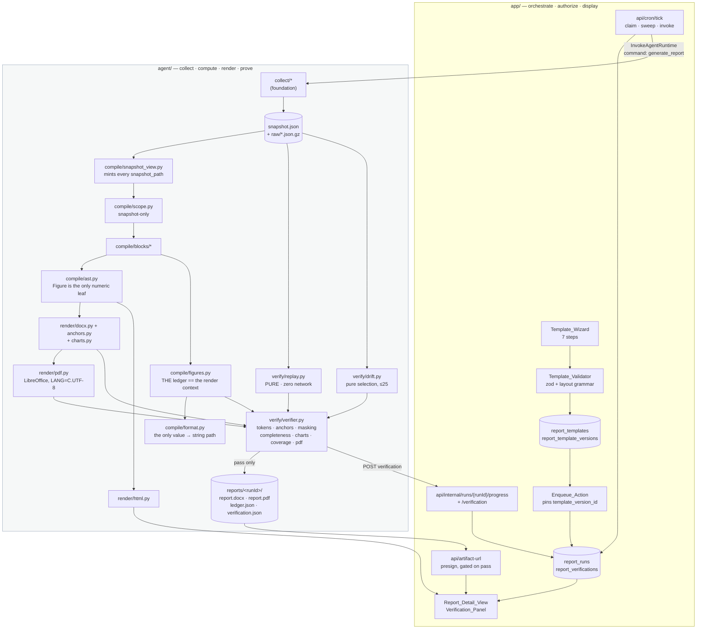
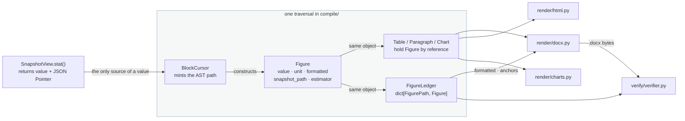
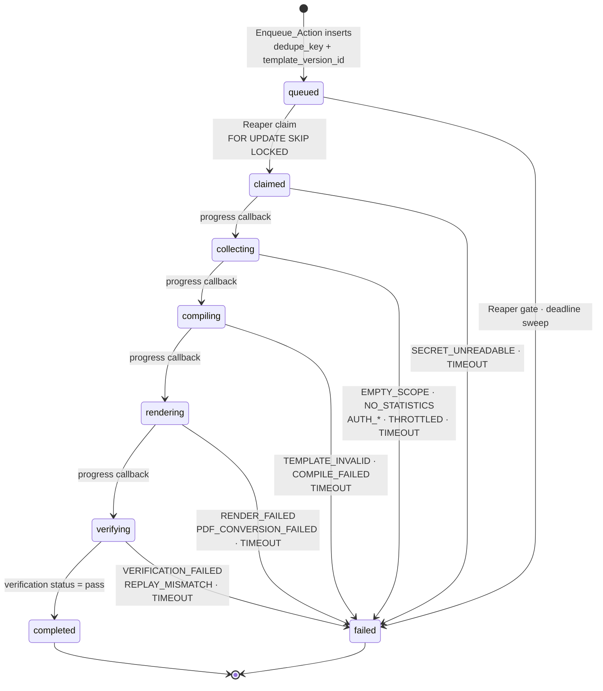

# Design Document

## Overview

This spec builds the **report** half: a seven-step template wizard, a compiler that turns a
versioned template definition plus an immutable snapshot into a typed document AST, two
emitters over that one tree, and a verifier that proves the delivered document against the
snapshot it came from.

The foundation spec is **complete and built**. Everything it delivers is referenced here by
name and re-designed nowhere: `Auth_Service`, `Crypto_Module`, `Env_Module`,
`Subscription_Store`, `Preflight_Service`, `Metric_Catalog`, `Inventory_Collector`,
`Metrics_Collector`, `Accumulator`, `Sketch`, `Archive_Writer`, `Snapshot_Builder`,
`Run_State_Machine`, `Enqueue_Action`, `Progress_Reporter`, `Progress_Endpoint`, `Reaper`,
`SSE_Relay`, `Redaction_Guard`, `Projection_Guard`, `Boundary_Guard`. Where this spec extends
one of them, the extension names the foundation criterion it extends and the existing module it
edits.

The design is organised around one structural claim, which is the whole reason the spec exists:

> **A number without provenance is not representable, and a document that disagrees with its
> snapshot is not deliverable.**

Both halves of that sentence are load-bearing and neither is a prompt.

**Not representable** is a type-level fact. `compile/ast.py` declares exactly one node that
carries a quantity — `Figure` — and every position in the tree that can hold a quantity is
declared as admitting `Figure` alone. Every other cardinality in the tree is a sequence length,
so **no node type other than `Figure` declares a numeric field at all**, and a static guard over
the module's annotations asserts that at build time (Req 15.12). A `Decimal` in a table cell is a
`TypeError` at construction with the offending AST path (Req 15.4), not a review comment someone
has to notice.

**Not deliverable** is a gate that has been observed failing. The verifier reads the rendered
`.docx` back through the XML, resolves every table figure by an anchor triple and asserts
character-for-character cell equality, masks prose in five ordered stages against a
null-context-derived allowlist, and asserts completeness in **both** directions. A failing
verification sets `error_code` `VERIFICATION_FAILED`, emits zero `report_file` events, and leaves
the Web_App with no route, action or control that can mint a presigned URL for that run's
document (Req 25.2, 25.3, 40.4). Section H's six negative tests are requirements, not a testing
footnote, and Req 44.1 fails the suite if any of the sixteen blocking finding types is asserted
by zero tests.

Four secondary claims shape the rest.

**The figure ledger and the render context are the same object.** Not two structures kept in
agreement — one dictionary whose values are the very `Figure` instances the AST holds, populated
during the single traversal that creates them (Req 17.2, 17.8). There is no parallel walk to
drift, and Req 17.9's mutation test demonstrates the identity rather than asserting it.

**The layout-versus-data table distinction is structural, not inferred.** A data table always
carries a `w:tblCaption` id; a `row` block's layout table never does. The table-verification pass
therefore excludes layout by construction rather than by counting cells or inspecting borders
(Req 21.1, 21.2, 26.5).

**Determinism is inherited, extended and then proven.** Every metric value stays a
fixed-precision decimal string from the snapshot through `compile/format.py` to the rendered
string; `compile/format.py` is the only operation in the runtime that turns a value into a
display string (Req 18.1); the compiled AST and the serialized ledger are RFC 8785-canonicalized
and hashed the same way the snapshot is; and `verify/replay.py` re-runs the pure aggregation over
the archived raw responses to assert a byte-identical `snapshot_id` with **zero** network calls.

**The row is the record; events are a view.** Unchanged from the foundation, and now extended to
three more phases. `compiling`, `rendering` and `verifying` were declared, undriven and
unreachable; this spec drives them, adds six terminal error codes, extends the reaper's sweep,
and emits the four event types the vocabulary already declared. **It adds no event type**, so the
cross-language event mirror is untouched (Req 42.8).

### What this design deliberately does not contain

- **No template language, no `docxtpl`, no `.docx` upload.** There is no placeholder
  substitution, no `{{ a / b }}`, no `|round`, and no route that accepts an uploaded document
  (Req 11.6, 20.2). A user-authored expression is exactly the hole the AST closes: it would
  produce a figure with no `snapshot_path`.
- **No standalone run-comparison screen.** `comparison_delta` is a block compiled from two
  pinned snapshots inside one report (Req 16.7). `structure.md` sketches
  `app/(app)/reports/compare/`; requirements.md's scope table puts it out of scope, and
  requirements win.
- **No chat, no Q&A over a report, no model tool registry.** The `prompt` path and
  `agent/.../tools/` stay absent. The only two model call sites this spec adds are prose
  generation and an advisory prose review, and both are single-shot Bedrock Converse calls with
  no tool list — see [Design decisions](#no-strands-agent-and-no-tool-registry-yet).
- **No scheduled runs and no email delivery.** The state machine, the callback and the reaper
  already exist; the scheduling *feature* remains later work.
- **`compare_runs` stays declared and undriven.** The invoke contract names it, this spec does
  not route it, and that is the same deliberate pattern the foundation applied to three run
  statuses: one contract, migrated once.

---

## Architecture

### The pipeline, end to end



Three edges carry the argument. `VER -->|pass only| ART` is the delivery gate: the artifacts are
uploaded **after** a passing verification, so there is no window in which a `report_file` event
could name an object that exists beside a failure. `LED --> VER` is the same object `DOCX` read
from, not a re-read of a serialization. And `SNAP --> RPL` is deliberately not
`azure --> RPL`: replay proves determinism by re-running the aggregation, never by re-collecting.

### The AST, the ledger and the verifier

This is the relationship the whole spec turns on, so it is worth one diagram of its own.



Read the two arrows out of `FIG`: they are the same reference, so "the ledger and the render
context are the same object" is a statement about aliasing rather than about discipline. Read the
arrow into `CUR`: a `Figure` cannot be constructed from a number that did not come out of
`SnapshotView`, because the cursor's figure factory takes a `SnapshotValue` — which carries its
own JSON Pointer — and nothing else. That is what makes `snapshot_path` *derived from the value's
position* (Req 15.5) rather than supplied beside it.

### The run state machine with the document phases



Three details are decisions rather than transcription.

**`completed` is written only once a `report_verifications` row exists for that run with
`status` `pass`** (Req 41.1). The endpoint that applies `verifying → completed` reads that row in
the same transaction, so there is no ordering in which a run reports success before its proof is
stored.

**`PDF_CONVERSION_FAILED` is reported from the `rendering` status, and no status is added for
PDF conversion** (Req 41.7). Conversion is the second half of rendering; giving it a status would
migrate the enum for a phase whose failure the error code already names.

**`TIMEOUT` still comes only from the Reaper** (Req 41.5), and the row keeps the status it held
when the deadline elapsed as the recorded failing phase. Phase budgets extend the foundation's
three: `compiling` 300s, `rendering` 600s, `verifying` 600s (Req 41.3). Rendering and verifying
get the larger budget for the same reason `collecting` did — LibreOffice conversion is bounded at
300s on its own (Req 23.9), and verification reads the whole document twice.

### The boundary, restated for four new packages

`azure/` remains the only package permitted to import an Azure SDK, and this spec adds four
packages that hold to the same rule for the same reason: `compile/`, `render/`, `verify/` and
`compare/` operate on plain data, so every one of them is unit-testable without a subscription.
Two additions to the Boundary_Guard make that structural rather than customary:

| Guard | Asserts | Requirement |
|---|---|---|
| SDK boundary (extended) | no module outside `azure/` imports a package whose first dotted segment is `azure` — now scanning `compile/`, `render/`, `verify/`, `compare/`, `narrate/` | 18.7 (foundation) |
| **Replay purity** | no module in `verify/replay.py`'s transitive **first-party** import closure imports `azure.*`, `boto3`, `httpx`, or `reporting_agent.storage.s3` | 31.7 |
| **AST numeric leaf** | no dataclass in `compile/ast.py` other than `Figure` declares a field whose annotation mentions `int`, `float`, `Decimal` or `DecimalString`; every `Figure`-admitting annotation is one of the declared forms | 15.12 |
| **Mirror** | the block-type set and per-type config schema in `app/lib/templates/blocks.ts` equals the one in `agent/.../compile/definition.py`, and both reach the same verdict on a shared fixture corpus | 2.6, 2.11 |
| **Theme** | each of the four theme documents declares `Figure`, every referenced paragraph and table style, and carries zero non-whitespace body text | 8.2–8.5 |

The replay-purity guard has a consequence for a foundation module, and it is not optional:
`collect/snapshot.py` currently imports `owner_tags` from `storage/s3.py`, which imports `boto3`
at module scope. Replay must import `collect/snapshot.py` for `build_snapshot`,
`canonical_bytes` and `content_hash`, so the guard would fail on day one. The fix is a
one-symbol additive move — `OWNER_TAG_KEY` and `owner_tags` move to the pure `storage/base.py`
and `storage/s3.py` re-exports them — recorded in
[Foundation touch-ups](#foundation-touch-ups-this-spec-requires) with nothing else changed.

---

## Components and Interfaces

### `app/` — the web app

#### Next 16 constraints this spec is written against

Read from the in-tree docs at `app/node_modules/next/dist/docs/`, on top of the seven the
foundation already recorded:

| Constraint | Source | Consequence here |
|---|---|---|
| Route Handlers are **not cached** by default; only `GET` can opt in | `01-getting-started/15-route-handlers.md` | the preview and presign handlers opt into nothing and additionally send `Cache-Control: no-store` |
| `RouteContext<'/path'>` is a generated global helper; `ctx.params` is awaited | `03-file-conventions/route.md` | `GET /api/templates/[id]` types params as `RouteContext<'/api/templates/[id]'>` and `await`s them, and the awaited object is still parsed by zod (Req 2.2 counts path params as input) |
| `after()` schedules work to run once the response is finished, in Route Handlers and Server Functions, and runs even when the response failed | `04-functions/after.md` | the wizard's autosave uses it for nothing load-bearing; the **preview cleanup** (deleting a superseded preview object) is scheduled with it, so a slow delete never widens the 180s preview budget |
| `after()` runs inside the route's max duration | same | it is therefore not a substitute for the progress callback, and no run state is written from it |
| Server Components cannot set cookies | `04-functions/cookies.md` | unchanged: the wizard's draft state is a DB write, never a cookie |

Turbopack is the default builder and `proxy` (the renamed, deprecated `middleware`) stays absent
— the route guard is still the authoritative DB check in `app/(app)/layout.tsx` plus a per-handler
check.

#### Files this spec adds

`(exists)` files are extended, not recreated. `app/components.json` and the preset token values in
`app/app/globals.css` are not regenerated; the only edit to `globals.css` is the **additive**
`--cat-*` block from `design-system.md`, appended.

```
app/
  app/
    globals.css                                    (exists) + APPEND the --cat-* palette
    (app)/templates/page.tsx                       new  template list + starters
    (app)/templates/[id]/edit/page.tsx             new  the seven-step wizard shell
    (app)/reports/page.tsx                         (exists) + template, version, verification
    (app)/reports/[runId]/page.tsx                 (exists) + paper rendering, panel, download
    api/templates/route.ts                         new  GET list · POST create
    api/templates/[id]/route.ts                    new  GET · PATCH draft · POST publish · DELETE
    api/templates/[id]/preview/route.ts            new  POST render-real-preview
    api/runs/[runId]/route.ts                      (exists) + verification projection
    api/internal/runs/[runId]/verification/route.ts new  HMAC-authorized result callback
    api/artifact-url/route.ts                      (exists) + the `reports` key segment
  components/
    templates/
      wizard-shell.tsx            step chrome, position of 7, next/back, save-draft
      step-identity.tsx  step-scope.tsx  step-period.tsx  step-metrics.tsx
      step-blocks.tsx   step-design.tsx  step-preview.tsx
      block-palette.tsx           grouped Structure · Data · Narrative · Record
      block-canvas.tsx            the DOM-ordered list + drop indicator
      block-canvas-item.tsx       one block; pointer drag source + keyboard command target
      block-inspector.tsx         config form for the selected block
      row-splitter.tsx            2/3 columns, refuses a nested row visibly
      scope-editor.tsx            per-block override above the inherited default
      style-preset-picker.tsx     2×2 grid of rendered page images
      paper-preview.tsx           the permanently labelled HTML canvas
      real-preview-panel.tsx      the docx→pdf result, inline only
      move-announcer.tsx          the single aria-live="polite" region
    reports/
      verification-panel.tsx      pass/fail, digests, findings, replay, drift
      finding-list.tsx            blocking and advisory, separated
      paper-render.tsx            the report's HTML rendering from the stored AST
      figure-provenance.tsx       hover/focus reveal of snapshot_path + estimator label
      download-card.tsx           mints the presigned URL on activation
      delta-table.tsx             comparison_delta, categorical palette, glyphs
    charts/
      themed-chart.tsx  categorical.ts  sequential.ts  palette.ts
  lib/
    templates/
      definition.ts     the zod definition schema (identity, scope, period, metrics, design)
      blocks.ts         THE mirrored block-type set + per-type config schemas
      version.ts        RFC 8785 canonicalization + sha256 → definition_sha256
      period.ts         Period_Resolver — pure, relative spec → local dates
      starters.ts       the three starter definitions, versioned as code
      composer.ts       the pure reducer every composer operation dispatches
      store.ts          Template_Store / Template_Version_Store data layer
    verifications/
      store.ts          Verification_Store data layer
      result.ts         the verification-result artifact schema (zod)
    runs/
      input.ts          (exists) + templateId
      state.ts          (exists) + the extended transition table and budgets
    db/{schema,views}.ts  (exists) + the three tables and the extended projections
  test/
    mirror.static.test.ts          Mirror_Guard (Req 2.6, 2.11)
    boundaries.static.test.ts      (exists) + the new server-only and key-segment rules
    migrations.static.test.ts      (exists) unchanged; it already fails a DROP
```

#### Dependencies to add

```bash
# from app/
pnpm add @dnd-kit/react @dnd-kit/dom recharts
```

Exact pins are resolved at install time against `react@19.2.4` and written back into
`package.json`; the two versions are deliberately **not** guessed in this document — see
[Risks](#risks-and-open-questions), item 1. `recharts` arrives with the shadcn `chart`
component (`pnpm dlx shadcn@latest add chart`), together with the Base UI primitives the wizard
needs: `select`, `checkbox`, `radio-group`, `switch`, `tabs`, `popover`, `table`, `tooltip`,
`progress`, `scroll-area`. Adding registry components is safe; `init` is not.

#### The drag-and-drop choice, decided by the constraint that decides it

**Keyboard-accessible reordering is a condition of Req 12 passing, not a follow-up** (Req 12.13),
and it eliminates most of the field before performance or bundle size gets a vote.

| Candidate | Keyboard reordering | Verdict |
|---|---|---|
| `react-dnd` | none out of the box; the HTML5 backend is pointer-only | **rejected** — the constraint is the requirement |
| `react-beautiful-dnd` | yes, and good | **rejected** — deprecated and unmaintained; adopting an archived library for a surface we must support for years is a debt we would take on knowingly ([dnd-kit replaced it as the community default](https://techoral.com/react/dnd-kit-guide.html)) |
| `@atlaskit/pragmatic-drag-and-drop` | not automatic — Atlassian's own [accessibility guidelines](https://atlassian.design/components/pragmatic-drag-and-drop/accessibility-guidelines) state the core package does not enable accessible controls and direct you to build the pattern yourself | **rejected as the whole answer**, though its guidance informs ours |
| native HTML5 DnD, no library | whatever we write | **rejected** — nested drop zones, a drop indicator that does not reflow, and cross-container moves are exactly the fiddly part; we would be writing a library badly |
| **`@dnd-kit`** | ships a keyboard sensor, sensible default ARIA attributes, and customizable screen-reader instructions and live regions ([accessibility guide](https://docs.dndkit.com/guides/accessibility)) | **chosen — for the pointer path only** |

The last four words are the design. **dnd-kit drives the pointer path; the keyboard path is a
first-class command model over the composer reducer, and it does not go through dnd-kit's
keyboard sensor.** Two reasons, and the first is the requirement:

1. **Req 12.4 does not describe a drag.** It describes a *command*: select a block, press a
   modifier with `ArrowUp`/`ArrowDown`, and the block moves exactly one position within the
   container it currently occupies, keeping focus and selection. dnd-kit's keyboard sensor
   models a lift-move-drop gesture with bare arrows moving by a pixel delta. Bending it into a
   one-position command means fighting a coordinate getter to reproduce something a reducer does
   in one line.
2. **Bare arrows during a lift are the pattern that fails with a screen reader on.** GitHub's
   engineering write-up on accessible sortable lists reports that screen-reader users could not
   move an item with the arrow keys, because the screen reader consumed them for its own
   navigation ([GitHub Engineering](https://github.blog/engineering/user-experience/exploring-the-challenges-in-creating-an-accessible-sortable-list-drag-and-drop/)).
   A modifier + arrow command has no lifted state to be trapped in, so it survives the one
   configuration a lift-based gesture reliably breaks in. WCAG 2.5.7 wants a non-dragging
   alternative for any dragging movement; this is that alternative, and it is the primary path
   rather than a fallback.

*(Content from the sources above was rephrased for compliance with licensing restrictions.)*

So `components/templates/block-canvas.tsx` renders a real DOM-ordered list (Req 12.6), each item
is both a dnd-kit draggable/droppable **and** a keyboard command target, and both paths dispatch
the identical action into one pure reducer:

```ts
// lib/templates/composer.ts — PURE. No React, no DOM, no dnd-kit types.
export type ComposerAction =
  | { kind: "insert"; blockType: BlockType; at: InsertionPoint }
  | { kind: "move";   blockId: string; to: InsertionPoint }
  | { kind: "nudge";  blockId: string; delta: -1 | 1 }        // Req 12.4 — modifier+Arrow
  | { kind: "remove"; blockId: string }
  | { kind: "select"; blockId: string | null }
  | { kind: "splitRow"; blockId: string; columns: 2 | 3 }
  | { kind: "patchConfig"; blockId: string; config: unknown }

export type ComposerResult =
  | { ok: true;  state: ComposerState; announcement: string }
  | { ok: false; state: ComposerState; refusal: Refusal }     // state is === the input

export function reduce(state: ComposerState, action: ComposerAction): ComposerResult
export function refusalFor(action: ComposerAction, state: ComposerState): Refusal | null
```

Three properties of that signature are the accessibility design:

- **`announcement` is produced by the reducer**, not by the component, so the `aria-live` message
  is a pure function of the move and is unit-testable without a DOM: `"KPI row moved to position
  3 of 7"`, and inside a row, `"Resource table moved to position 2 of 4 in column 1 of 2"`
  (Req 12.5, 12.7). Exactly one announcement per completed move, because the reducer returns
  exactly one string.
- **A refusal is a value, not a silent no-op.** `reduce` returns the *same* state object on
  refusal, so a component can assert identity, and it carries a `Refusal` the UI renders two
  ways for the same cause: a blocked cursor plus a "rows can't nest" hint for the pointer
  (Req 12.9), and the same sentence through the `polite` region for the keyboard (Req 12.14).
  One rule, two surfaces, no second implementation.
- **`nudge` is confined to the block's current container.** The reducer resolves the container
  from the block id, so `nudge` cannot move a block out of a row column by accident, and at a
  container boundary it refuses with the first/last announcement (Req 12.12) instead of
  overflowing into the top-level sequence.

`refusalFor` exists separately because the pointer path needs the refusal **during** the drag, to
paint the blocked state before the drop happens.

Everything the pointer can do has a keyboard equivalent, and the mapping is the test that
Req 12.13 passes:

| Operation | Pointer | Keyboard |
|---|---|---|
| insert from palette | drag onto an insertion point | focus the entry, `Enter`/`Space` → appended, selected, focused (Req 12.3) |
| reorder in container | drag | `Mod`+`ArrowUp`/`ArrowDown` (Req 12.4) |
| move between a row column and top level | drag | `Mod`+`ArrowLeft`/`ArrowRight` promotes out of / demotes into the adjacent row column |
| remove | drag to the palette, or the item's remove control | `Delete`/`Backspace` on the selected block |
| split a row | the row's explicit 2/3 control | the same control, focusable |

#### The seven steps

`Template_Wizard` is one route, `app/(app)/templates/[id]/edit/page.tsx`, a server component that
loads the draft and renders `wizard-shell.tsx` as the only `"use client"` boundary that owns
state. The steps are fixed in order and every step displays its position and the total of seven
(Req 11.1).

| # | Step | Component | Validated by | Notes |
|---|---|---|---|---|
| 1 | Identity | `step-identity.tsx` | `identitySchema` | name 1–120, description 0–1000 (Req 2.10) |
| 2 | Scope rules | `step-scope.tsx` | `scopeSpecSchema` | bounds of Req 3.1; **rejects a resource id, subscription id or tenant id by path** (Req 1.3) |
| 3 | Period | `step-period.tsx` | `periodSchema` | the six relative values; `custom` needs two local dates; shows what the rule resolves to *now*, labelled as an illustration (Req 11.7) |
| 4 | Metrics | `step-metrics.tsx` | `metricSelectionSchema` | selectable items come from the **Metric_Catalog**, served by `GET /api/templates/catalog`, never from a list in `app/` (Req 5.6) |
| 5 | Blocks | `step-blocks.tsx` → `Block_Composer` | `blocksSchema` | palette · canvas · inspector (Req 12.1) |
| 6 | Design | `step-design.tsx` → `Style_Picker` | `designSchema` | 2×2 rendered thumbnails + tuning (Req 13) |
| 7 | Preview | `step-preview.tsx` | — | the labelled HTML canvas + "Render real preview" (Req 14) |

Navigation and persistence are two rules that read as one: **a step transition or an explicit
save writes the draft** (Req 11.4) and **a draft writes no version row**. The draft lives in
`report_templates.draft_definition` (see [Data models](#report_templates)), so reopening restores
every value and opens the lowest-numbered failing step, or step 7 when everything passes
(Req 11.8). Backward navigation to any already-reached step is always allowed and resets nothing
(Req 11.2); forward navigation past a failing step is refused on the step, with every failing
field path named (Req 11.3).

There is **no control anywhere in the wizard that uploads a document** (Req 11.6). That is not an
omission to be tested for absence only — `test/boundaries.static.test.ts` gains an assertion that
no component under `components/templates/` renders an `input[type=file]` for a document MIME type
and that no route accepts a `.docx` body.

#### The style preset picker, and where its thumbnails come from

Req 13.2 is stricter than it first reads: each thumbnail must be a page the `Docx_Renderer`
emitted against that theme and the `Pdf_Converter` converted, rendered with a **null context**,
and it must be regenerated whenever the theme document's digest changes. So a thumbnail is
evidence, and a stale one is worse than none.

Implementation: a build-time step in the agent image produces
`agent/themes/thumbnails/<preset>.png` plus `<preset>.json` carrying
`{ theme_sha256, generated_by }`, using the real `render_preview` path over a fixed sample
definition that exercises a heading, body prose and a data table. The images are committed
alongside the themes and served from `app/public/theme-thumbnails/`. `Style_Picker` compares the
recorded `theme_sha256` against the digest the app was built with; a mismatch or a missing image
renders the card with its name, its text alternative and an explicit "page image unavailable"
statement, still selectable, and **never** substitutes a name-only select (Req 13.8, 13.3).

Each card carries a text alternative describing that theme's heading typography, table treatment
and density in words (Req 13.7) — a blind consultant chooses from the description, which means
the description is content, not an `alt` afterthought. Arrow keys move focus within the grid and
a keyboard confirmation selects (Req 13.6); selection is a `--ring` plus a `--primary` check
exposed programmatically, never colour alone (Req 13.4).

#### The HTML preview, and the one surface allowed to promise anything

`Preview_Canvas` emits from the **same AST** the `Docx_Renderer` emits from, through the
`Html_Emitter`, and holds no layout definition of its own (Req 14.1). In the wizard that AST comes
from a compile against the latest completed run's snapshot for the selected active subscription;
on the report detail surface it comes from that run's stored AST.

The label is permanent (Req 14.2): rendered on every render of the canvas, visible whenever any
part of the canvas is, behind no hover, focus or disclosure, with no dismiss control. Beside it,
in text, the three things that diverge are named: **pagination, table column widths and font
metrics** (Req 14.4). And the canvas shows **no page number, no page count and no page-position
indicator** (Req 14.3) — the only page marker it may draw is one representing a `page_break`
block the definition declares, carrying no number.

"Render real preview" is the only surface permitted to say *this is what you will get*
(Req 14.6). It runs the true `python-docx → LibreOffice → PDF` pipeline through a new
deterministic command, presents the `.pdf` inline, and shows the `snapshot_id`, the window with
its UTC offset and the template version it compiled (Req 14.10). It is disabled with a stated
reason when no completed run exists for the selected subscription, and it renders nothing from
fabricated data (Req 14.7). Every further activation while one is in flight is ignored
(Req 14.8), and a failure or a 180-second lapse names the stage that failed — compilation,
`.docx` rendering, or `.pdf` conversion (Req 14.9).

Three properties keep that PDF from becoming an unverified deliverable, which it must not:

1. It is written under `<actor_id>/previews/<previewId>/preview.pdf`, a prefix the report
   download route **cannot** serve — the artifact-key predicate admits `snapshots` and `reports`
   and nothing else (Req 43.2).
2. It is presented **inline only**. There is no download control, and no `report_file` event is
   emitted for it.
3. Every page carries a preview notice, emitted by the `Docx_Renderer` in preview mode against a
   `PreviewNotice` paragraph style each theme must declare, so the artifact says what it is even
   after it leaves the app.

The verifier does run over a preview, and its status is shown beside the PDF as information. It
does **not** gate the preview: a draft template must be previewable for layout reasons even when
its figures do not yet verify, and Req 14.9 names three failure stages, not four.

#### Route handlers and server actions

Every handler and every action parses its input with a **named zod schema at the boundary**, path
params and search params included (Req 2.2). No `as SomeType` on a body, ever.

| Entry point | Runtime | Input schema | Notes |
|---|---|---|---|
| `POST /api/templates` | nodejs | `templateCreateSchema` | inserts a template + `version` 1 from the supplied definition |
| `GET /api/templates` | nodejs | — | list, scoped by `user_id` (Req 1.4) |
| `GET /api/templates/[id]` | nodejs | `templateIdParamSchema` | draft + current version; not-found on another user's row (Req 1.5) |
| `PATCH /api/templates/[id]` | nodejs | `draftSaveSchema` | writes `draft_definition`; **inserts no version row** (Req 11.4) |
| `POST /api/templates/[id]` | nodejs | `publishSchema` | validates, canonicalizes, inserts version `max+1`, or returns the existing version when the digest is unchanged (Req 9.2, 9.5) |
| `DELETE /api/templates/[id]` | nodejs | `templateIdParamSchema` | deletes the template; versions a run pinned survive by FK (Req 10.7) |
| `POST /api/templates/[id]/preview` | **nodejs** | `previewRequestSchema` | invokes `render_preview`, 180s budget, streams progress, returns a presigned inline URL |
| `GET /api/templates/catalog` | nodejs | — | the Metric_Catalog's selectable items, so step 4 reads one catalog (Req 5.6) |
| `POST /api/internal/runs/[runId]/verification` | nodejs | `verificationCallbackSchema` | run-scoped HMAC; reads the artifact, parses it, inserts the row |
| `GET /api/runs/[runId]` | nodejs | `runIdParamSchema` | `RunView` + `VerificationView` + gaps |
| `GET /api/artifact-url` | nodejs | `artifactUrlQuerySchema` | extended predicate; **asserts a passing verification before any storage call** |

Server actions in `lib/actions/templates.ts` cover the wizard's writes (`createTemplate`,
`saveDraft`, `publishTemplateVersion`, `renameTemplate`, `deleteTemplate`) and are thin wrappers
over `lib/templates/store.ts`, which is `import "server-only"` because it opens a connection.
`lib/actions/runs.ts` gains `templateId` on `runCreateInputSchema` and resolves the highest
version at insert (Req 9.6).

**`app/` computes no figure.** `lib/verifications/result.ts` parses the verification artifact and
`components/reports/*` render `formatted` strings verbatim; there is no arithmetic over a metric
value anywhere in `app/`, and the Boundary_Guard's existing scan is extended to fail on an import
of `decimal.js` or a `Number()` call over a ledger `value` in `components/reports/`.

---

### `agent/` — the runtime

#### Package layout

```
agent/
  themes/                                   NEW — styles-only, committed, reviewed as code
    editorial.docx  corporate.docx  technical.docx  minimal.docx
    thumbnails/<preset>.png + <preset>.json   built at image build, committed
  Dockerfile                                (exists) + LibreOffice, fonts, warmed profile
  pyproject.toml                            (exists) + python-docx, pypdf, matplotlib
  .env.example                              NEW — agent-side variables
  AGENTCORE_INTEGRATION.md                  NEW — the authoritative invoke contract
  src/reporting_agent/
    main.py                                 (exists) + render_preview, verify_report handlers
    report_pipeline.py                      NEW — collect → compile → render → verify → upload
    compile/
      definition.py       the mirrored block-type set + config schemas + validation
      snapshot_view.py    the read side: the ONLY source of a value, mints every JSON Pointer
      scope.py            Scope_Resolver — snapshot-only, zero network
      ast.py              AST_Model — Figure is the only numeric leaf
      figures.py          Figure_Ledger + BlockCursor (the path minter and figure factory)
      format.py           Formatter — the ONLY value → display string
      estimators.py       Estimator_Labeller
      blocks/             one module per block type, sixteen of them
    render/
      docx.py  anchors.py  html.py  charts.py  chartstyle.py  pdf.py  themes.py
    verify/
      tokens.py    Token_Extractor — docx body walk + pdf text normalization
      masking.py   the five ordered prose stages
      allowlist.py the null-context static-text allowlist
      anchors.py   anchored cell equality
      charts.py    chart pairing + data-hash recomputation
      coverage.py  scope_verified · union coverage · empty scope
      pdf.py       PDF fidelity
      replay.py    PURE — zero network, import-guarded
      drift.py     PURE selection; the re-query arrives through a port
      findings.py  the finding-type vocabulary and the result document
      verifier.py  the orchestrator that assembles a verification result
      ports.py     MetricRequeryPort
    compare/
      delta.py     Delta_Compiler — two pinned snapshots, no Azure
    narrate/
      summary.py   executive_summary prose (Bedrock Converse, single shot)
      review.py    Prose_Reviewer — advisory, ≤25 findings, 60s budget
  tests/
    fixtures/definitions/          THE shared corpus (also read by app/test/mirror.static.test.ts)
    fixtures/documents/            .docx fixtures for the negative tests
    property/                      (exists) + the seven properties of this spec
```

`narrate/` is an addition to `structure.md`'s tree, and it earns its place: it holds the **only
two model call sites in the product**, so "where can a model be reached from" is a directory
rather than a convention, and the Boundary_Guard can assert that no module outside `narrate/`
imports a Bedrock client. `structure.md`'s `tools/` stays absent — there is no tool registry
here.

#### Dependencies to add

```toml
# agent/pyproject.toml — added to [project.dependencies]
"python-docx==1.2.0",     # the DOCX emitter; the AST is the only content source
"pypdf==6.16.1",          # PDF text extraction for the fidelity gate — pure Python (py3-none-any),
                          #   so no native build and nothing arm64-specific to go wrong
"matplotlib==3.11.1",     # static chart images; Agg only, rcParams frozen in render/chartstyle.py.
                          #   Ships a cp312 manylinux aarch64 wheel, so the image builds without
                          #   a toolchain; requires-python >=3.11, satisfied by the pinned 3.12
```

Exact pins, resolved into `requirements.lock` with hashes, the same discipline the foundation
applied. Three deliberate absences:

- **No `docxtpl`.** There is no template document and no placeholder to substitute (Req 20.2).
- **No `pandas`.** `tech.md` lists it for bucketing and roll-ups; the foundation already does
  both with `Decimal` accumulators, deliberately, because **pandas is float-backed** and a float
  on the path from a snapshot value to a `formatted` string is the one thing Req 18.5 forbids
  outright. Adding a large arm64 wheel to reintroduce the failure mode the collector was written
  to avoid is a bad trade twice over.
- **No `strands-agents`.** See [Design decisions](#no-strands-agent-and-no-tool-registry-yet).

LibreOffice is a **system** package, not a Python dependency, and the image gains three things
with it:

```dockerfile
# arm64 LibreOffice, the fonts the four themes reference, and a PRE-WARMED user profile.
RUN apt-get update && apt-get install -y --no-install-recommends \
      libreoffice-writer libreoffice-core fonts-dejavu-core fonts-liberation2 \
 && rm -rf /var/lib/apt/lists/*

# Req 23.5 — warm the profile AT BUILD TIME. A cold profile makes the first conversion of a
# container's life slow and occasionally fails outright, which reads as a flaky render rather
# than as a cold start, and Req 23.9 applies the same 300s limit and the same single attempt to
# that first conversion as to every later one.
ENV LANG=C.UTF-8 LO_PROFILE=/opt/libreoffice-profile
RUN mkdir -p "$LO_PROFILE" && printf 'warm' > /tmp/warm.txt \
 && soffice --headless --norestore -env:UserInstallation="file://$LO_PROFILE" \
      --convert-to pdf --outdir /tmp /tmp/warm.txt \
 && test -s /tmp/warm.pdf && rm -f /tmp/warm.txt /tmp/warm.pdf

# Req 8.7, 23.10 — the build fails rather than publishing an image that cannot render.
RUN python -m reporting_agent.render.themes --assert-build \
 && test "$(uname -m)" = "aarch64" \
 && test -d "$LO_PROFILE" && test -n "$(ls -A "$LO_PROFILE")"
```

`--assert-build` runs the Theme_Guard's assertions in the image: all four theme files present and
openable, each declaring `Figure`, `PreviewNotice` and the full referenced style union, each
carrying zero non-whitespace body text (Req 8.2–8.5, 8.8). A failure aborts the build and
publishes nothing (Req 8.7).

#### `report_pipeline.py` — the phases this spec drives

```python
async def run_generate_report(
    *, payload, context, steps: StepTracker, artifact_bucket: str, aws_region: str,
    progress: ProgressReporter,
) -> AsyncIterator[Event]:
    """collect → compile → render → verify → upload, one phase at a time (Req 41.1)."""
```

It composes rather than replaces. `collect/pipeline.py` gains a `run_collection(...)` entry that
yields the same events and **returns** a `CollectionOutcome` — snapshot document, `snapshot_id`,
counts, gaps, `partial: bool`, archive completeness — instead of raising `PartialCoverageError`;
the existing `run_generate_report` becomes a two-line wrapper that raises it, so a snapshot-only
run behaves exactly as it does today and every foundation test still passes. The report pipeline
defers that raise to the end of the whole run, because a run with gaps still completes and its
non-terminal `error` event must arrive before `done`, not before compilation.

Phase order, with what each one emits:

| Phase | Steps opened | Emits | Terminal codes |
|---|---|---|---|
| `collecting` | `collect_inventory`, `collect_metrics` | `progress`, `snapshot_ready` | foundation's |
| `compiling` | `compile_figures` | `progress` (blocks compiled), `delta` (prose), `chart` | `TEMPLATE_INVALID`, `COMPILE_FAILED` |
| `rendering` | `render_document` | `progress` (blocks emitted) | `RENDER_FAILED`, `PDF_CONVERSION_FAILED` |
| `verifying` | `verify_document` | `verification` | `VERIFICATION_FAILED`, `REPLAY_MISMATCH` |
| — | `upload_artifact` | `report_file` ×2 | — |

Every step is opened and closed through the foundation's `StepTracker`, so `progress.id` still
references an open step, `done` never decreases, and a phase that ends by raising still gets its
`phase: "end"` before `done` (Req 42.1). Heartbeats keep flowing at 15s through the same merge,
which matters more here than in collection: a 600-second rendering phase with nothing to say
would otherwise sit inside the relay's 120-second window with no event at all (Req 42.11).

`main.py` gains two handlers beside `handle_generate_report`, registered in `COMMAND_HANDLERS`:

```python
COMMAND_VERIFY_REPORT: Final[str] = "verify_report"     # re-verify a stored report (Req 36.4)
COMMAND_RENDER_PREVIEW: Final[str] = "render_preview"   # the wizard's real preview (Req 14.5)
# COMMAND_COMPARE_RUNS stays declared in AGENTCORE_INTEGRATION.md and unrouted: comparison is a
# block compiled inside a run (Req 16.7), and a standalone comparison screen is out of scope.
```

#### `compile/snapshot_view.py` — the only source of a value

```python
@dataclass(frozen=True, slots=True)
class SnapshotValue:
    value: Decimal
    unit: str
    statistic: str
    estimator: str
    fidelity_tier: str
    scale: int
    metric: str | None
    resource_id: str | None
    window: Window
    pointer: str                 # RFC 6901 JSON Pointer — DERIVED, never supplied
    estimated: bool
    derived_from: tuple[DerivedSourceRef, ...] = ()
    formula: str | None = None

class SnapshotView:
    """A read-only index over one snapshot document, and the only way to obtain a value."""
    def __init__(self, document: Mapping[str, JsonValue]) -> None: ...
    @property
    def snapshot_id(self) -> str: ...
    def resources(self) -> tuple[ResourceView, ...]: ...
    def stat(self, resource_id: str, metric: str, statistic: str) -> SnapshotValue | None: ...
    def day_stat(self, resource_id: str, day: date, metric: str, statistic: str
                 ) -> SnapshotValue | None: ...
    def count(self, what: CountKind) -> SnapshotValue: ...   # resource / gap / tier counts
    def resolve(self, pointer: str) -> JsonValue: ...        # Req 15.11's re-resolution
```

The index is built by walking the document once and recording, for every statistic object, the
JSON Pointer of its `value` field — `/resources/7/statistics/3/value`. That is why `pointer` is
*derived from the value's position*: there is no constructor for a `SnapshotValue` that accepts a
pointer from outside the walk. Array indices are stable because the snapshot's arrays are
deterministically sorted by the Snapshot_Builder (foundation Req 34.8) and the document is
immutable, so a pointer minted today resolves identically in a re-verification a year later.

`value` is parsed from the snapshot's decimal **string** into `Decimal`. No float appears on this
path, and `ObjectStore.get_json` already parses JSON numbers as `Decimal` for the same reason.

#### `compile/scope.py` — the Scope_Resolver

```python
def resolve(scope: ScopeRules, view: SnapshotView) -> tuple[ResourceView, ...]:
    """Resolve one block's scope against the snapshot alone (Req 3.4)."""
```

Its whole signature is the requirement: a `SnapshotView` and a `ScopeRules`, no client, no
network, no clock. Matching requires every populated dimension to be satisfied, treats multiple
entries within a dimension as any-of, treats an empty dimension as unconstrained, and compares
resource types and tag **keys** case-insensitively while comparing tag **values** case-sensitively
(Req 3.12) — because an Azure tag value is user data and folding its case would silently merge
`env=Prod` with `env=prod`.

Top-N ordering is the part a plausible implementation gets wrong, so it is spelled out
(Req 3.6, 3.11):

1. Partition the matched resources into those the snapshot has a value for at the named
   `(metric, statistic)` and those it does not.
2. Sort the first partition by that value in the scope's direction, defaulting to `descending`,
   breaking ties by resource id ascending in **Unicode code-point order**.
3. Append the second partition, ordered by resource id ascending, **after** every ranked
   resource — so a missing metric value can never reorder the ranked ones.
4. Take the first N; retain everything when the matched count is below N.

A resolved scope of zero resources is an ordinary return of an empty tuple and raises nothing
(Req 3.7, 3.8) — the empty-block row is the *compiler's* job, and the union gate is the
*pipeline's*.

#### `compile/ast.py` — the AST_Model

The declarations are the enforcement, so they are given in full rather than described.

```python
type DecimalString = NewType("DecimalString", str)
"""A fixed-precision decimal string: optional leading '-', digits, at most one '.' followed by
digits. No exponent, no leading '+', no thousands separator, no surrounding whitespace, no empty
string, no non-finite designation (Req 15.2). A NewType rather than a bare `str` so the static
guard can tell a quantity from prose by the annotation alone."""

@dataclass(frozen=True, slots=True)
class Figure:
    """THE only node that carries a quantity (Req 15.2, 15.3)."""
    path: FigurePath                 # its own AST path — the ledger key, by construction
    value: DecimalString
    unit: str
    snapshot_path: str               # RFC 6901 pointer, minted by SnapshotView
    formatted: str                   # produced by compile/format.py, and nowhere else
    fidelity_tier: Literal["baseline", "enhanced"]
    statistic: str
    metric: str | None = None
    resource_id: str | None = None
    window: WindowFields | None = None
    estimator: str | None = None        # present iff the value is an estimate
    estimator_label: str | None = None  # from Estimator_Labeller; the UI renders it verbatim
    derived_from: tuple[DerivedSourceRef, ...] = ()
    formula: str | None = None

    def __post_init__(self) -> None:
        # Every field is validated here, and every failure names this node's `path`.
        ...
    def __setattr__(self, name: str, value: object) -> NoReturn:  # Req 15.13
        raise FigureImmutableError(self.path, name)

@dataclass(frozen=True, slots=True)
class Text:
    """Literal characters and no figure (Req 15.6)."""
    value: str

type Inline = Text | Figure
"""The ONLY union that mixes prose and quantity, and only in a paragraph run position."""

@dataclass(frozen=True, slots=True)
class FigureCell:
    figure: Figure                   # a figure position: admits Figure alone (Req 15.3)
@dataclass(frozen=True, slots=True)
class TextCell:
    text: str
@dataclass(frozen=True, slots=True)
class EmptyCell:
    pass

type Cell = FigureCell | TextCell | EmptyCell
```

Four properties of those declarations do the work:

**No cardinality is a number.** `LayoutRow` carries `columns: tuple[Column, ...]` with a
validator requiring two or three, not `columns: int`. `Table` carries
`headers: tuple[ColumnHeader, ...]` and `rows: tuple[TableRow, ...]`, not counts. `PageBreak`
carries nothing. Consequently **`Figure` is the only dataclass in the module whose annotations
mention a numeric type at all**, and Req 15.12's guard becomes a mechanical AST scan with no
allowlist to maintain:

```python
NUMERIC_TOKENS = frozenset({"int", "float", "Decimal", "DecimalString", "complex", "Fraction"})
FIGURE_ADMITTING = frozenset({"Figure", "tuple[Figure, ...]", "Inline", "tuple[Inline, ...]",
                              "Cell", "tuple[Cell, ...]"})
```

For every dataclass in `compile/ast.py` other than `Figure`: no annotation may mention a token in
`NUMERIC_TOKENS`; every annotation mentioning `Figure` must be exactly one of `FIGURE_ADMITTING`;
`Inline` and `Cell` must be declared as unions over exactly the declared member sets; and every
node must be `frozen=True, slots=True`. The guard runs in the test suite and in the image build.

**A figure position is a type, not a convention.** `FigureCell.figure: Figure` admits nothing
else, so a `Decimal` in a table cell is not a bug the verifier catches later — the type
declaration refuses it, and `__post_init__` raises `NonFigureInFigurePositionError` naming the
node path and the offending type (Req 15.4), at which point the pipeline reports `COMPILE_FAILED`
and writes nothing.

**Immutability is enforced, and the test that proves ledger identity is honest about reaching
past it.** `Figure.__setattr__` raises (Req 15.13), so no stage after compilation can substitute
a value. Req 17.9's identity test therefore mutates through `object.__setattr__` — which is
exactly the point: normal code cannot mutate a figure, the test can, and a *copied* ledger fails
the test while an aliased one passes.

**`snapshot_path` is checked, not trusted.** `__post_init__` re-resolves the pointer against the
compiling snapshot and asserts the addressed value's decimal string equals `value` (Req 15.11).
A declared provenance that does not resolve is a failure, not an unchecked claim.

#### AST paths, and why they are stable

`FigurePath` is a string of the form `<block_id>:<ordinal>[.<ordinal>]*`, where each ordinal is
the zero-based index of the node within its parent's **declared child order** — the concatenation,
in dataclass field-declaration order, of every child-bearing field of that parent (Req 15.7). So
`kpi-1:0`, `tbl-7:3.2`, and for a row's child, `row-2:1.0.4.1`.

It is stable across two compilations of one template version against one snapshot because every
input to it is: the block `id` comes from the immutable definition, field order comes from the
source, and child order within a field is the order the compiler emitted — which is itself
deterministic because `scope.py` resolves an ordered resource list and the blocks iterate it.
Nothing consults a hash-ordered container, a clock, or an environment variable. That is what
makes Req 15.10's AST digest equality achievable and Property 6.3 testable.

Two identities derive from a path alone (Req 21.9, 22.2):

```python
def table_id(path: NodePath) -> str: return f"tbl:{path}"    # w:tblCaption for a data table
def chart_id(path: NodePath) -> str: return f"cht:{path}"    # image alt text AND its companion
                                                             # table's w:tblCaption
```

Both are asserted ≤255 characters (Req 21.1) and unique within one document, which follows from
path uniqueness. Derived from the path rather than from emission order or elapsed time, so two
renders of one AST carry identical identities.

#### `compile/figures.py` — the ledger and the cursor

```python
class FigureLedger:
    """Every figure of exactly ONE compiled AST, keyed by AST path (Req 17.1)."""
    _entries: dict[FigurePath, Figure]                  # values ARE the AST's objects (Req 17.2)
    _anchors: dict[FigurePath, TableAnchor]             # recorded onto the existing entry (17.5)

    def __getitem__(self, path: FigurePath) -> Figure: ...
    def formatted_values(self) -> tuple[str, ...]: ...   # longest-first for masking stage 1
    def anchors(self) -> Mapping[FigurePath, TableAnchor]: ...
    def serialize(self) -> bytes: ...                    # entries by path, RFC 8785 (Req 17.6)
    def digest(self) -> str: ...                         # sha256 of that serialization

class BlockCursor:
    """The path minter and the ONLY figure factory."""
    def child(self, field: str, ordinal: int) -> BlockCursor: ...
    def figure(self, snapshot_value: SnapshotValue, *, number_format: NumberFormat) -> Figure:
        """Construct a Figure at this cursor's path and register it in the ledger, in one step."""
```

`BlockCursor.figure` is where three requirements collapse into one function body: it mints the
path, calls `format.format_figure(...)` for `formatted`, constructs the `Figure`, and inserts it
into the ledger — so the entry is created **during the traversal that creates the node**
(Req 17.8) and the ledger's value is that same object (Req 17.2). There is no `build_ledger(ast)`
function anywhere in the package, and there cannot be one without deleting this method: a
parallel walk is a second structure, and two structures can disagree.

`compile()` asserts the closing invariant before returning (Req 17.10): the ledger's key set
equals the set of figure paths found by an independent walk of the finished tree, and no two
figure nodes resolve to one key. That walk exists **only** as an assertion — it creates nothing —
and a mismatch is `COMPILE_FAILED` naming every differing path.

#### `compile/format.py` — the Formatter

```python
def format_figure(
    value: Decimal, *, unit: str, catalog_scale: int, number_format: NumberFormat,
    estimator_label: str | None, path: FigurePath,
) -> str:
    """The ONLY operation in the runtime that turns a figure's value into a display string."""
```

The display scale is `max(number_format.decimal_places, catalog_scale)`, and that `max` is a
decision, not a typo. Req 18.3 takes the fractional-digit count from the Metric_Catalog and
Property 1.2 requires the formatted digits to round-trip to the catalog-quantized value, so the
catalog scale is a **floor** that a style preference may not cut into: precision is a property of
the measurement, not of a template's taste. Req 7.2's 0-to-3 decimal-place setting is therefore a
floor of its own — it can add zeros to a byte count whose catalog scale is 0, and it cannot take a
digit off a percentage whose catalog scale is 2. See
[Risks](#risks-and-open-questions), item 3, where the reading is recorded against Req 7.3.

Everything else about it is arithmetic hygiene the verifier depends on: `Decimal` throughout with
no float constructed anywhere on the path (Req 18.5); quantization half away from zero, one
rounding mode for every value, unit and number format (Req 18.3); the separators from the
template's number format; the unit's presentation from the catalog (Req 18.10), so a consumer
appending its own unit would break the exact-equality comparison Req 27.2 performs; and, for an
estimated value, the `Estimator_Labeller`'s label inside the string (Req 18.6) with an assertion
that no bare percentile designation survives (Req 18.7). A value that is neither a `Decimal` nor a
fixed-precision decimal string, or a metric for which the catalog declares no fractional-digit
count, produces no string at all and fails the run with the AST path named (Req 18.9, 18.11) —
there is no default scale to fall back to.

`compile/estimators.py` composes the label **without a numeral** — `p95, est. from hourly
averages` — from the snapshot value's `estimator` and `statistic`. It deliberately does **not**
consume the snapshot's own pre-formatted `label` field, because that string already embeds a
numeral at the collector's scale and separators, and splicing it into `formatted` would put a
second formatter's output inside the string the verifier matches. A table test asserts that every
estimator string the collector can emit has an entry here, so a new estimator fails the suite
rather than producing an unlabelled figure.

#### `render/` — two emitters, one tree

`docx.py` walks the AST once with `python-docx` against the theme the pinned version's preset
names, and reads the AST as its only source of content (Req 20.1). Three details are contracts
rather than implementation:

**Every figure is one run in the theme's `Figure` character style** (Req 20.3), at every position
the AST puts one — prose, heading, data cell, cover field, chart companion cell — carrying the
`formatted` string in full and no other character. That is what lets the Token_Extractor find
figures without re-parsing prose, and it is why the Theme_Guard's first assertion is the existence
of that style.

**Determinism.** Two emissions of one AST against one theme produce identical bytes once the
document's created and last-modified timestamps are excluded (Req 20.8), so nothing emitted is
derived from wall-clock time, locale, hostname, environment values or filesystem order.
`python-docx` writes both timestamps into `docProps/core.xml`; `docx.py` sets them to a fixed
sentinel and the byte-equality test excludes that part explicitly rather than hoping.

**One write, at the end.** The completed document is written as one artifact object after every
block is emitted (Req 20.11), so a partially emitted document is never an artifact.

`anchors.py` owns the two structural contracts the verifier depends on:

```python
def write_data_table_caption(table, identity: str) -> None:
    """w:tblPr/w:tblCaption, exactly once, ≤255 chars (Req 21.1)."""
    tblPr = table._tbl.tblPr
    caption = OxmlElement("w:tblCaption")
    caption.set(qn("w:val"), identity)
    tblPr.append(caption)

def write_layout_table(table) -> None:
    """A `row` block's borderless table: NO caption, NO header row, NO row key (Req 21.2)."""
```

The asymmetry is the design. A layout table is excluded from the table pass **by construction**,
because the pass enumerates tables carrying a caption — not by inspecting borders, not by counting
cells, and not by guessing from content. A data table nested inside a layout cell still carries its
own caption (Req 21.10), so a data-bearing child of a row is checked while its container is
skipped. And a data table carrying zero figures still records its identity in the ledger with zero
anchors (Req 21.11), so the verifier resolves it and reports no unexpected-table finding.

Header text and row keys are what the verifier resolves by, so both are constrained where they are
written: each header non-empty, ≤255 chars, unique within the table, and exactly equal to the
string the column key resolves by (Req 21.4); each row key the concatenated text of one designated
key column, identified by its header text, occupying the same column in every data row, non-empty,
≤255, unique (Req 21.5).

`charts.py` emits, for every chart node, exactly **one** static image and **one** companion data
table carrying every plotted point as a figure (Req 22.1), the table immediately after the image in
body order with nothing between them, both bearing the same `cht:<path>` identity — the image in
its alternative text, the table in its caption (Req 22.2). The chart data hash is the SHA-256 over
the ordered plotted contributions, each contributing series key, x key and the ledger's decimal
string, recorded both on the node and in the sidecar beside the embedded image (Req 22.3).

The palette comes from the node's declared `encoding` and never from the series count (Req 22.7):
peers get `--cat-1…5`, one ordered quantity gets the preset ramp `--chart-1…5`, and a peer chart is
never coloured from the ramp because a lightness ramp asserts an order peer series do not carry.
Colour is assigned by **stable key** — the metric key for a metric series, the resource id for a
resource series — never by array index, so one metric keeps one colour across every chart and every
delta table in one report (Req 22.8). Above five peers, the four largest by the node's declared
ordering statistic are plotted and the rest aggregate into one `--cat-other` series, and the
companion table carries exactly the plotted set including that aggregate, so image, table and hash
describe one thing (Req 22.9). Every series carries a direct label; lines additionally differ by
marker and dash; bars, columns and heatmap cells carry direct value labels; nothing is
distinguished by colour alone (Req 22.10). A delta is a glyph plus a signed magnitude in one
colour (Req 22.11). `--destructive` appears on no series, delta, gridline or band (Req 22.12).

Byte-identical image output (Req 22.14) is `chartstyle.py`'s job: the Agg backend, one frozen
`rcParams` block, a font shipped in the image and named explicitly rather than resolved by
fallback, PNG metadata suppressed, and a fixed dpi and figure size. The byte-equality test is what
keeps that honest across a dependency bump.

`pdf.py` converts the produced `.docx` and nothing else (Req 23.1):

```python
CONVERT_TIMEOUT_S: Final[float] = 300.0      # Req 23.9 — one attempt, first conversion included
REQUIRED_LANG: Final[str] = "C.UTF-8"        # Req 23.3

async def convert(docx_path: Path, out_dir: Path, *, env: Mapping[str, str]) -> Path:
    if env.get("LANG") != REQUIRED_LANG:      # Req 23.8 — refuse BEFORE invoking
        raise PdfConversionError(...)
    argv = ["soffice", "--headless", "--norestore",
            f"-env:UserInstallation=file://{profile_dir()}",
            "--convert-to", "pdf", "--outdir", str(out_dir), str(docx_path)]
```

`LANG` is asserted before the process starts, because a comma-decimal locale rewrites every
numeral and the ledger's strings stop being locatable in the PDF — which is precisely what negative
test 44.7 demonstrates, and why that test expects `VERIFICATION_FAILED` rather than
`PDF_CONVERSION_FAILED`: the conversion *succeeds*, and the fidelity gate is what catches it. The
pre-warmed profile is used as-is and none is created at run time (Req 23.5); it is chowned to the
runtime user at build so LibreOffice can take its lock files, and conversions within one invocation
are serialized, because two concurrent conversions would contend on that one profile.

`html.py` walks the same AST **instance** (Req 24.1), emits each figure's `formatted` string
verbatim together with `data-snapshot-path` and, for an estimate, `data-estimator-label` (Req 24.2)
— which is what the provenance reveal reads rather than derives — renders every figure in mono with
tabular numerals and no count-up (Req 24.3), emits no page number or count (Req 24.4), and emits
the same headers, row keys and cell strings the DOCX does, in the same order (Req 24.5). A node
type it cannot emit produces no partial rendering and no verification finding: the verifier reads
the `.docx` alone, and the in-app rendering is never a verification input (Req 24.8).

#### `verify/` — the gate

This is the heart of the spec, so it gets the most detail. The orchestrator assembles one result
from seven passes and **records every finding it observes rather than stopping at the first**
(Req 25.8), up to the first 1,000 blocking findings in document order plus the total observed
count.

```python
async def verify(
    *, docx_bytes: bytes, pdf_bytes: bytes, ledger: FigureLedger, ast: Document,
    snapshot: Mapping[str, JsonValue], pinned: TemplateVersion, run: RunFacts,
    archived: Iterable[tuple[int, bytes]],          # replay's input, supplied by the CALLER
    requery: MetricRequeryPort | None,              # drift's re-query, injected
) -> VerificationResult:
```

Two arguments are structural rather than convenient. `archived` is an iterable the caller has
already fetched, because Req 31.2 forbids the Replay_Verifier from fetching anything itself.
`requery` is a port, because `verify/` may not import an Azure SDK and the bounded drift sample is
the one place verification touches Azure at all (Req 25.7, 34.7).

##### `tokens.py` — reading the document the way Word stores it

```python
def paragraph_texts(document: Document) -> tuple[ExtractedParagraph, ...]:
    """Every paragraph of the body plus every header and footer part, concatenated (Req 26.6)."""
    for element in document.element.body.iter(qn("w:p")):     # EVERY depth (Req 26.1)
        ...

def data_tables(document: Document) -> tuple[ExtractedTable, ...]:
    """Every w:tbl carrying a non-blank w:tblPr/w:tblCaption, with its document ordinal."""
```

**Why `document.paragraphs` and `document.tables` are the wrong readers**, and this is Req 26.2
stated as a mechanism rather than a rule: both collections enumerate only the *direct children of
the body element*. A paragraph inside a table cell, inside a nested table, inside a text box
(`w:txbxContent`), or inside a content control (`w:sdt`) is not a direct child of the body, and
neither is a table nested in a cell. A verifier reading through those collections therefore
extracts **nothing** from a chart's companion table nested inside a `row` block's layout table —
and a verifier that extracts nothing finds no unmatched token, records no finding, and passes the
document. That failure mode is silent, total, and indistinguishable from success, which is why the
reader is `body.iter(qn("w:p"))` and the guard against regression is Property 2.7.

Three more extraction rules, each of which exists because its naive alternative fails:

**Tokenize the concatenated paragraph, never a run** (Req 26.3, 28.9). A single formatted number
is routinely stored as several consecutive `w:r`/`w:t` pairs — Word splits runs on spell-check
state, revision marks and rPr changes alone — so `1,234.56` commonly arrives as `1,`, `234.` and
`56`. Per-run tokenization splits that into three fragments that match no ledger value and produce
three spurious survivors, and Property 2.2 pins exactly that split as a declared example.

**Join with no inserted character** (Req 26.8). Adjacent `w:t` nodes concatenate directly; every
space a `w:t` carries is preserved; `w:tab` and `w:br` each become one space; leading and trailing
whitespace is stripped; nothing else is altered. Inserting a space between runs would break a
figure into two tokens exactly as per-run tokenization does.

**A caption that is present but blank counts as absent** (Req 26.5), so an empty `w:tblCaption`
cannot smuggle a layout table into the data pass or a data table out of it.

PDF text normalization (Req 33.5) lives in the same module: concatenate what every text-show
operator yields in content-stream order, join pages in ascending order with a single space, collapse
every whitespace run to one space, trim. That makes a `formatted` string the conversion split across
operators, lines or a page boundary still one contiguous substring, and it assumes no correspondence
between one operator and one figure — because there is none.

##### `anchors.py` — anchored cell equality, and why containment is not enough

```python
def check_anchor(anchor: TableAnchor, tables: TableIndex) -> Finding | None:
    """Resolve table → column → row, then assert EXACT equality (Req 27.1, 27.2)."""
```

Resolution order is table, then column, then row (Req 27.1): find the one data table whose caption
identity is character-for-character equal to the anchor's table id; within it, the one column whose
**header text** equals the anchor's column key; within it, the one row whose **row key** equals the
anchor's row key; the cell is their intersection. Zero or more than one match at any step is its own
finding type — `table_anchor_missing`, `table_column_unresolved`, `table_row_unresolved` — because a
column key resolving to two columns has no single cell to compare (Req 27.4, 27.6, 27.7).

Then the assertion, and every clause of it is deliberate (Req 27.2): the cell's **concatenated**
text must equal the anchor's `formatted` string character for character, with **no** trimming of
leading or trailing whitespace beyond the extraction's own, **no** whitespace normalization, **no**
case folding, **no** unit stripping and **no** re-parsing of either side as a number.

**Why containment loses.** The tempting implementation asks whether each ledger `formatted` string
appears *somewhere* in the document. Take a table with columns `Avg CPU` and `Max CPU` whose cell
texts are transposed across every data row. Every `formatted` string still appears somewhere in the
document — the strings are all present, attached to the wrong things — so containment records zero
discrepancies and calls the document verified. The reader then sees a report in which every VM's
average and peak are swapped, which is exactly the class of error that survives review by looking
reasonable. Resolution by header text and row key detects it because it compares the string against
*the cell the ledger says it belongs in*. Negative test 44.3 makes that argument executable: it
transposes two columns, asserts the anchored pass records a `table_cell_mismatch` per changed
anchor, **and additionally asserts that a containment check over the same document records zero
discrepancies** — so the test fails against a verifier that checks containment.

Resolution is by exact equality only, never by ordinal position, prefix, case-insensitive match or
any similarity measure (Req 27.9). That is what makes a *reordered* column or row verify cleanly
(Property 3.3) while a *transposed value* fails (Property 3.2) — the two cases a positional
implementation gets backwards.

Two more findings complete the pass. A data table whose identity matches no ledger anchor is
`table_anchor_unexpected` (Req 27.5). A data table carrying zero data rows while its block's scope
resolved to at least one resource is `table_rows_absent` (Req 27.10) — and a table carrying the
explicit no-resources-matched row as its only data row, with zero anchors, records nothing
(Req 27.11). Those two criteria are the same distinction negative tests 44.4 and 44.5 exist to keep
apart: a block that failed to render its rows must fail, and a block whose scope legitimately
matched nothing must pass.

Findings are ordered by table id, then row key, then column key (Req 27.14), so two verifications of
one document against one ledger produce identical results. The pass records the count of anchors
checked and data tables resolved (Req 27.13), because a pass produced by checking zero anchors must
be distinguishable from a pass produced by checking all of them.

##### `masking.py` — five ordered stages over a masked buffer

The paragraph is a mutable character buffer. A stage that matches a span **overwrites those
positions with a sentinel that carries no decimal digit**, and every later stage runs against the
overwritten buffer — so no stage can re-read or re-match text an earlier stage consumed, and the
five stages produce one identical output for one input paragraph (Req 28.11).

```python
MASK_CHAR: Final[str] = "\u0007"   # no digit, not \w, never present in document text
```

Overwriting in place rather than deleting is what keeps offsets stable, so a finding's location
still points at the right paragraph, and it is why a figure inside punctuation masks cleanly:
`(1,234.56)` becomes `(\a\a\a\a\a\a\a\a)`, which carries no digit and is therefore not a survivor.

| Stage | Masks | Requirement | Why it is where it is |
|---|---|---|---|
| 1 | every occurrence of every ledger `formatted` string, by exact equality, **longest first** by character count, ties by ascending code-point sequence | 28.2 | a shorter figure that is a substring of a longer one would otherwise mask part of the longer one and leave a digit-bearing fragment behind. Ledger insertion order would be non-deterministic across compiles; this ordering is not |
| 2 | identifiers: `[A-Za-z_][\w.\-]*[0-9][\w.\-]*`, leftmost-longest, non-overlapping | 28.3 | a figure never begins with a letter, so a token that does and contains a digit is a name — `prod-sql-01`, `Standard_E32-8s_v5` |
| 3 | GUIDs in canonical hyphenated form, Azure resource ids, IPv4, IPv6, CIDR suffixes | 28.4 | resource ids carry digits in every segment |
| 4 | calendar dates, timestamps carrying a date and a time, ISO 8601 durations | 28.5 | otherwise the grain `PT1H` and the window date `2026-07-01` read as measurements |
| 5 | the **static-text allowlist**, exact equality, longest first | 28.6 | template chrome — a heading that says "Top 10", a methodology paragraph that says "24 months" |

Stage 5's allowlist is **derived, never maintained** (Req 28.7): on every verification run the
pinned template version is rendered with a **null context** — no snapshot bound, no prose, no
figures — and every numeric-bearing string in that output becomes an allowlist entry. Template
chrome added in a later version is therefore allowed without an edit to the verifier, and a
hand-maintained list cannot drift out of date because there is no list. If that null-context render
fails, the verifier derives no allowlist, checks no prose and **fails** the verification (Req 28.12)
— an allowlist that could not be derived must never let prose pass unchecked.

After stage 5, every maximal whitespace-delimited token carrying at least one character in `0-9` is
a survivor, and each survivor is one `unmatched_prose_token` finding — one per survivor, not one per
paragraph (Req 28.8) — carrying the surviving substring and its location: the block identifier plus
the 1-based paragraph ordinal within that block, or, for a paragraph belonging to no block, the
region (body, header, footer) plus its ordinal within that region (Req 28.10, 28.13).

##### `verifier.py` — completeness in both directions

Req 29 is two assertions that must both hold, and the pair is the point.

**Forward:** every extracted numeric token resolves, where resolving means it was either a data-cell
value the anchored pass matched, or a numeric-bearing substring some masking stage consumed
(Req 29.1). Every extracted token goes through one of the two, so none is excluded from both.

**Backward:** every ledger entry appears (Req 29.2) — a table entry only if its anchor's cell text
equals its `formatted` string exactly, a chart entry only if the corresponding companion-table cell
does, and a prose entry only if its string occurs in the concatenated paragraph text of a paragraph
belonging to the block its AST path names. Where two prose entries in one block carry an identical
string, at least that many occurrences are required and no two entries resolve to the same
occurrence (Req 29.7).

An entry that does not appear is `ledger_entry_unrendered`, **blocking**, and blocking alone
(Req 29.3, 29.4) — never downgraded to advisory. That is a deliberate departure from the generic
"completeness is a warning" framing, and the reason is that in this product a template compiles the
figures the composed blocks declared: there is no unused option to tolerate, so a compiled figure
that did not render is a rendering defect that silently dropped part of the report. One rendering
defect yields one finding: an entry unrendered *because* requirement 27 already recorded a
mismatch or an unresolved anchor for it records no second finding (Req 29.8), so the counts stay
unambiguous.

Four counts are recorded whether the verification passes or fails (Req 29.5): entries checked,
entries resolved as appearing, `ledger_entry_unrendered` findings, and numeric tokens extracted.
`status` is `pass` only when zero survivors, zero unresolved-or-mismatched anchors and zero
unrendered entries coincide (Req 29.6), **and** every gate has been evaluated — a verification that
terminated early is a fail (Req 25.11), because an incomplete verification must never be a
delivered report.

##### `charts.py` — an image tied to the numbers beside it

Pair image with companion table by the `cht:<path>` identity, not by proximity (Req 30.1), and
check that table through the anchored pass. Then recompute the chart data hash **from the ledger**,
contribution by contribution in plotted order, and compare it to the sidecar's (Req 30.2). The
recomputation draws **nothing** from the sidecar or the image, because a digest recomputed from the
artifact it is checking proves nothing.

Both gates are required (Req 30.5): the table gate alone passes a document whose embedded image is
stale, and the hash gate alone passes a document whose companion table carries a value the ledger
never emitted. A missing companion table is `chart_table_missing`; a mismatch, an absent sidecar
digest, or a sidecar value that cannot be read as a digest is `chart_hash_mismatch` (Req 30.3, 30.4,
30.6) — a chart whose image cannot be tied to its data fails the same way as one that disagrees with
it.

##### `replay.py` — proving the snapshot without re-collecting

```python
def replay(archived: Iterable[tuple[int, bytes]], *, plan: ReplayPlan) -> ReplayOutcome:
    """Re-run the pure aggregation and recompute the snapshot digest. ZERO network (Req 31.1)."""
```

It folds each archived object exactly once, in the order the archive sequence records, derives every
folded value from that object's raw points alone — never from an accumulator, aggregate or digest
read out of the stored snapshot — and discards each object's decoded points once folded, so no more
than one object's points are held at a time (Req 31.4). Then it canonicalizes and hashes the
recomputed snapshot **through the same code path the Snapshot_Builder used** and asserts a
byte-for-byte equal `snapshot_id` (Req 31.1). A mismatch is `replay_hash_mismatch` carrying both
digests and the fold count, and the run reports `REPLAY_MISMATCH` (Req 31.3, 31.9).

Purity is enforced at build time, not observed at run time (Req 31.7). The Boundary_Guard walks
`verify/replay.py`'s transitive first-party import closure and fails if any module in it imports
`azure.*`, `boto3`, `httpx`, or `reporting_agent.storage.s3`. That guard is the reason
[the `owner_tags` move](#foundation-touch-ups-this-spec-requires) is a prerequisite rather than a
tidy-up: `collect/snapshot.py` is on that closure, and today it reaches boto3 through one symbol.

A known-incomplete archive is an inability to replay, never a proven mismatch: the snapshot's
`raw_archive.complete` being false, an object the sequence names being absent, or an object failing
to decode records the **advisory** `archive_incomplete` and records that replay was not possible,
with no `replay_hash_mismatch` (Req 31.5, 31.8). Reporting a mismatch there would accuse a run of
non-determinism on the strength of a missing input.

##### `coverage.py` — the gate that stops a clean empty report

Three assertions, all derived from the snapshot and the pinned version alone with zero Azure
queries, because the inventory query is itself RBAC-filtered and a coverage check therefore cannot
detect what RBAC hides (Req 32.5):

1. `scope_verified` false, absent or unrecorded → `scope_unverified`, fail. **The gate fails closed
   on a missing value** (Req 32.1): subscription-scope read is unproven unless the preflight proved
   it.
2. Every resource id of the run's union scope must be present in the snapshot's resource set; each
   absence is one `coverage_resource_absent` (Req 32.2). A union that cannot be resolved at all is
   also `coverage_resource_absent`, naming the rule — failing closed rather than reporting complete
   coverage (Req 32.8).
3. A verification against a snapshot whose resource set is empty is `empty_scope`, fail (Req 32.4),
   so re-verifying a stored empty snapshot fails rather than passing.

And upstream of all three, the pipeline's own gate: a run whose union of the template default scope
and every block override resolves to zero resources reports `EMPTY_SCOPE` before any snapshot is
written, compiles nothing, renders nothing and emits no `report_file` (Req 3.9, 32.3). The reasoning
is worth restating because it is the single most likely way this product could ship a confidently
wrong artifact: an expired secret or an over-narrow role yields zero resources → zero figures → zero
*unverifiable* figures → a clean pass on every other gate → a fully verified, empty, worthless
report. One block resolving to zero is the opposite case and is ordinary compile output: no finding,
no error code, an explicit row in the document (Req 32.7).

##### `pdf.py` — the fidelity gate

For every ledger entry, the entry's `formatted` string must have a **located** occurrence in the
normalized PDF text (Req 33.1), where located means bounded at each end by the text's start, its
end, or a character that is neither a digit nor the decimal separator nor the grouping separator
(Req 33.6) — so `12.4` appearing only inside `112.45` counts as absent rather than present. The same
whitespace normalization is applied to both sides. Each absence is one `pdf_figure_missing` naming
the AST path, the string and the `snapshot_path`, and the pass records five counts plus the digest of
the `.pdf` it checked (Req 33.2, 33.4).

The checked `.pdf` is identified by asserting its SHA-256 equals the recorded `pdf_sha256` (Req
33.3), so the gate cannot be satisfied by an independently rendered file. And a `.pdf` from which
zero text characters extract while the ledger holds at least one entry is `PDF_CONVERSION_FAILED`
with both downloads withheld and the snapshot, ledger and `.docx` left unmodified (Req 33.7) — a PDF
carrying no extractable text is a conversion that failed without failing.

##### `drift.py` — bounded, seeded, advisory

Selection is pure and separate from the re-query (Req 34.7): a function over the snapshot, the
resource ids the document names, and the seed. Three tiers in precedence order — every resource the
document names that the snapshot carries, then the 10 resources with the highest recorded maximum for
the report's primary metric, then 10% of the snapshot's resources rounded up and drawn
pseudo-randomly from the seed — each resource admitted at most once, admission stopping at 25
distinct resources (Req 34.1). Candidates within a tier are ordered by ascending resource id, ties in
the recorded maximum break by ascending resource id, and a tie in resource count between two resource
types breaks by ascending resource type id, so **truncation at the cap is deterministic** (Req 34.4).

The primary metric is the metric the pinned version's selection names first for the resource type
carrying the most resources in the union scope (Req 34.1). The descriptor `{n, method, seed}` is
recorded **before** the first re-query and whether or not a finding results (Req 34.3), so a disputed
check is re-runnable identically.

Every outcome is advisory. A differing value is `drift_observed`; a re-query that returns nothing
records the resource as not re-queried, records no finding, leaves the snapshot unmodified and
continues with the rest of the sample (Req 34.5, 34.9). The verification status derives from neither
(Req 34.6), and the run's status and terminal code derive from neither, and no artifact is withheld on
account of either (Req 34.10) — because a value re-queried later legitimately differs from a value
collected earlier, and treating that as a failure would make every honest run fail eventually.

##### `narrate/` — the two model calls, and what they are not allowed to touch

`summary.py` generates `executive_summary` prose. Its context is exactly what Req 19.1 permits: each
ledger figure as its `formatted` string with that figure's unit, statistic, resource id, window,
fidelity tier and estimator label; the compiled aggregate table; and the `collection_log` gap counts
grouped by type. It receives **no raw metric series** — no per-timestamp values, no numeric value
absent from the ledger — and there is no operation anywhere in the runtime that returns one to a
model or accepts a number from one and writes it into a figure position, a `formatted` string or a
snapshot (Req 19.2). There is no tool registry, so there is nothing to audit but the two call sites,
and Req 19.7's enumeration test is consequently a test over an empty set.

Model prose enters the AST as `Text` nodes carrying the returned characters **unaltered** (Req 19.3).
Nothing strips, rounds or substitutes a numeral the model wrote — deliberately, because a numeral the
compiler did not place must **reach the verifier** rather than be quietly removed. So the model may
write *"headroom is substantial on the database tier"*; if it writes *"CPU averaged 12%"*, that string
survives all five masking stages, records `unmatched_prose_token`, fails the verification, and the
report is not delivered (Req 19.4). The enforcement is the verifier, and no instruction, system
prompt, tool description or model setting is treated as enforcement (Req 19.5). There is no
configuration value, template setting, run parameter or control that disables the masking pass,
downgrades that finding, or permits delivery of a failed verification (Req 19.8).

Because the summary needs the finished ledger, compilation is **two-phase**: every block including
the summary block's compiler-placed figures compiles first, producing the complete ledger; the model
is then asked; the final tree is assembled once with the prose in its declared position. No node is
mutated — the tree is built once, from parts — and the prose is persisted as a run artifact so a
recompile for re-verification reuses it rather than re-asking the model. That is what keeps
Req 15.10's AST digest equality true and Req 9.13's byte-identical recompiled ledger achievable; see
[Design decisions](#prose-is-an-input-to-a-compile-not-a-product-of-one).

`review.py` is the advisory Prose_Reviewer. It receives exactly two inputs — the model-authored prose
text nodes and the report's aggregate table of rendered `formatted` strings — and no raw series, no
`collection_log` entry and no archived response (Req 35.1). Each observation is one advisory
`prose_review_finding` carrying the reviewed node's AST path and the observation text, carrying no
numeric string absent from both the ledger and the allowlist, capped at 25 for one report (Req 35.2).
It writes nothing — no snapshot, ledger, AST, `.docx` or `.pdf` (Req 35.7) — nothing applies its
findings automatically, and no code path writes a finding's text into the document (Req 35.4). It has
a 60-second budget after which the outcome is recorded as not completed with no finding of any other
type and no change to either status (Req 35.6), and the verification status is identical whether the
review completed, produced findings, or never ran (Req 35.3).

---

## Data Models

### Postgres — three tables and one additive column

`lib/db/schema.ts` stays the single source of truth and migrations stay generated. The existing
`test/migrations.static.test.ts` already fails any `DROP` of a previously created table or column
(foundation Req 9.5), and it needs no change to cover this spec — which is the point of having
written it then.

#### `report_templates`

| column | type | null | constraints |
|---|---|---|---|
| `id` | text | no | PK |
| `user_id` | text | no | FK → `users.id` `ON DELETE CASCADE`; index (Req 1.1, 1.4) |
| `name` | text | no | CHECK length 1–120 (Req 1.1) |
| `description` | text | no | default `''`; CHECK length ≤ 1000 |
| `current_version_id` | text | **yes** | FK → `report_template_versions.id`; null only until the first version exists (Req 1.1) |
| `draft_definition` | jsonb | yes | the wizard's in-progress definition; **never** a version (Req 11.4) |
| `seeded_starter_key` | text | yes | UNIQUE `(user_id, seeded_starter_key)` — the seeder's idempotency (Req 10.2) |
| `created_at` | timestamptz | no | `now()` |
| `updated_at` | timestamptz | no | `now()`, `$onUpdate` |

**There is no `connected_subscription_id`, no subscription id, no tenant id and no Azure resource
id on this table or anywhere in a definition** (Req 1.2). That absence is the requirement: a
template is rules, so one definition runs against every connected subscription the user has, and
onboarding a customer is not re-authoring a report. The Mirror_Guard's fixture corpus includes
rejected fixtures carrying a fully qualified resource id in a scope field, so Req 1.3's rejection —
by field path, before any row is written — is exercised on both sides.

`draft_definition` is a column rather than a version row because a draft is explicitly not a
version (Req 11.4) and must not consume a version number; and it is on the template rather than in
a separate table because there is exactly one draft per template and no history to keep.

`seeded_starter_key` is how Req 10.2's "no further starter row on any later request" and a retried
registration coexist: the seeder inserts with `ON CONFLICT (user_id, seeded_starter_key) DO
NOTHING`, and it runs **only at user creation** — so deleting a starter does not resurrect it
(Req 10.7), because nothing runs again to insert it.

#### `report_template_versions`

| column | type | null | constraints |
|---|---|---|---|
| `id` | text | no | PK |
| `template_id` | text | no | FK → `report_templates.id`; index |
| `version` | integer | no | starts at 1; UNIQUE `(template_id, version)` (Req 9.1) |
| `definition` | jsonb | no | the validated definition |
| `definition_sha256` | text | no | 64 lowercase hex (Req 9.4) |
| `created_at` | timestamptz | no | `now()` |

Every column is `NOT NULL` (Req 9.1), and the table has **no `updated_at`** — deliberately, because
there is no update. `lib/templates/store.ts` exposes `insertVersion` and `readVersion` and no
operation that modifies or deletes a version row; an attempted modification through any exposed
operation is rejected with an error stating that versions are immutable (Req 9.3). The FK from
`report_runs.template_version_id` is what keeps a version a completed run pinned readable after the
template itself is deleted.

`definition_sha256` is RFC 8785 canonicalization of the definition followed by SHA-256 over the
UTF-8 bytes, as 64 lowercase hex (Req 9.4) — the same construction the snapshot uses, and the same
reason: two machines that agree on the definition must agree on its digest. `lib/templates/version.ts`
implements JCS in TypeScript; the Mirror_Guard asserts that the app's digest for every fixture in the
shared corpus equals the agent's, so a JCS disagreement between the two implementations fails the
suite rather than producing two ids for one definition.

Two behaviours follow from the digest. A save whose canonical digest equals the highest existing
version's inserts nothing and returns that version (Req 9.5) — a save that changed nothing creates no
version. And two concurrent saves that compute the same next `version` are resolved by the UNIQUE
constraint: one commits, the loser re-resolves the highest version and retries at most 3 times before
returning a sequencing error (Req 9.11). The database settles the race; there is no pre-check to lose.

#### `report_verifications`

| column | type | null | constraints |
|---|---|---|---|
| `id` | text | no | PK |
| `run_id` | text | no | FK → `report_runs.id`; index. **No UNIQUE** (Req 36.1) |
| `attempt_id` | text | no | UNIQUE `(run_id, attempt_id)` — see below |
| `template_version_id` | text | no | FK → `report_template_versions.id` (Req 36.5) |
| `status` | `verification_status` | no | enum `('pass','fail')` (Req 36.1) |
| `figure_count` | integer | no | ≥ 0 |
| `snapshot_sha256` | text | no | the run's `snapshot_id` (Req 36.6) |
| `docx_sha256` | text | no | over the delivered `.docx` bytes |
| `pdf_sha256` | text | no | over the `.pdf` converted from that `.docx` |
| `replay` | jsonb | no | recomputed digest, stored digest, objects folded, objects named, possible |
| `drift_sample` | jsonb | no | `{n, method, seed}` |
| `findings` | jsonb | no | the ordered finding list, blocking and advisory |
| `counts` | jsonb | no | the pass-level counts requirements 27.13, 29.5, 30.7, 32.6, 33.4 declare |
| `artifact_key` | text | no | the stored verification-result artifact |
| `created_at` | timestamptz | no | `now()` |

**`run_id` carries no UNIQUE because a re-verification appends** (Req 36.1, 36.7): every earlier row
survives unchanged and the panel presents the row with the latest `created_at` plus the count of rows
for that run. `attempt_id` — a uuid the agent mints per verification attempt — carries the UNIQUE
instead, which is how a retried callback stays idempotent without forbidding the append. Without it,
the Progress_Reporter's single retry would insert a second identical row and inflate the count the
panel shows.

The store exposes insert and read only; there is no update and no delete (Req 36.2), so a written
verification is immutable for the life of the run it records.

#### The one additive column on `report_runs`

```sql
ALTER TABLE report_runs ADD COLUMN template_version_id text
  REFERENCES report_template_versions(id);
ALTER TABLE report_runs ADD CONSTRAINT report_runs_template_version_ck
  CHECK (created_at < '<migration instant>'::timestamptz OR template_version_id IS NOT NULL);
```

`template_version_id` pins the
exact version a run rendered (Req 9.6), and the CHECK is a deviation from that criterion's literal
`NOT NULL` that is recorded in [Risks](#risks-and-open-questions), item 2. The short version: making
the column `NOT NULL` requires backfilling every foundation-era row, and those runs produced no
document, so pinning them to a template version they never rendered would put a false statement into
the exact rows that exist to be an audit trail. The partial CHECK enforces the invariant for every row
this spec's code can create and leaves the pre-document runs truthfully unpinned. The enqueue always
sets it, so the constraint never catches a bug — the type does.

Nothing else is added, and specifically **no artifact-key columns** — not for the `.docx`, the `.pdf`,
the ledger, the AST or the persisted prose bundle. Every report artifact key is **positional** and
computed by `lib/db/views.ts` from the user id and the run id, exactly the way `snapshotArtifactKey`
already is, because one path template in one place cannot drift from itself. Six columns holding six
keys could, and the first symptom would be an authorization check guarding a key nothing writes.

### The extended transition table and budgets

`lib/runs/state.ts` gains six error codes and three driven phases; the shape of the change is what
matters, because both halves read the same declaration:

```ts
export const DRIVEN = Object.freeze({
  queued:     Object.freeze(["claimed", "failed"] as const),
  claimed:    Object.freeze(["collecting", "failed"] as const),
  collecting: Object.freeze(["compiling", "completed", "failed"] as const),
  compiling:  Object.freeze(["rendering", "failed"] as const),   // was []
  rendering:  Object.freeze(["verifying", "failed"] as const),   // was []
  verifying:  Object.freeze(["completed", "failed"] as const),   // was []
  completed:  Object.freeze([] as const),
  failed:     Object.freeze([] as const),
})

export const PHASE_DEADLINE_SECONDS = Object.freeze({
  queued: 900, claimed: 300, collecting: 1800,
  compiling: 300, rendering: 600, verifying: 600,               // Req 41.3
})
```

`collecting → completed` stays, because a snapshot-only invocation is still a legal run shape and
removing it would break the foundation's own tests. Six values are appended to the `run_error_code`
Postgres enum — `TEMPLATE_INVALID`, `COMPILE_FAILED`, `RENDER_FAILED`, `PDF_CONVERSION_FAILED`,
`VERIFICATION_FAILED`, `REPLAY_MISMATCH` — with `ALTER TYPE … ADD VALUE`, removing nothing
(Req 41.2). `APP_WRITTEN_CODES` is unchanged: `TIMEOUT` and `SECRET_UNREADABLE` remain the app's, and
the agent's `errors.py` gains six `AgentError` subclasses for the six new codes with
`default_terminal = True`.

`verifying → completed` is the one transition with a precondition beyond the table: the endpoint
requires a `report_verifications` row for that run with `status` `pass`, read in the same transaction
as the update (Req 41.1). The reaper's sweep predicate widens to include the three new statuses
(Req 41.5) and its `TIMEOUT` write preserves the status the row held, so `error_message` names the
phase that expired.

### Browser-safe projections

`lib/db/views.ts` gains two projections and extends one. Every one of them is asserted by the
Projection_Guard as an **exact sorted key set**, not a containment check, in the same change that
adds it (Req 43.4, 43.5) — which is what makes a newly added column reach the browser only through a
reviewed test edit.

```ts
export type TemplateView = {                    // 8 keys
  id: string; name: string; description: string
  currentVersion: number | null
  currentVersionSha256: string | null
  hasDraft: boolean
  createdAt: string; updatedAt: string
}

export type TemplateVersionView = {             // 4 keys (Req 43.5)
  id: string; version: number
  definitionSha256: string; createdAt: string
}

export type VerificationView = {                // 12 keys
  id: string; status: "pass" | "fail"
  figureCount: number
  snapshotSha256: string; docxSha256: string; pdfSha256: string
  replay: ReplayView; driftSample: DriftSampleView
  blockingFindings: FindingView[]; advisoryFindings: FindingView[]
  counts: VerificationCounts
  createdAt: string
}

export type RunView = {                         // 17 keys — was 14
  /* … the existing fourteen … */
  templateName: string                          // Req 43.4
  templateVersion: number | null
  verificationStatus: "pass" | "fail" | null
}
```

Three deliberate exclusions, each with a reason a future reader might otherwise undo:

- **`TemplateVersionView` carries no field of a connected subscription** (Req 43.5), which is trivially
  true because a definition has none — and the guard asserts it anyway, because the interesting
  assertion is about the shape rather than about today's data.
- **A `FindingView` carries no unbounded text.** Each excerpt is truncated to 200 characters by the
  agent before the result is written (Req 43.7), so the projection has nothing to truncate and cannot
  be the place the truncation is forgotten.
- **`RunView.artifactKeys` gains the report keys only when `verificationStatus` is `pass`.** That is
  Req 40.4 implemented in the projection rather than in a component: `toRunView(row, extras)` takes the
  verification status, so there is no shape in which a browser holds a document key for an unproven
  run. The guard asserts both branches.

The guard additionally asserts that the serialization of every projection this spec defines contains
no `progress_token_hash`, no client-secret ciphertext and no unmasked subscription id (Req 43.6), with
distinct non-empty fixture values for each, so no assertion passes over an absent value.

### Artifact keys

```
s3://<RPT_ARTIFACT_BUCKET>/
  <actor_id>/
    snapshots/<runId>/snapshot.json                 (foundation)
    snapshots/<runId>/raw/<seq>-<location>-<type>.json.gz   (foundation)
    reports/<runId>/report.docx                     NEW
    reports/<runId>/report.pdf                      NEW
    reports/<runId>/ledger.json                     NEW  (Req 17.6)
    reports/<runId>/ast.json                        NEW  (the paper rendering's source)
    reports/<runId>/prose.json                      NEW  (the persisted prose bundle)
    reports/<runId>/verification-<attemptId>.json   NEW  (Req 36.3)
    reports/<runId>/charts/<chartId>.png + .sidecar.json    NEW  (Req 22.3)
    previews/<previewId>/preview.pdf                NEW  — inline only, never a download
```

Every object is private, tagged with the owning actor id, and read only through a presigned URL minted
server-side (Req 43.1). The **first segment is the actor id**, unchanged, so authorization stays an
exact first-segment comparison.

`lib/aws/s3.ts`'s predicate is extended to admit a second segment of exactly `snapshots` or exactly
`reports` and to reject every other value (Req 43.2). It stays an **exact segment match**, never a
prefix, substring or pattern test (Req 43.3) — the `startsWith` implementation authorizes
`alice-evil/...` for `alice`, and adding a separator fixes that one case while still admitting a key
whose second segment is anything at all. `previews` is deliberately **not** admitted by this predicate:
the preview route mints its own URL through a separate function whose key template is
`previews/<previewId>/preview.pdf`, so the report download path is structurally unable to serve a
preview and vice versa.

### The template definition, and the mirror that keeps it compilable

A definition is a versioned JSON document with exactly seven required top-level keys, and a key the
schema does not declare is a rejection rather than an ignored field (Req 2.1, 6.9):

```jsonc
{
  "schema_version": 1,                       // integer ≥ 1, immutable once stored (Req 2.4, 2.9)
  "identity": { "name": "Monthly utilization", "description": "…", "report_title": "…" },
  "scope": {                                 // the template DEFAULT (Req 3.1)
    "resource_types": ["Microsoft.Compute/virtualMachines"],   // 0–20, fully qualified
    "tag_filters": [{ "key": "env", "value": "prod" }],         // 0–10
    "resource_groups": [],                                      // 0–50
    "top_n": null,                            // {count 1–500, metric, statistic} or null
    "sort": "descending"                      // "descending" | "ascending" | null
  },
  "period": { "kind": "last_full_month" },   // one of six; `custom` adds start/end local dates
  "metrics": {                                // ≤25 resource-type entries, 1–40 items each
    "Microsoft.Compute/virtualMachines": [
      { "metric": "Percentage CPU", "statistic": "avg" },
      { "metric": "Percentage CPU", "statistic": "p95",
        "estimator": "histogram_sketch_pt1h_interval_average",   // Req 5.7
        "fidelity_tier": "baseline" },
      { "derived": "memory_used_pct", "statistic": "avg" }
    ]
  },
  "blocks": [                                 // ≤200 counting rows and children (Req 6.3)
    { "id": "cover-1", "type": "cover", "config": { … } },
    { "id": "row-1", "type": "row", "columns": [
        [ { "id": "kpi-1", "type": "kpi_row", "config": { … } } ],
        [ { "id": "gap-1", "type": "gaps_and_coverage", "config": { … } } ]
    ] },
    { "id": "top-1", "type": "top_n_table", "config": { … },
      "scope_override": { "resource_types": ["Microsoft.Compute/virtualMachines"],
                          "top_n": { "count": 10, "metric": "Percentage CPU",
                                     "statistic": "avg" }, "sort": "descending" } }
  ],
  "design": {
    "preset": "editorial",                    // one of four, case-sensitive (Req 7.1)
    "accent_color": "#1f6f78", "density": "normal", "table_style": "hairline",
    "number_format": { "decimal_places": 2, "group_thousands": true },
    "cover_page": true, "logo": null, "page_size": "A4"
  }
}
```

Three shape decisions worth naming. A `row` carries `columns` as a **list of lists** rather than a
column count plus a flat child list, so "2 or 3 columns" is a length and there is no count to
disagree with the children — the same reasoning the AST uses. A metric selection entry is an object
rather than a bare string, because Req 5.7 requires a percentile entry to carry the catalog's
estimator label and fidelity tier, and an entry that names a percentile without it is rejected
(Req 5.8). And **no block carries a position, coordinate, offset, absolute width or height, or page
assignment**, and a definition carrying any such field is rejected by name (Req 6.5) — Word is a
reflowing paginated medium, and refusing free positioning is precisely what makes every arrangement
the composer can express paginate correctly.

Validation is a single pass that reports **every** violation rather than the first (Req 6.11, 2.7),
each identified by the offending block `id` and field path, writing no version and leaving every
existing version byte-identical. Bounds: ≤200 blocks, ≤262,144 bytes of UTF-8 in canonical form, name
1–120, description 0–1000 (Req 2.10). A duplicate block `id` anywhere, counting row children, is a
rejection (Req 6.7). A `row` inside a `row` at any depth is a rejection naming the offending child
(Req 6.4). A `rich_text` block whose config binds a metric, statistic, resource id, scope or snapshot
path is a rejection naming the bound field (Req 6.6) — `rich_text` is static prose and carries no
figure, and a bindable `rich_text` would be a template language with one field.

A definition carrying zero blocks is a valid **draft** and an invalid **run** (Req 6.8): the wizard
saves it, and a run request against a pinned version carrying zero blocks is refused with the stored
definition unchanged.

#### The cross-language mirror

The block-type set and every type's config schema are declared **twice**, between sentinel comments,
in the same style the foundation used for the event vocabulary — because the guard then needs neither
a TypeScript parser nor a Python parser and cannot itself drift:

```ts
// app/lib/templates/blocks.ts
// --- BEGIN BLOCK TYPES (mirrored in agent/src/reporting_agent/compile/definition.py) ---
export const BLOCK_TYPES = [
  "cover", "executive_summary", "kpi_row", "resource_table", "top_n_table",
  "timeseries_chart", "distribution_chart", "capacity_vs_usage", "gaps_and_coverage",
  "comparison_delta", "verification_record", "appendix_methodology",
  "row", "page_break", "heading", "rich_text",
] as const
// --- END BLOCK TYPES ---

// --- BEGIN BLOCK CONFIG (mirrored in agent/src/reporting_agent/compile/definition.py) ---
export const BLOCK_CONFIG = {
  top_n_table: {
    required: ["columns", "order_by"],
    optional: ["caption", "show_fidelity"],
    enums: { order_by_direction: ["descending", "ascending"] },
  },
  // … one entry per declared type, sixteen of them
} as const
// --- END BLOCK CONFIG ---
```

`Mirror_Guard` (`app/test/mirror.static.test.ts`) fails when the block-type sets differ, when any
type's declared config field names differ, when a field's required status differs, when an enumerated
field's permitted values differ, or when either sentinel-delimited declaration is absent or
unparseable — naming every differing type and field (Req 2.6). The reason it is a guard rather than a
convention is stated in the requirement and worth repeating: **a definition the app can save and the
compiler cannot compile turns a save-time validation error into a failed run minutes later**, after
inventory and metrics have already been spent.

Declaration equality is necessary and not sufficient, so the second half of the guard is behavioural.
A shared corpus at `agent/tests/fixtures/definitions/` holds at least 20 fixtures covering every
declared block type at least once, with accepted and rejected cases, plus a manifest declaring each
fixture's expected verdict and, for a rejection, the expected offending block `id` and field path. The
guard runs every fixture through both the `Template_Validator` and the `Block_Compiler` and fails
unless both reach the same verdict and name the same offender (Req 2.11). One corpus directory, two
readers; the app's test reads it across the monorepo path rather than keeping a copy, because two
copies of a corpus is how the guard comes to compare each half against itself.

### The relative period

```ts
// lib/templates/period.ts — PURE
export type PeriodSpec =
  | { kind: "last_24h" | "last_7d" | "last_30d" | "last_full_month" | "mtd" }
  | { kind: "custom"; start: string; end: string }     // inclusive local YYYY-MM-DD

export function resolvePeriod(spec: PeriodSpec, at: Date, timeZone: string): ResolvedPeriod
```

Pure, and the signature is why: `at` and `timeZone` are parameters, so the resolution derives from
the run's timezone and the current instant and from **no host or process time-zone setting**
(Req 4.8), and two enqueue instants in the same local day resolve identically. The resolution rules
are exact (Req 4.4) — `last_24h` is the single local day before today, `last_7d` and `last_30d` are the
7 or 30 consecutive local days ending on the day before today, `last_full_month` is the whole previous
local calendar month, `mtd` is the first of this local month through the day before today, `custom` is
the two declared dates — and every endpoint is inclusive.

Every resolution ends **at or before the local day preceding the current local date** (Req 4.5),
because today is incomplete and a partial trailing day would understate every daily figure derived
from it. `mtd` resolved on the first of a month therefore yields zero days, and that is an enqueue
rejection stating that the period contains no complete local day, with the consultant's selections
retained for correction (Req 4.6) — not a silent empty run.

Resolution happens **at enqueue**, once, and both resolved dates are written onto the row (Req 4.3); no
later phase re-resolves (Req 4.10), so a run whose phases span local midnight collects, compiles,
renders and verifies over one unchanged window. The wizard's step 3 shows what the rule resolves to at
the current instant, labelled as an illustration resolved fresh at each run, and persists no resolved
date in the definition (Req 11.7).

### The verification result document

One shape, three consumers: an artifact under `reports/<runId>/`, the `verification` event's payload,
and — after zod parsing at the app boundary — the `report_verifications` row.

```jsonc
{
  "schema_version": 1,
  "attempt_id": "ver_01J…",
  "run_id": "run_01J…", "template_version_id": "tv_01J…",
  "status": "fail",
  "figure_count": 1480,
  "snapshot_sha256": "9f2c…", "docx_sha256": "4e1a…", "pdf_sha256": "b7c0…",
  "ledger_sha256": "2d55…",
  "counts": {
    "table_anchors_checked": 1302, "data_tables_resolved": 41,
    "ledger_entries_checked": 1480, "ledger_entries_rendered": 1479,
    "ledger_entries_unrendered": 1, "numeric_tokens_extracted": 1655,
    "chart_nodes_checked": 6, "chart_hashes_matched": 6,
    "union_scope_resources": 200, "snapshot_resources": 200, "collection_log_entries": 3,
    "pdf_entries_checked": 1480, "pdf_entries_located": 1480, "pdf_pages_read": 14,
    "blocking_findings_observed": 1, "advisory_findings_observed": 2
  },
  "replay": { "possible": true, "recomputed_sha256": "9f2c…", "stored_sha256": "9f2c…",
              "objects_folded": 87, "objects_named": 87 },
  "drift_sample": { "n": 25, "method": "document_named+top10_max+10pct", "seed": "a3f9…",
                    "not_requeried": [] },
  "findings": [
    { "type": "ledger_entry_unrendered", "severity": "blocking",
      "ast_path": "tbl-7:3.2", "block_id": "tbl-7",
      "formatted": "12.48%", "message": "…" }
  ]
}
```

`severity` is carried **on the finding** rather than derived by the reader, which is what lets
Req 39.10 hold: a finding whose type the panel does not recognize is still presented under the
classification the result recorded and still counted, so an older client meeting a newer finding type
degrades rather than dropping it.

The path into Postgres is deliberately indirect. The agent writes the scrubbed artifact, then fires a
small callback to `POST /api/internal/runs/[runId]/verification` carrying the attempt id, the status,
the figure count, the three digests and the **artifact key**; the app reads that object, parses it with
`verificationResultSchema`, and inserts the row. The finding list is bounded at 1,000 entries with
200-character excerpts, which would make a fire-and-forget callback a several-hundred-kilobyte POST —
and the artifact is the record anyway, so the callback carries a pointer to it rather than a copy of
it. The scrub runs **before** the write and before the emission (Req 36.3, 43.7), because a finding
message can quote document text or a service error.

### Invoke payloads

The `context` is unchanged — the same twelve fields, closed (foundation Req 41.5). Two commands are
added and one payload field:

```jsonc
// generate_report — extended with the pinned version. `period` stays resolved local dates.
{ "command": "generate_report",
  "template_version_id": "tv_01J…",
  "period": { "start": "2026-07-01", "end": "2026-07-31" },
  "scope": { "resource_types": ["Microsoft.Compute/virtualMachines"],
             "resource_groups": [], "tag_filters": {} },   // the UNION of every block scope
  "context": { /* twelve fields, unchanged */ } }

// verify_report — re-verify a stored report against its stored snapshot (Req 36.4)
{ "command": "verify_report", "run_id": "run_01J…", "context": { … } }

// render_preview — the wizard's real preview (Req 14.5). Inline only, never a report artifact.
{ "command": "render_preview", "preview_id": "pv_01J…",
  "definition": { /* the definition currently composed — NOT a stored version */ },
  "source_run_id": "run_01J…", "context": { … } }
```

`scope` carries the **union** of the template default and every block override, with duplicates
collapsed and every top-N count and sort direction ignored when forming it (Req 3.3) — so one snapshot
holds every resource any block needs, including the candidates a top-N ordering will discard. The
metric request is likewise the union of the pinned version's selections per resource type present in
that union, and nothing outside it (Req 5.4).

`render_preview` is the one command that carries a definition inline rather than a version id, because
the whole point is to render what the wizard currently holds — which by construction is not a version.
Its output is a preview object and it emits no `report_file`.

### SSE events

The vocabulary is unchanged at ten types. This spec adds emitters for the four the foundation declared
and did not emit (Req 42.8), so `app/lib/events.ts` and `agent/.../events.py` need no edit and the
mirror guard is untouched. `EMITTED_BY_FOUNDATION` gains a sibling constant naming the ten this spec
emits, outside the sentinels for the reason the foundation states.

```jsonc
// delta — model-authored prose only, and no numeric absent from the ledger or the allowlist (42.7)
{ "type": "delta", "text": "CPU headroom is substantial across the database tier." }

// chart — structured, client-rendered, no image and no presign (42.6, 42.10)
{ "type": "chart",
  "spec": { "id": "cht:ts-1:0", "chart_type": "line", "encoding": "categorical",
            "title": "Daily average CPU — July 2026", "unit": "percent",
            "chart_data_sha256": "77aa…",
            "series": [ { "key": "Percentage CPU", "label": "Percentage CPU",
                          "points": [ { "x": "2026-07-01", "y": "9.91",
                                        "figure_ref": "ts-1:0.0.3" } ] } ] } }

// verification — the same values written to the store (42.2)
{ "type": "verification", "status": "pass", "figure_count": 1480,
  "snapshot_id": "9f2c…", "blocking": [], "advisory": [ … ],
  "replay": { … }, "drift_sample": { … }, "counts": { … } }

// report_file — after a passing verification, never before (42.3, 42.4)
{ "type": "report_file", "key": "usr_01J…/reports/run_01J…/report.pdf",
  "bucket": "<ARTIFACT_BUCKET>", "kind": "pdf", "bytes": 418233 }
```

Ordering the UI may rely on, guaranteed at the source (Req 25.9, 42.4, 42.5): exactly one
`snapshot_ready` per invocation and before any `verification`; every `report_file` after a
`verification` carrying `pass`; no `report_file` at all when the status is `fail` or when no
`verification` was emitted; `done` last with nothing after it. And the client's half: a `report_file`
arriving without a preceding passing `verification` is **discarded**, presents no download control,
requests no presigned URL, and surfaces a state saying the stream violated the declared ordering
(Req 25.4). The `chart` event's `encoding` is set from the emitting block's declaration, never inferred
from the series count, so no client guesses a palette from the shape of the data.

### UI surfaces

Luma preset tokens throughout: teal as the single chromatic voice, **controls as pills and surfaces at
10–14px**, all-sans Geist / Inter / Geist Mono, Phosphor icons from `@phosphor-icons/react/ssr` in
server components. The one additive CSS change is the `--cat-*` categorical block plus the `.dark`
sequential-ramp reversal from `design-system.md`, appended to `globals.css` — it lands now because this
spec is the one that introduces charts.

| Surface | Composition |
|---|---|
| `/templates` | list of `TemplateView`; the three starters present from account creation; version number and digest in mono; "New template" pill |
| `/templates/[id]/edit` | the seven-step shell; step position and total on every step; palette on `--sidebar`, canvas centre, inspector right |
| composer canvas | a real DOM-ordered list; drop indicator a 2px `--primary` rule at the insertion point with **no surrounding block shifted** (Req 12.8); selection a `--ring` outline with **no colour fill**, so the preview keeps looking like the document (Req 12.10) |
| inspector | the block's config form plus its scope override, with the inherited template default shown above it in `--muted-foreground` so inheriting and narrowed are visually distinct states rather than the same empty field (Req 12.11) |
| `/reports` | run list carrying status, template name, pinned version, masked subscription id, resolved local period, verification status as pass/fail/absent; every connected-subscription field from `ConnectedSubscriptionView` alone (Req 37.1); 50 per page, newest first |
| `/reports/[runId]` | snapshot provenance (digest truncated to 12 chars in mono with a copy control that yields the whole digest; window in the run's timezone **with the offset shown**; grain; counts), the paper rendering, the verification panel, the gap list, the download cards |
| gap list | grouped by `gap_type` with per-group counts and affected resources, in **mist neutrals** — a gap is neutral information (Req 37.3). Zero gaps renders an explicit "no gaps recorded" row rather than omitting the section, because an absent section is indistinguishable from one that failed to load (Req 37.10) |
| fidelity badges | per resource where tiers differ, with the tooltip explaining what each tier does and does not support, `baseline` in mist neutrals (Req 37.4) |
| verification panel | see below |
| download | two cards, `.docx` and `.pdf`, present only for a `completed` run whose stored verification is `pass`, each minting its presigned URL **on activation** rather than at render (Req 40.1) |

**Figures are mono with tabular numerals everywhere, and no numeral animates** (Req 24.3, 37.5) —
including while a run is in progress. A count-up on a verified figure is decoration presented as data,
and in a product whose thesis is that the numbers are trustworthy, numerals that jitter as they stream
argue against the thesis.

**The provenance reveal** (`figure-provenance.tsx`) is the surface that answers "where did this come
from" without leaving the report. Pointer hover **or keyboard focus** on a figure reveals, within
200ms and without navigating, that figure's `snapshot_path` in mono with a copy control, plus the
ledger's estimator label where the value is an estimate (Req 38.2, 38.4). Both paths reveal the same
content; the reveal dismisses on pointer-out, blur or `Escape`; every figure is reachable by sequential
keyboard navigation in document order with a visible `--ring`; and the revealed content is associated
as the figure's accessible description, so assistive technology announces provenance with no pointer
event (Req 38.6, 38.7). The caveat is the ledger's label rendered character for character — the UI
composes no percentile label and displays no bare percentile designation (Req 38.3), and a figure whose
ledger entry is missing reveals "provenance unavailable" rather than a composed guess (Req 38.8).

**The verification panel is an audit certificate**, and its rhetoric is part of the design: success is
quiet, failure is loud and specific. A pass shows the status word, the figure count and the snapshot
digest as one statement — *1,480 figures · every figure traced to snapshot `9f2c…` · verified* — in
mist neutrals, with no `--destructive` and no alert presentation (Req 39.2). A fail shows the count of
blocking findings and lists **every** one with its type and its locating fields — AST path, table
identity with row and column key, surviving substring with paragraph location, expected and observed
strings — states plainly that the report was **not delivered**, and applies `--destructive` to that
state (Req 39.3). Advisory findings sit in a separate labelled region without `--destructive` and are
never presented as a cause of the status (Req 39.5). The replay outcome shows both digests and the fold
count, or says replay was not possible rather than reporting a pass or a failure (Req 39.4). Status is
announced through a `polite` `aria-live` region, with the blocking count in the same announcement on a
fail (Req 39.7).

`--destructive` appears on the verification-failure state and on hard errors, and on nothing else — no
gap, no advisory finding, no fidelity badge, no utilization value, no negative delta (Req 39.6). That
reservation is what gives the token one meaning: **this document could not be proven.**

Every value the panel presents is read from the stored `report_verifications` row, never from a
received event alone (Req 39.9), so a reconnecting client renders the identical panel rather than a
subset of it. Which is the same rule as everywhere else in this design: the row is the record.

---

## Correctness Properties

*A property is a characteristic or behavior that should hold true across all valid executions of a
system — essentially, a formal statement about what the system should do. Properties serve as the
bridge between human-readable specifications and machine-verifiable correctness guarantees.*

The pure modules this spec adds are exactly the kind of code where a plausible implementation is
silently wrong across a large input space: a formatter, a tokenizer, a five-stage masking pipeline,
a replay aggregation, a sample selector, a scope resolver and a tree builder. Every property below
is written so that it **fails on the naive implementation it exists to rule out**, and each one
names that implementation.

Two things are declared here beyond requirements.md's seven, and both are required by Req 45.7's
"the set executed equals the set declared":

- **Properties 1–7 are the agent-side set** requirements.md enumerates, run with `hypothesis`.
- **Properties 8–12 are the web-side set**, run with `fast-check`. Req 45.1 requires the Web_App
  to execute "every web-side property this section declares" without enumerating them, because the
  pure app-side modules this spec adds — the definition validator, the period resolver, the
  composer reducer, the JCS digest and the artifact-key predicate — did not exist when
  requirements.md was written. They are declared now so the hygiene guard has a set to compare
  against.

Both sets run at a minimum of **100 accepted cases**, report the shrunk counterexample with the
seed that reproduces it, and fail the suite if skipped, marked expected-failure, declared below
100, exhausted before 100 accepted, or rejecting more than 20% of generated cases through a
precondition (Req 45.1, 45.3, 45.4). A fixed counterexample is retained as a declared example that
runs **in addition to** the 100-case minimum rather than counting toward it (Req 45.5).

### The regression gate

Two foundation properties re-run **unchanged** in this spec's suite — generators, assertions and
declared examples untouched — because the compile and verify stages consume the values they protect
(Req 45.2, 45.9):

| Foundation property | Protects | Why this spec depends on it |
|---|---|---|
| **Property 1** — count-weighted aggregation | the average is the real average; min and max roll up exactly | `compile/format.py` formats those values and the verifier matches the formatted strings; a regression here produces a document that verifies perfectly against a wrong number |
| **Property 6** — local-day bucketing at UTC+07:00 | a reported day is a real local day; the half-open window | `timeseries_chart` and every `day_buckets` figure address those buckets by `snapshot_path`; a bucket-boundary regression silently re-attributes every daily figure |

If either is absent from this spec's suite, does not execute, or fails, this spec's suite fails and
reports which one, and no passing result is recorded for Req 45 (Req 45.9) — so the gate cannot be
satisfied by a suite in which the two protected properties never ran.

---

### Property 1: Formatting is total, deterministic and the single display path

*For any* decimal value, declared unit, catalog-declared scale, number format and estimator, the
Formatter produces one identical `formatted` string on every call; that string's digits parse back
to the value quantized at the catalog-declared fractional-digit count; an estimated value's string
contains the Estimator_Labeller's label and no bare percentile designation; and no `float` exists
anywhere on the path from the value to the string.

**Validates: Requirements 18.3, 18.4, 18.5, 18.6, 18.7, 7.3, 7.9**

| | |
|---|---|
| **Module** | `compile/format.py`, `compile/estimators.py` |
| **Generators** | `Decimal` values with 0–9 fractional digits drawn from 0–100 for a percentage unit and 0–10¹⁵ for a magnitude unit, including negatives and exact zero; units from the catalog's declared set; catalog scales 0–9; number formats over decimal places 0–3 × grouping on/off × a decimal separator of `.` or `,` × a grouping separator of `,`, `.` or thin space; estimators drawn from every string the collector can emit |
| **Assertions** | 1.1 idempotence per input tuple · 1.2 digit round-trip at the catalog scale · 1.3 estimated ⇒ label present and no bare `p\d+`/`percentile` outside the label · 1.5 a `float` guard on the path raises · 1.6 two values differing after quantization at that scale format differently |
| **Declared examples** | the decimal strings `0`, `0.000001`, `-0.5`, `9007199254740993`, `0.1`, `0.30000000000000004`; a number format whose decimal separator is `,` and whose grouping separator is `.` |
| **Kills** | a formatter that round-trips the value through a binary float — `9007199254740993` becomes `…992` and `0.1 + 0.2` shows its tail; one that hard-codes `.` and `,`, so a European number format silently emits the wrong string and the verifier then fails a report that is correct; one that composes a percentile caption itself and emits a bare `p95`; one that truncates to the design's decimal-place count and loses a catalog-significant digit |

### Property 2: Token extraction and prose masking

*For any* rendered document whose figures are split across consecutive runs and whose prose embeds
identifiers, resource ids, addresses, dates, durations and template chrome, the Token_Extractor
extracts each figure as one token equal to its `formatted` string; the five masking stages leave
zero numeric-bearing survivors; and a numeric string absent from both the ledger and the allowlist
always survives and is always reported.

**Validates: Requirements 26.1, 26.3, 26.6, 26.7, 26.8, 26.9, 28.1, 28.2, 28.3, 28.4, 28.5, 28.6, 28.9, 28.11, 29.1, 19.3, 19.4, 33.5, 33.6**

| | |
|---|---|
| **Module** | `verify/tokens.py`, `verify/masking.py` |
| **Generators** | documents with 1–5,000 paragraphs and 0–500 data tables; each `formatted` string split across 1–5 consecutive `w:t` runs at random boundaries; paragraphs nested inside data tables, layout tables, headers and footers; prose seeded with identifiers matching stage 2, GUIDs, Azure resource ids, IPv4/IPv6/CIDR, dates, timestamps, ISO 8601 durations and allowlist strings; a ledger containing at least one `formatted` string that is a **proper substring** of another; and, for the negative half, one injected numeric absent from both sets |
| **Assertions** | 2.1 a split figure extracts as one token · 2.3 zero survivors when every numeral is legitimate · 2.4 an injected foreign numeral always produces a finding naming it · 2.5 substring-shadowed strings mask longest-first and leave nothing · 2.7 every body paragraph is extracted, including nested ones · plus: two extractions of one document produce identical tokens in identical order, and the five stages produce one identical output for one input paragraph |
| **Declared examples** | `1,234.56` split across the three runs `1,`, `234.` and `56`; a resource id containing digits; the grain `PT1H`; the window date `2026-07-01`; the identifier `prod-sql-01`; a ledger holding both `12.4%` and `112.4%` |
| **Kills** | an extractor that tokenizes each run separately — `1,`, `234.` and `56` match nothing and produce three spurious survivors; one that reads `document.paragraphs` / `document.tables` and therefore extracts **nothing** from a companion table nested inside a layout table, passing every document silently; a masking pass that masks in ledger insertion order, so `12.4%` consumes part of `112.4%` and the leftover `11` survives; one whose later stage re-reads a span an earlier stage consumed |

### Property 3: Anchored cell equality detects transposition

*For any* generated data table and its anchors, an unmutated render records zero findings; any
value-preserving transposition of two columns' values records at least one `table_cell_mismatch`;
and any permutation of column or row order that moves each value together with its header and row
key records zero findings.

**Validates: Requirements 27.1, 27.2, 27.3, 27.9, 21.1, 21.2, 21.3, 21.4, 21.5, 21.6, 21.8, 21.9, 30.2**

| | |
|---|---|
| **Module** | `verify/anchors.py`, `verify/charts.py`, `render/anchors.py` |
| **Generators** | tables of 1–40 columns × 0–500 rows with unique header texts and row keys; figure and text cells mixed; tables nested inside layout tables; charts with 1–8 series × 1–744 points and their companion tables; mutations drawn from {none, transpose two columns' values, permute column order with headers, permute row order with keys, mutate one cell, remove one caption, duplicate one caption, alter one sidecar hash} |
| **Assertions** | 3.1 unmutated ⇒ zero findings · 3.2 transposition ⇒ ≥1 `table_cell_mismatch` · 3.3 header/key-carrying permutation ⇒ zero findings · 3.4 a single-cell mutation names the table, row and column · 3.5 a layout table carrying numeric text produces no table finding · 3.6 a removed caption ⇒ `table_anchor_missing` · plus: every data table in a generated AST carries a caption and every layout table carries none, every table identity is unique and path-derived, and a chart's recomputed hash draws no contribution from the sidecar |
| **Declared examples** | a two-column table whose `Avg CPU` and `Max CPU` values are transposed across every row, asserting **both** that the anchored pass fails **and** that a containment check over the same document records zero discrepancies |
| **Kills** | a verifier that asserts each `formatted` string appears *somewhere* in the document — every string is still present after a transposition, so containment reports a clean pass on a report whose averages and peaks are swapped for every VM; one that resolves a column or row by ordinal position, which fails 3.3 the moment a column is reordered and cannot detect 3.2 at all; a renderer that captions a `row` block's layout table, which silently pulls layout into the data pass; a chart check that recomputes the hash from the sidecar it is comparing against |

### Property 4: Replay produces a bit-identical snapshot digest

*For any* set of archived raw responses, re-running the pure aggregation produces a snapshot digest
equal to the one the original aggregation produced, identically across two operating-system
processes with different interpreter hash-randomization seeds, with zero network requests and each
archived object folded exactly once.

**Validates: Requirements 31.1, 31.2, 31.4, 9.13**

| | |
|---|---|
| **Module** | `verify/replay.py` |
| **Generators** | 1–200 archived response objects over 1–50 resources × 1–8 metrics × 1–744 intervals; per-interval `{min, max, total, count}` as decimal strings; zero-count intervals, malformed intervals and per-resource errors at HTTP 200 included; mutations drawn from {none, alter one decimal string, drop one object, corrupt one object's gzip} |
| **Assertions** | 4.1 recomputed digest equals the original · 4.2 identical across two processes under differing `PYTHONHASHSEED` · 4.3 a network double fails the property if any call is attempted · 4.4 any single-value mutation produces a differing digest · 4.5 a fold counter shows each object folded exactly once |
| **Declared examples** | an archive whose objects are supplied in sequence order and one supplied reversed, asserting the digest is unchanged only because the aggregation is order-independent while the *sequence* is still followed for the fold count |
| **Kills** | a replay that reads the stored `snapshot_id` and returns it — 4.4's mutation cannot change a digest that was never recomputed; one that iterates a `set` somewhere on the path, which 4.2 exposes across two seeds; one that double-folds an object or skips one, which 4.5 counts; one that fetches its own objects, which 4.3 catches and which the import guard prevents from compiling at all |

### Property 5: Drift sample selection is bounded and reproducible

*For any* snapshot, rendered document and seed, the Drift_Sampler selects at most 25 distinct
resources drawn only from that snapshot, selects an identical set on every call for one triple,
includes every resource the document names when there are at most 25 of them, includes the top ten
by recorded maximum subject to the cap, and selects differently for two distinct seeds over a
snapshot carrying more than 25 resources.

**Validates: Requirements 34.1, 34.2, 34.4, 34.7**

| | |
|---|---|
| **Module** | `verify/drift.py` |
| **Generators** | snapshots of 0–2,000 resources across 1–5 resource types; documents naming 0–60 of them; recorded maxima including exact ties; seeds as 32-byte hex; primary-metric candidates including a tie in resource count between two resource types |
| **Assertions** | 5.1 `n ≤ 25` · 5.2 identical per triple · 5.3 all document-named resources included when ≤ 25 · 5.4 the top ten by maximum included subject to the cap · 5.5 every selection drawn from the snapshot · 5.6 exactly 25 for a snapshot above 250 resources · 5.7 two distinct seeds differ in ≥1 resource above the cap · 5.8 a network double proves the selection is pure |
| **Declared examples** | a snapshot with ten resources sharing one recorded maximum, asserting the tie breaks by ascending resource id so truncation at the cap is deterministic; two resource types with equal resource counts, asserting the primary metric resolves by ascending resource type id |
| **Kills** | a selector whose sample grows with the snapshot (5.6 pins exactly 25 above 250 resources, so a "10% with no cap" implementation fails); one that ignores the seed (5.7); one whose truncation depends on dictionary or set iteration order (5.2 across calls, 5.1's tie examples); one that re-queries during selection (5.8) |

### Property 6: The ledger and the document AST agree in both directions

*For any* template definition and snapshot pair, the ledger records exactly one entry per figure
node of the compiled AST keyed by that node's path and no entry addressing a node the tree does not
hold; two compilations over one pair produce an identical AST and an identical ledger with identical
`formatted` values; every ledger entry appears in the rendered document; a block whose scope
resolved to zero resources is present in the tree carrying the explicit row and zero figures; and no
numeric value exists anywhere in the tree outside a `Figure`.

**Validates: Requirements 17.1, 17.3, 17.7, 15.2, 15.4, 15.7, 15.10, 15.11, 16.1, 29.2, 29.6, 3.7**

| | |
|---|---|
| **Module** | `compile/*`, `render/docx.py`, `verify/verifier.py` |
| **Generators** | definitions over all sixteen block types, 1–200 blocks, rows at one level with 2–3 columns and 0–8 children each, per-block scope overrides including some that match nothing and some carrying top-N; snapshots of 0–300 resources across 1–5 types with statistics, day buckets, derived values, percentiles carrying estimators, and `collection_log` entries; number formats and design settings from Property 1's space |
| **Assertions** | 6.1 one entry per figure node, keyed by path · 6.2 no entry addressing an absent node · 6.3 two compilations produce identical AST digest, identical ledger digest and identical `formatted` values · 6.4 zero `ledger_entry_unrendered` findings against the emitted document · 6.5 an empty-scope block is present with the explicit row and zero figures · 6.6 a walk of the finished tree finds no numeric value outside a `Figure` · plus: every `snapshot_path` resolves to exactly one value whose decimal string equals the figure's `value` |
| **Declared examples** | a definition whose every block's scope matches nothing while the union matches one resource, asserting every block is present; a definition with two blocks emitting the identical `formatted` string in the same block, asserting two entries and two occurrences (Req 29.7) |
| **Kills** | a compiler that builds the ledger by walking the finished tree — 6.1 still passes, but the identity test in [Testing strategy](#unit-tests) fails, and 6.3 fails the moment the walk visits a hash-ordered container; one that omits an empty block, which 6.5 catches and which would make an unconfigured block and an empty result indistinguishable in the delivered document; one that derives a path from emission order, which 6.3 exposes across two compilations; one that accepts a `Decimal` in a cell, which 6.6 catches at run time and the static guard catches at build time |

### Property 7: Scope resolution is deterministic and snapshot-only

*For any* snapshot and scope specification, the Scope_Resolver resolves one identical ordered
resource list on every call, resolves identically under any permutation of the snapshot's resource
array order, resolves at most N for a top-N scope ordered by the named metric with ties broken by
ascending resource id, makes no network request, resolves an empty list without error, and the
requested collection scope equals the union of the template default and every block override.

**Validates: Requirements 3.3, 3.4, 3.5, 3.6, 3.11, 3.12, 5.4**

| | |
|---|---|
| **Module** | `compile/scope.py`, `report_pipeline.py` |
| **Generators** | snapshots of 0–500 resources with tags (including keys and values differing only by case), resource groups, types and per-metric statistics, plus resources **missing** a value for the top-N metric; scope specs over 0–20 types, 0–10 tag filters, 0–50 groups, top-N counts 1–500 with a named metric and statistic, and both sort directions; and, for 7.6, whole definitions whose block overrides differ from the default |
| **Assertions** | 7.1 idempotent per pair · 7.2 invariant under resource-array permutation · 7.3 at most N, ordered by metric and statistic, ties by ascending resource id in code-point order, and resources missing that value appended after every ranked one · 7.4 a network double proves purity · 7.5 zero matches returns an empty list and raises nothing · 7.6 the requested scope equals the union of default and every override, and the requested metrics equal the union per resource type |
| **Declared examples** | a scope whose top-N metric is missing for half the matched resources, asserting the ranked half is unaffected; tag filters differing from the resource's tags only by the **value's** case, asserting no match; the same differing only by the **key's** case, asserting a match |
| **Kills** | a resolver whose output depends on the order responses arrived in (7.2); one that treats a missing metric value as zero, which sorts those resources into the ranked order and silently changes which ten appear in a "Top 10 by CPU" table (7.3); one that folds tag-value case, which merges `env=Prod` with `env=prod` (7.3's examples); one that queries Azure (7.4); one that raises on an empty match, which would turn an ordinary empty block into a failed run (7.5); a pipeline that requests only the template default, so a block override's resources are absent from the snapshot and the coverage gate fails a correct run (7.6) |

---

### Web-side properties

### Property 8: Definition validation is total and reports every violation

*For any* generated definition carrying any combination of injected defects, the Template_Validator
rejects it, names **every** injected defect by field path in one response, accepts no definition
carrying an undeclared key or block type, and writes no version row.

**Validates: Requirements 2.1, 2.3, 2.7, 2.9, 2.10, 6.3, 6.4, 6.6, 6.7, 6.9, 6.11, 3.1, 3.2, 3.10, 5.1, 5.2, 5.3, 5.5, 5.8, 5.9, 7.1, 7.2, 7.8, 1.3**

| | |
|---|---|
| **Module** | `lib/templates/definition.ts`, `lib/templates/blocks.ts` |
| **Generators** | valid definitions from Property 6's space, then 1–6 injected defects drawn from: an undeclared top-level key, a missing required key, an undeclared block type, a `row` nested at depth 1–3, a duplicate block `id` planted at top level and inside a row column, a `rich_text` config binding a metric, an absolute-position field, a `schema_version` of 0 / `"1"` / 99, a name of 0 or 121 characters, a body above 262,144 bytes, 201 blocks, a scope dimension over its bound, a top-N without a metric, a metric absent from the catalog, a percentile without its estimator label, and **a fully qualified Azure resource id, subscription id or tenant id injected into a randomly chosen scope dimension** |
| **Assertions** | every injected defect appears in the response, identified by block `id` and field path · no defect is silently accepted or stripped · no version row is written · the previously stored definition is byte-identical afterwards |
| **Kills** | a zod schema left at its default strip-unknown-keys behaviour, which accepts an undeclared key and drops it — turning a save-time error into a failed run minutes later; a validator that returns the first error, which hides five of six defects and makes the wizard a guessing game; a nesting check that looks one level down; a duplicate-id check that scans only top-level ids; a resource-id check that scans only `resource_types` |

### Property 9: Period resolution is correct at every offset and every edge

*For any* period specification, instant and IANA timezone, the Period_Resolver resolves an inclusive
local range whose end is at or before the local day preceding the current local date, whose day
count is 1–31 or which is rejected, identically for any two instants within the same local day, and
independently of the host process timezone.

**Validates: Requirements 4.2, 4.4, 4.5, 4.6, 4.8**

| | |
|---|---|
| **Module** | `lib/templates/period.ts` |
| **Generators** | the six specifications; instants across 2024–2030 at every hour and minute; timezones including `Asia/Jakarta`, `UTC`, `Pacific/Kiritimati` (+14), `America/New_York`, `Pacific/Midway`, `Asia/Kathmandu` (+05:45) and `Australia/Eucla` (+08:45); `custom` ranges of 0–40 days including inverted ones |
| **Assertions** | each of the six rules resolves exactly as Req 4.4 states · the end is never after yesterday · the span is 1–31 or the submission is rejected naming the bound · two instants in one local day resolve identically · the result is unchanged when the process `TZ` is set to three different zones |
| **Declared examples** | `mtd` on the first local day of a month (zero days ⇒ rejection); `last_full_month` resolved on 1 January (⇒ the whole of December of the previous year); an instant of `2026-07-01T16:30Z` at `Asia/Jakarta`, which is `2026-07-01T23:30+07:00`, so `last_24h` is 30 June and **not** 1 July |
| **Kills** | a resolver that computes from a UTC clock, which resolves `last_24h` to 1 July for the 23:30-local example and shifts every month boundary by seven hours; one that includes today, which understates every daily figure derived from a partial day; one that reads `process.env.TZ` or the host zone; one that returns an empty range for `mtd` on the 1st instead of rejecting it |

### Property 10: The composer reducer is confined, announced and refusal-safe

*For any* composer state and any sequence of composer actions, a nudge moves a block exactly one
position within the container it already occupies or refuses at a boundary; a refused action returns
the same state object; every completed move produces exactly one announcement whose position and
total match the resulting tree; a row is never nested in a row by any action sequence; and the
canvas's DOM order always equals the document order the definition declares.

**Validates: Requirements 12.4, 12.5, 12.12, 12.14, 12.6, 6.3**

| | |
|---|---|
| **Module** | `lib/templates/composer.ts` |
| **Generators** | states of 0–200 blocks with 0–20 rows of 2–3 columns and 0–8 children; action sequences of 1–50 drawn from every `ComposerAction` variant with block ids sampled from the state and, 10% of the time, from outside it |
| **Assertions** | a nudge changes the index of exactly one block by exactly one within its own container, and changes no other block's container · a refusal returns `state` by reference identity and an unchanged block order · exactly one announcement per completed move, whose 1-based position and container total match the resulting tree, and which names the row's column and column count when the block sits in a row · no reachable state nests a row in a row · the rendered DOM order equals the definition order after any sequence |
| **Declared examples** | a nudge on the first and last block of the top-level sequence and of a row column (⇒ refusal with the first/last announcement); a `move` of a `row` into a row column (⇒ refusal, unchanged order, "a row holds no row"); a nudge on the only block in a column |
| **Kills** | a nudge computed against a flattened index, which teleports a block out of its row column into the top-level sequence — the single most likely implementation and the one a user hits within a minute; a boundary that silently clamps, so the user presses the key and nothing is announced and nothing happens; a refusal implemented as a silent no-op, which reads as a defect and invites repetition; an announcer that fires on both the pointer and the keyboard path for one move |

### Property 11: The definition digest is stable, sensitive and cross-language

*For any* definition, `definition_sha256` is byte-identical under every permutation of object key
insertion order, differs for any change to any value or key spelling including a change of Unicode
normalization form, and equals the digest the agent's implementation computes for the same
definition.

**Validates: Requirements 9.4, 9.5, 2.11**

| | |
|---|---|
| **Module** | `lib/templates/version.ts` |
| **Generators** | definitions from Property 8's valid space; ≥10 key-order permutations per definition; keys and string values drawn from ASCII, one astral-plane character, one pair differing only by letter case, one pair differing only by NFC/NFD, and one string requiring JSON escaping; nesting depth ≥4; one empty object and one empty array |
| **Assertions** | permutation invariance · any value or key change yields a different digest · NFC and NFD spellings yield **different** digests · for every fixture in the shared corpus, the app's digest equals the agent's |
| **Kills** | a digest over `JSON.stringify` with sorted keys, which sorts by UTF-16 code unit inconsistently with a Python implementation sorting by code point and produces two ids for one definition; one that applies Unicode normalization, which makes two genuinely different keys hash alike; one that mutates the input while canonicalizing |

### Property 12: Artifact-key authorization is an exact segment match

*For any* actor id and any key, authorization succeeds exactly when the key's first segment equals
that actor id and its second segment is exactly `snapshots` or exactly `reports`, and fails for
every other key.

**Validates: Requirements 43.2, 43.3, 40.5, 40.6**

| | |
|---|---|
| **Module** | `lib/aws/s3.ts` |
| **Generators** | actor ids over an alphabet including `-`, `_` and `.`, with pairs where one id is a proper prefix of another; keys built from those ids with second segments drawn from `snapshots`, `reports`, `Snapshots`, `previews`, `reports2`, `""`; keys with 1–8 segments, empty segments, leading and trailing slashes |
| **Assertions** | authorized ⇔ first segment equal **and** second segment in the admitted pair · a key whose first segment merely begins with the actor id is refused · a key with fewer than four segments or any empty segment is refused · `previews/…` is refused by this predicate |
| **Declared examples** | actor `alice` against `alice-evil/reports/r/x`; actor `alice` against `alice/Reports/r/x`; actor `alice` against `alice/reports` |
| **Kills** | `key.startsWith(actorId)`, which authorizes `alice-evil/...` for `alice`; `key.startsWith(actorId + "/")`, which still admits a key whose second segment is anything at all; a case-folding comparison, which authorizes a prefix the writer never wrote |

---

## Error Handling

### The six codes this spec adds

All six are terminal and all six are appended to `run_error_code` with `ALTER TYPE … ADD VALUE`,
removing nothing (Req 41.2).

| Code | Raised at | Written by | UI |
|---|---|---|---|
| `TEMPLATE_INVALID` | `compile/definition.py`, when the **pinned** version fails validation at compile time (Req 2.8) | agent terminal callback | names every failing field path; the run is failed, no document exists, and the template is offered for editing. Reaching this at all means a definition was saved that the compiler rejects, so it also indicates a Mirror_Guard gap |
| `COMPILE_FAILED` | `compile/blocks/*` or `compile/ast.py`: a non-`Figure` in a figure position (15.4), an unresolvable `snapshot_path` (15.11), a ledger/AST key-set mismatch (17.10), a formatter refusal (18.9, 18.11), a block whose non-empty scope would not compile (16.12) | agent terminal callback | names the AST path and the block; no partial AST, no artifact |
| `RENDER_FAILED` | `render/docx.py`: a theme missing a referenced style (7.7, 8.6), a numeric in a text position (20.12), or any other emission failure (20.9) | agent terminal callback | names the theme and **every** missing style rather than the first; failure text scrubbed of credentials and the progress token; at most one emission attempt; no partial artifact object |
| `PDF_CONVERSION_FAILED` | `render/pdf.py`: a non-zero exit, the 300s limit, no output, a zero-byte output, an unreadable page (23.6), a `LANG` other than `C.UTF-8` at invocation (23.8), or a `.pdf` yielding zero text while the ledger is non-empty (33.7) | agent terminal callback, from the `rendering` status | **neither** download is presented — a delivered pair whose halves can disagree is exactly what this code prevents |
| `VERIFICATION_FAILED` | `verify/verifier.py`, on any blocking finding (25.2), on an unreadable document (26.10), on an allowlist that could not be derived (28.12), on a verification that terminated early (25.11), or on a re-verification whose stored input is absent or digest-mismatched (36.8) | agent terminal callback | the panel lists every blocking finding with its locating fields and states the report was **not** delivered; `--destructive` on that state and nowhere else |
| `REPLAY_MISMATCH` | `verify/replay.py`, when the recomputed digest differs from the stored `snapshot_id` (31.3) | agent terminal callback | both digests and the fold count; the verification is a fail, so no download exists |

`TIMEOUT` continues to arrive with **no `error` event**, because by definition there may be no
container left to emit one — which is why the report detail surface reads terminal state from
`report_runs.status`, `error_code` and `error_message` in addition to events, and presents the row's
state when the two disagree (Req 37.6).

### The gates, and what each one refuses

| Gate | Where | Outcome | Fails open or closed |
|---|---|---|---|
| Theme present and complete | image build, and again before any Azure call at claim (8.9) | `RENDER_FAILED` | **closed** — asserted before minutes of collection are spent |
| Pinned version valid | compile entry | `TEMPLATE_INVALID` | closed |
| Union scope non-empty | after inventory, before any snapshot write (3.9, 32.3) | `EMPTY_SCOPE` | **closed, and this is the one that matters most** |
| `scope_verified` | verification (32.1) | `scope_unverified` | **closed on a missing value** |
| Union coverage | verification (32.2, 32.8) | `coverage_resource_absent` | closed — an underivable union fails rather than reporting complete coverage |
| Anchored cell equality | verification (27) | four finding types | closed |
| Prose masking | verification (28) | `unmatched_prose_token` | closed — an underivable allowlist fails the verification rather than skipping the pass |
| Ledger completeness | verification (29) | `ledger_entry_unrendered` | closed, and blocking, never advisory |
| Chart pairing and hash | verification (30) | `chart_table_missing`, `chart_hash_mismatch` | closed — both gates required |
| Replay | verification (31) | `replay_hash_mismatch` | closed on a mismatch, **open on a known-incomplete archive** (advisory `archive_incomplete`) |
| PDF fidelity | verification (33) | `pdf_figure_missing` | closed |
| Download authorization | every presign (40.2) | not found | closed |

One gate deliberately fails **open**, and the asymmetry is the reasoning: an archive that is
known-incomplete records an inability to replay, not a proven mismatch, because reporting a mismatch
there would accuse a run of non-determinism on the strength of a missing input.

### Failures that must not fail the run

| Failure | Handling |
|---|---|
| an unresolvable logo — absent, unreadable, >5 MB, or not retrieved in 10s | emit the cover without it, record one **advisory** finding naming the cover block and the reason, complete the render as a success (Req 7.6) |
| the prose review does not complete in 60s, or fails | record the outcome as not completed, record no finding of any other type, make no further attempt, leave both statuses unchanged (Req 35.6) |
| a drift re-query returns nothing | record the resource as not re-queried, record no finding, leave the snapshot unmodified, continue the remaining re-queries (Req 34.9) |
| a `drift_observed` difference | advisory; the run's status, terminal code and artifacts are unaffected (Req 34.6, 34.10) |
| a phase-transition callback fails | the foundation's behaviour, unchanged: retry once, log with the token excluded, continue the phase whatever the outcome, and never fail a run because a transition did not land (Req 41.4) |
| the verification callback fails | the artifact is already written and is the record; the reaper is the backstop, and the row stays `verifying` until its deadline |
| the in-app HTML rendering cannot emit a node type | present an error saying the in-app rendering is unavailable, keep presenting the verified `.pdf` as the delivered result, and record **no** verification finding — the verifier reads the `.docx` alone (Req 24.8) |
| one block's scope resolves to zero resources | an explicit row in the document, no finding, no error code, no `collection_log` gap, and the run proceeds (Req 3.8, 32.7) |

### Generic-outcome discipline

Three paths return responses identical **by construction**, extending the foundation's three:

- a template or version belonging to another user, and an id that exists for no row → one
  not-found response, no write, no field disclosed, indistinguishable (Req 1.5, 37.7);
- a download request for a key not recorded on the run, for a run that is not this user's, or for a
  run whose verification is not `pass` → one not-found, **no storage call**, and no indication of
  whether the object exists (Req 40.5, 40.6, 43.8);
- an invalid verification-callback token and an unknown run id → the foundation's single fixed 404.

---

## Testing Strategy

Two suites, both green, plus `pnpm lint` and `pnpm typecheck` clean and `ruff` clean, before any
change in this spec is committed (Req 45.6).

### Acceptance-criteria testing prework

Every requirement group classified by the test type that can actually falsify it. The point of the
table is the third column: it records why 100 generated cases would find nothing for most of this
spec, so the twelve properties are the ones that earn the cost.

| Requirement group | Classification | Why, and what tests it instead |
|---|---|---|
| 1.1, 1.2, 2.2, 2.5, 2.6, 6.1, 6.5, 6.10, 7.4, 7.7, 8.1–8.8, 9.3, 9.10, 10.1, 10.3, 10.5, 10.8, 11.6, 13.2, 14.1, 15.3, 15.12, 17.8, 18.1, 18.2, 19.2, 19.5, 19.7, 19.8, 20.2, 22.15, 23.10, 25.7, 26.2, 28.7, 31.2, 31.7, 32.5, 34.7, 35.1, 35.4, 35.5, 35.7, 36.1, 36.2, 39.9, 41.2, 41.6, 42.8, 43.4, 43.5, 43.6, 44.1, 44.14, 44.15, 45.1–45.9 | **SMOKE / static guard** | filesystem, AST and schema assertions with one deterministic outcome. The AST numeric-leaf guard and the replay-purity guard are the two most valuable tests in the spec precisely because they assert over *every future* node type and import rather than over one compilation |
| 1.3, 2.1, 2.3, 2.7, 2.9, 2.10, 3.1, 3.2, 3.10, 5.1–5.3, 5.5, 5.8, 5.9, 6.3, 6.4, 6.6, 6.7, 6.9, 6.11, 7.1, 7.2, 7.8 | **PROPERTY** | Property 8. Definition validation varies continuously with tree shape and defect placement, and the three implementations it kills — strip-unknown, first-error-only, one-level nesting checks — are the ones that actually ship |
| 3.3–3.6, 3.11, 3.12, 5.4 | **PROPERTY** | Property 7. A missing metric value sorting as zero silently changes which ten rows a "Top 10 by CPU" table contains |
| 4.2, 4.4, 4.5, 4.8 | **PROPERTY** | Property 9. Offsets, month edges and the never-past-yesterday rule are where a plausible resolver passes an example and fails July |
| 7.3, 7.9, 18.3–18.7 | **PROPERTY** | Property 1. The verifier matches `formatted` strings, so a formatting drift of one digit fails a report that is correct |
| 12.4, 12.5, 12.12, 12.14 | **PROPERTY** | Property 10. The reducer is pure, and the flattened-index nudge is the bug a keyboard user hits within a minute |
| 15.2, 15.4, 15.7, 15.10, 15.11, 16.1, 17.1, 17.3, 17.7, 29.2, 29.6, 9.13 | **PROPERTY** | Property 6, over generated definition/snapshot pairs |
| 20.3, 20.7, 20.8, 21.1–21.6, 21.8, 21.9, 22.1, 22.3, 22.7, 22.8, 22.14, 24.2, 24.4, 24.5, 27.1–27.3, 27.9, 30.2 | **PROPERTY** | Properties 3 and 6, plus the DOCX determinism and HTML-parity assertions. Byte-identical output is a universal statement over ASTs and is the only defence against a font or dependency bump changing a chart |
| 26.1, 26.3, 26.6–26.9, 28.1–28.6, 28.9, 28.11, 29.1, 19.3, 19.4, 33.5, 33.6 | **PROPERTY** | Property 2. Per-run tokenization and `doc.paragraphs` both fail *silently and totally*, which is the worst failure shape a verifier can have |
| 31.1, 31.4 | **PROPERTY** | Property 4, including the two-process hash-seed case |
| 34.1, 34.2, 34.4 | **PROPERTY** | Property 5 |
| 43.2, 43.3, 40.5, 40.6 | **PROPERTY** | Property 12. `startsWith` is the near-miss family this rules out |
| 9.4, 9.5, 2.11 | **PROPERTY** + corpus | Property 11. Cross-language digest equality cannot be asserted by a single-language property, so the shared corpus carries the second half |
| 16.2, 16.3, 16.11, 16.15, 21.7, 21.10, 21.11, 26.4, 26.5, 26.10, 27.4–27.8, 27.10, 27.11, 29.7, 30.1, 30.3, 30.4, 30.6, 30.7, 32.1, 32.4, 32.8, 33.7, 36.8, 38.8, 39.10 | **EDGE_CASE** | boundary conditions the property generators must reach, asserted directly as named cases so a generator change cannot quietly stop covering them |
| 8.9, 9.2, 9.5–9.9, 9.12, 10.2, 10.4, 10.6, 10.7, 11.1–11.5, 11.7–11.10, 13.1, 13.3–13.8, 14.2, 14.4–14.10, 15.1, 15.5, 15.6, 15.8, 15.9, 15.13, 16.4–16.10, 16.12–16.14, 17.2, 17.4–17.6, 17.9–17.11, 18.8–18.11, 19.1, 19.6, 20.1, 20.4–20.6, 20.9–20.12, 22.2, 22.4–22.6, 22.9–22.13, 23.1–23.9, 24.1, 24.3, 24.6–24.8, 25.1–25.6, 25.8–25.11, 27.12–27.14, 28.8, 28.10, 28.12, 28.13, 29.3–29.5, 29.8, 31.3, 31.5, 31.6, 31.8, 31.9, 32.2, 32.3, 32.6, 32.7, 32.9, 33.1–33.4, 34.3, 34.5, 34.6, 34.8–34.10, 35.2, 35.3, 35.6, 35.8, 36.3–36.7, 37.1–37.10, 38.1–38.7, 39.1–39.8, 40.1–40.7, 41.1, 41.3–41.5, 41.7–41.10, 42.1–42.7, 42.9–42.13, 43.1, 43.8, 43.9 | **EXAMPLE** / **INTEGRATION** | rendered output, ordering invariants over finite sequences, transition-table pairs, invocation shapes, and relational behaviour. The transition table is 64 pairs and the table *is* the specification, so exhausting it beats generating 100 |
| 9.11 | **INTEGRATION** | the concurrent-save race needs two real transactions against Postgres, not 100 generated ones |
| 44.2–44.13 | **EXAMPLE**, mandatory | the negative tests, below. Each asserts a **failure**, so a test that passes for the wrong reason is the risk, which is what 44.13's precondition and 44.14's exact-set assertion exist to remove |

### Unit tests

Deliberately not many, because the properties cover input breadth. These are the specific examples,
boundaries and identity claims a property cannot make.

**Agent (pytest).**

- **The ledger identity test** (Req 17.9), which is the single test that distinguishes this design
  from one that keeps two structures in agreement: compile a fixture, then
  `object.__setattr__(figure, "formatted", "MUTATED")` through the **AST** at a path, and assert the
  **ledger** reports the mutated value at that key; then do it in reverse. A copied or re-walked
  ledger fails both directions. It reaches past `Figure.__setattr__`'s refusal deliberately, and
  that is the point: production code cannot mutate a figure, the test can, and the aliasing becomes
  observable.
- **The figure-factory call count** (Req 17.8): a counter on `BlockCursor.figure` asserts the count
  equals the ledger's entry count and the AST's figure-node count, so an implementation that builds
  entries in a second pass shows up as a count mismatch rather than as a code review.
- `AST_Model` refusals: a `Decimal`, an `int`, a bare `str` and a `float` in a figure position, each
  asserting the error names the node path and the offending type; an assignment to a constructed
  `Figure` field; a `snapshot_path` that resolves to nothing, to two values, and to a value whose
  decimal string differs.
- `Formatter` refusals: a metric with no catalog scale (Req 18.11), a value that is neither
  `Decimal` nor a decimal string (Req 18.9), each asserting `COMPILE_FAILED` with the AST path.
- Block compilation cases: a `resource_table` at 501 resources asserting the 500-row cap plus a
  figure stating the omitted count (16.2); a `gaps_and_coverage` over an empty `collection_log`
  asserting the explicit no-gaps row (16.3); a `verification_record` asserting it carries **no**
  verification status, count or finding (16.5); a `comparison_delta` whose resource has differing
  tiers across the two snapshots asserting `fidelity_not_comparable` and no delta figure (16.8);
  and one whose resource is present in one snapshot only (16.15).
- `Token_Extractor` edge cases: a `w:tblCaption` present but whitespace-only counting as absent
  (26.5); a document whose body element is missing (26.10); a figure inside a text box and inside a
  content control, both extracted.
- `verify/anchors.py` per-finding cases: each of `table_anchor_missing`,
  `table_anchor_unexpected`, `table_column_unresolved` (with two matching columns),
  `table_row_unresolved`, `duplicate_table_anchor`, `table_rows_absent`, and the
  no-resources-matched table that records **nothing** (27.11).
- `verify/coverage.py`: `scope_verified` false, absent and unrecorded, all three failing (32.1); a
  union that cannot be resolved (32.8); a snapshot with zero resources (32.4).
- `Pdf_Converter` invocation assertions against a faked subprocess: `LANG` refused before the
  process starts (23.8), `--norestore` present, the pre-warmed profile path used, exactly one
  attempt, the 300s limit applied to the first conversion of a container's life (23.9). Plus one
  **real** conversion in the image, because a faked subprocess cannot tell us LibreOffice works.
- Event ordering with a fake clock: `snapshot_ready` before any `verification`; `report_file` only
  after a pass; nothing after `done`; a step left open by a raising render phase still closed
  before `done` (42.1); heartbeats at least every 30s through a silent 600-second verify phase
  (42.11).
- `Prose_Reviewer`: the review not completing in 60s leaving both statuses unchanged (35.6); the
  status identical across review-completed, review-found-findings and review-never-ran (35.3).

**Web (Vitest).**

- `report_verifications` insert-only, append-on-re-verification, and the `(run_id, attempt_id)`
  UNIQUE making a retried callback idempotent (36.1, 36.2, 36.7).
- The version sequence: `max+1` (9.2), an unchanged digest inserting nothing (9.5), a modification
  attempt rejected (9.3), and the concurrent-save race resolved by the UNIQUE with at most three
  retries (9.11) — that last one against real Postgres, in two transactions.
- Starter seeding: exactly three at account creation, no duplicate on a retried registration, no
  partial insert surviving a failure, and no re-seed after a starter is deleted (10.2, 10.6, 10.7).
- The download gate, asserted at the HTTP boundary because that is where it must hold: a control
  for `completed` + `pass` only; a fresh URL minted per activation and never at render; the three
  assertions of Req 40.2 running before any storage call; a `fail`, an absent verification and a
  non-`completed` status each yielding no control, no URL and no route; an unrecorded key
  resolving as not found with no storage call.
- `RunView`'s two branches: report keys present when the verification is `pass`, absent otherwise
  (40.4), with the Projection_Guard asserting the exact 17-key set in both.
- The extended transition table over all 64 `(current, target)` pairs, including every terminal
  row rejecting every target and `verifying → completed` refused when no passing verification row
  exists (41.1, 41.8).
- `useAgentStream` discarding a `report_file` that arrives with no preceding passing `verification`,
  presenting no control, requesting no URL, and surfacing the ordering-violation state (25.4).
- RTL tests for the composer's rendered behaviour: three panes in tab order with no focus trap
  (12.1); palette entries carrying what a block *emits* (12.2); `Enter` on a palette entry
  appending, selecting and focusing (12.3); the drop indicator as a 2px rule that shifts nothing
  (12.8); a row column refusing a dragged row with a blocked cursor and a visible hint (12.9);
  selection as a `--ring` with no fill (12.10); the inherited default rendered above the override
  (12.11); and the `aria-live` region announcing exactly once per move.
- RTL tests for the report surfaces: the permanent preview label surviving scroll and re-render and
  offering no dismiss (14.2); no page number for any document (14.3); the three named divergences
  in visible text (14.4); the provenance reveal on hover **and** on focus with identical content,
  dismissed by pointer-out, blur and `Escape`, and exposed as an accessible description
  (38.2, 38.4, 38.7); `--destructive` absent from the gap list, the fidelity badges, the advisory
  region and every delta (39.6); an unrecognized finding type still presented and counted (39.10).

### Property test configuration

**Agent — `hypothesis` under pytest.** The existing profile is reused: `max_examples=100`,
`deadline=None`, `print_blob=True`, `derandomize=False`. `HealthCheck.filter_too_much` and
`HealthCheck.data_too_large` are **never** suppressed — they are the mechanism by which a property
that discards nearly every generated input fails instead of silently testing almost nothing
(Req 45.4). Retained counterexamples are `@example(...)` decorators, so they run on every
subsequent execution and in addition to the 100 (Req 45.5).

**Web — `fast-check` under Vitest.** `test/setup.ts` already calls
`fc.configureGlobal({ numRuns: 100, verbose: 1 })`; the web properties inherit it and report the
shrunk counterexample with its seed and path.

**The hygiene guard extends rather than duplicating.** `app/test/property-hygiene.static.test.ts`
and `agent/tests/test_property_hygiene.py` already parse the property modules and fail on a skip, an
expected-failure marker, a run count below 100 or a suppressed filtering health check. This spec
adds two assertions to each (Req 45.7, 45.8): the **set** of properties collected equals the set
this design declares — so a property added to this document and never registered, or registered and
never run, fails the suite — and each property records its framework, accepted-case count,
precondition rejection fraction and seed in the suite's own output, so Req 45.4's thresholds are
observable rather than assumed.

### Negative test design — the six mandatory failures

A gate that has never been observed failing is not a gate. Each test below constructs a fixture,
applies exactly one mutation, and asserts a **failure**. Two preconditions apply to all of them and
are what stop a test passing for the wrong reason:

- **The unmutated fixture passes first** (Req 44.13). Every test asserts that the fixture it derives
  its input from produces a verification whose status is `pass` with zero blocking findings, *before*
  applying its mutation. Without it, a broken fixture makes every one of these tests pass while
  proving nothing.
- **The recorded blocking finding types are exactly the declared set** (Req 44.14). Each test
  declares the finding types it expects and asserts set equality, failing if a blocking finding of
  an undeclared type is recorded — so a test cannot pass by failing for a different reason than the
  one it is named after.

And three assertions apply to all of them (Req 44.12): zero `report_file` events emitted for that
run, no presigned URL minted for any key of that run, and no route, action or control of the Web_App
returning one.

None may be skipped or marked expected-failure, and all of them run before a change in this spec is
committed (Req 44.15).

#### N1 — one digit changed (Req 44.2)

| | |
|---|---|
| **Fixture** | a rendered `.docx` from a definition carrying at least one table figure and at least one prose figure, with its ledger and anchor set |
| **Mutation** | replace exactly **one digit character** of exactly one figure's rendered `formatted` string with a different digit, such that the mutated string equals no ledger `formatted` value, leaving the ledger, the anchors and every other rendered character untouched. Run once for a table figure and once for a prose figure |
| **Assertion** | status `fail`; for the table figure, `table_cell_mismatch` naming the table identity, row key, column key, and the expected and observed strings verbatim; for the prose figure, `unmatched_prose_token` naming the surviving substring with its block id and paragraph ordinal; `report_runs.status` `failed` with `error_code` `VERIFICATION_FAILED`; no download control |
| **Proves** | the smallest possible corruption is caught, in both the anchored pass and the masking pass |

#### N2 — two table columns transposed (Req 44.3)

| | |
|---|---|
| **Fixture** | a rendered `.docx` containing a data table of ≥2 columns and ≥2 data rows whose transposed values differ pairwise |
| **Mutation** | swap the cell text of two columns across **every** data row, leaving the ledger unchanged and leaving every transposed value present somewhere in the document |
| **Assertion** | status `fail`, with one `table_cell_mismatch` per anchor whose resolved cell text changed. **And additionally**: a containment check asserting each ledger `formatted` string appears somewhere in the same document records **zero** discrepancies |
| **Proves** | the design's central verification decision. The second assertion is what makes this test fail against a verifier that checks token containment instead of anchored cell equality — the implementation that looks correct and passes a document whose every average and peak are swapped |

#### N3 — a block that rendered zero rows, and its twin that must pass (Req 44.4, 44.5)

| | |
|---|---|
| **Fixture** | two definitions over one snapshot. **(a)** a data block whose resolved scope contains ≥1 resource; **(b)** a block whose resolved scope contains zero resources while every other block renders ≥1 data row |
| **Mutation** | in (a), emit that block's data table with its `w:tblCaption` identity, **zero data rows**, and no no-resources-matched row. (b) is **not mutated** — it is rendered as the compiler emits it |
| **Assertion** | (a) status `fail` with `table_rows_absent` naming the table identity, the scope's resource count and the observed row count; `error_code` `VERIFICATION_FAILED`; no download. (b) status **`pass`**, zero `table_rows_absent`, zero blocking findings, the explicit no-resources-matched row present in the document, and a `report_file` event emitted |
| **Proves** | the distinction the whole zero-resource design rests on. These are one test in two halves on purpose: without (b), a verifier could satisfy (a) by failing every empty table, and a legitimately empty scope would become an undeliverable report |

#### N4 — a chart data hash mismatch (Req 44.6)

| | |
|---|---|
| **Fixture** | a rendered `.docx` containing a chart with its embedded image, its sidecar, its companion data table and its ledger entries |
| **Mutation** | alter the chart data hash recorded in the **sidecar** to a value differing from the hash recomputed from the plotted decimal strings in plotted order, leaving those strings, the companion table and the ledger unchanged |
| **Assertion** | status `fail` with `chart_hash_mismatch` naming the chart node's AST path, the recomputed hash and the observed hash; `VERIFICATION_FAILED`; no download |
| **Proves** | the recomputation draws nothing from the artifact it checks. A verifier that read the sidecar and compared it to itself would pass this |

#### N5 — a PDF converted under a comma-decimal locale (Req 44.7)

| | |
|---|---|
| **Fixture** | a rendered `.docx` whose ledger carries ≥1 figure with a non-zero fractional-digit count, verified passing first |
| **Mutation** | convert to `.pdf` with `LANG` set to a locale whose decimal separator is a comma, bypassing the `render/pdf.py` guard that would refuse it, so the conversion **succeeds** and rewrites every numeral |
| **Assertion** | status `fail` with `pdf_figure_missing` naming ≥1 ledger entry whose `formatted` string carries a decimal separator, together with its AST path and its string; `report_runs.error_code` **`VERIFICATION_FAILED`, not `PDF_CONVERSION_FAILED`**; no download |
| **Proves** | that the pinned `LANG=C.UTF-8` is load-bearing rather than incidental. The expected code is the subtle part: nothing about the conversion *failed*, so only the fidelity gate can catch it — which is exactly why the fidelity gate exists |

#### N6 — an expired secret producing an empty scope (Req 44.8)

| | |
|---|---|
| **Fixture** | a run against a connected subscription whose client secret is expired, such that the union of the template default and every block override resolves to zero resources |
| **Mutation** | none — the expiry *is* the condition |
| **Assertion** | a terminal code of `EMPTY_SCOPE` or `AUTH_EXPIRED`; **no snapshot written**, no document compiled, no document rendered, no report artifact written; `report_runs.status` `failed` carrying that code; no download control and **no verification result carrying `pass`** for that run |
| **Proves** | the failure mode this product is most likely to ship a wrong artifact through: zero resources → zero figures → zero *unverifiable* figures → a clean pass on every other gate → a fully verified, empty, worthless report. The assertion that no passing verification exists is the important half |

#### The remaining blocking types, and the enumeration that keeps them honest

Nine more blocking types get at least one test each, constructed the same way (Req 44.1, 44.9–44.11):
`replay_hash_mismatch` (mutate one decimal string in one archived response, leaving the stored
`snapshot_id`, the sequence and the object count unchanged); `ledger_entry_unrendered` (remove one
entry's rendered text while the entry stays in the ledger); `scope_unverified` (a snapshot with ≥1
resource and `scope_verified` false, additionally asserting **no** `empty_scope` finding, so the
failure is attributable to the unverified scope rather than to an empty snapshot);
`table_anchor_missing`; `table_anchor_unexpected`; `table_column_unresolved`;
`table_row_unresolved`; `duplicate_table_anchor`; `chart_table_missing`;
`coverage_resource_absent`; `empty_scope`; and `pdf_figure_missing` (covered by N5).

The list is kept complete by a **meta-test**: the suite enumerates the sixteen blocking finding
types the glossary declares, collects the types every negative test declares as expected, and fails
if any declared type is asserted by zero tests (Req 44.1). That is what makes a blocking type added
in a later change fail the suite rather than being declared and never exercised.

### Static guard tests

These are the tests that make the boundaries structural rather than remembered. They read the
repository from disk and assert shape.

`agent/tests/test_boundaries.py` (extended):

- the SDK boundary scan now covers `compile/`, `render/`, `verify/`, `compare/` and `narrate/`: no
  module outside `azure/` may import a package whose **first dotted segment** is exactly `azure`
  (Req 18.7 of the foundation, unchanged in mechanism);
- **replay purity**: walk `verify/replay.py`'s transitive first-party import closure and fail if any
  module in it imports `azure.*`, `boto3`, `httpx` or `reporting_agent.storage.s3` (Req 31.7);
- **no `doc.paragraphs` / `doc.tables`**: no module under `verify/` may reference either attribute
  on a `python-docx` document, because both omit nested content and a verifier that reads nothing
  passes everything (Req 26.2);
- **the single formatting path**: `formatted` is assigned in exactly one module, `compile/format.py`
  is the only module importing the quantization helper, and no module under `render/` or `verify/`
  performs arithmetic on a figure's `value` (Req 18.1, 18.2);
- **no model client outside `narrate/`** (Req 19.2, 35.5);
- `unicodedata.normalize` still appears nowhere on the hash path, now including the AST and ledger
  digests.

`agent/tests/test_ast_guard.py` (new):

- the AST numeric-leaf guard described in [Components](#compileastpy--the-ast_model): no dataclass
  other than `Figure` declares a field whose annotation mentions `int`, `float`, `Decimal` or
  `DecimalString`; every `Figure`-admitting annotation is one of the six declared forms; `Inline`
  and `Cell` are unions over exactly the declared members; every node is `frozen=True, slots=True`
  (Req 15.12, 15.3, 15.13). It also runs in the image build, so an image cannot carry an AST that
  admits a bare number.

`agent/tests/test_themes.py` (new) — the Theme_Guard (Req 8.2–8.5, 8.8), reporting **every**
`(theme, style)` pair found missing across all four documents in one run rather than the first, and
invoked by the Dockerfile so a failure aborts the build rather than surfacing as an unstyled
delivered document (Req 8.7).

`app/test/mirror.static.test.ts` (new) — the Mirror_Guard: sentinel extraction and set comparison
for the block types and per-type config schemas, plus the shared fixture corpus run through both
halves with matching verdicts and matching offender paths, plus a corpus size and coverage check
(≥20 fixtures, every declared block type present, both accepted and rejected cases) (Req 2.6, 2.11).

`app/test/boundaries.static.test.ts` (extended) — `lib/templates/store.ts` and
`lib/verifications/store.ts` begin with `import "server-only"`; every new streaming or long-running
handler exports `runtime = "nodejs"`; the artifact-key predicate admits exactly `snapshots` and
`reports`; no component under `components/templates/` renders a document file input; the scanned
directory yielding zero files still fails the guard.

`app/test/migrations.static.test.ts` (unchanged) — it already fails any `DROP` of a previously
created table or column, which is the whole additive-migration rule for this spec's three tables, one
column and six appended enum values (Req 9.10, 41.6).

### Integration tests

Against real Postgres, because the SQL semantics *are* the behaviour: the version UNIQUE race
resolving to one row with a bounded retry; the `verifying → completed` transition refused when no
passing verification row exists; the reaper's extended sweep naming the expired phase from the
pre-update `status`; the `(run_id, attempt_id)` UNIQUE making a retried verification callback
idempotent; the partial CHECK on `template_version_id` accepting a foundation-era row and rejecting
a new one with a null.

Against a real LibreOffice in the built image, once per suite rather than per test: one `.docx` →
`.pdf` conversion asserting a readable page count and extractable text, and one conversion under a
deliberately wrong `LANG` asserting the guard refuses before the process starts.

The Azure boundary stays faked through the foundation's four ports, and the drift re-query is faked
through `verify/ports.py` — so the entire verification suite runs without a subscription, which is
the whole reason `verify/` may not import an Azure SDK.

---

## Design Decisions and Rationale

### Anchored cell equality, not token containment

**Decision.** A table figure is verified by resolving its anchor — table by caption id, column by
header text, row by row key — and asserting the resolved cell's concatenated text equals the ledger's
`formatted` string character for character.

**Rejected.** Asserting that each ledger `formatted` string appears *somewhere* in the document.

**Why.** Containment is checking the wrong thing, and it fails in the way that matters. Transpose two
columns of a table across every row: the multiset of strings in the document is unchanged, so
containment finds every string present and reports a clean pass — on a report in which every VM's
average and peak utilization are swapped. That is not a hypothetical failure shape; it is the
plausible outcome of a column-ordering bug in a renderer, and it is precisely the kind of error that
survives human review because every number on the page looks reasonable. Containment also passes a
cell holding the anchor's string alongside further text. Resolution by header text and row key
compares the string against *the cell the ledger says it belongs in*, which is the only comparison
that can distinguish "the numbers are present" from "the numbers are attached to the right things".
Negative test N2 makes the argument executable by asserting both outcomes on one document.

### The ledger is the render context, not a parallel structure

**Decision.** `FigureLedger` is a `dict[FigurePath, Figure]` whose values **are** the `Figure`
instances the AST holds, populated by the same `BlockCursor.figure` call that constructs each node.

**Rejected.** Building the ledger by walking the finished AST; and serializing the ledger and having
the renderer read the serialization.

**Why.** Both alternatives create a second structure, and two structures can disagree. A walk-built
ledger agrees with the tree *at the moment of the walk* and says nothing about what the renderer
subsequently read — and the verifier's whole job is to compare the document against the thing that
produced it. If those are two objects, the verifier is comparing a document against a description of
the intent, and a bug between the walk and the render is invisible to it. Aliasing removes the
possibility rather than testing for it, which is why Req 17.9's test mutates through one side and
observes the other: a copied ledger fails, and no amount of care makes a copy pass. The cost is that
the ledger cannot be built lazily or in parallel, which this pipeline never needed.

### Replay over a full Azure re-query

**Decision.** Determinism is proven by re-running the pure aggregation over the archived raw
responses and asserting a byte-identical `snapshot_id`, with **zero** network calls. Freshness gets a
bounded, seeded, advisory sample of at most 25 resources.

**Rejected.** Re-querying Azure for every resource in the snapshot at verification time.

**Why.** A full re-query nearly doubles the critical path of an 8-to-12-minute run, and it mostly
tests our own aggregation — which a unit test and Property 4 prove better, faster and without a
subscription. Worse, it tests it against data that may legitimately have changed, so a passing check
means little and a failing check means nothing in particular. Replay is the check that actually
proves the claim being made ("this snapshot is what that aggregation produces from those responses"),
and it is only possible because the archive ships with the collector rather than being retrofitted:
once the raw points are discarded they are gone. The bounded sample covers the different question —
"did Azure's answer drift" — and is advisory precisely because drift is expected and normal.

### No `docxtpl`, no `.docx` upload, no template language

**Decision.** A template is a versioned JSON definition compiled to a typed AST, emitted by
`python-docx` against a styles-only theme.

**Rejected.** A user-uploaded `.docx` with `{{ placeholder }}` substitution.

**Why.** It fails both product promises with one decision. Output quality becomes a function of the
customer's Word skills, and "the tables and charts look professional" is a requirement here rather
than a nice-to-have. And any expression a user can write — `{{ a / b }}`, `|round`, `|sum` — produces
a figure with **no `snapshot_path`**, which the verifier cannot trace and therefore cannot prove. A
template language would reopen exactly the hole the AST closes, and it would do so through the one
surface the product cannot audit: user input. Composition from vetted blocks buys both promises with
one constraint, and the constraint is what makes provenance structural.

### dnd-kit for the pointer, a pure reducer for the keyboard

**Decision.** dnd-kit drives pointer drag; every keyboard operation is a `ComposerAction` dispatched
into a pure reducer, with modifier + arrow as the move command.

**Rejected.** dnd-kit's `KeyboardSensor` as the keyboard path; `react-dnd`; `react-beautiful-dnd`;
`pragmatic-drag-and-drop` alone; hand-rolled HTML5 drag.

**Why.** Two independent reasons, and either would be sufficient. Req 12.4 specifies a *command*, not
a gesture — one position per keypress within the current container, focus and selection retained —
and bending a lift-move-drop sensor with a pixel delta into that shape means fighting a coordinate
getter to reproduce a one-line reducer. And a lift-based gesture with bare arrows is the pattern that
breaks with a screen reader running, because the screen reader consumes the arrow keys for its own
navigation; GitHub published exactly that finding. A modifier + arrow command has no lifted state to
be trapped in. Putting both paths through one reducer means the announcement, the refusal and the
container confinement have one implementation, so the keyboard path cannot drift behind the pointer
path as the composer grows — which is how "keyboard accessible" usually rots.

### PDF converted from the produced DOCX, never rendered independently

**Decision.** `render/pdf.py` converts the **exact bytes** of the `.docx` that was rendered for that
run, in headless LibreOffice inside the container.

**Rejected.** Rendering the `.pdf` from the AST or the ledger with a second emitter; converting
through a network service.

**Why.** Two independent renderers are two chances to disagree, and the disagreement would be
invisible: a client reading the PDF and a colleague reading the Word file would see different
numbers, both artifacts would carry a passing verification, and nothing in the system would say
which was wrong. Converting from the delivered `.docx` makes divergence impossible rather than
unlikely. A network service is rejected because it would move a customer's report body outside the
container boundary for no gain. The cost is LibreOffice in the image — several hundred megabytes, a
pre-warmed profile, and a 300-second budget — which is a real cost, paid once, for a guarantee that
cannot be bought any other way.

### Prose is an input to a compile, not a product of one

**Decision.** Model-authored prose is generated once, persisted as a run artifact
(`reports/<runId>/prose.json`), and passed **into** subsequent compilations of that run.

**Rejected.** Generating prose on every compile.

**Why.** Req 15.10 requires two compilations of one template version over one snapshot to produce an
identical AST digest, and Req 9.13 requires a re-verification's recompiled ledger to be
byte-identical. A model call in the middle of the compile makes the first false and makes the second
depend on a model's determinism, which is not a property anything should rest on. Treating prose as
an *input* restores both: the compile is a pure function of (template version, snapshot, prose
bundle), the ledger never contained prose text anyway, and a re-verification a year later recompiles
exactly what was delivered. It also makes the negative tests reproducible, which they must be.

### The executive summary's numbers are placed by the compiler, and the model's are caught

**Decision.** An `executive_summary` block compiles to compiler-placed figure nodes drawn from the
ledger plus paragraphs of model prose inserted **unaltered**. Nothing substitutes a value into the
model's text, and nothing strips a numeral out of it.

**Rejected.** A citation syntax the model emits (`{{fig:kpi-1:0}}`) that the compiler substitutes;
and post-processing the model's prose to remove or replace numerals.

**Why.** A citation syntax is a template language with one construct, authored by a model instead of
a user — which is worse, not better, because the model can emit a citation to a figure that does not
exist and the failure mode becomes a substitution bug rather than a verification finding. Stripping
numerals is worse still: it would make the verifier's prose gate unreachable, since the very thing
the gate exists to catch would be removed before the gate ran. Leaving the prose untouched means a
number the model invented **reaches the verifier**, survives all five masking stages, and fails the
report — which is the enforcement working as designed. So the model is asked for qualitative
commentary, the compiler places every measurement, and the gate is what makes the arrangement
trustworthy rather than the prompt.

### The catalog scale is a floor on display digits

**Decision.** `format_figure`'s display scale is `max(number_format.decimal_places, catalog_scale)`.

**Rejected.** Using the design setting's decimal-place count as the display scale.

**Why.** Req 18.3 takes the fractional-digit count from the Metric_Catalog and Property 1.2 requires
the formatted digits to round-trip to the catalog-quantized value. If a template asking for 0 decimal
places could truncate a percentage whose catalog scale is 2, the rendered string would lose a digit
the catalog declared significant, the ledger's `formatted` would no longer round-trip to the
snapshot's value, and the two authorities would disagree about what the measurement is. Precision is
a property of the measurement, not of a template's taste. The design setting therefore adds zeros
where it asks for more than the catalog declares and is ignored where it asks for less; the reading
is recorded against Req 7.3 in [Risks](#risks-and-open-questions), item 3.

### No Strands agent and no tool registry, yet

**Decision.** The two model calls this spec adds are single-shot Bedrock Converse calls from
`narrate/`. `strands-agents` is not added and no tool registry exists.

**Rejected.** Adding `strands-agents` now, as `tech.md`'s dependency list anticipates.

**Why.** Prose generation from a fixed, ledger-derived context needs no agent loop, no tool calling
and no model-driven control flow. And the invariant is that **no operation exposed to a model returns
a number or accepts one** (Req 19.2) — a claim that is easiest to make, and to test, when the set of
such operations is *empty*. Req 19.7's enumeration test is then an assertion over an empty set, which
is the strongest form it can take. `strands-agents` lands with the chat spec, where a tool loop is
the feature rather than an unused dependency.

### The verification row is a projection of the artifact, not a copy carried over the wire

**Decision.** The agent writes the scrubbed verification result as an artifact, then fires a small
callback carrying the attempt id, the status, the counts, the three digests and the **artifact key**;
the app reads that object, parses it with zod, and inserts the row.

**Rejected.** Carrying the whole result in the callback body.

**Why.** The finding list is bounded at 1,000 entries with 200-character excerpts, so the body could
reach several hundred kilobytes — which is a poor shape for a fire-and-forget callback whose entire
design virtue is that it is short and cannot time out. The artifact is the record anyway, so the
callback carries a pointer to it. The app parses it at its own boundary with zod, which is the same
discipline every other external input gets, and the artifact's digest is recorded on the row so a
later reader can tell whether the two still agree.

### A preview is not a report, and the difference is structural

**Decision.** The real preview writes to `previews/<previewId>/preview.pdf`, is presented **inline
only** with no download control, emits no `report_file`, carries a per-page preview notice in the
document itself, and is served by a route the report predicate cannot reach.

**Rejected.** Writing the preview under `reports/<runId>/` and gating it on a passing verification;
and skipping the verifier entirely for previews.

**Why.** A draft template must be previewable for layout reasons before its figures verify, so
gating the preview would make the composer unusable exactly when it is most needed. But a PDF that
leaves the app is a document a client might read, so the separation has to be more than a label: a
different prefix, no download affordance, and a notice inside the artifact. The verifier still runs
and its status is shown as information, because a preview that silently disagrees with the ledger
teaches the consultant nothing — and running it on every preview is free negative-test coverage.

---

## Risks and Open Questions

**1. The two new front-end dependency versions are unresolved in this document, deliberately.**
`@dnd-kit/react` (on `@dnd-kit/dom`) and `recharts` must be pinned exactly, the way every other
dependency in this repo is, and the pin has to be chosen against `react@19.2.4` and `next@16.2.6` at
install time rather than guessed here. dnd-kit currently ships two lines — the legacy
`@dnd-kit/core` + `@dnd-kit/sortable` packages and the newer `@dnd-kit/react` on `@dnd-kit/dom` — and
picking between them is a compatibility question, not a design one. **Action at implementation:**
install, pin, and add one smoke test that mounts the canvas under React 19 strict mode, because a
strict-mode double-invoke regression in a drag library presents as an intermittent reorder rather
than as an error.

**2. `template_version_id` is nullable with a partial CHECK, not `NOT NULL` — Req 9.6 is narrowed.**
The literal requirement is a `NOT NULL` column. Making it so requires backfilling every foundation-era
`report_runs` row, and those runs produced no document, so pinning them to a template version they
never rendered would write a false statement into the exact rows that exist to be an audit trail.
The design therefore adds the column nullable with
`CHECK (created_at < '<migration instant>' OR template_version_id IS NOT NULL)`, which enforces the
invariant for every row this spec's code can create and leaves the pre-document runs truthfully
unpinned. On a deployment whose `report_runs` is empty at migration time, the column can be plain
`NOT NULL` and the guard test asserts the constraint either way. **Recorded as a deviation, not
resolved by fiat** — if the product owner prefers a sentinel backfill, that is a one-line migration
change and this note is where the trade-off lives.

**3. Req 7.2's decimal-place setting is a floor on display digits, and Req 7.3 is read accordingly.**
Req 18.3 keys the fractional-digit count to the Metric_Catalog and Property 1.2 forbids losing a
catalog-significant digit, while Req 7.2 offers a 0-to-3 decimal-place setting and Req 7.3 says the
Formatter applies the number format. The only reading that satisfies all four is the `max` described
above: the setting can add zeros and cannot truncate. The grouping flag and both separators are
applied unconditionally, so the setting is not inert. Stated once, here, and the reading is
superseding rather than optional.

**4. Chart image byte-determinism depends on a pinned font and a pinned matplotlib.** Req 22.14
requires two renders of one chart node to produce byte-identical image content, which is achievable —
Agg backend, frozen `rcParams`, suppressed PNG metadata, a font shipped in the image and named
explicitly — and which a matplotlib or FreeType bump can break without any code change. The
byte-equality property is what turns that into a caught failure rather than a silent one, and the
lockfile is what makes it rare. **Residual risk:** a security-driven base-image bump could fail the
suite on a chart's bytes with nothing else wrong, and the fix is to regenerate the expected bytes
after confirming the *data* hash is unchanged. That ordering — data hash first, image bytes second —
is the rule to follow, because the data hash is the thing that matters.

**5. LibreOffice profile contention within one container.** The pre-warmed profile is used directly
rather than copied, which keeps it warm and makes the first conversion of a container's life behave
like every later one. It also means two concurrent conversions in one container would contend on the
profile's lock files. A run performs at most two conversions and does them serially, so this is not a
live problem — but a future change that renders a preview and a report concurrently in one container
would find it. **Action:** the conversion helper takes a process-wide lock, and a comment says why.

**6. The verification-result document is a third cross-language contract.** `lib/events.ts` ↔
`events.py` and `blocks.ts` ↔ `definition.py` were two; the verification result written by Python and
parsed by zod is a third. It is mitigated the same way — the fixture corpus is validated by both
sides — but it is a real maintenance cost and it should be named rather than discovered. If a fourth
appears, the right move is a generated schema rather than a third hand-written mirror.

**7. `render_preview` extends the invoke contract beyond `agentcore-integration.md`'s four commands.**
That document declares `generate_report`, `compare_runs`, `verify_report` and `preflight`. This spec
routes `generate_report`, `verify_report` and `render_preview`, and leaves `compare_runs` declared and
unrouted. `agent/AGENTCORE_INTEGRATION.md` is created by this spec and becomes the authoritative
contract, and `agentcore-integration.md`'s `#[[file:agent/AGENTCORE_INTEGRATION.md]]` inclusion should
be added in the same change so the two cannot drift.

**8. The `--cat-*` palette values are a specified starting point, not a verified pass.**
`design-system.md` says so explicitly, and `--cat-4` (ochre) against `--cat-5` (green) is the pair
most at risk under red-green colour-vision deficiency. Req 22.15's contrast and CVD checks are
implemented as a test over the palette rather than as a manual review, so a failing pair fails the
suite — but the *fix* if it fails is a design decision (separate them by lightness rather than adding
a sixth hue), and it needs a human. **Action:** run that check before the first chart ships, not
after.

**9. Full WCAG conformance is not claimed.** The composer's keyboard model, the `aria-live`
announcements, the focus indicators, the accessible drop-target names and the chart text alternatives
are all designed and tested here. Genuine conformance still requires manual testing with assistive
technologies and expert accessibility review, and the automated checks in this design do not
substitute for either.

### Foundation touch-ups this spec requires

Four small, additive changes to built foundation modules. None changes behaviour; each is required by
a guard or a phase this spec adds, and each is listed so it is reviewed rather than discovered.

| Change | Module | Why |
|---|---|---|
| Move `OWNER_TAG_KEY` and `owner_tags` to `storage/base.py`; re-export from `storage/s3.py` | `collect/snapshot.py`, `storage/*` | `collect/snapshot.py` is on `verify/replay.py`'s import closure and today reaches `boto3` through that one symbol, which the replay-purity guard (Req 31.7) fails on |
| Extract `run_collection(...)` returning a `CollectionOutcome`; keep `run_generate_report` as a wrapper that raises `PartialCoverageError` | `collect/pipeline.py` | the report pipeline must defer the partial-coverage event until after the document phases; a snapshot-only run keeps its exact current behaviour |
| Add six `AgentError` subclasses and six `run_error_code` values | `errors.py`, `lib/db/schema.ts`, `lib/runs/state.ts` | Req 41.2, additively, removing nothing |
| Add `RPT_PROSE_MODEL_ID` to the agent's `REQUIRED_ENV_VARS` and create `agent/.env.example` | `config.py` | the prose model id is agent-side. It cannot go in `app/.env.example`, because the Boundary_Guard asserts that file's key set **equals** the app's `REQUIRED_ENV_VARS` (foundation Req 6.6), and an agent-only variable there would fail that guard |

---

## Requirements Coverage

Every requirement maps to a design section. No requirement is unaddressed.

| Req | Where |
|---|---|
| 1 Subscription-agnostic rules | [`report_templates`](#report_templates), Property 8 |
| 2 The definition schema | [The template definition](#the-template-definition-and-the-mirror-that-keeps-it-compilable), Property 8 |
| 3 Scope rules and the union | [`compile/scope.py`](#compilescopepy--the-scope_resolver), Property 7 |
| 4 The relative period | [The relative period](#the-relative-period), Property 9 |
| 5 Metric selection | [The definition](#the-template-definition-and-the-mirror-that-keeps-it-compilable), [step 4](#the-seven-steps), Property 8 |
| 6 Palette and layout grammar | [The definition](#the-template-definition-and-the-mirror-that-keeps-it-compilable), Property 8 |
| 7 Presets and design tuning | [`compile/format.py`](#compileformatpy--the-formatter), [`render/`](#render--two-emitters-one-tree), Property 1 |
| 8 Theme documents | [Dependencies to add](#dependencies-to-add-1), [Static guard tests](#static-guard-tests) |
| 9 Immutable versioning | [`report_template_versions`](#report_template_versions), Property 11 |
| 10 Starter templates | [`report_templates`](#report_templates), [Unit tests](#unit-tests) |
| 11 The seven-step wizard | [The seven steps](#the-seven-steps) |
| 12 Keyboard-operable composition | [The drag-and-drop choice](#the-drag-and-drop-choice-decided-by-the-constraint-that-decides-it), Property 10 |
| 13 The preset picker | [The style preset picker](#the-style-preset-picker-and-where-its-thumbnails-come-from) |
| 14 The honest preview | [The HTML preview](#the-html-preview-and-the-one-surface-allowed-to-promise-anything) |
| 15 The document AST | [`compile/ast.py`](#compileastpy--the-ast_model), [AST paths](#ast-paths-and-why-they-are-stable), Property 6 |
| 16 Block compilation | [`compile/`](#compilesnapshot_viewpy--the-only-source-of-a-value), [Unit tests](#unit-tests), Property 6 |
| 17 The ledger is the render context | [`compile/figures.py`](#compilefigurespy--the-ledger-and-the-cursor), Property 6 |
| 18 The Formatter | [`compile/format.py`](#compileformatpy--the-formatter), Property 1 |
| 19 Prose carries no number | [`narrate/`](#narrate--the-two-model-calls-and-what-they-are-not-allowed-to-touch), Property 2 |
| 20 DOCX emission | [`render/`](#render--two-emitters-one-tree), Property 3 |
| 21 Table identity and anchors | [`render/anchors.py`](#render--two-emitters-one-tree), Property 3 |
| 22 Charts | [`render/charts.py`](#render--two-emitters-one-tree), Property 3 |
| 23 PDF conversion | [`render/pdf.py`](#render--two-emitters-one-tree), [Integration tests](#integration-tests) |
| 24 The HTML emitter | [`render/html.py`](#render--two-emitters-one-tree) |
| 25 Verification is the delivery gate | [`verify/`](#verify--the-gate), [Error handling](#error-handling) |
| 26 Numeric extraction | [`tokens.py`](#tokenspy--reading-the-document-the-way-word-stores-it), Property 2 |
| 27 Anchored cell equality | [`anchors.py`](#anchorspy--anchored-cell-equality-and-why-containment-is-not-enough), Property 3 |
| 28 Ordered prose masking | [`masking.py`](#maskingpy--five-ordered-stages-over-a-masked-buffer), Property 2 |
| 29 Bidirectional completeness | [`verifier.py`](#verifierpy--completeness-in-both-directions), Properties 2 and 6 |
| 30 Chart verification | [`charts.py`](#chartspy--an-image-tied-to-the-numbers-beside-it), Property 3 |
| 31 Deterministic replay | [`replay.py`](#replaypy--proving-the-snapshot-without-re-collecting), Property 4 |
| 32 Scope and coverage gates | [`coverage.py`](#coveragepy--the-gate-that-stops-a-clean-empty-report) |
| 33 PDF fidelity | [`pdf.py`](#pdfpy--the-fidelity-gate), Property 2 |
| 34 Sampled drift | [`drift.py`](#driftpy--bounded-seeded-advisory), Property 5 |
| 35 The prose review | [`narrate/`](#narrate--the-two-model-calls-and-what-they-are-not-allowed-to-touch) |
| 36 The verification record | [`report_verifications`](#report_verifications), [The verification result document](#the-verification-result-document) |
| 37 Reports list and detail | [UI surfaces](#ui-surfaces) |
| 38 Provenance reveal | [UI surfaces](#ui-surfaces) |
| 39 The verification panel | [UI surfaces](#ui-surfaces) |
| 40 Download gating | [UI surfaces](#ui-surfaces), [Route handlers](#route-handlers-and-server-actions), Property 12 |
| 41 The run pipeline | [The run state machine](#the-run-state-machine-with-the-document-phases), [The extended transition table](#the-extended-transition-table-and-budgets) |
| 42 The event contract | [SSE events](#sse-events), [`report_pipeline.py`](#report_pipelinepy--the-phases-this-spec-drives) |
| 43 Artifacts, keys, projections | [Artifact keys](#artifact-keys), [Browser-safe projections](#browser-safe-projections), Property 12 |
| 44 Every blocking gate observed failing | [Negative test design](#negative-test-design--the-six-mandatory-failures) |
| 45 Property-based verification | [Correctness Properties](#correctness-properties), [Property test configuration](#property-test-configuration) |
| Properties 1–12 | [Correctness Properties](#correctness-properties) |

Sources consulted: the Next.js 16 in-tree documentation at `app/node_modules/next/dist/docs/` for
route handlers, `RouteContext`, `after()` and caching semantics; the built foundation source tree for
the schema, projection, guard, event-vocabulary, error-code and pipeline conventions this spec
extends; [dnd-kit's accessibility guide](https://docs.dndkit.com/guides/accessibility) and
[keyboard sensor reference](https://docs.dndkit.com/api-documentation/sensors/keyboard) for what the
library provides; [Atlassian's pragmatic-drag-and-drop accessibility guidelines](https://atlassian.design/components/pragmatic-drag-and-drop/accessibility-guidelines)
for what its core package does not; and
[GitHub Engineering on accessible sortable lists](https://github.blog/engineering/user-experience/exploring-the-challenges-in-creating-an-accessible-sortable-list-drag-and-drop/)
for the screen-reader arrow-key finding that decided the keyboard model. Content from external
sources was rephrased for compliance with licensing restrictions.
